# Complete collection of functions and commands

## Common commands conda & pip (python)...

#### 1. View the current Python version

```bash
python --version
```


#### 2. view conda environment

```bash
conda info --env
```


#### 3. enter environment

```bash
conda activate XXX
```


#### 4. Create a virtual environment with specified [ˈspesɪfaɪd]  python for your project 

```bash
conda create -n yourenvname python=x.x anaconda
```


#### 5. Delete a no longer needed virtual environment

1. **Remove the Environment**: Use the `conda env remove` command followed by the name of the environment you want to delete. Replace `<env_name>` with the name of your virtual environment:

   ```
   conda env remove --name <env_name>
   ```

2. **Confirm Deletion (Optional)**: Conda will ask for confirmation before removing the environment. Type `y` and press Enter to confirm.

For example, if you want to delete an environment named "myenv", you would run:

```
conda env remove --name myenv
```

This command will delete the specified Conda virtual environment and all packages installed within it. Make sure you're certain you want to delete the environment, as this action is irreversible.


#### 6. Deactivate your virtual environment.

```bash
conda deactivate
```


#### 7. Check conda is installed and in your PATH

```bash
$ conda -V
conda 3.7.0
```


#### 8. Check conda is up to date

```bash
conda update conda
```


####  9. Check conda list

This command will display a list of all packages installed in the currently active Conda environment, along with their versions.

```bash
conda list
```


#### 10. install /uninstall a package

```bash
conda install package
```


#### 11.To see a list of all of your environments

```
conda info --envs
```

or

```
conda env list
```


#### 12. pip install a specific version and pip update package, type the package name followed by the required version:

```bash
pip install 'PackageName==1.4'
```

The fundamental command to update a Python package using pip is

```
pip install --upgrade package-name
```


#### 13. The following command will install the packages according to the configuration file `requirements.txt`.

In summary, `pip install -r` simplifies the process of installing multiple Python packages at once by reading package names and versions from a `requirements.txt` file.

**But** for the `pip install` command does not directly accept a `requirements.txt` file as an argument. Instead, you use `pip install -r requirements.txt` to specify that you want to install packages listed in the `requirements.txt` file.

So, the correct way to install packages listed in a `requirements.txt` file is:

```bash
pip install -r requirements.txt
```


#### 14. NVIDIA System Management Interface program

```bash
nvidia-smi
```


#### 15. pip install -e package

Using `pip install -e package` when you want to actively develop or **modify a package** and see changes reflected immediately, and use `pip install package` when you just want to install the package for regular use without needing to modify its source code.

```
pip install -e causal_conv1d>=1.1.0
pip install -e mamba-1p1p1
```


#### 16. pip install -e .

`.`: This is the path to the directory containing the package you want to install. In this case, `.` refers to the current directory. So, you're telling pip to install the package located in the current directory.

```
pip install -e .
```


#### 17. remove the existing cuda

```
sudo apt-get --purge remove "*cuda*" "*cublas*" "*cufft*" "*cufile*" "*curand*"  "*cusolver*" "*cusparse*" "*gds-tools*" "*npp*" "*nvjpeg*" "nsight*" "*nvvm*"
```


#### 18. To check the version of the NVIDIA CUDA Compiler (`nvcc`)

To check the version of the NVIDIA CUDA Compiler (`nvcc`)

```
nvcc --version
```


#### 19. installing the nvidia driver

*Mar 27, 2022*

I had many driver installed I my virtual machine , so It was actually the reason why I was having the error.

To fix it I had first to remove all driver I have installed before using :

-`sudo apt-get purge nvidia-*`

-`sudo apt-get update`

-`sudo apt-get autoremove`

After that I when a head and installed the latest version of it nvidia driver:

I did :

- `apt search nvidia-driver` To get the latest version of the driver After getting the latest version I installed it with :

Edit Sept 2021 : According to the last comment by @a-r-j you can install a couple of dependencies before

- `sudo apt install libnvidia-common-470`
- `sudo apt install libnividia-gl-470`

Then you can move forward and install the driver.

- `sudo apt install nvidia-driver-470`

And after installing it I rebooted my machine and checked with :

```
nvidia-smi
```

refer from:https://www.murhabazi.com/install-nvidia-driver


#### 20. To search for Nvidia drivers

```
apt search nvidia-driver
```


#### 21. how to edit  .bashrc file

```
gedit ~/.bashrc
```


#### 22. Refresh .bashrc file

Sourcing your `.bashrc` file using the `source` command will execute the commands within it, making any changes to your shell environment immediately available. This is particularly useful if you've made changes to your `.bashrc` file and want them to take effect without having to close and reopen your terminal session. It's a handy way to reload your Bash settings.

```
source ~/.bashrc
```


#### 23. how to add the cuda's path to root

first open the .bashrc file and then put below code.

```
export PATH=/usr/local/cuda-11.8/bin${PATH:+:${PATH}}
export LD_LIBRARY_PATH=/usr/local/cuda-11.8/lib64${LD_LIBRARY_PATH:+:${LD_LIBRARY_PATH}}
```


#### 24. how to use the `watch` command to continuously monitor the temperature:

1.**Install lm-sensors**: Open a terminal and type the following command to install lm-sensors:

```
sudo apt-get install lm-sensors 
```

2.using the `watch` command to continuously monitor the temperature:

```
watch -n 2 sensors
```


#### 25. conda install or uninstall pytorch torchvision torchaudio

install

```
conda install pytorch torchvision torchaudio pytorch-cuda=11.8 -c pytorch -c nvidia
```

uninstall

```
conda uninstall pytorch torchvision torchaudio 
```


#### 26. Install GCC Compiler from Ubuntu Repositories

```
sudo apt update
sudo apt install build-essential
```


#### 27. Switch multiple versions of the gcc and g++

gcc: Compiles C code, used for .c files.

g++: Compiles C++ code, used for .cpp files, and includes C++-specific libraries (e.g., libstdc++).


The --config gcc option tells update-alternatives to display an interactive menu of all installed GCC versions registered as alternatives for the gcc command. You can then select which version you want to use as the default.

```
sudo update-alternatives --config gcc
```


- Opens an interactive menu showing all registered versions of g++ in the update-alternatives system.
- Allows you to select which version of g++ should be the default when you run the g++ command.
- Updates the symbolic link /usr/bin/g++ to point to the chosen version (e.g., /usr/bin/g++-9).

```
sudo update-alternatives --config g++
```


#### 28. breakpoint()

`breakpoint()` is a built-in function introduced in Python 3.7 (PEP 553) that allows you to enter the Python debugger at the point where it's called. It pauses execution and opens an interactive debugging session, typically using `pdb` (Python's default debugger) or another debugger if configured.

**Key Details:**

- **Usage**: Simply call `breakpoint()` in your code where you want to pause execution.
- **Behavior**: It invokes the debugger, letting you inspect variables, step through code, or execute commands.
- **Environment Variable**: You can customize the debugger used by setting the `PYTHONBREAKPOINT` environment variable. For example:
  - `PYTHONBREAKPOINT=pdb.set_trace` uses `pdb` (default).
  - `PYTHONBREAKPOINT=ipdb.set_trace` uses `ipdb` (if installed).
  - `PYTHONBREAKPOINT=0` disables `breakpoint()`.
- **Example**:
  
  ```python
  def divide(a, b):
      breakpoint()  # Execution pauses here
      return a / b
  
  result = divide(10, 2)
  print(result)
  ```
  When `breakpoint()` is hit, you’ll enter the debugger, where you can:
  - Check variable values (e.g., `print(a, b)`).
  - Step through code (`n` for next, `s` for step into, `c` for continue).
  - Exit with `q`.
  
- **Why Use It?**: It’s a cleaner alternative to manually importing `pdb` and calling `pdb.set_trace()`. It’s also configurable and integrates with modern IDEs or debuggers.

If you’re using an older Python version (<3.7), you’d need to use `import pdb; pdb.set_trace()` instead. Let me know if you need help with debugging workflows or specific debugger commands!


## Colab server

#### 01. download dataset via wget from hugging face

```
!wget https://huggingface.co/datasets/poult/CinC_challenge_2021/resolve/main/collection_of_all_datasets.zip
```


#### 02. unzip file 

```
!unzip collection_of_all_datasets.zip
```


#### 03. pip install package

```
# third step: pip install required package
!pip install -r /content/drive/MyDrive/the\ mamba\ materials/mamba_ECG_code/vim_requirements_edited.txt
!pip install mamba-ssm
!pip install causal-conv1d
```


#### 04. how to cd

```
%cd drive/MyDrive/the_mamba_materials/mamba_ECG_code/scripts
```


## Visual Studio Code

#### 1.debugging

Debugging a Python file in Visual Studio Code with arguments involves setting up a launch configuration in the `launch.json` file. Here are the steps:

1. **Open the Python file you want to debug:** Open the Python file you want to debug in Visual Studio Code.

2. **Install the Python extension:** Make sure you have the Python extension installed in Visual Studio Code. You can install it from the Extensions view (Ctrl+Shift+X).

3. **Create a `launch.json` file:** If you don't already have a `launch.json` file in your project, you can create one by going to the Run view (Ctrl+Shift+D), clicking on the gear icon, and selecting "Add Configuration...". Choose "Python" as the environment.

4. **Edit the `launch.json` file:** In the `launch.json` file, you can set up your debugging configuration. Here's an example with arguments:

   ```python
   {
       // Use IntelliSense to learn about possible attributes.
       // Hover to view descriptions of existing attributes.
       // For more information, visit: https://go.microsoft.com/fwlink/?linkid=830387
       "version": "0.2.0",
       "configurations": [
   
           {
               "name": "Python Debugger: Current File with Arguments",
               "type": "debugpy",
               "request": "launch",
               "program": "benchmarks/benchmark_generation_mamba_simple.py",
               "console": "integratedTerminal",
               "args": [
                   "--model-name",
               "state-spaces/mamba-2.8b",
               "--prompt",
               "My cat wrote all this CUDA code for a new language model and",
               "--topp",
               "0.9",
               "--temperature",
               "0.7",
               "--repetition-penalty",
               "1.2"
           ]
           }
       ]
   }
   ```

   Replace `"your_file.py"` with the actual name of your Python file and `["arg1", "arg2", "arg3"]` with the arguments you want to pass.

5. **Start debugging:** Save the `launch.json` file, set breakpoints in your code if needed, and then press F5 or select "Run > Start Debugging" from the menu. The debugger will start, and your Python script will run with the specified arguments.

Remember to customize the configuration based on your project structure and requirements.


## Slurm Workload Manager

The **Slurm Workload Manager**, formerly known as **Simple Linux Utility for Resource Management** (**SLURM**), or simply **Slurm**, is a [free and open-source](https://en.wikipedia.org/wiki/Free_and_open-source) [job scheduler](https://en.wikipedia.org/wiki/Job_scheduler) for [Linux](https://en.wikipedia.org/wiki/Linux) and [Unix-like](https://en.wikipedia.org/wiki/Unix-like) [kernels](https://en.wikipedia.org/wiki/Kernel_(operating_system)), used by many of the world's [supercomputers](https://en.wikipedia.org/wiki/Supercomputer) and [computer clusters](https://en.wikipedia.org/wiki/Computer_cluster).


## Common commands linux

#### 1.How do I run .sh file shell script in Linux?

1. Open the Terminal application on Linux or Unix

2. Create a new script file with .sh extension using a text editor

3. Write the script file using nano script-name-here.sh

4. Set execute permission on your script using chmod command :

   ```bash
   chmod +x script-name-here.sh
   ```

5. To run your script :

   ```bash
   ./script-name-here.sh
   ```

   Another option is as follows to execute shell script:

   ```bash
   sh script-name-here.sh
   ```

   OR

   ```bash
   bash script-name-here.sh
   ```

   

#### 2.Bash set -x/+x to print statements as they are executed

Setting the -x tells Bash to print out the statements as they are being executed. It can be very useful as a logging facility and for debugging when you need to know which statements were execute and in what order.

It can be enabled on the command line or on the sh-bang line by providing -x or by the set -x statement.

It can be disabled using the set +x statement.

See this example:

**examples/shell/set-x.sh**

```bash
set -x
a=1
b=2
```

and the output it generates:

```shell
+ a=1
+ b=2
```

Hint: not will be shown if use "set +x" or doesn't use "set" command


#### 3.export variable

`export` propagates the variable to subprocesses.

For example, if you did

```bsh
FOO=bar
```

then a subprocess that checked for FOO wouldn't find the variable whereas

```bsh
export FOO=bar
```

would allow the subprocess to find it.

But if `FOO` has *already* been defined as an environment variable, then `FOO=bar` will modify the value of that environment variable.

For example:

```bsh
FOO=one     # Not an environment variable
export FOO  # Now FOO is an environment variable
FOO=two     # Update the environment variable, so sub processes will see $FOO = "two"
```

Older shells didn't support the `export FOO=bar` syntax; you had to write `FOO=bar; export FOO`.

------

Actually, if you don't use "`export`", you're not defining an environment variable, but just a shell variable. Shell variables are only available to the shell process; environment variables are available to *any* subsequent process, not just shells. In addition, subshells are commands contained within parentheses, which do have access to shell variables, whereas what you're talking about are child processes that happen to be shells.


#### 4.Brace parameter expansion

Let’s run a couple of examples to understand how parameter expansion works:

```bash
$ price=5
$ echo "$priceUSD"

$ echo "${price}USD"
5USD
```

As we can observe from the output, **we use \*{..}\* here as a disambiguation mechanism for delimiting tokens**.

Adding double quotes around a variable tells Bash to treat it as a single word. Hence, the first *echo* statement returns an empty output since the variable *priceUSD* is not defined.

However, **using \*${price}\* we were able to resolve the ambiguity**. Clearly, in the second *echo* statement, we could concatenate the string *USD* with the value of the *price* variable that was what we wanted to do.


#### 5.*if [ ! -d $directory ]*

In bash command -d is to check if the directory exists or not.

For example, I having a directory called 

> /home/sureshkumar/test/.

The directory variable contains:

> "/home/sureshkumar/test/"
>
> if [ -d $directory ]

This condition will be true only when a directory exists. 

I have changed the directory variable to

>  "/home/a/b/". 

This directory does not exist.

> if [ -d $directory ]


Now, the condition is false. If I put the ! in front of my directory does not exist, then this if the condition is true. If this directory does exists then the 

> if [ ! -d $directory ] 
>
> condition is false.

The procedure of the ! the operator is if this condition is true, then it gives the condition is false. If the command is false then it says the command is true. This is the work of! operator.

> if [ ! -d $directory ]

This command true only if the $directory does not exist. If the directory exists, it returns false.


#### 6.mkdir -p

With the help of mkdir -p command you can create sub-directories of a directory. It will create parent directory first, if it doesn't exist. But if it already exists, then it will not print an error message and will move further to create sub-directories.

```bash
mkdir -p $base_exp_dir
```


#### 7.bash 返回上一级命令

```bash
cd ..
```


#### 8.real-time monitor GPU(ubuntu)

```bash
watch nvidia-smi
```


#### 9. Copy multiple files with specific suffixes to the previous directory 

For the below example: 

​	the suffixes: **.hea .mat**

​	targeted directory: **../test_data**

```
cp g1/*.hea g1/*.mat g2/*.hea g2/*.mat ../test_data
```


#### 10. 'Ctrl + c' and 'Ctrl + z'

So, if you're running a Python script with `python` and you want to exit the program but keep the process running in the background, you can use `Ctrl + Z`. 

If you want to terminate the process entirely, use `Ctrl + C`.


## Visual Studio Code

#### 1. how to debug the python script

find the launch.json file and edit like below:

for example the command like this:

```
python train_model.py ../../python-classifier-2021 main/training_data/chapman_shaoxing/g1 model
```


```json
{
    // 使用 IntelliSense 了解相关属性。 
    // 悬停以查看现有属性的描述。
    // 欲了解更多信息，请访问: https://go.microsoft.com/fwlink/?linkid=830387
    "version": "0.2.0",
    "configurations": [
        {
            "name": "Python: 当前文件",
            "type": "python",
            "request": "launch",
            "program": "${file}",
            "console": "integratedTerminal",
            "args": ["../../python-classifier-2021-main/training_data/chapman_shaoxing/g1","model"],
            "justMyCode": true
        }
    ]
}
```


####  

## Miscellaneous options [ˌmɪsəˈleɪniəs ˈɒpʃnz] 

```python
python -W ignore XXX.py
```

Warning control. Python’s warning machinery by default prints warning messages to [`sys.stderr`](https://docs.python.org/3/library/sys.html#sys.stderr).

The simplest settings apply a particular action unconditionally to all warnings emitted by a process (even those that are otherwise ignored by default):

```
-Wdefault  # Warn once per call location
-Werror    # Convert to exceptions
-Walways   # Warn every time
-Wmodule   # Warn once per calling module
-Wonce     # Warn once per Python process
-Wignore   # Never warn
```


## About logging

python 项目中记录日志，可以使用 logging 模块，logging 模块定义的函数和类为应用程序和库的开发实现了一个灵活的事件日志系统。logging 模块是Python的一个标准库模块，由标准库模块提供日志记录API的关键好处是所有Python模块都可以使用这个日志记录功能。所以，你的应用日志可以将你自己的日志信息与来自第三方模块的信息整合起来。


```python
import logging.handlers
import os

# 设置日志文件的存放目录
log_dir = 'logdir'
# 设置日志文件的名字
log_filename = 'app.log'

# 日志格式化输出
LOG_FORMAT = "%(asctime)s - %(filename)s[line:%(lineno)d] - %(levelname)s: %(message)s"
# 日期格式
DATE_FORMAT = "%Y-%m-%d %H:%M:%S %p"

log_dir = os.path.dirname(os.getcwd()) + '/' + log_dir
if not os.path.exists(log_dir):
    os.makedirs(log_dir)

log_filename = log_dir + '/' + log_filename

# 一个日志50M, 超过 app.log 指定的大小会自动滚动创建日志文件  app.log.1, app.log.2, app.log.3
fp = logging.handlers.RotatingFileHandler(log_filename, maxBytes=1024 * 1024 * 50, 
                                             backupCount=30,encoding='utf-8')

# 再创建一个handler，用于输出到控制台
fs = logging.StreamHandler()

logging.basicConfig(level=logging.DEBUG, format=LOG_FORMAT, datefmt=DATE_FORMAT, handlers=[fp, fs])
# 测试
if __name__ == '__main__':
    logging.info("打印日志")
```


output:

```bash
2022-05-05 11:39:03 AM - 2575816780.py[line:30] - INFO: 打印日志
```


## About pickle

Python Pickle is used to `serialize` and `deserialize` a python object structure. Any object on python can be pickled so that it can be saved on disk. At first Python pickle serialize the object and then converts the object into a character stream so that this character stream contains all the information necessary to reconstruct the object in another python script. Note that the pickle module is not secure against erroneous or maliciously constructed data according to the documentation. So, never **unpickle** data received from an untrusted or unauthenticated source.


```python
import pickle

f = open('data_one.pkl','wb')  # 写入一个文件，用写入二进制的格式
datas = {'name':'Bruce','age':25,'high':175}  # 待写入数据
data_one = pickle.dump(datas,f,-1)  #dump函数将obj数据datas导入到file文件f中
f.close() #完整的f文件操作结束


f = open('data_one.pkl','rb')  #打开一个data_one文件
output=pickle.load(f)  #使用load的方法将数据从pkl文件中读取出来
print(output)
f.close()
```


output:

```bash
{'name': 'Bruce', 'age': 25, 'high': 175}
```

or combine with 'with as'. 


Hence the "*rb*" mode opens the file in binary format for reading.

```python
import pickle

with open("./pickle_pth_files/stats_1.pickle", "rb") as infile:
    test_dict_reconstructed = pickle.load(infile)

print(test_dict_reconstructed)
```


#### 1. pickle.HIGHEST_PROTOCOL

Use the latest protocol that supports the lowest Python version you want to support reading the data. Newer protocol versions support new language features and include optimizations.

```python
import pickle

with open(exp_dir + '/stats_' + str(epoch) +'.pickle', 'wb') as handle:
            pickle.dump(stats, handle, protocol=pickle.HIGHEST_PROTOCOL)
```

That is the mode with which you are opening the file. `"wb"` means that you are writing to the file (w), and that you are writing in binary mode (b).

#### 2. pickle.dump()

`pickle.dump()` function takes 3 arguments. The first argument is the object that you want to store. The second argument is the file object you get by opening the desired file in `write-binary` (wb) mode. And the third argument is the key-value argument. This argument defines the protocol. There are two type of protocol - **pickle.HIGHEST_PROTOCOL** and **pickle.DEFAULT_PROTOCOL**. See the sample code to know how to dump data using pickle.

```python
import pickle

# take user input to take the amount of data
number_of_data = int(input('Enter the number of data : '))
data = []

# take input of the data
for i in range(number_of_data):
    raw = input('Enter data '+str(i)+' : ')
    data.append(raw)

# open a file, where you ant to store the data
file = open('important', 'wb')

# dump information to that file
pickle.dump(data, file)

# close the file
file.close()
```


#### 3. pickle.load()

To retrieve pickled data, the steps are quite simple. You have to use `pickle.load()` function to do that. The primary argument of pickle load function is the file object that you get by opening the file in read-binary (rb) mode. Simple! Isn’t it. Let’s write the code to retrieve data we pickled using the pickle dump code. See the following code for understanding.

```python
import pickle

# Open the pickle file for reading in binary mode (rb)
with open('./i-ARAVDESS/i-ACT_with_ImageNet_MixUp_Masking_STTS/pickle/stats_32.pickle', 'rb') as file:
    # Load the data from the file
    data = pickle.load(file)

print('Showing the pickled data:')
cnt = 0
for item in data:
    print('The data ', cnt, ' is : ', item, "\n")
    cnt += 1
```

output:

```
Showing the pickled data:
The data  0  is :  {'precisions': array([0.08208208]), 'recalls': array([1.]), 'AP': 0.40935198861863037, 'fpr': array([0.]), 'fnr': array([1.]), 'auc': 0.8910010403421569, 'acc': 0.5408970976253298} 

The data  1  is :  {'precisions': array([0.31526104]), 'recalls': array([1.]), 'AP': 0.7405314271095732, 'fpr': array([0.]), 'fnr': array([1.]), 'auc': 0.9479201871831535, 'acc': 0.5408970976253298} 

The data  2  is :  {'precisions': array([0.13789954]), 'recalls': array([1.]), 'AP': 0.4960821782132826, 'fpr': array([0.]), 'fnr': array([1.]), 'auc': 0.8036215628064425, 'acc': 0.5408970976253298} 

The data  3  is :  {'precisions': array([0.14052584]), 'recalls': array([1.]), 'AP': 0.4593533617061196, 'fpr': array([0.]), 'fnr': array([1.]), 'auc': 0.7871920373168648, 'acc': 0.5408970976253298} 

The data  4  is :  {'precisions': array([0.15034619]), 'recalls': array([1.]), 'AP': 0.7469121837987309, 'fpr': array([0.]), 'fnr': array([1.]), 'auc': 0.901923590702645, 'acc': 0.5408970976253298} 

The data  5  is :  {'precisions': array([0.14066986]), 'recalls': array([1.]), 'AP': 0.54269096349896, 'fpr': array([0.]), 'fnr': array([1.]), 'auc': 0.8382257953686525, 'acc': 0.5408970976253298} 

The data  6  is :  {'precisions': array([0.14933059]), 'recalls': array([1.]), 'AP': 0.5835201611343612, 'fpr': array([0.]), 'fnr': array([1.]), 'auc': 0.8572997775305896, 'acc': 0.5408970976253298} 

The data  7  is :  {'precisions': array([0.13297394]), 'recalls': array([1.]), 'AP': 0.6565312880880461, 'fpr': array([0.]), 'fnr': array([1.]), 'auc': 0.89231205421802, 'acc': 0.5408970976253298} 
```

##### Another example:

since we had already dumped the data following the certain order, we have to follow the same order when we load the data. the circumstance can be found via code in below.

```python
import pickle

filename ="../cinc2021-focus_without_attention/model/PROGRESS_0.pickle"
with open(filename, 'rb') as handle:
    models = pickle.load(handle)
    train_files = pickle.load(handle)
    valid_files = pickle.load(handle)
    classes = pickle.load(handle)
    lossweights = pickle.load(handle)

print(type(models))
print(type(train_files))
print(type(valid_files))
print(type(classes))
print(lossweights)
```

output:

```
<class 'list'>
<class 'list'>
<class 'list'>
<class 'list'>
[ 15.79376784   9.53903568 172.46683047 298.15677966  58.08033473
  17.32364391  23.97382384  46.51076716  10.56445536  39.36649514
 222.42088608  54.20015637  45.26539974  49.17839375   2.04616646
  26.05019157  58.62922297 137.43333333  44.5784377   41.7108288
  67.94628906  22.28529024   3.66505881   8.1381051    6.53238024
  21.12503917]
```


## About Pytorch

#### 1. model.train() & model.eval()

`model.train()` tells your model that you are training the model. This helps inform layers such as Dropout and BatchNorm, which are designed to behave differently during training and evaluation. For instance, in training mode, BatchNorm updates a moving average on each new batch; whereas, for evaluation mode, these updates are frozen.

More details: `model.train()` sets the mode to train (see [source code](https://pytorch.org/docs/stable/_modules/torch/nn/modules/module.html#Module.train)). You can call either `model.eval()` or `model.train(mode=False)` to tell that you are testing. It is somewhat intuitive to expect `train` function to train model but it does not do that. It just sets the mode.

| `model.train()`                                              | [`model.eval()`](https://stackoverflow.com/a/66843176/9067615) |
| ------------------------------------------------------------ | ------------------------------------------------------------ |
| Sets model in **train**ing mode i.e.  • `BatchNorm` layers use per-batch statistics • `Dropout` layers activated [etc](https://stackoverflow.com/questions/66534762/which-pytorch-modules-are-affected-by-model-eval-and-model-train) | Sets model in **eval**uation (inference) mode i.e.  • `BatchNorm` layers use running statistics • `Dropout` layers de-activated etc |
|                                                              | Equivalent to `model.train(False)`.                          |


#### 2. About backward() & backward(parameter) and grad() from PyTorch 

grad can be implicitly created only for scalar outputs

```python
import torch as t
from torch.autograd import Variable as v

a = v(t.FloatTensor([2, 3]), requires_grad=True)  
print("This is a: ", a)  
b = a + 3
c = b * b * 3
out = c.mean() # not merely transfer to scaler
print("This is out: ", out)
out.backward(retain_graph=True) # 这里可以不带参数，默认值为‘1’，由于下面我们还要求导，故加上retain_graph=True选项

print(a.grad) # tensor([15., 18.])
print("This is b.grad: \n", b.requires_grad)
```

output:

```powershell
This is a:  tensor([2., 3.], requires_grad=True)
This is out:  tensor(91.5000, grad_fn=<MeanBackward0>)
tensor([15., 18.])
This is b.grad: 
 True
```

`注意参数requires_grad=True`让其成为一个叶子节点，具有求导功能。


手动求导结果：

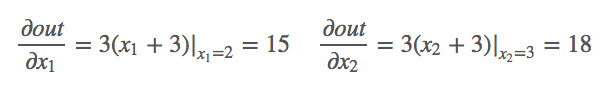

#### Below is for the grad()

pytorch中只有`torch.float`和`复杂类型`才能有grad

```python
x = torch.tensor([1, 2, 3, 4], requires_grad=True)
```

这里没有指定`x`的`dtype=torch.float`，那么是会报错的。
RuntimeError: Only Tensors of floating point and complex dtype can require gradients.

```python
x = torch.tensor(data=[1, 2, 3, 4], dtype=torch.float)
```

below is for the parameter from backward()

```python
from torch.autograd import Variable
import torch

# 创建一个torch.Size([2, 3])的tensor

x_tensor = torch.randn(2, 3)
print(x_tensor)

# 将tensor封装成Variable类型，用于计算梯度，这里的requires_grad要设置为True

x = Variable(x_tensor, requires_grad=True)

y = 3 * x ** 2 + 1

print(y.type())  # torch.FloatTensor
print(y.grad_fn)  # <AddBackward0 object at 0x0000021679AB9700>

# 梯度参数grad_variables形状必须与Variable一致

grad_variables = torch.FloatTensor([[1, 2, 3],
                                    [1, 1, 1]])

# 求函数y对x的梯度，这里需要输入参数，否则会报错grad can be implicitly created only for scalar outputs

y.backward(grad_variables)
print(x.grad)  # 得到x的梯度
```

Below is explanation w.r.t the parameter of backward()

Typically, your computational graph has one scalar output says `loss`. Then you can compute the gradient of `loss` w.r.t. the weights (`w`) by `loss.backward()`. Where the default argument of `backward()` is `1.0`.

If your output has multiple values (e.g. `loss=[loss1, loss2, loss3]`), you can compute the gradients of loss w.r.t. the weights by `loss.backward(torch.FloatTensor([1.0, 1.0, 1.0]))`.

Furthermore, if you want to add weights or importances to different losses, you can use `loss.backward(torch.FloatTensor([-0.1, 1.0, 0.0001]))`.

This means to calculate `-0.1*d(loss1)/dw, d(loss2)/dw, 0.0001*d(loss3)/dw` simultaneously.

---------------------------

hint: 

"if you want to add weights or importances to different losses, you can use loss.backward(torch.FloatTensor([-0.1, 1.0, 0.0001]))." -> This is true but somewhat misleading because the main reason why we pass `grad_tensors` is not to weigh them differently but they are gradients w.r.t. each element of corresponding tensors.


#### 3. About torch.squeeze() & torch.unsqueeze()

torch.squeeze(): 

这个函数主要对数据的维度进行压缩，去掉维数为1的的维度，比如是一行或者一列这种，一个一行三列（1,3）的数去掉第一个维数为一的维度之后就变成（3）行。squeeze(a)就是将a中所有为1的维度删掉。不为1的维度没有影响。a.squeeze(N) 就是去掉a中指定的维数为一的维度(这里面为第N维)。还有一种形式就是b=torch.squeeze(a，N) a中去掉指定的定的维数为一的维度。

torch.unsqueeze()

这个函数主要是对数据维度进行扩充。给指定位置加上维数为一的维度，比如原本有个三行的数据（3），在0的位置加了一维就变成一行三列（1,3）。a.squeeze(N) 就是在a中指定位置N加上一个维数为1的维度。还有一种形式就是b=torch.squeeze(a，N) a就是在a中指定位置N加上一个维数为1的维度

```python
x = torch.ones(1, 2, 3, 4, 5)
y = torch.squeeze(x)  # 返回一个张量，其中所有大小为1的输入的维都已删除
z = torch.squeeze(
    x, 3
)  # Returns a tensor with third dimensions of input of size 1 removed.
w = torch.unsqueeze(x, 4)  # 在第四个维度增加一个维度，并且增加的这个维度是一
print("This is x: ", x.size())
print("This is y: ", y.size())
print("This is z: ", z.size())
print("This is w: ", w.size())
x = x * 2
print("This is new x: ", x)
print("This is new y: ", y)
q = torch.unsqueeze(x, -1)
print("This is q: ", q.size())
h = torch.unsqueeze(x, -2)
print("This is h: ", h.size())
i = torch.unsqueeze(x, 5)
print("This is i: ", i.size())
```


out:

```powershell
This is x:  torch.Size([1, 2, 3, 4, 5])
This is y:  torch.Size([2, 3, 4, 5])
This is z:  torch.Size([1, 2, 3, 4, 5])
This is w:  torch.Size([1, 2, 3, 4, 1, 5])
This is new x:  tensor([[[[[2., 2., 2., 2., 2.],
           [2., 2., 2., 2., 2.],
           [2., 2., 2., 2., 2.],
           [2., 2., 2., 2., 2.]],

          [[2., 2., 2., 2., 2.],
           [2., 2., 2., 2., 2.],
           [2., 2., 2., 2., 2.],
           [2., 2., 2., 2., 2.]],

          [[2., 2., 2., 2., 2.],
           [2., 2., 2., 2., 2.],
           [2., 2., 2., 2., 2.],
           [2., 2., 2., 2., 2.]]],


         [[[2., 2., 2., 2., 2.],
           [2., 2., 2., 2., 2.],
           [2., 2., 2., 2., 2.],
           [2., 2., 2., 2., 2.]],

          [[2., 2., 2., 2., 2.],
           [2., 2., 2., 2., 2.],
           [2., 2., 2., 2., 2.],
           [2., 2., 2., 2., 2.]],

          [[2., 2., 2., 2., 2.],
           [2., 2., 2., 2., 2.],
           [2., 2., 2., 2., 2.],
           [2., 2., 2., 2., 2.]]]]])
This is new y:  tensor([[[[1., 1., 1., 1., 1.],
          [1., 1., 1., 1., 1.],
          [1., 1., 1., 1., 1.],
          [1., 1., 1., 1., 1.]],

         [[1., 1., 1., 1., 1.],
          [1., 1., 1., 1., 1.],
          [1., 1., 1., 1., 1.],
          [1., 1., 1., 1., 1.]],

         [[1., 1., 1., 1., 1.],
          [1., 1., 1., 1., 1.],
          [1., 1., 1., 1., 1.],
          [1., 1., 1., 1., 1.]]],


        [[[1., 1., 1., 1., 1.],
          [1., 1., 1., 1., 1.],
          [1., 1., 1., 1., 1.],
          [1., 1., 1., 1., 1.]],

         [[1., 1., 1., 1., 1.],
          [1., 1., 1., 1., 1.],
          [1., 1., 1., 1., 1.],
          [1., 1., 1., 1., 1.]],

         [[1., 1., 1., 1., 1.],
          [1., 1., 1., 1., 1.],
          [1., 1., 1., 1., 1.],
          [1., 1., 1., 1., 1.]]]])
This is q:  torch.Size([1, 2, 3, 4, 5, 1])
This is h:  torch.Size([1, 2, 3, 4, 1, 5])
This is i:  torch.Size([1, 2, 3, 4, 5, 1])
```


Hint: 

Tensor.squeeze_(*dim=None*) → [Tensor](https://pytorch.org/docs/stable/tensors.html#torch.Tensor)

In-place version of [`squeeze()`](https://pytorch.org/docs/stable/generated/torch.Tensor.squeeze.html#torch.Tensor.squeeze)


##### Use tensor.squeeze(0) to remove the first dimension

```python
import torch

# Create a tensor of shape (1, 3, 4)
tensor = torch.randn(1, 3, 4)
print("Original shape:", tensor.shape)

# Use tensor.squeeze(0) to remove the first dimension
squeezed_tensor = tensor.squeeze(0)
print("Squeezed shape:", squeezed_tensor.shape)
```

output:

```
Original shape: torch.Size([1, 3, 4])
Squeezed shape: torch.Size([3, 4])
```


#### 4. About h5py

```python
import h5py

dir_video = "data/visual_feature.h5"
dir_audio = "data/audio_feature.h5"
dir_labels = "data/labels.h5"
dir_order_test = "data/test_order.h5"

# with h5py.File(dir_video, "r") as hf:

#   video_features = hf["avadataset"][:1]

# print("This is video feature: ", video_features)


# HDF5的读取：
f = h5py.File(dir_video, "r") # 打开h5文件

# 可以查看所有的主键
for key in f.keys():
  print("This is key: ", key)
  # print(f[key].name)
  print("This is shape of dir_video: ", f[key].shape)
  # print(f[key].value)

```


#### 5. about copy_ from "tensor"

```python
a = torch.zeros(3)
print("This is a: ", a)
b = torch.randn(3)
print("This is b: ", b)
a.copy_(b) #从输出来看这里面将b的内容复制给a

print("This is a new a: ", a)
print("This is a new b: ", b)
```


```powershell
This is a:  tensor([0., 0., 0.])
This is b:  tensor([-1.6451, -0.0094, -0.4104])
This is a new a:  tensor([-1.6451, -0.0094, -0.4104])
This is a new b:  tensor([-1.6451, -0.0094, -0.4104])
```


#### 6. about variable function from torch


```python
from torch.autograd import Variable
import matplotlib.pyplot as plt

print("构建函数y=x^2,并求x=3导数")
# x = np.arange(-3, 3.01, 0.1)
# # print("This is x: ",x)
# y = x ** 2
# plt.plot(x, y)
# plt.plot(2, 4, "ro")
# plt.show()
x = Variable(torch.FloatTensor([7]), requires_grad=True)
y = x ** 2
y.backward()
print(x.grad)
```

output: 

```powershell
tensor([14.])


```


#### 7. torch.max(input, dim) 函数

输入

- `input`是softmax函数输出的一个`tensor`
- `dim`是max函数索引的维度`0/1`，`0`是每列的最大值，`1`是每行的最大值

输出

- 函数会返回两个`tensor`，第一个`tensor`是每行的最大值；第二个`tensor`是每行最大值的索引。


tip: 在多分类任务中我们并不需要知道各类别的预测概率，所以返回值的第一个`tensor`对分类任务没有帮助，而第二个`tensor`包含了预测最大概率的索引，所以在实际使用中我们仅获取第二个`tensor`即可。


```python
import torch
a = torch.tensor([[1,5,62,54], [2,6,2,6], [2,65,2,6]])
print(a)
```

output:

```powershell
tensor([[ 1,  5, 62, 54],
        [ 2,  6,  2,  6],
        [ 2, 65,  2,  6]])
```

索引每行的最大值：

```python
print(torch.max(a, 1))
```

output:

```powershell
torch.return_types.max(
values=tensor([62,  6, 65]),
indices=tensor([2, 3, 1]))
```

在计算准确率时第一个tensor `values`是不需要的，所以我们只需提取第二个tensor，并将tensor格式的数据转换成array格式。

```python
print("This is: ", torch.max(a, 1)[1].numpy())
```

output:

```powershell
This is:  [2 3 1]
```


#### 8. about torch.nn.functional.softmax(Tensor,dim) 

The softmax function takes as input a vector of values and converts it into a probability distribution. The output values are in the range (0, 1) and sum to 1. This is useful when you want to interpret the output of a model as probabilities over different classes.


|  | =    | softmax                                         |
| ------------------------------------------------------------ | ---- | ----------------------------------------------- |
|  | =    | input vector                                    |
|  | =    | standard exponential function for input vector  |
|  | =    | number of classes in the multi-class classifier |
|  | =    | standard exponential function for output vector |
|  | =    | standard exponential function for output vector |

```python
import torch
import torch.nn.functional as F

x = torch.Tensor([[1, 2, 3, 4], [5, 6, 7, 8], [9, 10, 11, 12]])

y1 = F.softmax(x, dim=0) # 对每一列进行softmax

print(y1)
print("This is y1[0]:", y1[0])
print("This is y1[1]:", y1[1])


y2 = F.softmax(x, dim=1) # 对每一行进行softmax

print(y2)
print("This is y2[0]:", y2[0])
print("This is y2[1]:", y2[1])
```


This is output:

```powershell
tensor([[3.2932e-04, 3.2932e-04, 3.2932e-04, 3.2932e-04],
        [1.7980e-02, 1.7980e-02, 1.7980e-02, 1.7980e-02],
        [9.8169e-01, 9.8169e-01, 9.8169e-01, 9.8169e-01]])
This is y1[0]: tensor([0.0003, 0.0003, 0.0003, 0.0003])
This is y1[1]: tensor([0.0180, 0.0180, 0.0180, 0.0180])
tensor([[0.0321, 0.0871, 0.2369, 0.6439],
        [0.0321, 0.0871, 0.2369, 0.6439],
        [0.0321, 0.0871, 0.2369, 0.6439]])
This is y2[0]: tensor([0.0321, 0.0871, 0.2369, 0.6439])
This is y2[1]: tensor([0.0321, 0.0871, 0.2369, 0.6439])
```


当然针对数值溢出有其对应的优化方法，将每一个输出值减去输出值中最大的值。

![[公式]](https://www.zhihu.com/equation?tex=softmax%28z_%7Bi%7D%29%3D%5Cfrac%7Be%5E%7Bz_%7Bi%7D+-+D%7D%7D%7B%5Csum_%7Bc+%3D+1%7D%5E%7BC%7D%7Be%5E%7Bz_%7Bc%7D-D%7D%7D%7D)

another explanation

`torch.nn.functional.softmax` applies the softmax function to an input tensor along a specified dimension. The softmax function normalizes the input tensor's elements along the given dimension so that they sum to 1, making the output tensor a valid probability distribution.

The difference between specifying `dim=0`, `dim=1`, and `dim=-1` is in the dimension along which the softmax normalization is applied:

1. **`dim=0`**: Applies the softmax function along the first dimension (rows if the tensor is 2D). Each column will be normalized independently.

    ```python
    import torch.nn.functional as F
    import torch

    x = torch.tensor([[1.0, 2.0],
                      [3.0, 4.0]])
    
    # Apply softmax along dimension 0
    result = F.softmax(x, dim=0)
    print(result)
    ```

    The output will normalize each column separately:
    ```
    tensor([[0.1192, 0.1192],
            [0.8808, 0.8808]])
    ```

2. **`dim=1`**: Applies the softmax function along the second dimension (columns if the tensor is 2D). Each row will be normalized independently.

    ```python
    # Apply softmax along dimension 1
    result = F.softmax(x, dim=1)
    print(result)
    ```

    The output will normalize each row separately:
    ```
    tensor([[0.2689, 0.7311],
            [0.2689, 0.7311]])
    ```

3. **`dim=-1`**: Applies the softmax function along the last dimension, which is often used for multi-dimensional tensors when you want to normalize along the innermost dimension.

    ```python
    # Apply softmax along the last dimension (same as dim=1 in this case)
    result = F.softmax(x, dim=-1)
    print(result)
    ```

    Since `dim=-1` refers to the last dimension and in a 2D tensor it is equivalent to `dim=1`, the result will be the same as `dim=1`:
    ```
    tensor([[0.2689, 0.7311],
            [0.2689, 0.7311]])
    ```

To summarize:

- `dim=0`: Normalizes along the rows.
- `dim=1`: Normalizes along the columns.
- `dim=-1`: Normalizes along the last dimension, which, for 2D tensors, is the same as `dim=1`.

The choice of dimension depends on how you want to normalize your tensor, ensuring that the resulting probabilities sum to 1 along the specified dimension.


#### 9. about item() from pytorch/ tensor.item()

这个方法可以解决从tensor 转换成int

文档中给了例子，说是一个元素张量可以用item得到元素值，请注意这里的print(x)和print(x.item())值是不一样的，一个是打印张量，一个是打印元素的值：

```bash
x = torch.randn(1)
print(x)
print(x.item())

#结果是
tensor([-0.4464])
-0.44643348455429077
```

解释:

item() → number
方法: item() 返回一个数
    Returns the value of this tensor as a standard Python number. 
    This only works for tensors with one element. For other cases, 
    see tolist().
    该方法的功能是以标准的Python数字的形式来返回这个张量的值.这个方法
    只能用于只包含一个元素的张量.对于其他的张量,请查看方法tolist().
    This operation is not differentiable.
    该操作是不可微分的,即不可求导.
    (译者注:返回的结果是普通Python数据类型,
    自然不能调用backward()方法来进行梯度的反向传播)

    Example:  例子:
    >>> x = torch.tensor([1.0])
    >>> x.item()
    1.0


#### 10. about torch.sort() function

***注意这里面的tensor一定要注意维度***

```python
logits = torch.tensor(
  [
​    [
​      [-0.5816, -0.3873, -1.0215, -1.0145, 0.4053],
​      [0.7265, 1.4164, 1.3443, 1.2035, 1.8823],
​      [-0.4451, 0.1673, 1.2590, -2.0757, 1.7255],
​      [0.2021, 0.3041, 0.1383, 0.3849, -1.6311],
​    ]
  ]
)


sorted_logits, sorted_indices = torch.sort(

  logits, descending=True, dim=-1

) # dim=-1 按照行排序

print("according to the line: ", sorted_logits)

print("according to the line: ", sorted_indices)


sorted_logits, sorted_indices = torch.sort(logits, descending=True, dim=1) # 按照列排序

print("according to the column: ", sorted_logits)

print("according to the column: ", sorted_indices)
```


output:

```powershell
according to the line:  tensor([[[ 0.4053, -0.3873, -0.5816, -1.0145, -1.0215],
         [ 1.8823,  1.4164,  1.3443,  1.2035,  0.7265],
         [ 1.7255,  1.2590,  0.1673, -0.4451, -2.0757],
         [ 0.3849,  0.3041,  0.2021,  0.1383, -1.6311]]])
according to the line:  tensor([[[4, 1, 0, 3, 2],
         [4, 1, 2, 3, 0],
         [4, 2, 1, 0, 3],
         [3, 1, 0, 2, 4]]])
according to the column:  tensor([[[ 0.7265,  1.4164,  1.3443,  1.2035,  1.8823],
         [ 0.2021,  0.3041,  1.2590,  0.3849,  1.7255],
         [-0.4451,  0.1673,  0.1383, -1.0145,  0.4053],
         [-0.5816, -0.3873, -1.0215, -2.0757, -1.6311]]])
according to the column:  tensor([[[1, 1, 1, 1, 1],
         [3, 3, 2, 3, 2],
         [2, 2, 3, 0, 0],
         [0, 0, 0, 2, 3]]])
```


#### 11. about **torch.randn()**  torch.mean() torch.pow() torch.matmul() torch.ones_like()

产生大小为指定的，正态分布的采样点，数据类型是tensor

**torch.mean()**

torch.mean(input) 输出input 各个元素的的均值，不指定任何参数就是所有元素的算术平均值. 指定参数可以计算每一行或者 每一列的算术平均数


```python
a=torch.randn(3)  #生成一个一维的矩阵
b=torch.randn(1,3)  #生成一个二维的矩阵
print(a)
print(b)
torch.mean(a)
```

output:

```powershell
tensor([-1.0737, -0.8689, -0.9553])
tensor([[-0.4005, -0.6812,  0.0958]])

tensor(-0.9659)
```

如果指定参数的话，

keepdim=True, input 和output将保持一样的size. otherwise,dim is squeezed. 默认是false.

```python
a = torch.randn(4, 5)  # 4行5列
print(a)
c = torch.mean(a, dim=0, keepdim=True)  # dim为0时 求列的平均值
print("This is mean of column: ", c)
d = torch.mean(a, dim=1, keepdim=True)  # dim为1时 求行的平均值
print("This is mean of line: ", d)
```

output:

```powershell
tensor([[ 0.8913, -0.4275, -0.5879,  0.3359,  1.4847],
        [-0.6798,  0.6409, -0.4618,  0.2167,  0.0430],
        [-0.9019,  0.8588, -1.4371,  0.7955, -0.2983],
        [-0.2362,  1.3501,  0.0100,  0.4004, -0.2030]])
This is mean of column:  tensor([[-0.2317,  0.6056, -0.6192,  0.4371,  0.2566]])
This is mean of line:  tensor([[ 0.3393],
        [-0.0482],
        [-0.1966],
        [ 0.2643]])
```


**torch.pow()**

```python
a = torch.tensor(3)

b = torch.pow(a, 2)

print("This is after pow: ", b.item())

c = torch.randn(4)

print("This is c: ", c)

d = torch.pow(c, 2)

print("This is after pow: ", d)
```

output

```powershell
This is after pow:  9
This is c:  tensor([-0.7659, -0.5344,  0.1736,  1.1546])
This is after pow:  tensor([0.5866, 0.2855, 0.0301, 1.3331])
```


**torch.matmul()**

torch.matmul 是做矩阵乘法

```python
a=torch.tensor([1,2,3])
b=torch.tensor([3,4,5])
torch.matmul(a, b)
```

output:

```powershell
tensor(26)
```


#### 12. about hook, register_forward_hook and register_full_backward_hook

hook种类分为两种:

Tensor级别  register_hook(hook) ->为Tensor注册一个backward hook，用来获取变量的梯度；hook必须遵循如下的格式：hook(grad) -> Tensor or None

nn.Module对象 register_forward_hook(hook)和register_backward_hook(hook)两种方法，分别对应前向传播和反向传播的hook函数。


hook作用：

获取某些变量的中间结果的。**Pytorch会自动舍弃图计算的中间结果**，所以想要获取这些数值就需要使用hook函数。hook函数在使用后应及时删除，以避免每次都运行钩子增加运行负载。

Hooks in PyTorch provide a way to register functions that will be called during the forward or backward pass of a module. Here's an explanation of `register_forward_hook()` and `register_full_backward_hook()`:

##### `nn.Module.register_forward_hook()`

This method allows you to register a forward hook on a module. A forward hook is a function that will be called every time the module performs a forward pass.

```python
hook_handle = module.register_forward_hook(hook_fn)
```

`hook_fn`: A function that takes three arguments:

1. `module`: the module to which the forward hook is registered.
2. `input`: the input to the module. This can be a single tensor or a tuple of tensors.
3. `output`: the output from the module. This can be a single tensor or a tuple of tensors.

```python
import torch
import torch.nn as nn

def forward_hook(module, input, output):
    print(f"Forward hook: {module}")
    print(f"Input: {input}")
    print(f"Output: {output}")

model = nn.Linear(3, 5)
hook_handle = model.register_forward_hook(forward_hook)

# Print the weight parameter
print("Weight parameter:\n", model.weight)

# Print the bias parameter
print("Bias parameter:\n", model.bias)

# Dummy input
x = torch.ones(1, 3)
output = model(x)

# Removing the hook
hook_handle.remove()
```

output:

```
Weight parameter:
 Parameter containing:
tensor([[ 0.1752, -0.3124, -0.3581],
        [-0.4440, -0.0342,  0.0012],
        [ 0.4524,  0.1182,  0.0021],
        [ 0.0601,  0.2809, -0.3237],
        [ 0.1943,  0.3910,  0.0086]], requires_grad=True)
Bias parameter:
 Parameter containing:
tensor([-0.1624, -0.0718, -0.3281,  0.5136, -0.1481], requires_grad=True)
Forward hook: Linear(in_features=3, out_features=5, bias=True)
Input: (tensor([[1., 1., 1.]]),)
Output: tensor([[-0.6577, -0.5488,  0.2447,  0.5308,  0.4458]],
       grad_fn=<AddmmBackward0>)
```

##### `nn.Module.register_full_backward_hook()`

This method allows you to register a backward hook on a module. A full backward hook is a function that will be called during the backward pass of a module, after gradients have been computed for all parameters.

```python
hook_handle = module.register_full_backward_hook(hook_fn)

```

`hook_fn`: A function that takes three arguments:

1. `module`: the module to which the backward hook is registered.
2. `grad_input`: the gradients with respect to the input of the module.
3. `grad_output`: the gradients with respect to the output of the module.


#### 13. pytorch.data属性和.detach()属性相同与不同之处

example: .data 和.detach()只取出本体tensor数据，**舍弃了grad，grad_fn等额外反向图计算过程需保存的额外信息。**

```python
a = torch.tensor([1.,2,3], requires_grad = True)

print(a)

b = a.data

print(b)

c = a.detach()

print(c)


b *= 5

print("This is a: ", a)
print("This is b: ", b)
print("This is c: ", c)


c *= 4

print("This is a: ", a)
print("This is b: ", b)
print("This is c: ", c)
```


output:

```powershell
tensor([1., 2., 3.], requires_grad=True) 

tensor([1., 2., 3.]) 

tensor([1., 2., 3.]) 

This is a:  tensor([ 5., 10., 15.], requires_grad=True) 

This is b:  tensor([ 5., 10., 15.]) 

This is c:  tensor([ 5., 10., 15.]) 


This is a:  tensor([20., 40., 60.], requires_grad=True) 

This is b:  tensor([20., 40., 60.]) 

This is c:  tensor([20., 40., 60.])
```

**简单的说就是，.data取出本体tensor后仍与原数据共享内存（从第一个代码段中可以看出），在使用in-place操作后，会修改原数据的值，而如果在反向传播过程中使用到原数据会导致计算错误，而使用.detach后，如果在“反向传播过程中”发现原数据被修改过会报错。更加安全**


#### 14. PyTorch中in-place

**in-place operation**在pytorch中是指改变一个tensor的值的时候，不经过复制操作，而是直接在原来的内存上改变它的值。可以把它成为**原地操作符**。

在pytorch中经常加后缀“_”来代表原地 in-place operation，比如说.add_() 或者.scatter_()。python里面的+=，*=也是in-place operation。


```python
import torch
x=torch.rand(2) #tensor([0.8284, 0.5539])
print(x)
y=torch.rand(2)
print(x+y)      #tensor([1.0250, 0.7891])
print(x)        #tensor([0.8284, 0.5539])
```


```python
import torch
x=torch.rand(2) #tensor([0.8284, 0.5539])
print(x)
y=torch.rand(2)
x.add_(y)
print(x)        #tensor([1.1610, 1.3789])
```


#### 15. PyTorch笔记之 scatter() 函数

**scatter()** 和 **scatter_()** 的作用是一样的，只不过 scatter() 不会直接修改原来的 Tensor，而 scatter_() 会

> PyTorch 中，一般函数加**下划线**代表直接在原来的 Tensor 上修改

scatter(dim, index, src) 的参数有 3 个

- **dim：**沿着哪个维度进行索引
- **index：**用来 scatter 的元素索引
- **src：**用来 scatter 的源元素，可以是一个标量或一个张量

> 这个 scatter 可以理解成放置元素或者修改元素

简单说就是通过一个张量 src 来修改另一个张量，哪个元素需要修改、用 src 中的哪个元素来修改由 dim 和 index 决定

官方文档给出了 3维张量 的具体操作说明，如下所示

```python
self[index[i][j][k]][j][k] = src[i][j][k]  # if dim == 0
self[i][index[i][j][k]][k] = src[i][j][k]  # if dim == 1
self[i][j][index[i][j][k]] = src[i][j][k]  # if dim == 2
```

example:

```python
x = torch.rand(2, 5)

#tensor([[0.1940, 0.3340, 0.8184, 0.4269, 0.5945],
#        [0.2078, 0.5978, 0.0074, 0.0943, 0.0266]])

torch.zeros(3, 5).scatter_(0, torch.tensor([[0, 1, 2, 0, 0], [2, 0, 0, 1, 2]]), x)

#tensor([[0.1940, 0.5978, 0.0074, 0.4269, 0.5945],
#        [0.0000, 0.3340, 0.0000, 0.0943, 0.0000],
#        [0.2078, 0.0000, 0.8184, 0.0000, 0.0266]])
```

如果是二维的例子，则应该对应下面的情况：

```python
y = y.scatter(dim,index,src)
 
#则：
y [ index[i][j] ] [j] = src[i][j] #if dim==0
y[i] [ index[i][j] ]  = src[i][j] #if dim==1 
```

那么这个函数有什么作用呢？其实可以利用这个功能将pytorch 中mini batch中的返回的label（特指[ 1,0,4,9 ]，即size为[4]这样的label）转为one-hot类型的label,举例子如下：

```python
import torch

mini_batch = 4
out_planes = 6
out_put = torch.rand(mini_batch, out_planes)
print("This is old out_put:\n" , out_put)
softmax = torch.nn.Softmax(dim=1)
out_put = softmax(out_put)
 
print("This is new out_put: \n", out_put)
label = torch.tensor([1,3,3,5])
one_hot_label = torch.zeros(mini_batch, out_planes).scatter_(1,label.unsqueeze(1),1)
# index[i][j] 有两个维度，所以这里需要扩容.
print(one_hot_label)
```

output:

```powershell
This is old out_put: 

tensor([[0.7513, 0.4557, 0.2814, 0.4894, 0.6988, 0.9134],        

[0.3404, 0.9000, 0.4107, 0.8312, 0.2615, 0.1938],        

[0.4149, 0.9932, 0.1023, 0.5605, 0.3504, 0.3599],       

[0.1629, 0.3053, 0.4270, 0.2092, 0.5538, 0.3117]]) 

This is new out_put:  

tensor([[0.1900, 0.1414, 0.1187, 0.1462, 0.1803, 0.2234],        

[0.1380, 0.2416, 0.1481, 0.2255, 0.1276, 0.1192],        

[0.1525, 0.2720, 0.1116, 0.1765, 0.1430, 0.1444],        

[0.1400, 0.1615, 0.1824, 0.1467, 0.2070, 0.1625]]) 

tensor([[0., 1., 0., 0., 0., 0.],        

[0., 0., 0., 1., 0., 0.],        

[0., 0., 0., 1., 0., 0.],        

[0., 0., 0., 0., 0., 1.]])
```


#### 16. torch.set_printoptions

printing all the contents of a tensor.

```python
torch.set_printoptions(threshold=np.inf)
```


#### 17. torch.nn.GELU()

The `torch.nn.GELU()` function in PyTorch is used to create a Gaussian Error Linear Unit (GELU) activation function. Activation functions are a critical component in neural networks as they introduce non-linearity, allowing the network to learn complex patterns.

Here's a detailed explanation:

##### GELU Activation Function

1. **Definition**:
   GELU stands for Gaussian Error Linear Unit. It is defined mathematically as:
   \[
   \text{GELU}(x) = x \cdot \Phi(x)
   \]
   where \(\Phi(x)\) is the cumulative distribution function (CDF) of the standard normal distribution. This can also be approximated as:
   \[
   \text{GELU}(x) \approx 0.5x \left(1 + \tanh\left(\sqrt{\frac{2}{\pi}} (x + 0.044715x^3)\right)\right)
   \]
   This approximation is what is typically used in practice for efficiency.

2. **Behavior**:
   The GELU function smoothly blends between zero and the identity function. For small negative values of \(x\), the output is near zero, and for large positive values of \(x\), the output is close to \(x\). This smooth transition can help with training stability and performance.

3. **Usage**:
   It is used as an activation function in neural networks, similar to ReLU, Sigmoid, or Tanh. GELU has gained popularity due to its effective performance in several state-of-the-art neural network architectures, including the Transformer models used in natural language processing.

##### Code Example

Here's how you use `torch.nn.GELU()` in PyTorch:

```python
import torch
import torch.nn as nn

# Create a GELU activation function instance
gelu = nn.GELU()

# Example input tensor
input_tensor = torch.tensor([[-1.0, 0.0, 1.0], [2.0, -2.0, 0.5]])

# Apply the GELU activation function
output_tensor = gelu(input_tensor)

print(output_tensor)
```

##### Explanation of the Code

1. **Importing**:
   - `torch`: The main PyTorch library.
   - `torch.nn`: A sub-library in PyTorch containing neural network components.

2. **Creating GELU instance**:
   - `gelu = nn.GELU()`: This creates an instance of the GELU activation function.

3. **Input tensor**:
   - `input_tensor`: An example tensor with some sample values.

4. **Applying the GELU function**:
   - `output_tensor = gelu(input_tensor)`: Applies the GELU activation function to each element of the `input_tensor`.

5. **Output**:
   - The `output_tensor` will contain the result of applying the GELU function to each element of the `input_tensor`.

##### Why Use GELU?

- **Smooth Activation**: Unlike ReLU which has a sharp change at zero, GELU transitions smoothly, which can lead to better optimization.
- **Improved Performance**: In practice, GELU has been found to improve performance in many deep learning tasks, particularly in natural language processing.

By understanding and utilizing the `torch.nn.GELU()` function, you can leverage the advantages of this advanced activation function in your neural network models.


#### 18. clone() 与 detach() 对比

Torch 为了提高速度，向量或是矩阵的赋值是指向同一内存的，这不同于 Matlab。

如果需要保存旧的tensor即需要开辟新的存储地址而不是引用，可以用 clone() 进行**深拷贝**，
首先我们来打印出来clone()操作后的数据类型定义变化：

**(1). 简单打印类型**

```python
import torch

a = torch.tensor(1.0, requires_grad=True)
b = a.clone()
c = a.detach()
a.data *= 3
b += 1

print(a)   # tensor(3., requires_grad=True)
print(b)
print(c)

'''
输出结果：
tensor(3., requires_grad=True)
tensor(2., grad_fn=<AddBackward0>)
tensor(3.)      # detach()后的值随着a的变化出现变化
'''
```

grad_fn=<CloneBackward>，表示clone后的返回值是个中间变量，因此支持梯度的回溯。clone操作在一定程度上可以视为是一个identity-mapping函数。
detach()操作后的tensor与原始tensor共享数据内存，当原始tensor在计算图中数值发生反向传播等更新之后，detach()的tensor值也发生了改变。
注意： 在pytorch中我们不要直接使用id是否相等来判断tensor是否共享内存，这只是充分条件，因为也许底层共享数据内存，但是仍然是新的tensor，比如detach()，如果我们直接打印id会出现以下情况。

```python
import torch as t
a = t.tensor([1.0,2.0], requires_grad=True)
b = a.detach()
#c[:] = a.detach()
print(id(a))
print(id(b))
#140568935450520
140570337203616
```

显然直接打印出来的id不等，我们可以通过简单的赋值后观察数据变化进行判断。

**(2). clone()的梯度回传**


#### 19. pytorch view()

1.在PyTorch中**view**函数作用为重构张量的维度，相当于numpy中的resize()的功能，但是用法不太一样.

tensor.view()方法可以调整tensor的形状，但必须保证调整前后元素总数一致。view不会修改自身的数据，返回的新tensor与原tensor共享内存，即更改一个，另一个也随之改变。

```python
import torch
tt1=torch.tensor([-0.3623,-0.6115,0.7283,0.4699,2.3261,0.1599])
result=tt1.view(3,2)
result
```

则`tt1.size()`为`torch.Size([6])`，是一个一行的tensor。现在通过view可以将其重构一下形状。

output:

```powershell
tensor([[-0.3623, -0.6115],
        [ 0.7283,  0.4699],
        [ 2.3261,  0.1599]])
```

2.有的时候会出现torch.view(-1)或者torch.view(参数a，-1)这种情况。

```python
import torch

tt2=torch.tensor([[-0.3623, -0.6115],[ 0.7283, 0.4699],[ 2.3261, 0.1599]])

result=tt2.view(-1)

result
```

```powershell
tensor([-0.3623, -0.6115,  0.7283,  0.4699,  2.3261,  0.1599]) 
```

由上面的案例可以看到，如果是torch.view(-1)，则原张量会变成一维的结构。

```python
import torch

tt3=torch.tensor([[-0.3623, -0.6115],[ 0.7283, 0.4699],[ 2.3261, 0.1599]])

result=tt3.view(2,-1)

result

```

```powershell
tensor([[-0.3623, -0.6115,  0.7283],        [ 0.4699,  2.3261,  0.1599]])
```

由上面的案例可以看到，如果是torch.view(参数a，-1)，在这个例子中a=2，tt3总共由6个元素，则b=6/2=3。

则为两行.


当-1在左边时，会变成两列.

```python
import torch

b=a.view(-1,2)  #当-1在左边时，会变成两列.

print(b)
```


#### 20. pytorch **Matmul 函数**

张量相乘函数

```python
import torch

# a为1D张量,b为2D张量
a = torch.tensor([1., 2.])
b = torch.tensor([[5., 6., 7.], [8., 9., 10.]])

result = torch.matmul(a, b)
print(result.size())
# torch.Size([3])

print(result)
# tensor([21., 24., 27.])
```


#### 21. pytorch nn.MSELoss() 均方损失函数

```python
import torch
import torch.nn as nn
crit=nn.MSELoss()#均方损失函数
target = torch.FloatTensor([[1, 2, 3], [4, 5, 6]])
pred= torch.FloatTensor([[7, 8, 9], [8, 4, 3]])
cost=crit(pred,target)#将pred,target逐个元素求差,然后求平方,再求和,再求均值,
print(cost)#tensor(22.3333)
sum=0
for i in range (0,2):#遍历行i
    for j in range(0,3):#遍历列
        sum+=(target[i][j]-pred[i][j])*(target[i][j]-pred[i][j])#对应元素做差,然后平方
print(sum/6)#tensor(22.3333)
```

很多的loss函数都有size_average和reduce两个布尔类型的参数，因为一般损失函数都是直接计算batch的数据，因此返回的loss结果都是维度为(batch_size,)的向量。

1）如果reduce=False,那么size_average参数失效，直接返回向量形式的loss

2)如果redcue=true,那么loss返回的是标量。

   2.a: if size_average=True, 返回loss.mean();#就是平均数

   2.b: if size_average=False,返回loss.sum()

注意：默认情况下，reduce=true,size_average=true


#### 22. torch.eye()

Sure, `torch.eye()` is a function in PyTorch that generates an identity matrix. An identity matrix is a square matrix in which all the elements of the principal diagonal are ones and all other elements are zeros.

Here’s how you can use it:

```python
import torch

# Create a 3x3 identity matrix
I = torch.eye(3)
print(I)

```

output:

```
tensor([[1., 0., 0.],
        [0., 1., 0.],
        [0., 0., 1.]])

```

In this identity matrix, the diagonal from the top left to the bottom right is filled with ones, and all other elements are zeros. This is useful in many mathematical operations. For example, when an identity matrix is multiplied by any matrix of the same size, the original matrix is unchanged. This is analogous to multiplying numbers by one. The identity matrix serves as the “one” of matrix multiplication.


#### 23. torch.hub.load_state_dict_from_url()

`torch.hub.load_state_dict_from_url()` is a function from PyTorch that allows you to load pretrained model weights from a URL. Here's how you can use it:

```python
import torch

# Define the URL from which to load the checkpoint
url = "https://example.com/model_checkpoint.pth"

# Load the checkpoint from the URL
checkpoint = torch.hub.load_state_dict_from_url(
    url=url,
    map_location="cpu",
    check_hash=True
)

# Now you can use the state dictionary to initialize your model
# For example:
# model = YourModel()
# model.load_state_dict(checkpoint)

```

- `url`: Specifies the URL from which to load the checkpoint.
- `map_location`: Specifies where to load the model. In this case, it's set to `"cpu"`, meaning the model will be loaded onto the CPU. If you're using a GPU, you can specify `"cuda"` instead.
- `check_hash`: A boolean indicating whether to check the hash of the downloaded file against the expected hash. This helps ensure the integrity of the downloaded file.


#### 24. @torch.jit.ignore

The `@torch.jit.ignore` is a decorator provided by PyTorch’s JIT (Just-In-Time) compiler. [It indicates to the compiler that a function or method should be ignored and left as a Python function](https://pytorch.org/docs/stable/generated/torch.jit.ignore.html)[1](https://pytorch.org/docs/stable/generated/torch.jit.ignore.html). [This allows you to leave code in your model that is not yet TorchScript compatible](https://pytorch.org/docs/stable/generated/torch.jit.ignore.html)[1](https://pytorch.org/docs/stable/generated/torch.jit.ignore.html).

[If called from TorchScript, ignored functions will dispatch the call to the Python interpreter](https://pytorch.org/docs/stable/generated/torch.jit.ignore.html)[1](https://pytorch.org/docs/stable/generated/torch.jit.ignore.html). [However, models with ignored functions cannot be exported; for that, you would use `@torch.jit.unused` instead](https://pytorch.org/docs/stable/generated/torch.jit.ignore.html)[1](https://pytorch.org/docs/stable/generated/torch.jit.ignore.html).

[Here’s an example of how to use `@torch.jit.ignore` on a method](https://pytorch.org/docs/stable/generated/torch.jit.ignore.html)[1](https://pytorch.org/docs/stable/generated/torch.jit.ignore.html):

```python
import torch
import torch.nn as nn

class MyModule(nn.Module):
    @torch.jit.ignore
    def debugger(self, x):
        import pdb
        pdb.set_trace()

    def forward(self, x):
        x += 10
        # The compiler would normally try to compile `debugger`,
        # but since it is `@ignore`d, it will be left as a call to Python
        self.debugger(x)
        return x

m = torch.jit.script(MyModule())
# Error! The call `debugger` cannot be saved since it calls into Python
m.save("m.pt")
```

You can also use `@torch.jit.ignore(drop=True)` on a method. [In this case, the ignored method is not saved, and the call is replaced with a `raise`](https://pytorch.org/docs/stable/generated/torch.jit.ignore.html)[1](https://pytorch.org/docs/stable/generated/torch.jit.ignore.html). [This is useful when you want to ignore certain methods during training but still want to be able to export the model](https://pytorch.org/docs/stable/generated/torch.jit.ignore.html)[1](https://pytorch.org/docs/stable/generated/torch.jit.ignore.html).

​             

#### 25. torch.nn.Identity()

The `torch.nn.Identity()` is a module in PyTorch that acts as a placeholder identity operator. [It is argument-insensitive, meaning it does not modify or use any arguments passed to it](https://pytorch.org/docs/stable/generated/torch.nn.Identity.html)[1](https://pytorch.org/docs/stable/generated/torch.nn.Identity.html).

Here’s an example of how it works:

```python
import torch
import torch.nn as nn

# Define the Identity module
m = nn.Identity()

# Create a random tensor
input = torch.randn(5, 4)
print("This is the input:", input)
# Pass the tensor through the Identity module
output = m(input)

# Print the output size
print(output.size())  # Output: torch.Size([128, 20])
print("This is the output:", output)

```

output:

```
This is the input: tensor([[ 0.9613,  0.8207,  0.8217,  1.7528],
        [-0.0525, -0.5623,  0.2284, -1.6684],
        [ 1.8826, -0.8619, -2.0095, -0.0459],
        [-2.4592, -0.2403, -1.3047,  0.7057],
        [ 2.4735,  0.4918,  0.3385,  0.2276]])
torch.Size([5, 4])
This is the output: tensor([[ 0.9613,  0.8207,  0.8217,  1.7528],
        [-0.0525, -0.5623,  0.2284, -1.6684],
        [ 1.8826, -0.8619, -2.0095, -0.0459],
        [-2.4592, -0.2403, -1.3047,  0.7057],
        [ 2.4735,  0.4918,  0.3385,  0.2276]])
```

The `torch.nn.Identity()` module in PyTorch might seem like it doesn’t do much since it just **returns the input as is**. However, it can be quite useful in certain scenarios. Here are a few examples:


#### 26. torch.nn.module.apply()

It’s a method provided by the `torch.nn.Module` class, which is the base class for all neural network modules in PyTorch. This method allows you to apply a function recursively to every submodule (and the module itself) in a neural network.

Details of `torch.nn.Module.apply()`

- **Purpose**: The `apply()` method calls a specified function on the module itself and recursively on all its submodules (e.g., layers or components of a neural network).
- **Signature**: 
  ```python
  Module.apply(fn)
  ```
  - `fn`: A function that takes a `torch.nn.Module` as its argument and returns `None`. This function is applied to the module and all its submodules.
- **Behavior**: The function `fn` is invoked for the module itself and then recursively for every submodule in the module's hierarchy (e.g., layers, blocks, or other nested modules).
- **Return Value**: The method returns the module itself (i.e., `self`), allowing for method chaining.

Common Use Cases

1. **Initializing Weights**: You can use `apply()` to initialize the weights of all layers in a neural network by defining a custom initialization function.
2. **Modifying Modules**: It’s useful for applying changes to module properties, such as setting specific attributes or configurations.
3. **Inspecting Modules**: You can use it to traverse the module hierarchy and inspect or modify parameters, buffers, or other properties.

Example: Initializing Weights

Here’s an example of using `apply()` to initialize the weights of a neural network with a custom initialization function:

```python
import torch
import torch.nn as nn

# Define a simple neural network
class Net(nn.Module):
    def __init__(self):
        super(Net, self).__init__()
        self.fc1 = nn.Linear(10, 5)
        self.fc2 = nn.Linear(5, 2)

    def forward(self, x):
        x = torch.relu(self.fc1(x))
        x = self.fc2(x)
        return x

# Custom initialization function
def init_weights(m):
    if isinstance(m, nn.Linear):
        nn.init.xavier_uniform_(m.weight)
        m.bias.data.fill_(0.01)

# Create an instance of the network
net = Net()

# Apply the initialization function to all modules
net.apply(init_weights)

# Verify the initialization
for name, param in net.named_parameters():
    print(f"{name}: {param.data}")
```

Explanation of the Example

- The `init_weights` function checks if a module is an instance of `nn.Linear` and initializes its weights using Xavier uniform initialization and sets biases to 0.01.
- `net.apply(init_weights)` applies this function to `net` and all its submodules (i.e., `fc1` and `fc2`).
- The result is that all linear layers in the network have their weights and biases initialized according to the specified function.

Notes

- **Recursive Application**: The method traverses the module hierarchy in a depth-first manner, ensuring that the function `fn` is applied to every submodule.
- **Caution**: The function `fn` should not return a new module or modify the module’s structure in a way that breaks the hierarchy, as this could lead to unexpected behavior.
- **Use with Care**: Since `apply()` modifies modules in place, ensure that the function `fn` is designed to handle all possible module types in the network to avoid errors.       


#### 27. torch.autograd.Function.apply()

[Yes, `torch.autograd.Function.apply()` is a method in PyTorch that is used to apply a custom autograd function](https://pytorch.org/tutorials/beginner/examples_autograd/two_layer_net_custom_function.html)[1](https://pytorch.org/tutorials/beginner/examples_autograd/two_layer_net_custom_function.html).

[In PyTorch, you can define your own custom autograd functions by subclassing `torch.autograd.Function` and implementing the `forward` and `backward` methods](https://pytorch.org/tutorials/beginner/examples_autograd/two_layer_net_custom_function.html)[1](https://pytorch.org/tutorials/beginner/examples_autograd/two_layer_net_custom_function.html). [The `forward` method computes the output Tensors from the input Tensors](https://pytorch.org/tutorials/beginner/examples_autograd/two_layer_net_custom_function.html)[1](https://pytorch.org/tutorials/beginner/examples_autograd/two_layer_net_custom_function.html)[, while the `backward` method computes the gradient of the loss with respect to the input](https://pytorch.org/tutorials/beginner/examples_autograd/two_layer_net_custom_function.html)[1](https://pytorch.org/tutorials/beginner/examples_autograd/two_layer_net_custom_function.html).

Here’s an example of how you can define a custom autograd function:

```python
import torch
import math

class LegendrePolynomial3(torch.autograd.Function):
    @staticmethod
    def forward(ctx, input):
        ctx.save_for_backward(input)
        return 0.5 * (5 * input ** 3 - 3 * input)

    @staticmethod
    def backward(ctx, grad_output):
        input, = ctx.saved_tensors
        return grad_output * 1.5 * (5 * input ** 2 - 1)
```

[In this example, `LegendrePolynomial3` is a custom autograd function that computes the third Legendre Polynomial](https://pytorch.org/tutorials/beginner/examples_autograd/two_layer_net_custom_function.html)[1](https://pytorch.org/tutorials/beginner/examples_autograd/two_layer_net_custom_function.html). [The `forward` method computes the output, and the `backward` method computes the gradient](https://pytorch.org/tutorials/beginner/examples_autograd/two_layer_net_custom_function.html)[1](https://pytorch.org/tutorials/beginner/examples_autograd/two_layer_net_custom_function.html).

To use this custom function, you can call the `apply` method:

```python
P3 = LegendrePolynomial3.apply
```

[Now, `P3` can be used like a function to perform the forward pass, and PyTorch’s autograd will take care of the backward pass](https://pytorch.org/tutorials/beginner/examples_autograd/two_layer_net_custom_function.html)[1](https://pytorch.org/tutorials/beginner/examples_autograd/two_layer_net_custom_function.html).

Hint:

That’s a great question! While it’s true that you can define a class that inherits from `torch.nn.Module` and implement a `forward` method for most use cases, `torch.autograd.Function` and its `apply()` method serve a different purpose.

The `torch.nn.Module` class is used for defining a layer or a set of layers in a neural network. It’s designed to encapsulate parameters (weights and biases) and methods for forward propagation.

On the other hand, `torch.autograd.Function` is used to define custom operations. It allows you to specify how an operation is performed in the forward pass and how it should be differentiated in the backward pass. This is useful when you want to implement a mathematical operation that is not included in the PyTorch library.

The `apply()` method is used to invoke the `forward` method of a `Function`. It also keeps track of the operation in the computation graph, so that gradients can be computed during the backward pass.

In summary, while both `torch.nn.Module` and `torch.autograd.Function` allow you to define custom behavior, they serve different purposes. The former is for defining layers in a neural network, while the latter is for defining custom operations for autograd. So, depending on what you want to achieve, you might need to use one or the other.

​                               

​              

#### 28. `tensor.dtype` and `tensor.type()` and **tensor.type(arg)**

Sure, I’d be happy to explain!

In PyTorch, `tensor.type()` is a method that returns the data type of the elements in the tensor. PyTorch supports various types of tensors, including:

- FloatTensor: 32-bit floating point
- DoubleTensor: 64-bit floating point
- HalfTensor: 16-bit floating point
- IntTensor: 32-bit integer
- LongTensor: 64-bit integer
- ShortTensor: 16-bit integer
- ByteTensor: 8-bit unsigned integer
- CharTensor: 8-bit signed integer

Here’s an example:

```python
import torch

# Create a float tensor
x = torch.tensor([1.0, 2.0, 3.0])
print(x.type())  # Outputs: 'torch.FloatTensor'

# Create an integer tensor
y = torch.tensor([1, 2, 3])
print(y.type())  # Outputs: 'torch.LongTensor'
```

In this code, we first create a tensor `x` with floating point numbers, and `x.type()` returns `'torch.FloatTensor'`. Then we create a tensor `y` with integers, and `y.type()` returns `'torch.LongTensor'`.

So, `tensor.type()` is a way to check the data type of your tensor in PyTorch. It can be useful when you want to ensure that your tensors are of the correct type before performing operations on them. For example, some operations in PyTorch require the tensors to be of a specific type, and using `tensor.type()` can help you debug issues related to incorrect tensor types.


In PyTorch, `tensor.dtype` is an attribute that returns the data type of the elements in the tensor. Similar to `tensor.type()`, it provides information about the type of data stored in the tensor, but it returns a `torch.dtype` object instead of a string.

Here’s an example:

```python
import torch

# Create a float tensor
x = torch.tensor([1.0, 2.0, 3.0])
print(x.dtype)  # Outputs: torch.float32

# Create an integer tensor
y = torch.tensor([1, 2, 3])
print(y.dtype)  # Outputs: torch.int64
```

In this code, we first create a tensor `x` with floating point numbers, and `x.dtype` returns `torch.float32`. Then we create a tensor `y` with integers, and `y.dtype` returns `torch.int64`.

So, `tensor.dtype` is another way to check the data type of your tensor in PyTorch. It can be useful when you want to ensure that your tensors are of the correct type before performing operations on them. For example, some operations in PyTorch require the tensors to be of a specific type, and using `tensor.dtype` can help you debug issues related to incorrect tensor types. It’s also worth noting that `tensor.dtype` is commonly used when you need to specify the data type for a new tensor. For instance, `torch.zeros(10, dtype=torch.float64)` will create a tensor of zeros with a data type of 64-bit floating point numbers.

​              

The `tensor.type(arg)` function in PyTorch is used to change the data type of the tensor. Here, `arg` is a string representing the desired data type. The function returns a new tensor with the specified data type. If `arg` is not provided, the function will return the current data type of the tensor, similar to `tensor.type()` without any arguments.

Here’s an example:

```python
import torch

# Create a float tensor
x = torch.tensor([1.0, 2.0, 3.0])
print(x.type())  # Outputs: 'torch.FloatTensor'

# Change the data type to 'torch.IntTensor'
x = x.type('torch.IntTensor')
print(x.type())  # Outputs: 'torch.IntTensor'
```

In this code, we first create a tensor `x` with floating point numbers, and `x.type()` returns `'torch.FloatTensor'`. Then we use `x.type('torch.IntTensor')` to change the data type of `x` to `'torch.IntTensor'`, and `x.type()` now returns `'torch.IntTensor'`.

So, `tensor.type(arg)` is a way to change the data type of your tensor in PyTorch. It can be useful when you want to convert your tensors to a different type for certain operations. For example, some operations in PyTorch require the tensors to be of a specific type, and using `tensor.type(arg)` can help you convert your tensors to the required type. Please note that this operation does not change the original tensor but returns a new tensor with the specified type. The original tensor `x` remains unchanged. If you want to change the type of `x`, you need to assign the result back to `x`, as shown in the example.


another example:

```python
import torch

# original targets tensor
targets = torch.tensor([-1.0, 0.0, 1.0, 2.0])
print("Original targets:", targets)
print("after the tensor.gt(0.0):", targets.gt(0.0))
print("This is the dtype of target:", targets.dtype)

# apply the operation
targets = targets.gt(0.0).type(targets.dtype)

print("After operation:", targets)
```

 output:

```
Original targets: tensor([-1.,  0.,  1.,  2.])
after the tensor.gt(0.0): tensor([False, False,  True,  True])
This is the dtype of target: torch.float32
After operation: tensor([0., 0., 1., 1.])
```


#### 29. torch.linspace()

`torch.linspace()` is a function in the PyTorch library. It returns a one-dimensional tensor of steps equally spaced points between `start` and `end` which are the first and second arguments respectively.

Here is the basic syntax:

```python
torch.linspace(start, end, steps=100)
```

- `start`: This is the starting value for the set of points.
- `end`: This is the ending value for the set of points.
- `steps`: This defines the total number of sampling points. If not provided, the default is `100`.

The function generates `steps` number of points between `start` and `end`, inclusive. The generated tensor can be used whenever you need a sequence of numbers spaced evenly between a start and end point.

Here’s an example:

```python
import torch
torch.linspace(0, 10, steps=5)
```

output:

```
tensor([ 0.0000,  2.5000,  5.0000,  7.5000, 10.0000])
```

This will output a tensor: `tensor([ 0.0000,  2.5000,  5.0000,  7.5000, 10.0000])`. As you can see, it generates 5 points (as specified by `steps=5`) between 0 and 10, inclusive.

Remember, the `torch.linspace()` function is particularly useful in scenarios where you need to generate data for analysis or visualization that requires evenly spaced points in a specified interval.

​            

#### 30. timm.layers.DropPath()

`DropPath` is a regularization technique also known as **Stochastic Depth**, commonly used in deep neural networks like ResNets, Vision Transformers (ViTs), and other architectures with residual connections.

**What is `timm.layers.DropPath`?**

`DropPath` randomly "drops" (bypasses) entire paths or layers in a network during training, effectively skipping their computation and passing the input directly to the output (typically in a residual block). This is different from **Dropout**, which randomly zeroes out individual elements of a tensor. The idea behind DropPath is to prevent co-adaptation of parallel paths and encourage robustness by simulating a shallower network during training.

The technique was introduced in the paper *"Deep Networks with Stochastic Depth"* (Huang et al., 2016). It’s particularly useful in very deep networks to reduce overfitting and improve generalization.

**How Does It Work?**

In `timm`, the `DropPath` implementation is typically applied within residual blocks. For example, in a residual connection like:

```
x = x + block(x)
```

With `DropPath`, it becomes:

```
x = x + drop_path(block(x))
```

During training, `drop_path` will randomly set `block(x)` to zero for some samples in the batch with a probability `drop_prob`. When the block is "dropped," the output is just the input `x`, effectively skipping the block’s computation. During inference, the block is always executed, and the output is scaled appropriately to account for the training-time dropping.

**Code Definition in `timm`**

The `DropPath` class is defined in `timm/layers/drop.py`. Here’s a simplified version of how it might look (based on the typical implementation):

```python
import torch
import torch.nn as nn

class DropPath(nn.Module):
    def __init__(self, drop_prob=0.0, scale_by_keep=True):
        super(DropPath, self).__init__()
        self.drop_prob = drop_prob
        self.scale_by_keep = scale_by_keep

    def forward(self, x):
        if self.drop_prob == 0. or not self.training:
            return x
        keep_prob = 1 - self.drop_prob
        shape = (x.shape[0],) + (1,) * (x.ndim - 1)  # Shape for batch dimension only
        random_tensor = torch.rand(shape, dtype=x.dtype, device=x.device) < keep_prob
        if self.scale_by_keep and keep_prob > 0:
            return x * random_tensor / keep_prob
        return x * random_tensor
```

- **`drop_prob`**: The probability of dropping a path (e.g., 0.1 means 10% chance).
- **`scale_by_keep`**: If `True`, scales the output by `1 / (1 - drop_prob)` to maintain expected value during training.
- **During training**: Randomly drops paths per sample in the batch.
- **During inference**: No dropping occurs (returns `x` unchanged).

Key Features

1. **Stochastic Depth**: By dropping entire paths, it mimics training a shallower network, which can improve efficiency and generalization.
2. **Batch-wise Dropping**: The dropping is applied per sample in the batch, not per element (unlike Dropout).
3. **Residual Compatibility**: It’s designed to work with residual connections, where skipping a block still allows the network to function via the identity path.

**Usage Example**

Here’s how you might use `DropPath` in a simple residual block with `timm`:

```python
import torch
import torch.nn as nn
from timm.layers import DropPath

class ResidualBlock(nn.Module):
    def __init__(self, dim, drop_prob=0.1):
        super().__init__()
        self.block = nn.Sequential(
            nn.Conv2d(dim, dim, 3, padding=1),
            nn.ReLU(),
            nn.Conv2d(dim, dim, 3, padding=1)
        )
        self.drop_path = DropPath(drop_prob)

    def forward(self, x):
        return x + self.drop_path(self.block(x))

# Example
model = ResidualBlock(dim=64, drop_prob=0.1)
x = torch.randn(2, 64, 32, 32)
output = model(x)
```

**Why Use `DropPath`?**

- **Regularization**: Prevents overfitting by reducing reliance on specific paths.
- **Efficiency**: During training, dropped paths skip computation, potentially speeding up training (though this depends on the implementation and hardware).
- **Improved Generalization**: Encourages the network to learn robust features that don’t depend on every layer being active.

In `timm`, `DropPath` is widely used in models like Vision Transformers and EfficientNets to enhance performance. If you’re working with a specific model from `timm`, you can check its architecture to see where `DropPath` is applied (often in the transformer blocks or residual layers).


​                 

#### 31. torch.nn.ModuleList([])

In PyTorch, `torch.nn.ModuleList` is a class that is used to contain a list of PyTorch modules. It behaves like a regular Python list, but it ensures that all the modules contained within it are properly registered as submodules of the parent module when used in a PyTorch `Module`.

Here's a breakdown of its usage:

1. **Initialization**: You can initialize a `ModuleList` instance with a list of PyTorch modules.

```python
import torch.nn as nn

module_list = nn.ModuleList([nn.Linear(10, 10), nn.ReLU(), nn.Linear(10, 5)])
```

2. **Accessing Modules**: You can access individual modules within the `ModuleList` just like you would with a regular Python list.

```python
linear_module = module_list[0]
```

3. **Adding Modules**: You can add new modules to the `ModuleList` using the `append()` method.

```python
module_list.append(nn.Dropout(0.5))
```

4. **Iterating Over Modules**: You can iterate over the modules in a `ModuleList` just like you would with a regular Python list.

```python
for module in module_list:
    print(module)
```

5. **Usage within PyTorch `Module`**: When a `ModuleList` is used within a PyTorch `Module`, all the modules it contains are automatically registered as submodules of the parent module. This is important because it ensures that parameters of these modules are properly tracked by PyTorch and are included in operations like model optimization.

```python
class MyModel(nn.Module):
    def __init__(self):
        super(MyModel, self).__init__()
        self.module_list = nn.ModuleList([nn.Linear(10, 10), nn.ReLU(), nn.Linear(10, 5)])

    def forward(self, x):
        for module in self.module_list:
            x = module(x)
        return x
```

In summary, `torch.nn.ModuleList` is a convenient way to manage lists of PyTorch modules within your neural network architectures while ensuring proper tracking and registration of these modules within the PyTorch framework.

​           

> In summary, `Sequential` is useful for simple networks where the layer sequence **is fixed**, while `ModuleList` provides more flexibility for dynamic architectures or when you need to access or modify individual layers.


#### 32. torch.randperm()

`torch.randperm()` is a function in the PyTorch library which generates a random permutation of integers from 0 to `n-1`, where `n` is the input argument passed to the function. The permutation is generated randomly, meaning the order of the integers is shuffled.

Here's how you can use it:

```python
import torch

n = 10  # Example: Generate a permutation of integers from 0 to 9
perm = torch.randperm(n)
print(perm)
```

Output might look something like:

```
tensor([4, 2, 9, 7, 3, 8, 5, 0, 1, 6])
```

This means that `perm` contains a random permutation of integers from 0 to 9. Each time you run the code, you will get a different permutation.


#### 33. torch.nn.LayerNorm()

`torch.nn.LayerNorm` in PyTorch applies **Layer Normalization**, which normalizes the features of each sample in a tensor to stabilize and speed up training. It’s commonly used in models like transformers.

Simple Explanation

Layer Normalization makes sure the values in a tensor (e.g., features for each sample) have a mean of 0 and a standard deviation of 1, then optionally scales and shifts them. It works on each sample independently, not across the batch.

**Formula (simplified)**:
- Subtract the mean of the features.
- Divide by the standard deviation (with a small number added to avoid division by zero).
- Optionally scale and shift using learned parameters.

Syntax

```python
torch.nn.LayerNorm(normalized_shape, eps=1e-05, elementwise_affine=True)
```
- **normalized_shape**: The size of the dimensions to normalize (e.g., `512` for a 512-dimensional feature vector).
- **eps**: A tiny number (default: 1e-5) for numerical stability.
- **elementwise_affine**: If `True` (default), learns scaling and shifting parameters.

Example

```python
import torch
import torch.nn as nn

# LayerNorm for 512 features
layer_norm = nn.LayerNorm(512)

# Input: 2 samples, 3 positions, 512 features each
input_tensor = torch.randn(2, 3, 512)

# Apply LayerNorm
output = layer_norm(input_tensor)  # Same shape: (2, 3, 512)
```

Why Use It?

- Stabilizes training by keeping values in a consistent range.
- Works well for small or variable batch sizes (unlike BatchNorm).
- Common in transformers (e.g., BERT) and sequence models.


**Difference Between LayerNorm and BatchNorm**

| Feature                       | LayerNorm (`nn.LayerNorm`)             | BatchNorm (`nn.BatchNorm1d/2d/3d`) |
| ----------------------------- | -------------------------------------- | ---------------------------------- |
| **Normalization Axis**        | Across feature dimensions (per sample) | Across batch (per feature)         |
| **Batch Dependency**          | No                                     | Yes (depends on batch statistics)  |
| **Works with Small Batches?** | ✅ Yes                                  | ❌ No                               |
| **Use Case**                  | NLP, Transformers, Time Series         | CNNs, Large Batch Training         |


The core difference between **** (Layer Normalization) and **** (Batch Normalization) lies in the axis along which the statistics (mean and variance) are calculated. This distinction significantly impacts where and why each method is used in deep learning architectures.

------


🔬 Comparison of LayerNorm and BatchNorm


| Feature                   | Layer Normalization ()                         | Batch Normalization ()                         |
| ------------------------- | ------------------------------------------------------------ | ------------------------------------------------------------ |
| **Normalization Axis**    | Across the **Channel and Spatial** dimensions.               | Across the **Batch** and **Spatial** dimensions.             |
| **Dependency**            | **Independent** of the batch size.                           | **Dependent** on the batch size.                             |
| **Input Shape**           |  for 1D,  for 2D.                |  for 1D,  for 2D.                |
| **Statistics Calculated** | Mean/Variance is calculated for **each sample** across all pixels/tokens and channels. | Mean/Variance is calculated for **each channel** across all samples in the batch and all spatial locations. |
| **Best Use Case**         | **Sequence/NLP** models (Transformers, RNNs). **Vision models** where small batch sizes are necessary (e.g., fine-tuning high-res images). | Standard **CNNs** (ResNet, VGG). **High-performance vision tasks** with large, stable batch sizes. |


🎯 Detail and Justification


Layer Normalization

Layer Normalization computes the mean and variance **within a single sample** (across all channels and spatial locations).

- **Benefit in Transformers:** This is ideal for **Transformer** architectures because the input length (sequence length) can vary, and more importantly, small batch sizes are often used when training large models or high-resolution images. Since LN is independent of the batch size, performance doesn't degrade when the batch is small.
- **Where it's used:** It's the standard normalization technique in the **Swin Transformer Block** and **Patch Merging/Expanding** layers because it was designed for sequential data and provides stability.


Batch Normalization 

Batch Normalization computes the mean and variance for **each channel separately**, but aggregates those statistics across all samples in the current batch.

- **Drawback of BN:** The biggest drawback is its reliance on a **large, representative batch size**. If the batch is small (e.g., less than 32), the calculated statistics become noisy, which can significantly hurt training performance.
- **Where it's used:** It remains a core component in many classic CNNs like **ResNet** and is known for improving convergence speed in standard computer vision tasks when large batches are available. In some modern CNNs like ConvNeXt, BN is sometimes preferred over LN for specific performance gains, provided the large-batch training regime is maintained.

​              


#### 34. torch.nn.GroupNorm

[Sure, `torch.nn.GroupNorm` is a class in PyTorch that applies Group Normalization over a mini-batch of inputs](https://pytorch.org/docs/stable/generated/torch.nn.GroupNorm.html)[1](https://pytorch.org/docs/stable/generated/torch.nn.GroupNorm.html). [This operation is described in the paper "Group Normalization"](https://pytorch.org/docs/stable/generated/torch.nn.GroupNorm.html)[1](https://pytorch.org/docs/stable/generated/torch.nn.GroupNorm.html).

Here’s how it works:

- [The input channels are separated into `num_groups` groups, each containing `num_channels / num_groups` channels](https://pytorch.org/docs/stable/generated/torch.nn.GroupNorm.html)[1](https://pytorch.org/docs/stable/generated/torch.nn.GroupNorm.html).

- [The mean and standard-deviation are calculated separately over each group](https://pytorch.org/docs/stable/generated/torch.nn.GroupNorm.html)[1](https://pytorch.org/docs/stable/generated/torch.nn.GroupNorm.html).

- The normalization formula is given by: 

  y = \frac {x - E[x]} { \sqrt {Var[x] + \epsilon}} * \gamma + \betay=Var[x]+ϵx−E[x]∗γ+β

   where `E[x]` is the mean, `Var[x]` is the variance, `γ` (gamma) and `β` (beta) are learnable per-channel affine transform parameter vectors of size `num_channels` if `affine` is set to `True`

  1

  .

- [The standard-deviation is calculated via the biased estimator, equivalent to `torch.var(input, unbiased=False)`](https://pytorch.org/docs/stable/generated/torch.nn.GroupNorm.html)[1](https://pytorch.org/docs/stable/generated/torch.nn.GroupNorm.html).

- [This layer uses statistics computed from input data in both training and evaluation modes](https://pytorch.org/docs/stable/generated/torch.nn.GroupNorm.html)[1](https://pytorch.org/docs/stable/generated/torch.nn.GroupNorm.html).

The parameters are:

- [`num_groups (int)`: number of groups to separate the channels into](https://pytorch.org/docs/stable/generated/torch.nn.GroupNorm.html)[1](https://pytorch.org/docs/stable/generated/torch.nn.GroupNorm.html).
- [`num_channels (int)`: number of channels expected in input](https://pytorch.org/docs/stable/generated/torch.nn.GroupNorm.html)[1](https://pytorch.org/docs/stable/generated/torch.nn.GroupNorm.html).
- `eps (float)`: a value added to the denominator for numerical stability. [Default: 1e-5](https://pytorch.org/docs/stable/generated/torch.nn.GroupNorm.html)[1](https://pytorch.org/docs/stable/generated/torch.nn.GroupNorm.html).
- `affine (bool)`: a boolean value that when set to `True`, this module has learnable per-channel affine parameters initialized to ones (for weights) and zeros (for biases). [Default: `True`](https://pytorch.org/docs/stable/generated/torch.nn.GroupNorm.html)[1](https://pytorch.org/docs/stable/generated/torch.nn.GroupNorm.html).

[The shape of the input and output is `(N, C, *)` where `C = num_channels`](https://pytorch.org/docs/stable/generated/torch.nn.GroupNorm.html)[1](https://pytorch.org/docs/stable/generated/torch.nn.GroupNorm.html). [The output has the same shape as the input](https://pytorch.org/docs/stable/generated/torch.nn.GroupNorm.html)[1](https://pytorch.org/docs/stable/generated/torch.nn.GroupNorm.html).

Here’s an example of how to use it:

```python
import torch
import torch.nn as nn

# Create a random tensor
input = torch.randn(20, 6, 10, 10)

# Separate 6 channels into 3 groupsgroups
m = nn.GroupNorm(3, 6)

# Activate the module
output = m(input)
```

[In this example, the 6 channels of the input tensor are separated into 3 groups](https://pytorch.org/docs/stable/generated/torch.nn.GroupNorm.html)[1](https://pytorch.org/docs/stable/generated/torch.nn.GroupNorm.html). [The `GroupNorm` module is then applied to the input](https://pytorch.org/docs/stable/generated/torch.nn.GroupNorm.html)[1](https://pytorch.org/docs/stable/generated/torch.nn.GroupNorm.html).

​                 

​           

#### 35. torch.nn.BatchNorm2d()

`torch.nn.BatchNorm2d()` is a function in PyTorch, a popular deep learning framework. It is used to apply Batch Normalization over a 4D input (a mini-batch of 2D inputs with additional channel dimensions).

Batch Normalization

Batch Normalization is a technique to improve the training of deep neural networks by normalizing the inputs of each layer. It helps to stabilize and accelerate the training process.

`torch.nn.BatchNorm2d` Parameters

Here are the main parameters of `torch.nn.BatchNorm2d()`:

- `num_features`: (int) C from an expected input of size (N, C, H, W). This parameter defines the number of channels in the input data.
- `eps`: (float, optional) a value added to the denominator for numerical stability. Default is 1e-5.
- `momentum`: (float, optional) the value used for the running mean and variance computation. Default is 0.1.
- `affine`: (bool, optional) a boolean value that when set to `True`, this module has learnable affine parameters, `weight` and `bias`. Default is `True`.
- `track_running_stats`: (bool, optional) a boolean value that when set to `True`, this module tracks the running mean and variance, and when set to `False`, this module does not track such statistics and uses batch statistics in both training and eval modes. Default is `True`.

Example Usage

Here is an example of how to use `torch.nn.BatchNorm2d`:

```python
import torch
import torch.nn as nn

# Create a BatchNorm2d layer with 3 input channels
batch_norm = nn.BatchNorm2d(num_features=3)

# Generate a random tensor with shape (N, C, H, W)
input_tensor = torch.randn(8, 3, 32, 32)

# Apply batch normalization
output_tensor = batch_norm(input_tensor)

print(output_tensor.shape)  # Should be torch.Size([8, 3, 32, 32])
```

In this example:
- We created a `BatchNorm2d` layer for an input with 3 channels.
- We generated a random input tensor with shape `(8, 3, 32, 32)`, which means a batch size of 8, 3 channels, and 32x32 spatial dimensions.
- We applied the batch normalization to the input tensor, resulting in an output tensor of the same shape.

Key Points

- Batch Normalization helps in stabilizing and accelerating training.
- `BatchNorm2d` is specifically designed for 4D inputs (e.g., images).
- The parameters `num_features`, `eps`, `momentum`, `affine`, and `track_running_stats` control the behavior of the normalization process.
- The layer can learn parameters (scale and shift) if `affine=True`.


#### 36. torch.bmm()

`torch.bmm()` is a function in PyTorch (a popular deep learning library) that stands for "batch matrix multiplication". It's specifically designed to perform matrix multiplication between batches of matrices efficiently.

Here's how it works:

```python
import torch

# Define two batches of matrices
batch1 = torch.randn(10, 3, 4)  # Shape: [batch_size, num_rows, num_cols]
batch2 = torch.randn(10, 4, 5)  # Shape: [batch_size, num_cols, num_cols]

# Perform batch matrix multiplication
result_batch = torch.bmm(batch1, batch2)

# Result will have shape [batch_size, num_rows, num_cols]
print(result_batch.shape)
```

In this example:
- `batch1` has a shape of `[10, 3, 4]`, meaning it contains 10 matrices, each with 3 rows and 4 columns.
- `batch2` has a shape of `[10, 4, 5]`, meaning it contains 10 matrices, each with 4 rows and 5 columns.
- `torch.bmm(batch1, batch2)` multiplies each matrix in `batch1` with the corresponding matrix in `batch2` for each batch, resulting in a new batch of matrices with shape `[10, 3, 5]`.

The key point here is that `torch.bmm()` handles batches of matrices efficiently, which is important in deep learning when you often work with batches of data. It performs the matrix multiplication for each pair of matrices within the batches and returns the resulting batch of matrices.


#### 37. nn.Module.named_parameters()和parameters()

nn.Module里面关于参数有两个很重要的属性named_parameters()和parameters()，前者给出网络层的**名字**和参数的迭代器，而后者仅仅是参数的迭代器。

```python
import torchvision.models as models
model = models.resnet18()
for param in model.named_parameters():
    print(param[0])
# 这里面只有param[0]和param[1]的值有效
'''
conv1.weight
bn1.weight
bn1.bias
layer1.0.conv1.weight
layer1.0.bn1.weight
layer1.0.bn1.bias
layer1.0.conv2.weight
layer1.0.bn2.weight
layer1.0.bn2.bias
layer1.1.conv1.weight
layer1.1.bn1.weight
layer1.1.bn1.bias
layer1.1.conv2.weight
layer1.1.bn2.weight
layer1.1.bn2.bias
layer2.0.conv1.weight
layer2.0.bn1.weight
layer2.0.bn1.bias
layer2.0.conv2.weight
layer2.0.bn2.weight
layer2.0.bn2.bias
layer2.0.downsample.0.weight
layer2.0.downsample.1.weight
layer2.0.downsample.1.bias
layer2.1.conv1.weight
layer2.1.bn1.weight
layer2.1.bn1.bias
layer2.1.conv2.weight
layer2.1.bn2.weight
layer2.1.bn2.bias
layer3.0.conv1.weight
layer3.0.bn1.weight
layer3.0.bn1.bias
layer3.0.conv2.weight
layer3.0.bn2.weight
layer3.0.bn2.bias
layer3.0.downsample.0.weight
layer3.0.downsample.1.weight
layer3.0.downsample.1.bias
layer3.1.conv1.weight
layer3.1.bn1.weight
layer3.1.bn1.bias
layer3.1.conv2.weight
layer3.1.bn2.weight
layer3.1.bn2.bias
layer4.0.conv1.weight
layer4.0.bn1.weight
layer4.0.bn1.bias
layer4.0.conv2.weight
layer4.0.bn2.weight
layer4.0.bn2.bias
layer4.0.downsample.0.weight
layer4.0.downsample.1.weight
layer4.0.downsample.1.bias
layer4.1.conv1.weight
layer4.1.bn1.weight
layer4.1.bn1.bias
layer4.1.conv2.weight
layer4.1.bn2.weight
layer4.1.bn2.bias
fc.weight
fc.bias
'''
```


#### 


#### 38. def ____len____(self):

```python
class Fib(object):

​    def __init__(self, num):

​        a, b, L = 0, 1, []

​        for n in range(num):

​            L.append(a)

​            a, b = b, a + b

​        self.numbers = L


​    def __str__(self):

​        return str(self.numbers)


​    __repr__ = __str__


​    def __len__(self):

​        print("code goes here")

​        return len(self.numbers)


f = Fib(10)

print (f)

print (len(f))
```

output:

```powershell
[0, 1, 1, 2, 3, 5, 8, 13, 21, 34] 

code goes here 

10
```


#### 39. torch.utils.data.DataLoader()

DataLoader是PyTorch中的一种数据类型。

在PyTorch中训练模型经常要使用它，那么该数据结构长什么样子，如何生成这样的数据类型？

下面就研究一下：

先看看 dataloader.py脚本是怎么写的（VS中按F12跳转到该脚本）

 __init__（构造函数）中的几个重要的属性：

1、dataset：（数据类型 dataset）

输入的数据类型。看名字感觉就像是数据库，C#里面也有dataset类，理论上应该还有下一级的datatable。这应当是原始数据的输入。PyTorch内也有这种数据结构。这里先不管，估计和C#的类似，这里只需要知道是输入数据类型是dataset就可以了。

2、batch_size：（数据类型 int）

每次输入数据的行数，默认为1。PyTorch训练模型时调用数据不是一行一行进行的（这样太没效率），而是一捆一捆来的。这里就是定义每次喂给神经网络多少行数据，如果设置成1，那就是一行一行进行（个人偏好，PyTorch默认设置是1）。

3、shuffle：（数据类型 bool）

洗牌。默认设置为False。在每次迭代训练时是否将数据洗牌，默认设置是False。将输入数据的顺序打乱，是为了使数据更有独立性，但如果数据是有序列特征的，就不要设置成True了。

4、collate_fn：（数据类型 callable，没见过的类型）

将一小段数据合并成数据列表，默认设置是False。如果设置成True，系统会在返回前会将张量数据（Tensors）复制到CUDA内存中。（不太明白作用是什么，就暂时默认False）

5、batch_sampler：（数据类型 Sampler）

批量采样，默认设置为None。但每次返回的是一批数据的索引（注意：不是数据）。其和batch_size、shuffle 、sampler and drop_last参数是不兼容的。我想，应该是每次输入网络的数据是随机采样模式，这样能使数据更具有独立性质。所以，它和一捆一捆按顺序输入，数据洗牌，数据采样，等模式是不兼容的。

6、sampler：（数据类型 Sampler）

采样，默认设置为None。根据定义的策略从数据集中采样输入。如果定义采样规则，则洗牌（shuffle）设置必须为False。

7、num_workers：（数据类型 Int）

工作者数量，默认是0。使用多少个子进程来导入数据。设置为0，就是使用主进程来导入数据。注意：这个数字必须是大于等于0的，负数估计会出错。


8、pin_memory：（数据类型 bool）

内存寄存，默认为False。在数据返回前，是否将数据复制到CUDA内存中。

When `pin_memory=True`, the DataLoader allocates data in **page-locked (pinned) memory**.  This allows the GPU to access data directly from the CPU memory, improving the efficiency of data transfer between the CPU and GPU.


9、drop_last：（数据类型 bool）

丢弃最后数据，默认为False。设置了 batch_size 的数目后，最后一批数据未必是设置的数目，有可能会小些。这时你是否需要丢弃这批数据。

Setting `drop_last=True` means that this incomplete batch will be dropped, ensuring that all batches fed to the model during training have **the same size.**

10、timeout：（数据类型 numeric）

超时，默认为0。是用来设置数据读取的超时时间的，但超过这个时间还没读取到数据的话就会报错。 所以，数值必须大于等于0。

11、worker_init_fn（数据类型 callable，没见过的类型）

子进程导入模式，默认为Noun。在数据导入前和步长结束后，根据工作子进程的ID逐个按顺序导入数据。

从DataLoader类的属性定义中可以看出，这个类的作用就是实现数据以什么方式输入到什么网络中。
代码一般是这么写的：

定义学习集 DataLoader

train_data = torch.utils.data.DataLoader(各种设置...) 

将数据喂入神经网络进行训练

for i, (input, target) in enumerate(train_data): 
    循环代码行......

 

如果全部采用默认设置输入数据，数据就是一行一行按顺序输入到神经网络。如果对数据的输入有特殊要求。

比如：想打乱一下数据的排序，可以设置 shuffle（洗牌）为True；

比如：想数据是一捆的输入，可以设置 batch_size 的数目；

比如：想随机抽取的模式输入，可以设置 sampler 或 batch_sampler。如何定义抽样规则，可以看sampler.py脚本。这里不是重点；

比如：像多线程输入，可以设置 num_workers 的数目；

其他的就不太懂了，以后实际应用时碰到特殊要求再研究吧。


```python
from torch.utils.data import DataLoader, Dataset
import torch

class TensorDataset(Dataset):
    # TensorDataset继承Dataset, 重载了__init__, __getitem__, __len__
    # 实现将一组Tensor数据对封装成Tensor数据集
    # 能够通过index得到数据集的数据，能够通过len，得到数据集大小
    def __init__(self, data_tensor, target_tensor):
        self.data_tensor = data_tensor
        self.target_tensor = target_tensor

    def __getitem__(self, index):

        # 两边都是输出相同索引的数值,根据输出栏目可以看到data和taeget是一套输出的
        k=20
        return self.data_tensor[index], self.target_tensor[index], k

    def __len__(self):
        return self.data_tensor.size(0)

# 生成数据
data_tensor = torch.randn(4, 3)
target_tensor = torch.rand(4)
print("This is data_tensor: ",data_tensor)
print("This is target_tensor: ",target_tensor)

# 将数据封装成Dataset
tensor_dataset = TensorDataset(data_tensor, target_tensor)

# 可使用索引调用数据
print ('tensor_data[0]: ', tensor_dataset[0])

# 可返回数据len
print ('len os tensor_dataset: ', len(tensor_dataset))

# 这个函数控制着接下来for循环的输出“__getitem__”方法
tensor_dataloader = DataLoader(tensor_dataset,   # 封装的对象
                               batch_size=2,     # 输出的batchsize
                               shuffle=True,     # 随机输出
                               num_workers=0)    # 只有1个进程

# 以for循环形式输出,这里会直接调用
for data, target, k in tensor_dataloader: 
    print("This is data: ", data)
    print("This is target: ", target)
    print("This is the k ", k, type(k))
#### Hint: we can find the k is the tensor, even we had definded as int. each value from this loop will be the tensor.
print("---------------------------------------------------------------")
# # 输出一个batch
# print ('one batch tensor data: ', iter(tensor_dataloader).next())

# # 输出batch数量
# print ('len of batchtensor: ', len(list(iter(tensor_dataloader))))

 
```


output:

```python
This is data_tensor:  tensor([[-0.4201,  1.3954,  0.4135],
        [-1.2717, -1.6161,  0.3224],
        [ 1.3073,  1.4076,  0.9184],
        [ 0.6659, -0.8728,  0.1131]])
This is target_tensor:  tensor([0.8892, 0.2531, 0.7626, 0.3117])
tensor_data[0]:  (tensor([-0.4201,  1.3954,  0.4135]), tensor(0.8892), 20)
len os tensor_dataset:  4
This is data:  tensor([[ 0.6659, -0.8728,  0.1131],
        [ 1.3073,  1.4076,  0.9184]])
This is target:  tensor([0.3117, 0.7626])
This is the k  tensor([20, 20]) <class 'torch.Tensor'>
This is data:  tensor([[-0.4201,  1.3954,  0.4135],
        [-1.2717, -1.6161,  0.3224]])
This is target:  tensor([0.8892, 0.2531])
This is the k  tensor([20, 20]) <class 'torch.Tensor'>
---------------------------------------------------------------
```


#### 40. tensor().size()

>```python
>(base) PS C:\Users\chenxuqi> python
>Python 3.7.4 (default, Aug  9 2019, 18:34:13) [MSC v.1915 64 bit (AMD64)] :: Anaconda, Inc. on win32
>Type "help", "copyright", "credits" or "license" for more information.
>
>>>> import torch
>>>> a = torch.ones(2,3,4)
>>>> a
>>>> tensor([[[1., 1., 1., 1.],
>>>>  [1., 1., 1., 1.],
>>>>  [1., 1., 1., 1.]],
>
>   [[1., 1., 1., 1.],
>    [1., 1., 1., 1.],
>    [1., 1., 1., 1.]]])
>
>>>> a.size
>>>> <built-in method size of Tensor object at 0x000001D0D5CAE368>
>
>>>> a.size()
>>>> torch.Size([2, 3, 4])
>
>>>> a.size(0)
>>>> 2
>>>> a.size()[0]
>>>> 2
>
>
>>>> a = torch.ones(2,3,4,5,6,7,8,9)
>>>> a.shape
>>>> torch.Size([2, 3, 4, 5, 6, 7, 8, 9])
>>>> a.size()
>>>> torch.Size([2, 3, 4, 5, 6, 7, 8, 9])
>>>> a.size(0)
>>>> 2
>>>> a.size(7)
>>>> 9
>>>> a.size()[0]
>>>> 2
>>>> a.size()[7]
>>>> 9
>>>> a.size(4)
>>>> 6
>>>> a.size()[4]
>>>> 6
>
>
>>>> a.size()[:]
>>>> torch.Size([2, 3, 4, 5, 6, 7, 8, 9])
>
>>>> a.size()[4:]
>>>> torch.Size([6, 7, 8, 9])
>
>
>
>
>```
>
>


#### 41. about collate_fn=custom_collate()

When you create a DataLoader, you pass in a dataset and specify the batch size. The DataLoader then takes care of grouping individual samples from the dataset into batches. The `collate_fn` parameter allows you to define a custom function to perform the collation process.

The default behavior of `collate_fn` is to stack tensors along a new dimension (batch dimension), but sometimes, especially when dealing with datasets of **varying shapes**, you might need a custom collation strategy.

```python
from torch.nn.utils.rnn import pad_sequence #(1)
from torch.utils.data import DataLoader

nlp_data = [
    {'tokenized_input': [1, 4, 5, 9, 3, 2], 'label':0},
    {'tokenized_input': [1, 7, 3, 14, 48, 7, 23, 154, 2], 'label':0},
    {'tokenized_input': [1, 30, 67, 117, 21, 15, 2], 'label':1},
    {'tokenized_input': [1, 17, 2], 'label':0},
]

def custom_collate(data): #(2)

    inputs = [torch.tensor(d['tokenized_input']) for d in data] #(3)
    labels = [d['label'] for d in data]

    inputs = pad_sequence(inputs, batch_first=True) #(4)
    labels = torch.tensor(labels) #(5)

    return { #(6)
        'tokenized_input': inputs,
        'label': labels
    }

loader = DataLoader(nlp_data, batch_size=2, shuffle=False, collate_fn=custom_collate) #(7)

iter_loader = iter(loader)
batch1 = next(iter_loader)
print(batch1)
batch2 = next(iter_loader)
print(batch2)
```

output:

```
{'tokenized_input': tensor([[  1,   4,   5,   9,   3,   2,   0,   0,   0],
        [  1,   7,   3,  14,  48,   7,  23, 154,   2]]), 'label': tensor([0, 0])}
{'tokenized_input': tensor([[  1,  30,  67, 117,  21,  15,   2],
        [  1,  17,   2,   0,   0,   0,   0]]), 'label': tensor([1, 0])}
```

不过话说回来，我个人感受是：

在不足维度上进行补0操作，那么我们为什么不在建立dataset之前先补好呢？所以，collate_fn这个东西的应用场景还是有限的。不过，明白其原理总是好事。

##### Hint:

When using a custom `collate_fn`, the input `data` (or `batch`) parameter is a list, where the length of this list is equal to the `batch_size` specified in the `DataLoader`. Each element of this list is a tuple containing the variables returned by the `__getitem__()` method of your dataset class.


#### 42. torch.nn.utils.rnn.pad_sequence

When working with sequences of variable lengths (e.g., sentences of different lengths in natural language processing tasks), it's common to pad shorter sequences with zeros so that they all have the same length.

In PyTorch's `pad_sequence` function, the `batch_first` parameter is a Boolean that determines the order of dimensions in the output tensor. If `batch_first` is set to `True`, the batch dimension is placed first; otherwise, the time step dimension is placed first.

```python
from torch.nn.utils.rnn import pad_sequence
import torch

# Example sequences
seq1 = torch.tensor([1, 2, 3])
seq2 = torch.tensor([4, 5])
seq3 = torch.tensor([6, 7, 8, 9])

# List of sequences
list_of_sequences = [seq1, seq2, seq3]

# Pad the sequences with batch_first=True
padded_sequences_batch_first = pad_sequence(list_of_sequences, batch_first=True)

# Pad the sequences with batch_first=False (default)
padded_sequences_default = pad_sequence(list_of_sequences)

print("With batch_first=True:")
print(padded_sequences_batch_first)

print("\nWith batch_first=False (default):")
print(padded_sequences_default)

```

As you can see, when `batch_first=True`, the batch dimension is placed first in the output tensor. This can be useful depending on the requirements of your neural network.

output:

```
With batch_first=True:
tensor([[1, 2, 3, 0],
        [4, 5, 0, 0],
        [6, 7, 8, 9]])

With batch_first=False (default):
tensor([[1, 4, 6],
        [2, 5, 7],
        [3, 0, 8],
        [0, 0, 9]])

```


**another example:**

```python
import torch
from torch.nn.utils.rnn import pad_sequence

a = torch.ones(2, 7)
print(a)

b = torch.ones(3, 7)
print(b)

c = torch.ones(4, 7)
print(c)
print("-------------------------------------------------------")
print(pad_sequence([a, b, c]), pad_sequence([a, b, c]).size())

```

output:

```
tensor([[1., 1., 1., 1., 1., 1., 1.],
        [1., 1., 1., 1., 1., 1., 1.]])
tensor([[1., 1., 1., 1., 1., 1., 1.],
        [1., 1., 1., 1., 1., 1., 1.],
        [1., 1., 1., 1., 1., 1., 1.]])
tensor([[1., 1., 1., 1., 1., 1., 1.],
        [1., 1., 1., 1., 1., 1., 1.],
        [1., 1., 1., 1., 1., 1., 1.],
        [1., 1., 1., 1., 1., 1., 1.]])
-------------------------------------------------------
tensor([[[1., 1., 1., 1., 1., 1., 1.],
         [1., 1., 1., 1., 1., 1., 1.],
         [1., 1., 1., 1., 1., 1., 1.]],

        [[1., 1., 1., 1., 1., 1., 1.],
         [1., 1., 1., 1., 1., 1., 1.],
         [1., 1., 1., 1., 1., 1., 1.]],

        [[0., 0., 0., 0., 0., 0., 0.],
         [1., 1., 1., 1., 1., 1., 1.],
         [1., 1., 1., 1., 1., 1., 1.]],

        [[0., 0., 0., 0., 0., 0., 0.],
         [0., 0., 0., 0., 0., 0., 0.],
         [1., 1., 1., 1., 1., 1., 1.]]]) torch.Size([4, 3, 7])
```


#### 43. about grad

```python
import torch


a = torch.tensor([1, 2, 3.], requires_grad=True)

print(a.grad)

out = a.sigmoid()

print("This is out: ",out)

print(out.sum())

out.sum().backward()

\# grad can be implicitly created only for scalar outputs

print(a.grad)
```

output:

```powershell
None 
This is out:  tensor([0.7311, 0.8808, 0.9526], grad_fn=<SigmoidBackward>) 
tensor(2.5644, grad_fn=<SumBackward0>) 
tensor([0.1966, 0.1050, 0.0452])
```


#### 44. torch.transpose()

这个函数作用是交换两个维度的内容，类似矩阵的转置.

```python
import torch

cc=torch.randn((2,3,4,5))
dd=torch.transpose(cc,1,2)
ee=torch.transpose(cc,0,1)

print("This is the cc:",cc.shape)
print("This is the dd:",dd.shape)
print("This is the ee:",ee.shape)
```

output:

```bash
This is the cc: torch.Size([2, 3, 4, 5]) 

This is the dd: torch.Size([2, 4, 3, 5]) 

This is the ee: torch.Size([3, 2, 4, 5])
```


#### 45. torch.arange()

```python
import torch

a=torch.arange(0,24).view(2, 3, 4)
print("This is input: ",a)
```

output:

```powershell
This is input:  tensor([[[ 0,  1,  2,  3],         [ 4,  5,  6,  7],         [ 8,  9, 10, 11]],         [[12, 13, 14, 15],         [16, 17, 18, 19],         [20, 21, 22, 23]]])
```


#### 46. torch change to numpy

```python
import torch

a=torch.arange(0,24).view(2, 3, 2,2)

a=a.numpy()
```


#### 47. tensor.grad.zero_()

可以看到，每次反向传播求梯度时，都会加上上一次的梯度，但是没有改变`W`和`X`，梯度也不应该变化.

```python
torch.tensor.grad.zero_()

```

```python
import torch

X = torch.tensor([[1.5],[3.7],[2.8],[6.4]], requires_grad=True, dtype=torch.float)
W = torch.tensor(data=[[1, 3, -2, 4]], requires_grad=True, dtype=torch.float)
Y = W.matmul(X)
Y.backward(retain_graph=True)  # 保持计算图
print(X.grad)

Y.backward(retain_graph=True)
print(X.grad)

Y.backward(retain_graph=True)
print(X.grad)

X.grad.zero_()
print(X.grad)

Y.backward()
print(X.grad)
```


#### 48. optimizer.zero_grad(), loss.backward(), optimizer.step(), Scheduler.step()


**1. zero_grad（）函数的应用：**

  在pytorch中做随机梯度下降时往往会用到zero_grad（）函数，相关代码如下。just like a loop. the order will be repeat via below code.

​               optimizer.zero_grad()                       # 将模型的参数梯度初始化为0

​               outputs=model（inputs）              # 前向传播计算预测值

​               loss = cost(outputs, y_train)           # 计算当前损失

​               loss.backward()                               # 反向传播计算梯度

​               optimizer.step()                               # 更新所有参数   


**2. zero_grad（）函数的作用：**

根据pytorch中backward（）函数的计算，当网络参量进行反馈时，梯度是累积计算而不是被替换，但在处理每一个batch时并不需要与其他batch的梯度混合起来累积计算，因此需要对每个batch调用一遍zero_grad（）将参数梯度置0.

  另外，如果不是处理每个batch清除一次梯度，而是两次或多次再清除一次，相当于提高了batch_size，对硬件要求更高，更适用于需要更高batch_size的情况。


Because of this, when you start your training loop, ideally you should [`zero out the gradients`](https://pytorch.org/docs/stable/generated/torch.optim.Optimizer.zero_grad.html#torch.optim.Optimizer.zero_grad) so that you do the parameter update correctly. Otherwise, the gradient would be a combination of the old gradient, which you have already used to update your model parameters and the newly-computed gradient. 


1. When we pass the 1st batch for the forward pass and compute the loss for the 1st batch. We calculate the back propagation to compute d_loss/dx for all layers. By loss.backward().

2. Then with optimization technique we updates the weights with help of optimizer.step() function for the 1st batch.

3. Later for the second batch whether the updated weights from the 1st batch will be used or what. And before applying the backward() function for second batch weather we should do optimizer.zero_grade() .

   

optimizer step() is used for updating the parameter on every mini batch.

**scheduler step()** is used for changing the learning rate for each epoch. 

[1]: https://stackoverflow.com/questions/48001598/why-do-we-need-to-call-zero-grad-in-pytorch


In PyTorch, `zero_grad()` is a method used to clear the gradients of all optimized tensors. However, `zero_grad()` is not a method available for individual tensors like `z`. Instead, it's a method of optimizers or models to reset gradients of all parameters they manage.


#### 49. with torch.no_grad()

torch.no_grad() 是一个上下文管理器，被该语句 wrap 起来的部分将不会track 梯度。

例如：

```python
a = torch.tensor([1.1], requires_grad=True)
b = a * 2
```

打印b可看到其 grad_fn 为 mulbackward 表示是做的乘法。

```python
b
Out[63]: tensor([2.2000], grad_fn=<MulBackward0>)
```

```python
b.add_(2)
Out[64]: tensor([4.2000], grad_fn=<AddBackward0>)
```

可以看到不被wrap的情况下，b.grad_fn 为 addbackward 表示这个add 操作被track了

```python
with torch.no_grad():
    b.mul_(2)
```


在被包裹的情况下可以看到 b.grad_fn 还是为 add，mul 操作没有被 track. 但是注意，乘法操作是被执行了的。(4.2 -> 8.4)

```python
b
Out[66]: tensor([8.4000], grad_fn=<AddBackward0>)
```


所以如果有不想被track的计算部分可以通过这么一个上下文管理器包裹起来。这样可以执行计算，但该计算不会在反向传播中被记录。

同时 torch.no_grad() 还可以作为一个装饰器。
比如在网络测试的函数前加上

```python
@torch.no_grad()
def eval():
	...
```


扩展：
同样还可以用 torch.set_grad_enabled()来实现不计算梯度。
例如：

```python
def eval():
	torch.set_grad_enabled(False)
	...	# your test code
	torch.set_grad_enabled(True)
```


#### 50. torch.cat()

1.字面理解：torch.cat是将两个张量（tensor）拼接在一起，cat是concatenate / kənˈkæt(ə)nˌeɪt /  的意思，即拼接，联系在一起。

2. 例子理解(1)

```python
import torch

A=torch.ones(2,3) #2x3的张量（矩阵）                                     
print(f"This is A:{A}")


B=2*torch.ones(4,3)#4x3的张量（矩阵）                                    
print(f"This is B:{B}")


C=torch.cat((A,B),0)#按维数0（行）拼接
print(f"This is C:{C}")
print(f"This is C size:{C.size()}")


D=2*torch.ones(2,4) #2x4的张量（矩阵）
print(f"This is D:{D}")

C=torch.cat((A,D),1)#按维数1（列）拼接，此时的tensor 行数必须一致
print(f"This is C:{C}")
print(f"This is C size:{C.size()}")
```

output:

```bash
This is A:tensor([[1., 1., 1.],
        [1., 1., 1.]])
This is B:tensor([[2., 2., 2.],
        [2., 2., 2.],
        [2., 2., 2.],
        [2., 2., 2.]])
This is C:tensor([[1., 1., 1.],
        [1., 1., 1.],
        [2., 2., 2.],
        [2., 2., 2.],
        [2., 2., 2.],
        [2., 2., 2.]])
This is C size:torch.Size([6, 3])
This is D:tensor([[2., 2., 2., 2.],
        [2., 2., 2., 2.]])
This is C:tensor([[1., 1., 1., 2., 2., 2., 2.],
        [1., 1., 1., 2., 2., 2., 2.]])
This is C size:torch.Size([2, 7])
```


上面给出了两个张量A和B，分别是2行3列，4行3列。即他们都是2维张量。因为只有两维，这样在用torch.cat拼接的时候就有两种拼接方式：按行拼接和按列拼接。即所谓的维数0和维数1. 

C=torch.cat((A,B),0)就表示按维数0（行）拼接A和B，也就是竖着拼接，A上B下。此时需要注意：列数必须一致，即维数1数值要相同，这里都是3列，方能列对齐。拼接后的C的第0维是两个维数0数值和，即2+4=6.

C=torch.cat((A,B),1)就表示按维数1（列）拼接A和B，也就是横着拼接，A左B右。此时需要注意：行数必须一致，即维数0数值要相同，这里都是2行，方能行对齐。拼接后的C的第1维是两个维数1数值和，即3+4=7.

从2维例子可以看出，使用torch.cat((A,B),dim)时，除拼接维数dim数值可不同外其余维数数值需相同，方能对齐。

**例子理解，区分append函数(2)**

```python
import torch

A=torch.zeros(2,5) #2x5的张量（矩阵）                                     
print(A)

B=torch.ones(3,5)
print(B)

list=[]
list.append(A)
list.append(B)

print(f"This is list{list}")
C=torch.cat(list,dim=0)#按照行进行拼接,此时所有tensor的列数需要相同
print(C,C.shape)
```

output:

```python
tensor([[0., 0., 0., 0., 0.],        [0., 0., 0., 0., 0.]]) 

tensor([[1., 1., 1., 1., 1.],        [1., 1., 1., 1., 1.],        [1., 1., 1., 1., 1.]]) 

This is list[tensor([[0., 0., 0., 0., 0.],        
                     [0., 0., 0., 0., 0.]]), tensor([[1., 1., 1., 1., 1.],        
[1., 1., 1., 1., 1.],[1., 1., 1., 1., 1.]])] 

tensor([[0., 0., 0., 0., 0.],        

[0., 0., 0., 0., 0.],        

[1., 1., 1., 1., 1.],        

[1., 1., 1., 1., 1.],        

[1., 1., 1., 1., 1.]]) torch.Size([5, 5])
```


3.实例

在深度学习处理图像时，常用的有3通道的RGB彩色图像及单通道的灰度图。张量size为cxhxw,即通道数x图像高度x图像宽度。在用torch.cat拼接两张图像时一般要求图像大小一致而通道数可不一致，即h和w同，c可不同。当然实际有3种拼接方式，另两种好像不常见。比如经典网络结构：U-Net

​     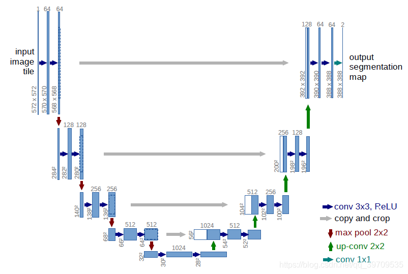                               

里面用到4次torch.cat,其中copy and crop操作就是通过torch.cat来实现的。可以看到通过上采样（up-conv 2x2）将原始图像h和w变为原来2倍，再和左边直接copy过来的同样h,w的图像拼接。这样做，可以有效利用原始结构信息。

4.总结

使用torch.cat((A,B),dim)时，除拼接维数dim数值可不同外其余维数数值需相同，方能


#### 51.torch.cuda.amp.autocast()

`torch.cuda.amp.autocast()` is a PyTorch feature for automatic mixed precision (AMP) training. It enables automatic casting of operations to work with both float16 (or bfloat16) and float32 precision to improve training speed while maintaining model accuracy.

Here's a brief explanation of how to use it:

```python
from torch.cuda.amp import autocast

# Basic usage in training loop
with autocast():
    outputs = model(inputs)
    loss = criterion(outputs, labels)
```

The key benefits are:
1. Faster training by using lower precision operations where possible
2. Lower memory usage
3. Maintains model accuracy by automatically choosing appropriate precision

Hint: do not use this on the phrase of reloading, Lessons paid for in blood, this bug took me two weeks.


#### 52. torch.optim.Adam()

this part will be re-summarized in the future.

Hint: *Optimizer step is performed on every mini batch*, while scheduler step is usually performed per-epoch.

optimizer step() is used for updating the parameter on every mini batch.

scheduler step() is used for changing the learning rate for each epoch. 


Yes, I am familiar with the `torch.optim.Adam()` function from the PyTorch library. `torch.optim.Adam` is an implementation of the Adam optimizer, which is widely used in training neural networks due to its adaptive learning rate and momentum.

Here is a brief overview of the `torch.optim.Adam` function:

`torch.optim.Adam` Overview

The Adam optimizer is an extension to stochastic gradient descent that maintains per-parameter learning rates, which are adapted based on the first and second moments of the gradients. This method is particularly beneficial for training deep neural networks.

Syntax

```python
torch.optim.Adam(params, lr=0.001, betas=(0.9, 0.999), eps=1e-08, weight_decay=0, amsgrad=False)
```

Parameters

- **params**: iterable of parameters to optimize or dicts defining parameter groups.
- **lr** (float, optional): Learning rate (default: 1e-3).
- **betas** (Tuple[float, float], optional): Coefficients used for computing running averages of gradient and its square (default: (0.9, 0.999)).
- **eps** (float, optional): Term added to the denominator to improve numerical stability (default: 1e-8).
- **weight_decay** (float, optional): Weight decay (L2 penalty) (default: 0).
- **amsgrad** (boolean, optional): Whether to use the AMSGrad variant of this algorithm from the paper "On the Convergence of Adam and Beyond" (default: False).

Example Usage

Here's an example of how to use the `torch.optim.Adam` optimizer in a typical training loop:

```python
import torch
import torch.nn as nn
import torch.optim as optim

# Define a simple model
model = nn.Sequential(
    nn.Linear(10, 5),
    nn.ReLU(),
    nn.Linear(5, 1)
)

# Define a loss function
criterion = nn.MSELoss()

# Initialize the Adam optimizer
optimizer = optim.Adam(model.parameters(), lr=0.001)

# Dummy input and target
input = torch.randn(10)
target = torch.randn(1)

# Training loop
for epoch in range(100):
    optimizer.zero_grad()   # Zero the gradients
    output = model(input)   # Forward pass
    loss = criterion(output, target)  # Compute loss
    loss.backward()  # Backward pass
    optimizer.step()  # Update parameters

    print(f'Epoch {epoch+1}, Loss: {loss.item()}')
```

In this example, the optimizer is used to minimize the mean squared error between the model's output and the target. The `optimizer.zero_grad()` call is used to reset the gradients of the model parameters before each backward pass. The `loss.backward()` call computes the gradient of the loss with respect to the model parameters, and `optimizer.step()` updates the model parameters based on the computed gradients.

Key Features

1. **Adaptive Learning Rate**: Adjusts the learning rate based on the first and second moments of the gradient, which helps in handling sparse gradients on noisy problems.
2. **Momentum**: Combines the advantages of the AdaGrad and RMSProp algorithms to compute adaptive learning rates.
3. **Bias Correction**: The initial bias-correction ensures that the initial steps are not too large.

This optimizer is often preferred due to its efficiency and relatively low memory requirements, making it a popular choice for training deep learning models.

##### different layers, different optimization

This code is actually demonstrating how to apply different optimization settings to different layers of the network. Let me explain:

The Adam optimizer is being configured with three different parameter groups:

Each group can have its own unique optimization settings:

1. First FC layer (fc1):
   - Has its own parameter group
   - Weight decay = 0.005
2. Second FC layer (fc2):
   - Has its own parameter group
   - Weight decay = 0.009
3. All other layers:
   - Grouped together
   - Weight decay = 0

```python
import torch.optim as optim
from model import CNNModel

model = CNNModel(no_of_leads = 12, no_of_classes=23)
optimizer = optim.Adam([
    {'params': model.fc1.parameters(), 'weight_decay': 0.005},  # First FC layer
    {'params': model.fc2.parameters(), 'weight_decay': 0.009},  # Second FC layer
    {'params': [p for n, p in model.named_parameters() 
               if not any(x in n for x in ['fc1', 'fc2'])], 
     'weight_decay': 0}  ], lr=0.0005, betas=(0.9, 0.999))

print(optimizer.state_dict())
print("---------------------------------------------------------------")
for param_group in optimizer.param_groups:
    print(param_group['lr'])
```

output:

```
{'state': {}, 'param_groups': [{'weight_decay': 0.005, 'lr': 0.0005, 'betas': (0.9, 0.999), 'eps': 1e-08, 'amsgrad': False, 'maximize': False, 'foreach': None, 'capturable': False, 'differentiable': False, 'fused': None, 'params': [0, 1, 2, 3]}, {'weight_decay': 0.009, 'lr': 0.0005, 'betas': (0.9, 0.999), 'eps': 1e-08, 'amsgrad': False, 'maximize': False, 'foreach': None, 'capturable': False, 'differentiable': False, 'fused': None, 'params': [4, 5, 6, 7]}, {'weight_decay': 0, 'lr': 0.0005, 'betas': (0.9, 0.999), 'eps': 1e-08, 'amsgrad': False, 'maximize': False, 'foreach': None, 'capturable': False, 'differentiable': False, 'fused': None, 'params': [8, 9, 10, 11, 12, 13, 14, 15, 16, 17, 18, 19, 20, 21, 22, 23, 24, 25, 26, 27, 28, 29, 30, 31, 32, 33, 34, 35, 36, 37, 38, 39, 40, 41, 42, 43, 44, 45, 46, 47, 48, 49, 50, 51]}]}
---------------------------------------------------------------
0.0005
0.0005
0.0005
```


#### 53. torch.optim.lr_scheduler.MultiStepLR()

`torch.optim.lr_scheduler.MultiStepLR`(*optimizer*, *milestones*, *gamma=0.1*, *last_epoch=- 1*, *verbose=False*)

Decays the learning rate of each parameter group by gamma once the number of epoch reaches **one of the milestones**. Notice that such decay can happen simultaneously with other changes to the learning rate from outside this scheduler. When last_epoch=-1, sets initial lr as lr.


```python
import torch.optim as optim
from torch.optim import lr_scheduler
from torchvision.models import AlexNet

model = AlexNet(num_classes=2)

optimizer = optim.Adam(params=model.parameters(), lr=0.01)
scheduler = lr_scheduler.MultiStepLR(optimizer, list(range(5,10)), gamma=0.5)

print("This is the scheduler.get_lr(): ",scheduler.get_lr(),type(scheduler.get_lr()), len(scheduler.get_lr()))
scheduler.step()
print("This is the scheduler.get_lr(): ",scheduler.get_lr(),type(scheduler.get_lr()), len(scheduler.get_lr()))
print("-----------------------------------------")

for epoch in range(20):
    scheduler.step()
    print(epoch, scheduler.get_lr())
```

output:

```bash
This is the scheduler.get_lr():  [0.01] <class 'list'> 1
This is the scheduler.get_lr():  [0.01] <class 'list'> 1
-----------------------------------------
0 [0.01]
1 [0.01]
2 [0.01]
3 [0.0025]
4 [0.00125]
5 [0.000625]
6 [0.0003125]
7 [0.00015625]
8 [0.0003125]
9 [0.0003125]
10 [0.0003125]
11 [0.0003125]
12 [0.0003125]
13 [0.0003125]
14 [0.0003125]
15 [0.0003125]
16 [0.0003125]
17 [0.0003125]
18 [0.0003125]
19 [0.0003125]
```


#### 54. torch.optim.lr_scheduler.StepLR(*optimizer*, *step_size*, *gamma=0.1*, *last_epoch=-1*, *verbose=False*)

Decays the learning rate of each parameter group by gamma every step_size epochs. Notice that such decay can happen simultaneously with other changes to the learning rate from outside this scheduler. When last_epoch=-1, sets initial lr as lr.


```python
# Assuming optimizer uses lr = 0.05 for all groups
# lr = 0.05     if epoch < 30
# lr = 0.005    if 30 <= epoch < 60
# lr = 0.0005   if 60 <= epoch < 90
# ...
scheduler = StepLR(optimizer, step_size=30, gamma=0.1)
for epoch in range(100):
    train(...)
    validate(...)
    scheduler.step()
```

Hint: If we don’t call the operation `scheduler.step()`, the learning rate won’t be changed and stays at the initial value.


#### 55. optimizer.step() vs scheduler.step()

In summary, `optimizer.step()` is used for parameter updates, while `scheduler.step()` is used for adjusting the learning rate according to a predefined schedule. Both are important for the training process but serve different roles.


#### 56. torch.nn.Module.train(mode=True)&torch.nn.Module.eval()

`model.train()` tells your model that you are training the model. This helps inform layers such as Dropout and BatchNorm, which are designed to behave differently during training and evaluation. For instance, in training mode, BatchNorm updates a moving average on each new batch; whereas, for evaluation mode, these updates are frozen.


More details: `model.train()` sets the mode to train (see [source code](https://pytorch.org/docs/stable/_modules/torch/nn/modules/module.html#Module.train)). You can call either `model.eval()` or `model.train(mode=False)` to tell that you are testing. It is somewhat intuitive to expect `train` function to train model but it does not do that. It just sets the mode.


`model.eval()` is a kind of switch for some specific layers/parts of the model that behave differently during training and inference (evaluating) time. For example, Dropouts Layers, BatchNorm Layers etc. You need to turn them off during model evaluation, and `.eval()` will do it for you. In addition, the common practice for evaluating/validation is using `torch.no_grad()` in pair with `model.eval()` to turn off gradients computation:

| `model.train()`                                              | [`model.eval()`](https://stackoverflow.com/a/66843176/9067615) |
| ------------------------------------------------------------ | ------------------------------------------------------------ |
| Sets model in **train**ing mode i.e.  • `BatchNorm` layers use per-batch statistics • `Dropout` layers activated [etc](https://stackoverflow.com/questions/66534762/which-pytorch-modules-are-affected-by-model-eval-and-model-train) | Sets model in **eval**uation (inference) mode i.e.  • `BatchNorm` layers use running statistics • `Dropout` layers de-activated etc |
|                                                              | Equivalent to `model.train(False)`.                          |

**Note:** neither of these function calls run forward / backward passes. They tell the model *how* to act *when* run.

This is important as [some modules (layers)](https://stackoverflow.com/questions/66534762/which-pytorch-modules-are-affected-by-model-eval-and-model-train) (e.g. `Dropout`, `BatchNorm`) are designed to behave differently during training vs inference, and hence the model will produce unexpected results if run in the wrong mode.


#### 57.torch.nn.module()

Base class for all neural network modules.

Your models should also subclass this class.

Modules can also contain other Modules, allowing to nest them in a tree structure. 


#### 58. data.to(device, non_blocking=True) 

`data.to(device, non_blocking=True)` is used to move tensors to a specified device (typically CPU or GPU) in PyTorch, with two key components:

1. `to(device)` - Moves the tensor to the specified device (e.g., CUDA GPU or CPU)
2. `non_blocking=True` - This is an important performance optimization parameter:
   - When True, it allows asynchronous memory transfers between CPU and GPU
   - This is particularly useful during training when you want to overlap data transfer with computation
   - Only has an effect when copying from CPU to GPU memory

Here's a typical usage example:

```python
device = torch.device("cuda" if torch.cuda.is_available() else "cpu")
# Moving data to GPU asynchronously
inputs = data.to(device, non_blocking=True)
```

The `non_blocking=True` option is most beneficial when:
- You're using DataLoader with `pin_memory=True`
- Your code has computation that can run in parallel with the memory transfer
- You're working with large datasets where memory transfer time is significant


#### 59.torch.nn.ZeroPad2d()

Pads the input tensor boundaries with zero.

For N-dimensional padding, use [`torch.nn.functional.pad()`](https://pytorch.org/docs/stable/generated/torch.nn.functional.pad.html#torch.nn.functional.pad).

Parameters

**padding** ([*int*](https://docs.python.org/3/library/functions.html#int)*,* [*tuple*](https://docs.python.org/3/library/stdtypes.html#tuple)) – the size of the padding. If is int, uses the same padding in all boundaries. If a 4-tuple, uses (padding_left, padding_right, padding_top, padding_bottom)

Examples:

```python
>>> m = nn.ZeroPad2d(2)
>>> input = torch.randn(1, 1, 3, 3)
>>> input
tensor([[[[-0.1678, -0.4418,  1.9466],
          [ 0.9604, -0.4219, -0.5241],
          [-0.9162, -0.5436, -0.6446]]]])
>>> m(input)
tensor([[[[ 0.0000,  0.0000,  0.0000,  0.0000,  0.0000,  0.0000,  0.0000],
          [ 0.0000,  0.0000,  0.0000,  0.0000,  0.0000,  0.0000,  0.0000],
          [ 0.0000,  0.0000, -0.1678, -0.4418,  1.9466,  0.0000,  0.0000],
          [ 0.0000,  0.0000,  0.9604, -0.4219, -0.5241,  0.0000,  0.0000],
          [ 0.0000,  0.0000, -0.9162, -0.5436, -0.6446,  0.0000,  0.0000],
          [ 0.0000,  0.0000,  0.0000,  0.0000,  0.0000,  0.0000,  0.0000],
          [ 0.0000,  0.0000,  0.0000,  0.0000,  0.0000,  0.0000,  0.0000]]]])
>>> # using different paddings for different sides
>>> m = nn.ZeroPad2d((1, 1, 2, 0))
>>> m(input)
tensor([[[[ 0.0000,  0.0000,  0.0000,  0.0000,  0.0000],
          [ 0.0000,  0.0000,  0.0000,  0.0000,  0.0000],
          [ 0.0000, -0.1678, -0.4418,  1.9466,  0.0000],
          [ 0.0000,  0.9604, -0.4219, -0.5241,  0.0000],
          [ 0.0000, -0.9162, -0.5436, -0.6446,  0.0000]]]])
```


#### 60. torch.argmax()

`torch.argmax`(*input*) → LongTensor

Returns the indices of the maximum value of all elements in the `input` tensor.

This is the second value returned by [`torch.max()`](https://pytorch.org/docs/stable/generated/torch.max.html#torch.max). See its documentation for the exact semantics of this method.

NOTE

If there are multiple maximal values then the indices of the first maximal value are returned.

- Parameters

  **input** ([*Tensor*](https://pytorch.org/docs/stable/tensors.html#torch.Tensor)) – the input tensor.

Example:

```python
>>> a = torch.randn(4, 4)
>>> a
tensor([[ 1.3398,  0.2663, -0.2686,  0.2450],
        [-0.7401, -0.8805, -0.3402, -1.1936],
        [ 0.4907, -1.3948, -1.0691, -0.3132],
        [-1.6092,  0.5419, -0.2993,  0.3195]])
>>> torch.argmax(a)
tensor(0)
```


- `torch.argmax`(*input*, ***dim***, *keepdim=False*) → LongTensor

  

Returns the indices of the maximum values of a tensor across a dimension.

This is the second value returned by [`torch.max()`](https://pytorch.org/docs/stable/generated/torch.max.html#torch.max). See its documentation for the exact semantics of this method.

- Parameters

  **input** ([*Tensor*](https://pytorch.org/docs/stable/tensors.html#torch.Tensor)) – the input tensor.**dim** ([*int*](https://docs.python.org/3/library/functions.html#int)) – the dimension to reduce. If `None`, the argmax of the flattened input is returned.**keepdim** ([*bool*](https://docs.python.org/3/library/functions.html#bool)) – whether the output tensor has `dim` retained or not. Ignored if `dim=None`.

Example:

```python
>>> a = torch.randn(4, 4)
>>> a
tensor([[ 1.3398,  0.2663, -0.2686,  0.2450],
        [-0.7401, -0.8805, -0.3402, -1.1936],
        [ 0.4907, -1.3948, -1.0691, -0.3132],
        [-1.6092,  0.5419, -0.2993,  0.3195]])
>>> torch.argmax(a, dim=1)
tensor([ 0,  2,  0,  1])

# 矩阵dim=0维度上（每一列）张量最大值的索引
# 矩阵dim=1维度上（每一行）张量最大值的索引
```


#### 61. torch.FloatTensor()

`torch.Tensor`是一种包含单一数据类型元素的多维矩阵。

Torch定义了七种CPU tensor类型和八种GPU tensor类型：

| Data tyoe                | CPU tensor           | GPU tensor                |
| ------------------------ | -------------------- | ------------------------- |
| 32-bit floating point    | `torch.FloatTensor`  | `torch.cuda.FloatTensor`  |
| 64-bit floating point    | `torch.DoubleTensor` | `torch.cuda.DoubleTensor` |
| 16-bit floating point    | N/A                  | `torch.cuda.HalfTensor`   |
| 8-bit integer (unsigned) | `torch.ByteTensor`   | `torch.cuda.ByteTensor`   |
| 8-bit integer (signed)   | `torch.CharTensor`   | `torch.cuda.CharTensor`   |
| 16-bit integer (signed)  | `torch.ShortTensor`  | `torch.cuda.ShortTensor`  |
| 32-bit integer (signed)  | `torch.IntTensor`    | `torch.cuda.IntTensor`    |
| 64-bit integer (signed)  | `torch.LongTensor`   | `torch.cuda.LongTensor`   |

`torch.Tensor`是默认的tensor类型（`torch.FlaotTensor`）的简称。

一个张量tensor可以从Python的`list`或序列构建：


```python
import torch

a=10
a=torch.FloatTensor([[1, 2, 3], [4, 5, 6]])

print(a)
print("---------------")
print(a.long())
```


output:

```bash
tensor([[1., 2., 3.], [4., 5., 6.]]) 
---------------
tensor([[1, 2, 3], [4, 5, 6]])
```


#### 62. torch.tensor与torch.Tensor的区别

细心的读者可能注意到了，通过Tensor建立数组有torch.tensor([1,2])或torch.Tensor([1,2])两种方式。那么，这两种方式有什么区别呢？

​    （1）torch.tensor是从数据中推断数据类型，而torch.Tensor是torch.empty(会随机产生垃圾数组，详见实例)和torch.tensor之间的一种混合。但是，当传入数据时，torch.Tensor使用全局默认dtype(FloatTensor)；

​    （2）torch.tensor(1)返回一个固定值1，而torch.Tensor(1)返回一个大小为1的张量，它是**初始化**的随机值。


#### 63. forward()

Module类是nn模块里提供的一个模型构造类，是所有神经网络模块的基类，我们可以继承它来定义我们想要的模型。下面继承Module类构造本节开头提到的多层感知机。这里定义的MLP类重载了Module类的__init__函数和forward函数。它们分别用于创建模型参数和定义前向计算。前向计算也即正向传播。


```python
import torch
from torch import nn

class MLP(nn.Module):
    # 声明带有模型参数的层，这里声明了两个全连接层
    def __init__(self, **kwargs):
        # 调用MLP父类Module的构造函数来进行必要的初始化。这样在构造实例时还可以指定其他函数
        # 参数，如“模型参数的访问、初始化和共享”一节将介绍的模型参数params
        super(MLP, self).__init__(**kwargs)
        self.hidden = nn.Linear(784, 256) # 隐藏层
        self.act = nn.ReLU()
        self.output = nn.Linear(256, 10)  # 输出层
 
 
    # 定义模型的前向计算，即如何根据输入x计算返回所需要的模型输出
    def forward(self, x):
        print("-----------------------")
        print("The code goes here")
        print(f'This is the x:{x}')
        print("-----------------------")
        a = self.act(self.hidden(x))
        return self.output(a)

X = torch.rand(2, 784)
print(f'This is the big X:{X}')
net = MLP()
print("This is the Net:",net)
print("-----------------Divider-------------")

net(X)
'''
When a tensor is passed to an instance, the forward() will be automatically called, 
where net (X) is the return value of the forward(), 
This can also prove that: forward() is callable funciton.
'''
```

output:

```bash
This is the big X:tensor([[0.4453, 0.9970, 0.5351,  ..., 0.3065, 0.8355, 0.7803],
        [0.0405, 0.6654, 0.4172,  ..., 0.1077, 0.3329, 0.6616]])
This is the Net: MLP(
  (hidden): Linear(in_features=784, out_features=256, bias=True)
  (act): ReLU()
  (output): Linear(in_features=256, out_features=10, bias=True)
)
-----------------Divider-------------
-----------------------
The code goes here
This is the x:tensor([[0.4453, 0.9970, 0.5351,  ..., 0.3065, 0.8355, 0.7803],
        [0.0405, 0.6654, 0.4172,  ..., 0.1077, 0.3329, 0.6616]])
-----------------------
tensor([[ 0.0245, -0.1216,  0.1481,  0.0782,  0.1221,  0.0736, -0.3178, -0.2884,
          0.2686,  0.1267],
        [ 0.0489, -0.1041,  0.0629,  0.0625,  0.1631,  0.2585, -0.3531, -0.1964,
          0.1541,  0.0936]], grad_fn=<AddmmBackward0>)
```


为什么会调用forward()呢，是因为**Module**中定义了__call__()函数，该函数调用了forward()函数，当执行net(x)的时候，会自动调用__call__()函数.


**After all, forward method is callable functions**

```python
from torch import nn

class challengeloss(nn.Module):

    def __init__(self):
        super(challengeloss, self).__init__()
        print('code goes init')

    def forward(self, L, P):
        L = L
        N = L + P - L * P
        print("code goes forward",L,P)
        return N

chll=challengeloss()
print("---------------------------------")
m=chll(3,74)
print(m)
```

output:

```
code goes init 
---------------------------------
code goes forward 3 74 
-145
```

##### (1) forward() can only use () to call in python

In Python, the `forward()` method is commonly used in the context of defining and working with classes that **inherit from** the `nn.Module` class in the PyTorch library. The `forward()` method is a fundamental part of the PyTorch framework and is responsible for defining the forward pass of a neural network model.

The reason `forward()` is implemented using parentheses `()` in Python is because it is a method and follows the convention of calling methods in the language. In Python, methods are typically called using parentheses `()`, which can include arguments that are passed to the method.

When you define a class that inherits from `nn.Module` and override the `forward()` method, you define the specific computation that should be performed when the instance of the class is called as a function. This is commonly done for neural network models, where the `forward()` method defines the sequence of operations that are applied to the input data to produce the output.

By using parentheses for calling the `forward()` method, Python provides a clear and consistent syntax for invoking methods and passing any necessary arguments. This helps maintain readability and consistency within the language.

It's important to note that the use of parentheses to call methods is not limited to the `forward()` method. It applies to all methods in Python, where parentheses are used to indicate that a function or method is being called with any required arguments.

In summary, the `forward()` method in PyTorch is called using parentheses `()` in Python because it follows the convention of calling methods, where parentheses are used to invoke functions or methods and pass any necessary arguments.

##### (2) not always but recommend

If you define an `nn.Module`, you are usually storing some submodules, parameters, buffers or other arguments in its `__init__` method and write the actual forward logic in its `forward` method.
This is a convenient method as `nn.Module.__call__` will register hooks etc. and call finally into the `forward` method.
However, you don’t need to use this approach and could completely write your model in a functional way.

##### (3) overriding the forward

Example:

```python
import torch
import torch.nn as nn

class VSSM(nn.Module):
    def __init__(self):
        super(VSSM, self).__init__()
        self.linear = nn.Linear(10, 10)
        self.forward = self.my_forward

    def my_forward(self, x):
        return self.linear(x)


model = VSSM()
input = torch.randn(1, 10)
output = model(input)   # Calls my_forward via self.forward
print(output.shape)     # Should print: torch.Size([1, 10])
```

you can write the code as shown, where you assign the my_forward method to self.forward in the __init__ method of your VSSM class. This will effectively make my_forward the method that gets called when you invoke the model instance (e.g., model(input)).


#### 64. init() and __getitem__ () from class

__getitem__() is a magic method in Python, which when used in a class, **allows its instances to use the [] (indexer) operators**. 

example #1:

```python
class P(object):
   def __init__(self):       
       self.cus_dict = {'name': 'abc'}
       print("here is called(__init__())")

   def __getitem__(self, item):
       print("here is called(__getitem__())")
       return self.cus_dict[item]

if __name__ == '__main__':
   m = P() # When instantiating an object, only the __init__ function is called
   # here we should pay attention, if the object of P carries the argument(no indicator the self), 
   print("------------------")
   m['name'] # only the __getitem__ is called if only use [] (indexer) operators.
   print("------------------")
   
```

output:

```
here is called(__init__()) 
------------------ 
here is called(__getitem__()) 
------------------
```


example #2: 

If the object carries the extra argument(not indicator the self), we should convey the argument as well when the object is being instantiated.

```python
class P(object):
   def __init__(self, test_value):
​       print(test_value)
​       self.cus_dict = {'name': 'abc'}
​       print("here is called(__init__())")

   def __getitem__(self, item):
​       print("here is called(__getitem__())")
​       return self.cus_dict[item]

if __name__ == '__main__':
   m = P('hahahahahahahahha') 
   print("------------------")
```

output:

```
hahah here is called(__init__()) 
------------------
```

##### (1) getitem can only use [] to call in python

In Python, the `getitem` method, also known as the **indexing operator**, allows objects to support accessing their elements using square brackets `[]`. This is a common convention in many programming languages.

The reason `getitem` is implemented using square brackets `[]` in Python is primarily for readability and familiarity. Square brackets are widely used across various programming languages to represent indexing or accessing elements within a container, such as lists, tuples, or dictionaries.

By using square brackets for indexing, Python adheres to the principle of least surprise, making it easier for developers to understand and work with the language. It also helps maintain consistency within the language syntax.

Furthermore, Python provides flexibility by allowing objects to define their own `__getitem__` method, which is automatically called when using the indexing operator. This enables custom objects to support indexing and provide meaningful behavior when accessing their elements.

In summary, Python uses square brackets `[]` to call the `getitem` method for indexing because it follows common programming conventions, promotes readability, and allows for custom behavior in objects.

##### (2) between the `for` loop and the `__getitem__()` method

```python
class MyCustomList:
    def __init__(self, items):
        self.items = items
# the name of index is not necessary be the 'index', the name can be another as well, we need to keep same with 'index' for the content of method.
    def __getitem__(self, index):
        return self.items[index]


my_list = MyCustomList([1, 2, 3, 4, 5])

# Using a for loop to iterate over the custom list
for item in my_list:
    print(item)

```


##### The difference in how these methods are typically invoked in code.

1. **`forward()`**:
When you want to use the `forward()` method of a PyTorch model to perform a forward pass and get predictions, you call it with **parentheses** and pass the input data as an argument. This is the typical way to invoke it, as you're explicitly asking the model to process the input.

Example:
```python
output = model(input_data)  # Calling forward() with parentheses
```

2. **`__getitem__()`**:
When you want to access elements of an object using the custom indexing behavior provided by the `__getitem__()` method, you use **square brackets** (`[]`) and pass the index as an argument. This is often used in **loops** or when directly indexing the object, On the other hand, a loop is a control structure that allows you to iterate over a sequence or collection of items.

Example:
```python
item = my_list[2]  # Accessing item at index 2 using __getitem__()
```

In this context, you're using the `__getitem__()` method implicitly through the indexing operator (`[]`), whereas you explicitly call the `forward()` method using parentheses when you want to perform the forward pass of a neural network model.


#### 65. torch.nn.Conv2d()& Conv1d()

##### Difference between Conv2d() and Conv1d()

Conv1d is a convolutional layer that operates on sequential data with one spatial dimension, **such as text or time-series data.** It applies a 1-dimensional convolution to the input tensor, sliding a kernel of size kernel_size along the input sequence, and producing an output tensor with one spatial dimension.

On the other hand, Conv2d is a convolutional layer that operates on image data with two spatial dimensions. It applies a 2-dimensional convolution to the input tensor, sliding a kernel of size kernel_size along the height and width dimensions of the input image, and producing an output tensor with two spatial dimensions.

##### Conv1d

Parameters

- **in_channels** ([*int*](https://docs.python.org/3/library/functions.html#int)) – Number of channels in the input image
- **out_channels** ([*int*](https://docs.python.org/3/library/functions.html#int)) – Number of channels produced by the convolution
- **kernel_size** ([*int*](https://docs.python.org/3/library/functions.html#int) *or* [*tuple*](https://docs.python.org/3/library/stdtypes.html#tuple)) – Size of the convolving kernel
- **stride** ([*int*](https://docs.python.org/3/library/functions.html#int) *or* [*tuple*](https://docs.python.org/3/library/stdtypes.html#tuple)*,* *optional*) – Stride of the convolution. Default: 1
- **padding** ([*int*](https://docs.python.org/3/library/functions.html#int)*,* [*tuple*](https://docs.python.org/3/library/stdtypes.html#tuple) *or* [*str*](https://docs.python.org/3/library/stdtypes.html#str)*,* *optional*) – Padding added to **both sides** of the input. Default: 0
- **padding_mode** ([*str*](https://docs.python.org/3/library/stdtypes.html#str)*,* *optional*) – `'zeros'`, `'reflect'`, `'replicate'` or `'circular'`. Default: `'zeros'`
- **dilation** ([*int*](https://docs.python.org/3/library/functions.html#int) *or* [*tuple*](https://docs.python.org/3/library/stdtypes.html#tuple)*,* *optional*) – Spacing between kernel elements. Default: 1
- **groups** ([*int*](https://docs.python.org/3/library/functions.html#int)*,* *optional*) – Number of blocked connections from input channels to output channels. Default: 1
- **bias** ([*bool*](https://docs.python.org/3/library/functions.html#bool)*,* *optional*) – If `True`, adds a learnable bias to the output. Default: `True`


```python
import torch
import torch.nn as nn

m = nn.Conv1d(16, 33, 3, stride=2)
input = torch.randn(20, 16, 50)
output = m(input)

print(output.shape)
```

output:

```
torch.Size([20, 33, 24])
```


##### Conv2d

torch.nn.Conv2d(*in_channels*, *out_channels*, *kernel_size*, *stride=1*, *padding=0*, *dilation=1*, *groups=1*, *bias=True*, *padding_mode='zeros'*, *device=None*, *dtype=None*)

Applies a 2D convolution over an input signal composed of several input planes.

- Parameters:

  **in_channels** ([*int*](https://docs.python.org/3/library/functions.html#int)) – Number of channels in the input image 

  **out_channels** ([*int*](https://docs.python.org/3/library/functions.html#int)) – Number of channels produced by the convolution 

  **kernel_size** ([*int*](https://docs.python.org/3/library/functions.html#int) *or* [*tuple*](https://docs.python.org/3/library/stdtypes.html#tuple)) – Size of the convolving kernel 

  **stride** ([*int*](https://docs.python.org/3/library/functions.html#int) *or* [*tuple*](https://docs.python.org/3/library/stdtypes.html#tuple)*,* *optional*) – Stride of the convolution. Default: 1 

  **padding** ([*int*](https://docs.python.org/3/library/functions.html#int)*,* [*tuple*](https://docs.python.org/3/library/stdtypes.html#tuple) *or* [*str*](https://docs.python.org/3/library/stdtypes.html#str)*,* *optional*) – Padding added to **all four sides** of the input. Default: 0 **padding_mode** ([*str*](https://docs.python.org/3/library/stdtypes.html#str)*,* *optional*) – `'zeros'`, `'reflect'`, `'replicate'` or `'circular'`. Default: `'zeros'` 

  **dilation** ([*int*](https://docs.python.org/3/library/functions.html#int) *or* [*tuple*](https://docs.python.org/3/library/stdtypes.html#tuple)*,* *optional*) – Spacing between kernel elements. Default: 1 

  **groups** ([*int*](https://docs.python.org/3/library/functions.html#int)*,* *optional*) – Number of blocked connections from input channels to output channels. Default: 1 

  **bias** ([*bool*](https://docs.python.org/3/library/functions.html#bool)*,* *optional*) – If `True`, adds a learnable bias to the output. Default: `True`

Hint: When the dilation rate is 1, the dilated convolution reduces to a regular convolution. it means  there is no dilation applied.


```python
import torch
import torch.nn as nn

# With square kernels and equal stride
m = nn.Conv2d(16, 33, 3, stride=2)
input = torch.randn(20, 16, 50, 100)
output = m(input).shape

print(output)
```

output:

```
torch.Size([20, 33, 24, 49])
```

`(16, 33, 3)`: These are the arguments passed to the `Conv2d` class constructor. Let's examine them individually:

- `16`: The first argument represents the number of input channels or feature maps. In this case, there are 16 input channels. Each channel typically represents a different aspect or feature of the input data. **Hint: for the RGB image, the input channel is 3. But for the gray image the input channel is 1.** 
- `33`: The second argument represents the number of output channels. This determines the number of filters or feature maps the layer will learn. In this case, there will be 33 output channels or filters.
- `3`: The third argument represents the size of the convolutional kernel or filter. A kernel of size 3x3 is commonly used in convolutional layers.

`stride=2`: This is a named parameter that sets the stride of the convolution operation. The stride determines the step size used when sliding the convolutional kernel over the input data. In this case, a stride of 2 means that the kernel will move two units at a time.

##### The dilation of CNN

**Dilated Convolution:** It is a technique that expands the kernel (input) by inserting holes between its consecutive elements. In simpler terms, it is the same as convolution but it involves pixel skipping, so as to cover a larger area of the input. 

Key Point: Dilation and Gaps

- **Dilation** in CNNs controls how far apart the input elements are when the kernel samples them.
- The **spacing** (or gaps) between the sampled input elements is determined by dilation - 1.
- When dilation = 1 (the default in torch.nn.Conv2d), the spacing is: $\text{spacing} = \text{dilation} - 1 = 1 - 1 = 0$ This means **no gaps**—the kernel samples consecutive, adjacent elements in the input, just like a standard convolution.

```python
import numpy as np
import tensorflow as tf
import sys
from scipy.signal import convolve2d

np.random.seed(678)
tf.random.set_seed(6789)
sess = tf.compat.v1.Session()

# Initializing a 9x9 matrix of zeros.
mat_size = 9
matrix = np.zeros((mat_size,mat_size)).astype(np.float32) 

# Assigning 1's in the middle of matrix 
# to create a random input matrix
for x in range(4,7):
	for y in range(3,6):
		matrix[y,x] = 1

# Creating a random kernel for test
kernel = np.array([
	[1,2,3],
	[4,5,6],
	[7,8,9]
]).astype(np.float32) 

print("Original Matrix Shape : ",matrix.shape)
print(matrix)
print('\n')
print("Original kernel Shape : ",kernel.shape)
print(kernel)

# self-initializing a dilated kernel.
# ======[dilation factor = 3]======
dilated_kernel = np.array([
	[1,0,0,2,0,0,3],
	[0,0,0,0,0,0,0],
	[0,0,0,0,0,0,0],
	[4,0,0,5,0,0,6],
	[0,0,0,0,0,0,0],
	[0,0,0,0,0,0,0],
	[7,0,0,8,0,0,9]
])

print('\n')
print("Dilated kernel Shape : ",dilated_kernel.shape)
print(dilated_kernel)

print('\n')
print("DILATED CONVOLUTION RESULTS [Dilation Factor = 3]")
output = convolve2d(matrix,dilated_kernel,mode='valid')
print("Numpy Results Shape: ",output.shape)
print(output)

```

output:

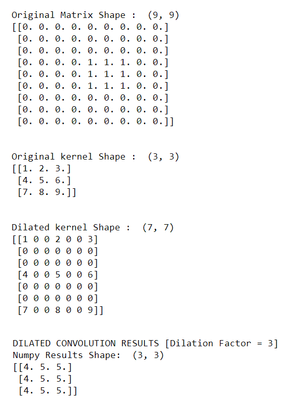


#### 66.torch.nn.ConvTranspose2d()

Alright — let’s break down **`torch.nn.ConvTranspose2d`** and how it differs from **`torch.nn.Conv2d`**, because they are often misunderstood due to the "transpose" part of the name.

------

1️⃣ `torch.nn.Conv2d`

This is the **standard convolution layer** in 2D:

- It takes an input image/tensor and applies a kernel (filter) to extract features.
- Usually **reduces spatial dimensions** (unless you use padding to keep them the same).
- **Operation**: slides the kernel over the input, performing dot products and producing a new feature map.

**Shape effect**
 If:

- `input` has shape `(N, C_in, H_in, W_in)`
- `Conv2d` params: `kernel_size`, `stride`, `padding`
   Then output size is:

$H_{\text{out}} = \left\lfloor \frac{H_{\text{in}} + 2 \cdot \text{padding} - \text{kernel\_size}}{\text{stride}} \right\rfloor + 1$$W_{\text{out}} = \left\lfloor \frac{W_{\text{in}} + 2 \cdot \text{padding} - \text{kernel\_size}}{\text{stride}} \right\rfloor + 1$

------

2️⃣ `torch.nn.ConvTranspose2d`

This is the **inverse operation** (also called **deconvolution** or **upconvolution**):

- It’s not exactly the mathematical inverse of convolution, but it **increases** the spatial dimensions — used for upsampling in decoder parts of CNNs (e.g., in autoencoders, UNet, GANs).
- Instead of sliding a kernel *over* the input, it projects each input value into a larger space and overlaps the projections, summing them.
- Often used to go from a low-resolution feature map to a higher-resolution one.

**Shape effect**
 If:

- `input` has shape `(N, C_in, H_in, W_in)`
- `ConvTranspose2d` params: `kernel_size`, `stride`, `padding`, `output_padding`
   Then output size is:

$H_{\text{out}} = (H_{\text{in}} - 1) \cdot \text{stride} - 2 \cdot \text{padding} + \text{kernel\_size} + \text{output\_padding}$$W_{\text{out}} = (W_{\text{in}} - 1) \cdot \text{stride} - 2 \cdot \text{padding} + \text{kernel\_size} + \text{output\_padding}$

------

3️⃣ Main Differences

| Feature             | `Conv2d`                                         | `ConvTranspose2d`                           |
| ------------------- | ------------------------------------------------ | ------------------------------------------- |
| Purpose             | Extract features                                 | Upsample / reconstruct features             |
| Spatial size change | Usually decreases (unless padding keeps it same) | Usually increases                           |
| Used in             | Encoder, feature extraction                      | Decoder, image generation                   |
| Formula             | Shrinks dimensions                               | Expands dimensions                          |
| Output padding      | Not applicable                                   | Needed sometimes to match exact target size |

------

4️⃣ Small Example

```python
import torch
import torch.nn as nn

# Standard convolution: reduces size
conv = nn.Conv2d(3, 6, kernel_size=3, stride=2, padding=1)
x = torch.randn(1, 3, 32, 32)
y = conv(x)
print("Conv2d output:", y.shape)  # (1, 6, 16, 16)

# Transposed convolution: increases size
tconv = nn.ConvTranspose2d(6, 3, kernel_size=3, stride=2, padding=1, output_padding=1)
z = tconv(y)
print("ConvTranspose2d output:", z.shape)  # (1, 3, 32, 32)
```

------

💡 **Key takeaway:**

- Think of **`Conv2d`** as *compressing* space and extracting features.
- Think of **`ConvTranspose2d`** as *expanding* space and reconstructing details.
- They are not perfect inverses, but they are shape-opposites in deep learning architectures.


#### 67. torch.nn.ConvTranspose1d()

Sure — let’s go step by step through `torch.nn.ConvTranspose1d()`, which is sometimes called a **“deconvolution”** or **“fractionally strided convolution”**.

------

🧩 1. **What It Does**

`torch.nn.ConvTranspose1d` performs the *inverse* of a normal 1D convolution (`Conv1d`).
 Instead of **reducing** the sequence length (as `Conv1d` usually does), it **increases** it — hence, it's often used for **upsampling** in time-series or audio generation tasks.

Think of it as:

> "How can we reconstruct a longer sequence from a compressed one using learned filters?"

------

⚙️ 2. **Syntax**

```python
torch.nn.ConvTranspose1d(
    in_channels,
    out_channels,
    kernel_size,
    stride=1,
    padding=0,
    output_padding=0,
    groups=1,
    bias=True,
    dilation=1,
    padding_mode='zeros'
)
```

------

📏 3. **Input / Output Shapes**

If your input has shape:

```
(batch_size, in_channels, input_length)
```

Then the output will have shape:

```
(batch_size, out_channels, output_length)
```

The **output length** is computed as:

[
 L_{\text{out}} = (L_{\text{in}} - 1) \times \text{stride} - 2 \times \text{padding} + \text{dilation} \times (\text{kernel_size} - 1) + \text{output_padding} + 1
 ]

------

🧠 4. **Intuitive Example**

```python
import torch
import torch.nn as nn

x = torch.randn(1, 4, 5)  # (batch=1, channels=4, length=5)
conv_t = nn.ConvTranspose1d(in_channels=4, out_channels=2, kernel_size=3, stride=2, padding=1)
y = conv_t(x)
print(y.shape)
```

Let’s calculate manually:

[
 L_{\text{out}} = (5 - 1) \times 2 - 2 \times 1 + 3 + 0 + 1 = 10
 ]

✅ So output shape → `(1, 2, 10)`

------

🎯 5. **Why Use ConvTranspose1d**

- **Upsampling** time series or audio (e.g., from latent representation to waveform).
- **Decoder** part of autoencoders or generative models.
- Inverse of a Conv1d when reconstructing signals.

------

⚖️ 6. **Difference from `Conv1d`**

| Feature          | `Conv1d`                                           | `ConvTranspose1d`                              |
| ---------------- | -------------------------------------------------- | ---------------------------------------------- |
| Typical use      | Downsampling / feature extraction                  | Upsampling / reconstruction                    |
| Effect on length | Usually decreases                                  | Usually increases                              |
| Stride           | Moves kernel forward                               | Expands output with spacing                    |
| Formula          | (L_{out} = \frac{L_{in} + 2p - d(k-1) - 1}{s} + 1) | (L_{out} = (L_{in}-1)s - 2p + d(k-1) + op + 1) |

------

🔍 7. **Common Gotcha: `output_padding`**

`output_padding` doesn’t add padding—it’s used to *fix size mismatches* when reversing a convolution.
 If you want exact symmetry in encoder–decoder architectures, you may need to adjust this manually.


#### 68. torch.save() & torch.load()

##### 一、保存方式

首先我们知道不论是保存模型还是参数都需要用到torch.save()。

对于torch.save()有两种保存方式：

只保存神经网络的训练模型的参数，save的对象是model.state_dict()；
既保存整个神经网络的的模型结构又保存模型参数，那么save的对象就是整个模型；

**Eg.** 假设我有一个训练好的模型名叫model，如何来保存参数以及结构？

```python
import torch

# 保存模型步骤
torch.save(model, './xxx/xxx/net.pth')  # 保存整个神经网络的模型结构以及参数
torch.save(model, 'net.pkl')  # 同上
torch.save(model.state_dict(), 'net_params.pth')  # 只保存模型参数
torch.save(model.state_dict(), 'net_params.pkl')  # 同上

# 加载模型步骤
model = torch.load('net.pth')  # 加载整个神经网络的模型结构以及参数
model = torch.load('net.pkl')  # 同上
model.load_state_dict(torch.load('net_params.pth')) # 仅加载参数
model.load_state_dict(torch.load('net_params.pkl')) # 同上

```

上面例子也可以看出若使用`torch.save()`来进行模型参数的保存，那保存文件的后缀其实没有任何影响，**.pkl** 文件和 **.pth** 文件一模一样。

**Hint**: 如果仅加载参数，需要原模型的变量。


##### 二、pkl、pth文件区别

实际上，这两种格式的文件还是有区别的。

###### 2.1 .pkl文件

 首先介绍 **.pkl** 文件，它若直接打开会显示一堆序列化的东西，以二进制形式存储的。如果去 **read** 这些文件，需要用`'rb'`而不是`'r'`模式。

```python
import pickle as pkl

file = os.path.join('annot',model.pkl) # 打开pkl文件
with open(file, 'rb') as anno_file:
	result = pkl.load(anno_file)
```

or:

```python
import pickle as pkl

file = os.path.join('annot',model.pkl) # 打开pkl文件
anno_file = open(file, 'rb')
result = pkl.load(anno_file)
```

###### 2.2 .pth文件

```python
import torch

filename = r'E:\anaconda\model.pth' # 字符串前面加r，表示的意思是禁止字符串转义
model = torch.load(filename)
print(model)

```

但其实不管pkl文件还是pth文件，都是以二进制形式存储的，没有本质上的区别，你用pickle这个库去加载pkl文件或pth文件，效果都是一样的。


##### The `map_location` parameter:

In PyTorch, `torch.load()` is a function used to load serialized objects from files. The `map_location` parameter is used to specify where the tensors should be loaded, which is particularly useful when you are loading a model saved on a device (e.g., GPU) and want to load it onto another device (e.g., CPU).

Here's how `map_location` works:

- If `map_location` is a dictionary, it's used to remap storage locations. For example, if you saved a model on GPU and want to load it on CPU, you would specify `map_location={'cuda:0': 'cpu'}`.
- If `map_location` is a string, it specifies where to load all tensors by default. For example, if you want to load tensors onto the CPU, you would specify `map_location='cpu'`.

Here's an example of loading a model saved on GPU onto the CPU:

```python
import torch

# Load the model
model = torch.load('model.pth', map_location='cpu')

```

This will load the model stored in 'model.pth' and move all tensors to the CPU.


#### 69. the strict from model.load_state_dict(torch.load(PATH), strict=False)

```python
modelB = TheModelBClass(*args, **kwargs)
modelB.load_state_dict(torch.load(PATH), strict=False)
```

Partially loading a model or loading a partial model are common scenarios when transfer learning or training a new complex model. Leveraging trained parameters, even if only a few are usable, will help to warmstart the training process and hopefully help your model converge much faster than training from scratch.

Whether you are loading from a partial *state_dict*, which is missing some keys, or loading a *state_dict* with more keys than the model that you are loading into, you can set the `strict` argument to **False** in the `load_state_dict()` function to ignore non-matching keys.

If you want to load parameters from one layer to another, but some keys do not match, simply change the name of the parameter keys in the *state_dict* that you are loading to match the keys in the model that you are loading into.

below is an example of warning:

```
Removing key head.weight from pretrained checkpoint
Removing key head.bias from pretrained checkpoint

For example, if you load a pre-trained model for ImageNet classification (with 1000 classes) and you want to fine-tune it for a new task with only 10 classes, you would typically replace the final layer (the "head") of the model. When loading the checkpoint, PyTorch recognizes that the head.weight and head.bias in the checkpoint do not match the dimensions of the new final layer you defined, so it removes these keys.
```


#### 70. state_dict()

In PyTorch, the learnable parameters (i.e. weights and biases) of a `torch.nn.Module` model are contained in the model’s parameters (accessed with `model.parameters()`). A `state_dict` is simply a Python dictionary object that maps each layer to its parameter tensor.

```python
import torch.optim as optim
import torch.nn.functional as F
import torch.nn as nn

# Define model

class TheModelClass(nn.Module):
    def __init__(self):
        super(TheModelClass, self).__init__()
        self.conv1 = nn.Conv2d(3, 6, 5)
        self.pool = nn.MaxPool2d(2, 2)
        self.conv2 = nn.Conv2d(6, 16, 5)
        self.fc1 = nn.Linear(16 * 5 * 5, 120)
        self.fc2 = nn.Linear(120, 84)
        self.fc3 = nn.Linear(84, 10)

    def forward(self, x):
       x = self.pool(F.relu(self.conv1(x)))
       x = self.pool(F.relu(self.conv2(x)))
       x = x.view(-1, 16 * 5 * 5)
       x = F.relu(self.fc1(x))
       x = F.relu(self.fc2(x))
       x = self.fc3(x)
       return x

# Initialize model

model = TheModelClass()

# Initialize optimizer

optimizer = optim.SGD(model.parameters(), lr=0.001, momentum=0.9)

# Print model's state_dict
print("Model's state_dict:")
for param_tensor in model.state_dict():
    print(param_tensor, "\t", model.state_dict()[param_tensor].size())


print("----------------------------------------")
# Print optimizer's state_dict
print("Optimizer's state_dict:")
for var_name in optimizer.state_dict():
    print(var_name, "\t", optimizer.state_dict()[var_name])
```


output:

```
Model's state_dict:
conv1.weight 	 torch.Size([6, 3, 5, 5])
conv1.bias 	 torch.Size([6])
conv2.weight 	 torch.Size([16, 6, 5, 5])
conv2.bias 	 torch.Size([16])
fc1.weight 	 torch.Size([120, 400])
fc1.bias 	 torch.Size([120])
fc2.weight 	 torch.Size([84, 120])
fc2.bias 	 torch.Size([84])
fc3.weight 	 torch.Size([10, 84])
fc3.bias 	 torch.Size([10])
----------------------------------------
Optimizer's state_dict:
state 	 {}
param_groups 	 [{'lr': 0.001, 'momentum': 0.9, 'dampening': 0, 'weight_decay': 0, 'nesterov': False, 'maximize': False, 'foreach': None, 'differentiable': False, 'params': [0, 1, 2, 3, 4, 5, 6, 7, 8, 9]}]
```


#### 71. torch.empty().random_() & torch.empty()

Example:

其中如果函数有下标“_”这个表示时[Tensor](https://so.csdn.net/so/search?q=Tensor&spm=1001.2101.3001.7020)里的内建函数，其中产生一个0到1的整数值来随机初始化y

```python
import torch

# 将y取0或1
y = torch.empty(3).random_(2)
print(y)
```

output:

```bash
tensor([1., 1., 0.])
```

**below is the part w.r.t torch.empty()**

just generating random data, the shape of the tensor is defined by the variable argument `size` which the argument from empty().

```python
import torch

y=torch.empty(3)
print(y)
```

Hint: ***Quick Answer:\*** torch.empty() creates tensor with any data type you want, torch.Tensor() only creates tensors of type torch.FloatTensor. So torch.Tensor() is a special case of torch.empty()

output:

```
tensor([-3.3491e+38,  3.0929e-41, -3.0275e+38])
```


#### 72. torch.nn.DataParallel() 

`torch.nn.DataParallel()` is a utility class provided by the PyTorch library that facilitates parallel execution of neural network computations across multiple GPUs. **It's commonly used to distribute the workload of training a neural network model across multiple graphics processing units** (GPUs) for faster training.

`DataParallel` works by replicating the model onto each of the available GPUs and splitting the input data into smaller batches, sending each batch to a different GPU for processing. **After the computations are complete, the gradients are collected from each GPU and averaged to update the model's parameters.**

Here's a simplified example of how you might use `DataParallel` in your PyTorch code:

```python
import torch
import torch.nn as nn
from torch.nn import DataParallel

# Define your neural network model
class MyModel(nn.Module):
    # ... Define layers and forward method ...

# Create an instance of your model
model = MyModel()

# Wrap the model with DataParallel
model = DataParallel(model)

# Move the model to GPUs if available
device = torch.device("cuda:0" if torch.cuda.is_available() else "cpu")
model.to(device)

# Define your loss function and optimizer
criterion = nn.CrossEntropyLoss()
optimizer = torch.optim.SGD(model.parameters(), lr=0.01)

# Training loop
for epoch in range(num_epochs):
    for inputs, labels in dataloader:
        inputs, labels = inputs.to(device), labels.to(device)

        # Forward pass
        outputs = model(inputs)
        loss = criterion(outputs, labels)

        # Backpropagation and optimization
        optimizer.zero_grad()
        loss.backward()
        optimizer.step()

```

Keep in mind that while `DataParallel` can simplify parallelism across GPUs, PyTorch also provides the `torch.nn.parallel.DistributedDataParallel` class for more advanced distributed training scenarios, particularly in multi-node setups. Always refer to the official PyTorch documentation for the most up-to-date and detailed information on using parallelism and distributed training features.

Hint:If you are working with only **one GPU**, **you don't need to use** `torch.nn.DataParallel()` because there's only one GPU available for computations. The purpose of `DataParallel` is to distribute computations across multiple GPUs to speed up training, so if you have only one GPU, it won't provide any additional benefits and might even introduce **unnecessary overhead**.


The difference between `module.encoder.0.weight` and `encoder.0.weight` often arises in the context of PyTorch models and how they are saved or loaded, especially when using the `nn.DataParallel` module for training on multiple GPUs.


**Multi-GPU Training with `nn.DataParallel`**: When training a model with `nn.DataParallel`, the state dictionary will have keys prefixed with `module`, such as `module.encoder.0.weight`.


#### 73. torch.nn.parallel.DistributedDataParallel()

It's a PyTorch module that provides distributed data parallelism, allowing you to train a model across multiple GPUs on a single machine or across multiple machines.

The `DistributedDataParallel` module:

- Wraps a model and handles the communication between replicas of the model running on different GPUs.
- Automatically synchronizes the gradients across replicas during the backward pass.
- Provides an abstraction over the underlying distributed communication package, such as NCCL or Gloo.
- Supports both single-machine and multi-machine distributed training.

To use `DistributedDataParallel`, you typically:

1. Initialize the distributed environment with `torch.distributed.init_process_group()`.
2. Wrap your model with `nn.parallel.DistributedDataParallel()`.
3. Ensure your dataloader is configured to work with distributed training.

Here's a simple example:

```python
import torch.distributed as dist
import torch.nn as nn
import torch.nn.parallel

# Initialize the distributed environment
dist.init_process_group(backend='nccl')

# Wrap your model with DistributedDataParallel
model = nn.Linear(10, 1)
model = nn.parallel.DistributedDataParallel(model)

# Use the wrapped model for training
```

The `DistributedDataParallel` module takes care of the communication and synchronization between the replicas of your model, allowing you to efficiently train on multiple GPUs.


#### 74. torch.nn.Linear()

below is only one layer, the neuron is 30. input has 128 data.

```python
import torch
from torch import nn

m = nn.Linear(20, 30)
input = torch.randn(128, 20)
print(input)
print("------------------------")
output = m(input)
print(output.size())
print(output)
```

output:

```
tensor([[-0.9771,  0.4335,  1.3242,  ..., -0.9972, -0.2351, -0.2201],        [ 0.6695,  0.1226,  0.6321,  ...,  0.8133,  1.9768, -1.0225],        [ 0.3623,  1.2667,  0.5457,  ...,  2.1877,  0.8420,  0.2036],        ...,        [ 0.6800,  0.4596, -0.0223,  ...,  0.1837, -0.2930, -1.5673],        [-0.0384,  1.2227,  0.2207,  ..., -0.3101, -0.1785,  0.6022],        [-0.1680,  0.7853, -0.8171,  ..., -0.6361,  0.7153,  0.7602]]) 
------------------------
torch.Size([128, 30]) 
tensor([[-0.2589, -0.0821, -0.1593,  ...,  0.4066, -0.4171, -0.4257],        [ 0.5849, -0.5448,  0.2569,  ...,  0.2027,  1.0030, -0.6241],        [-0.3641,  0.0504,  0.3085,  ...,  0.0112, -0.3904,  0.6075],        ...,        [-0.8970, -0.6790,  0.7113,  ..., -0.5090, -0.0185,  0.4327],        [-0.1577,  0.6159,  0.4980,  ...,  0.3427,  0.4944, -0.9509],        [ 0.7158,  0.6687, -0.2940,  ...,  1.5808, -0.6037, -0.0396]],       grad_fn=<AddmmBackward0>)
```

##### nn.Linear().weight

we can use above statement to check the weights.

```python
from torch import nn
# here should be paid attention the below torch.size is ([8, 5]), it means row:8 column:5
m = nn.Linear(5, 8)
print(m.weight)
print("---------------")
print("This is the size of weight:",m.weight.size())
```

output:

```
Parameter containing:
tensor([[ 0.4374,  0.4373,  0.0825,  0.3854,  0.1059],
        [-0.2149, -0.2871, -0.0476, -0.3999, -0.3833],
        [ 0.3388, -0.2034,  0.2516, -0.0158,  0.1927],
        [ 0.0961, -0.4366,  0.4090, -0.3781, -0.1626],
        [ 0.3324, -0.1836, -0.3048,  0.2473,  0.1962],
        [ 0.1097, -0.1786, -0.3855,  0.3869, -0.0452],
        [ 0.2645, -0.1102, -0.2556, -0.1755, -0.1297],
        [-0.1669,  0.2221, -0.2140, -0.3187,  0.2817]], requires_grad=True)
---------------
This is the size of weight: torch.Size([8, 5])
```


#### 75. torch.nn.functional.linear()

Yes, I'm familiar with the `torch.nn.functional.linear` function in PyTorch. This function applies a linear transformation to the input data using a weight matrix and an optional bias vector. Essentially, it performs a matrix multiplication followed by an optional addition of the bias.

Here is the general signature of the function:

```python
torch.nn.functional.linear(input, weight, bias=None)
```

Parameters:

- **input**: A tensor of shape `(N, *, in_features)` where `*` means any number of additional dimensions.
- **weight**: A tensor of shape `(out_features, in_features)`. This represents the weights of the linear layer.
- **bias**: An optional tensor of shape `(out_features)`. This is the bias term to be added to the output. If `None`, no bias is added.

Usage Example:

Here's an example of how to use `torch.nn.functional.linear`:

```python
import torch
import torch.nn.functional as F

# Define the input tensor
input = torch.randn(2, 3)  # Example input with shape (batch_size=2, in_features=3)

# Define the weight and bias tensors
weight = torch.randn(4, 3)  # Weight tensor with shape (out_features=4, in_features=3)
bias = torch.randn(4)       # Bias tensor with shape (out_features=4)

# Apply the linear transformation
output = F.linear(input, weight, bias)
print(output)
```

In this example, `input` is a tensor with shape `(2, 3)`, `weight` is a tensor with shape `(4, 3)`, and `bias` is a tensor with shape `(4)`. The output will have the shape `(2, 4)`.

Detailed Explanation:

- The `input` tensor represents the features or data points you want to transform.
- The `weight` tensor is the matrix that contains the learnable weights of the linear transformation.
- The `bias` tensor is an optional vector that gets added to the result of the matrix multiplication between `input` and `weight`.

The function computes the output as follows:
\[ \text{output} = \text{input} \times \text{weight}^T + \text{bias} \]

Where:
- \(\times\) denotes matrix multiplication.
- \(\text{weight}^T\) is the transpose of the `weight` matrix.

If `bias` is `None`, the function simply performs the matrix multiplication without adding the bias term.

This function is often used in defining custom neural network layers or for performing linear transformations outside of the usual `torch.nn.Linear` module.

Hint: the difference between torch.nn.Linear() and torch.nn.functional.linear()

torch.nn.Linear: This is a class that defines a linear layer as part of a neural network model. It maintains its own learnable parameters (weights and biases).
torch.nn.functional.linear: This is a function that applies a linear transformation to the incoming data. It does not maintain its own parameters; instead, **you must provide the weights and biases as arguments**.


#### 76. torch.nn.functional.conv1d(padding='same')

Yes! In recent versions of PyTorch (from **1.10** onward), the `torch.nn.functional.conv1d` function supports the argument `padding='same'`.

✅ How it works:

- `padding='same'` automatically calculates padding so that the output length is:

$\text{output\_length} = \lceil \frac{\text{input\_length}}{\text{stride}} \rceil$

In other words, the output size will match the input size (if `stride=1`), accounting for kernel size and dilation.

Example:

```python
import torch
import torch.nn.functional as F

x = torch.randn(1, 3, 10)  # (batch_size=1, channels=3, length=10)
weight = torch.randn(5, 3, 3)  # (out_channels=5, in_channels=3, kernel_size=3)

y = F.conv1d(x, weight, padding='same')
print(y.shape)  # should be (1, 5, 10)
```

Behind the scenes:

PyTorch automatically figures out how much zero-padding to apply on both sides to maintain that *"same"* output length.

------

⚠ Notes:

- ```
  padding='same'
  ```

   works only if:

  - `stride=1` (if you want perfect same size)
  - Kernel size is odd (for exact symmetrical padding; PyTorch will still handle even kernels, but be cautious)

- You need to ensure you’re using a sufficiently recent PyTorch version (≥ 1.10).

👉 **You can check your version with:**

```python
import torch
print(torch.__version__)
```

------


#### 77. torch.nn.functional.scaled_dot_product_attention()

This is a PyTorch function used to compute scaled dot-product attention, which is a key component of the Transformer architecture introduced in the paper "Attention is All You Need" by Vaswani et al. It’s commonly used in deep learning models, especially for tasks like natural language processing and computer vision.

Here’s a quick breakdown of what it does:

The function calculates attention based on the formula:
\[ \text{Attention}(Q, K, V) = \text{softmax}\left(\frac{QK^T}{\sqrt{d_k}}\right)V \]
Where:
- \( Q \) (queries), \( K \) (keys), and \( V \) (values) are input tensors.
- \( d_k \) is the dimension of the keys (used for scaling to prevent large values in the dot product).
- The scaling factor \(\sqrt{d_k}\) stabilizes gradients during training.

Syntax in PyTorch:

```python
torch.nn.functional.scaled_dot_product_attention(query, key, value, attn_mask=None, dropout_p=0.0, is_causal=False)
```

Parameters:

- `query`: Tensor of shape `(batch_size, num_heads, query_len, head_dim)` representing the queries.
- `key`: Tensor of shape `(batch_size, num_heads, key_len, head_dim)` representing the keys.
- `value`: Tensor of shape `(batch_size, num_heads, key_len, head_dim)` representing the values.
- `attn_mask` (optional): A mask to ignore certain positions (e.g., padding tokens). Can be a boolean or float tensor.
- `dropout_p` (optional): Dropout probability applied to the attention weights (default is 0.0).
- `is_causal` (optional): If `True`, applies a causal mask to prevent attending to future tokens (useful for autoregressive tasks like language generation).

Example Usage:

```python
import torch
import torch.nn.functional as F

# Example tensors (batch_size=1, num_heads=2, seq_len=3, head_dim=4)
query = torch.randn(1, 2, 3, 4)
key = torch.randn(1, 2, 3, 4)
value = torch.randn(1, 2, 3, 4)

# Compute scaled dot-product attention
output = F.scaled_dot_product_attention(query, key, value)
print(output.shape)  # Output shape: (1, 2, 3, 4)
```

Notes:

- This function is optimized for performance on modern hardware (e.g., GPUs) and is often faster than manually implementing the attention mechanism.
- It assumes the input tensors are already projected into the appropriate shapes (e.g., via linear layers in a Transformer model).
- If you’re working with causal attention (like in GPT-style models), set `is_causal=True` to ensure the model only attends to previous positions.


#### 78. torch.zeros_like()&torch.ones_like()

Returns a tensor filled with the scalar value 0, with the same size as `input`.

Returns a tensor filled with the scalar value 1, with the same size as `input`.

```python
import torch

input=torch.randn(2,3)
example1=torch.zeros_like(input)
example2=torch.ones_like(input)
print(input)
print(example1)
print(example2)
```

output:

```
tensor([[-0.6357,  1.2373,  1.6572],        
​		[ 1.6297,  1.1152,  0.3759]]) 

tensor([[0., 0., 0.],        
​		[0., 0., 0.]]) 

tensor([[1., 1., 1.],        
​		[1., 1., 1.]])
```


#### 79. torch.flatten()与torch.nn.Flatten()

 [torch](https://so.csdn.net/so/search?q=torch&spm=1001.2101.3001.7020).flatten(x)等于torch.flatten(x，0)默认将张量拉成一维的向量，也就是说从第一维开始平坦化，torch.flatten(x，1)代表从第二维开始平坦化。 torch.flatten(x,0,3)代表在第一维和第四维之间平坦化

```python
import torch

x=torch.randn(2,3,4,5)
print(x.size())
print("-----------------------")
z=torch.flatten(x)
print(z.size())
print("-----------------------")

w=torch.flatten(x,1)
print(w.size())
print("-----------------------")

w=torch.flatten(x,2)
print(w.size())
print("-----------------------")

w=torch.flatten(x,0,3)
print(w.size())

```

output:

```
torch.Size([2, 3, 4, 5]) 
-----------------------
torch.Size([120]) 
-----------------------
torch.Size([2, 60]) 
-----------------------
torch.Size([2, 3, 20]) 
-----------------------
torch.Size([120])
```


对于torch.nn.Flatten()，因为其被用在神经网络中，输入为一批数据，第一维为batch，通常要把一个数据拉成一维，而不是将一批数据拉为一维。**所以torch.nn.Flatten()默认从第二维开始平坦化**。

```python
import torch
#随机32个通道为1的5*5的图
x=torch.randn(32,1,5,5)

model=torch.nn.Sequential(
    #输入通道为1，输出通道为6，3*3的卷积核，步长为1，padding=1
    torch.nn.Conv2d(1,6,3,1,1),
    torch.nn.Flatten()
)
output=model(x)
print(output.shape)  # 6*（7-3+1）*（7-3+1）

输出为：

torch.Size([32, 150])
```


#### 80. connection between loss.backward()&optimizer.step()

Some answers explained well, but I'd like to give a specific example to explain the mechanism.

Suppose we have a function : z = 3 x^2 + y^3.
The updating gradient formula of z w.r.t x and y is:

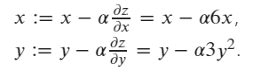

initial values are x=1 and y=2.

```python
import torch
x = torch.tensor([1.0], requires_grad=True)
y = torch.tensor([2.0], requires_grad=True)
z = 3*x**2+y**3

print("x.grad: ", x.grad)
print("y.grad: ", y.grad)
print("z.grad: ", z.grad)
# print result should be:
x.grad:  None
y.grad:  None
z.grad:  None
```

Then calculating the gradient of x and y in current value (x=1, y=2)

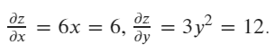

```python
# calculate the gradient
z.backward()

print("x.grad: ", x.grad)
print("y.grad: ", y.grad)
print("z.grad: ", z.grad)

# print result should be:
x.grad:  tensor([6.])
y.grad:  tensor([12.])
z.grad:  None
```

Finally, using SGD optimizer to update the value of x and y according the formula: 

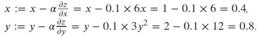

```python
# create an optimizer, pass x,y as the paramaters to be update, setting the learning rate lr=0.1
optimizer = torch.optim.SGD([x, y], lr=0.1)

# executing an update step
optimizer.step()

# print the updated values of x and y
print("x:", x)
print("y:", y)

# print result should be:
x: tensor([0.4000], requires_grad=True)
y: tensor([0.8000], requires_grad=True)
```


#### 81. torch.nn.ReLU()

```tex
参数inplace=True:
inplace为True，将会改变输入的数据 ，否则不会改变原输入，只会产生新的输出
inplace：can optionally do the operation in-place. Default: False
注： 产生的计算结果不会有影响。利用in-place计算可以节省内"RAM(Random-access memory)"（显）存，同时还可以省去反复申请和释放内存的时间。但是会对原变量覆盖，只要不带来错误就用。
```

```python
import torch
import torch.nn as nn

input = torch.randn(5)
print('输入处理前:\n', input, input.size())
print('*'*70)

print("Default. inplace=False:")
output_F = nn.ReLU(inplace=False)(input)
print('输入:\n', input, input.size())
print('输出:\n', output_F, output_F.size())

print('*'*70)

print("inplace=True:")
output_T = nn.ReLU(inplace=True)(input)
print('输入:\n', input, input.size())
print('输出:\n', output_T, output_T.size())
```

 output:

```powershell
输入处理前:
 tensor([-1.5561, -1.3829, -0.7814, -0.4832,  0.1552]) torch.Size([5])
**********************************************************************
Default. inplace=False:
输入:
 tensor([-1.5561, -1.3829, -0.7814, -0.4832,  0.1552]) torch.Size([5])
输出:
 tensor([0.0000, 0.0000, 0.0000, 0.0000, 0.1552]) torch.Size([5])
**********************************************************************
inplace=True:
输入:
 tensor([0.0000, 0.0000, 0.0000, 0.0000, 0.1552]) torch.Size([5])
输出:
 tensor([0.0000, 0.0000, 0.0000, 0.0000, 0.1552]) torch.Size([5])
```


#### 82. torch.nn.LeakyReLU(*negative_slope=0.01*, *inplace=False*)

Applies the element-wise function:

LeakyReLU(*x*)=max(0,*x*)+negative_slope∗min(0,*x*)

Parameters:

- **negative_slope** ([*float*](https://docs.python.org/3/library/functions.html#float)) – Controls the angle of the negative slope (which is used for negative input values). Default: 1e-2
- **inplace** ([*bool*](https://docs.python.org/3/library/functions.html#bool)) – can optionally do the operation in-place. Default: `False`

```python
import torch

m = torch.nn.LeakyReLU(0.1)
input = torch.randn(2)
print(input)
output = m(input)

print(output)
```

output:

```
tensor([-0.1224,  2.7356]) 
tensor([-0.0122,  2.7356])
```


#### 83. torch.nn.LeakyReLU() vs torch.nn.functional.leaky_relu()


In PyTorch, both `torch.nn.LeakyReLU()` and `torch.nn.functional.leaky_relu()` are used to apply the Leaky ReLU activation function, but they are used in slightly different contexts and have different purposes. Here are the key differences between the two:

`torch.nn.LeakyReLU()`

- **Class-based API**: `torch.nn.LeakyReLU` is a class that creates an instance of a Leaky ReLU activation function. It can be integrated into a `nn.Module` as a layer.
- **Stateful**: As an instance of a class, it can hold state and be included in a model's `state_dict`.
- **Usage in Sequential Models**: It can be used within `torch.nn.Sequential` blocks or as a part of a custom model's `__init__` method.
- **Example**:
  ```python
  import torch.nn as nn
  
  # Define a neural network with LeakyReLU as a layer
  class MyModel(nn.Module):
      def __init__(self):
          super(MyModel, self).__init__()
          self.fc1 = nn.Linear(10, 20)
          self.leaky_relu = nn.LeakyReLU(negative_slope=0.01)
          self.fc2 = nn.Linear(20, 1)
  
      def forward(self, x):
          x = self.fc1(x)
          x = self.leaky_relu(x)
          x = self.fc2(x)
          return x
  ```

`torch.nn.functional.leaky_relu()`

- **Functional API**: `torch.nn.functional.leaky_relu` is a function that applies the Leaky ReLU activation to a tensor. It is stateless and directly operates on input data.
- **More Flexible**: It can be used anywhere in the code without the need to define it as a layer. This is particularly useful in the `forward` method when you need more flexibility.
- **Example**:
  ```python
  import torch
  import torch.nn as nn
  import torch.nn.functional as F
  
  # Define a neural network using the functional API
  class MyModel(nn.Module):
      def __init__(self):
          super(MyModel, self).__init__()
          self.fc1 = nn.Linear(10, 20)
          self.fc2 = nn.Linear(20, 1)
  
      def forward(self, x):
          x = self.fc1(x)
          x = F.leaky_relu(x, negative_slope=0.01)
          x = self.fc2(x)
          return x
  ```

Summary

- **`torch.nn.LeakyReLU()`**: Use this when you want to define a Leaky ReLU as a layer within a model, which can be included in the model's `state_dict` and used with `torch.nn.Sequential`.
- **`torch.nn.functional.leaky_relu()`**: Use this when you need to apply Leaky ReLU directly to tensors within the `forward` method, providing more flexibility in where and how it's applied.

In general, if you are defining a model and want to use Leaky ReLU as a layer, go with `torch.nn.LeakyReLU()`. If you need to apply Leaky ReLU in a more flexible or ad-hoc manner, use `torch.nn.functional.leaky_relu()`.


#### 84. torch.mm(*input*, *mat2*, ***, *out=None*)

Performs a **m**atrix **m**ultiplication of the matrices `input` and `mat2`.

- Parameters:

  **input** ([*Tensor*](https://pytorch.org/docs/stable/tensors.html#torch.Tensor)) – the first matrix to be matrix multiplied**mat2** ([*Tensor*](https://pytorch.org/docs/stable/tensors.html#torch.Tensor)) – the second matrix to be matrix multiplied

- Keyword Arguments:

  **out** ([*Tensor*](https://pytorch.org/docs/stable/tensors.html#torch.Tensor)*,* *optional*) – the output tensor.

  

```python
import torch

mat1 = torch.randn(2, 3)
mat2 = torch.randn(3, 3)
print(mat1)
print(mat2)
print("--------------------")
result=torch.mm(mat1, mat2)
print(result)
```

output:

```
tensor([[-0.8290, -0.6466, -0.2649],        
[ 1.0774,  0.3734,  0.7960]]) 
tensor([[ 0.8418, -1.0231,  1.1602],        
[-0.9484, -0.4818,  0.8393],        
[-1.0636,  2.3593, -1.2942]]) 
-------------------- 
tensor([[ 0.1972,  0.5348, -1.1616],        
[-0.2938,  0.5957,  0.5332]])
```


#### 85. torch.sum(*input*, *, *dtype=None*)

Returns the sum of all elements in the `input` tensor.

- Parameters:

  **input** ([*Tensor*](https://pytorch.org/docs/stable/tensors.html#torch.Tensor)) – the input tensor.

- Keyword Arguments:

  **dtype** ([`torch.dtype`](https://pytorch.org/docs/stable/tensor_attributes.html#torch.dtype), optional) – the desired data type of returned tensor. If specified, the input tensor is casted to [`dtype`](https://pytorch.org/docs/stable/tensor_attributes.html#torch.dtype) before the operation is performed. This is useful for preventing data type overflows. Default: None.

Example:

```python
a = torch.randn(1, 3)
a
torch.sum(a)
```


#### 86. torch.nn.utils.clip_grad_norm()

`torch.nn.utils.clip_grad_norm()` is a function provided by PyTorch's `nn.utils` module that is used to clip the gradients of parameters in a neural network model. It helps prevent exploding gradients during the training process, which can destabilize the training process and make it difficult for the model to converge.

The function `clip_grad_norm` takes two parameters: `parameters` and `max_norm`.

- `parameters` is an iterable of parameters that need to have their gradients clipped. These parameters are typically obtained from the model using the `model.parameters()` method.
- `max_norm` is the maximum norm value allowed for the gradients. Gradients with norm larger than `max_norm` will be scaled down to have the same norm value. This helps to ensure that the gradients do not exceed a certain threshold.

Here's an example of how `clip_grad_norm` can be used:

```python
pythonCopy codeimport torch
import torch.nn as nn
import torch.nn.utils as utils

# Create a simple neural network model
class MyModel(nn.Module):
    def __init__(self):
        super(MyModel, self).__init__()
        self.fc = nn.Linear(10, 5)
    
    def forward(self, x):
        return self.fc(x)

model = MyModel()
optimizer = torch.optim.SGD(model.parameters(), lr=0.01)

# Perform forward and backward pass
input_data = torch.randn(10)
output = model(input_data)
loss = output.sum()
loss.backward()

# Clip gradients
max_norm = 1.0
utils.clip_grad_norm(model.parameters(), max_norm)

# Update the parameters
optimizer.step()
```

In this example, the gradients of the model's parameters are clipped using `clip_grad_norm` to have a maximum norm of 1.0. This ensures that the gradients do not grow too large and potentially cause instability during the optimization step. Finally, the optimizer is used to update the parameters based on the clipped gradients.


#### 87. torch.permute()

PyTorch **torch.permute()** rearranges the original tensor according to the desired ordering and returns a new multidimensional rotated tensor. The size of the returned tensor remains the same as that of the original.

```python
import torch

x = torch.randn(2, 3, 5)
x.size()
torch.permute(x, (2, 0, 1)).size()
```

output:

```
torch.Size([5, 2, 3])
```


#### 88. the input for the torch.nn.Conv2d()

torch.nn.Conv2d(*in_channels*, *out_channels*, *kernel_size*, *stride=1*, *padding=0*, *dilation=1*, *groups=1*, *bias=True*, *padding_mode='zeros'*, *device=None*, *dtype=None*)

Applies a 2D convolution over an input signal composed of several input planes.

这个函数需要输入一个四维数组，从左到右第一维是数据数量（一般就是图片数量），然后是channel数，然后是图片尺寸（行*列）。

```python
import torch
import torch.nn as nn

m = nn.Conv2d(in_channels=12,
                              out_channels=256,
                              kernel_size=(1,15),
                              padding=(0,7),
                              stride=(1,2),
                              bias=False)
input = torch.randn(128, 12, 1, 8192)
output = m(input).shape
print(output)
```

output:

```
torch.Size([128, 256, 1, 4096])
```


#### 89. torch.ones()

```python
import torch

m=torch.ones(2, 3)
print(m)
```

output:

```
tensor([[1., 1., 1.],
        [1., 1., 1.]])
```


#### 90. torch.nn.linear().bias&torch.nn.linear().weight

In a fully connected feedforward neural network, where every neuron in a layer is connected to every neuron in the subsequent layer, **the number of biases is equal to the number of neurons in each layer, except for the input layer**. 

```python
import torch
from torch import nn

input = torch.ones(2, 4)
print(input)
print("------------------")
m = nn.Linear(4, 10)
print(m.weight)
print("This is the bias: ",m.bias)
print("------------------")
output=m(input)
print(output,output.size())
```

output:

```
tensor([[1., 1., 1., 1.],
        [1., 1., 1., 1.]])
------------------
Parameter containing:
tensor([[-1.6091e-01,  2.3428e-01,  1.9951e-01, -4.9811e-01],
        [-2.0970e-01,  2.3395e-01,  2.0872e-01,  2.6485e-01],
        [-9.4639e-02,  1.3374e-01,  6.3642e-03, -1.4294e-01],
        [-1.6239e-01,  4.2572e-01, -4.3870e-01, -1.9876e-01],
        [ 3.2162e-01, -3.4442e-01, -2.8008e-04, -6.9864e-02],
        [-2.6920e-01,  2.2169e-01,  1.6839e-01,  3.7457e-01],
        [ 3.8748e-01,  2.6485e-01,  4.6841e-01, -4.8173e-01],
        [-2.6852e-01,  1.8060e-01, -1.8390e-01, -4.5349e-01],
        [-6.3189e-02, -3.1551e-01,  2.0694e-02, -3.3643e-02],
        [ 2.5252e-01,  1.7889e-01, -4.9350e-01,  6.8989e-02]],
       requires_grad=True)
This is the bias:  Parameter containing:
tensor([ 0.1981,  0.4391,  0.1734,  0.1133, -0.4618,  0.1890, -0.1960, -0.0598,
        -0.0444, -0.4557], requires_grad=True)
------------------
tensor([[-0.0271,  0.9370,  0.0759, -0.2608, -0.5547,  0.6845,  0.4430, -0.7851,
         -0.4360, -0.4488],
        [-0.0271,  0.9370,  0.0759, -0.2608, -0.5547,  0.6845,  0.4430, -0.7851,
         -0.4360, -0.4488]], grad_fn=<AddmmBackward0>) torch.Size([2, 10])
```


#### 91. torch.nn.CrossEntropyLoss

The base is e.

```python
import torch.nn as nn


# Example of target with class indices
m = nn.Softmax(dim=1)

# 使用这个函数之前一定要实例化
loss = nn.CrossEntropyLoss()

input = torch.randn(3, 5, requires_grad=True)
print(f"This is the input: {input}")
softmax_input=m(input)
print(f"This is the softmax_input: {softmax_input}")
target = torch.empty(3, dtype=torch.long).random_(5)
print(f"This is the target: {target}")
output = loss(input, target)
print(f"This is the output: {output}")
```

output:

```
This is the input: tensor([
[ 0.5131,  0.0736,  0.9282, -0.7914,  0.9528],        
[ 1.5885,  0.1021,  0.0685,  0.2574,  3.1932],        
[ 0.0475, -0.6753, -0.6322,  0.5781, -0.2402]], requires_grad=True) 

This is the softmax_input: tensor([
[0.2007, 0.1293, 0.3040, 0.0545, 0.3115],        
[0.1496, 0.0338, 0.0327, 0.0395, 0.7443],        
[0.2251, 0.1093, 0.1141, 0.3827, 0.1688]], grad_fn=<SoftmaxBackward0>) 

This is the target: tensor([1, 4, 3]) 

This is the output: 1.1003996133804321
```

本文主要讲述CrossEntropyLoss函数内部的计算逻辑，我觉得摆一大堆公式都不如直接上代码来的实在。

首先，我们先设置好两个变量，input与y_target。

```python3
import torch
import torch.nn as nn
import numpy as np

a = np.arange(1,13).reshape(3,4)
b = torch.from_numpy(a)
input = b.float()
print('input:\n',input)
```

可以看到input矩阵如下：

```python3
 tensor([[ 1.,  2.,  3.,  4.],
        [ 5.,  6.,  7.,  8.],
        [ 9., 10., 11., 12.]])
```

然后设置y_target：

```python3
y_target = torch.tensor([1,2,3])
print('y_target:\n',y_target)
```

这个不用打印大家也应该知道是什么样了。

input是一个【3 4】的矩阵，y-target是一个【1 3】的矩阵。input是预测值，代表有三个样本，四个类别。y-target代表三个样本的真实标签。

```python3
crossentropyloss=nn.CrossEntropyLoss(reduction='none')
crossentropyloss_output=crossentropyloss(x_input,y_target)
print('crossentropyloss_output:\n',crossentropyloss_output)
```

经过CrossEntropyLoss后，最终结果为：

```python3
crossentropyloss_output:
 tensor([2.4402, 1.4402, 0.4402])
```

下面我们来剖析它的计算过程。**其实CrossEntropyLoss相当于softmax + log + nllloss**。

不信可以计算一遍：

```python3
softmax_func=nn.Softmax(dim=1)
soft_output=softmax_func(input)
print('soft_output:\n',soft_output)

log_output=torch.log(soft_output)
print('log_output:\n',log_output)

nllloss_func=nn.NLLLoss(reduction='none')
nllloss_output=nllloss_func(log_output, y_target)
print('nllloss_output:\n',nlloss_output)
```

最终结果是一样的：

```python3
nllloss_output:
 tensor([2.4402, 1.4402, 0.4402])
```

softmax、log这两个函数应该都比较好理解。

下面主要讲解一下nllloss这个损失函数。

有了经过softmax与log的矩阵，我们叫它矩阵A。

```python3
 tensor([[-3.4402, -2.4402, -1.4402, -0.4402],
        [-3.4402, -2.4402, -1.4402, -0.4402],
        [-3.4402, -2.4402, -1.4402, -0.4402]])
```

还有真实标签：

```text
tensor([1, 2, 3])
```

y-target中第一个数字，代表第一个样本的真实标签，第一个数字是1，代表第一个样本的真实标签为1。所以取出矩阵A的第一行第二个数字-2.4402，并加上一个负号。之后也是这样，依次取出-1.4402、-0.4402。

所以有了最终结果：

```text
crossentropyloss_output:
 tensor([2.4402, 1.4402, 0.4402])
```

reduction这个参数着重提一下，它一般有none、sum、mean等几个选项，none就是没有别的附加操作，sum就是把这个几个损失加和，mean就是把这几个损失求平均。


#### 92. tensor转成numpy的几种情况


1. GPU中的Variable变量：

a.cuda().data.cpu().numpy()

\2. GPU中的tensor变量：

a.cuda().cpu().numpy()

\3. CPU中的Variable变量：
a.data.numpy()

\4. CPU中的tensor变量：

a.numpy()

总结：

.cuda()是读取GPU中的数据

.data是读取Variable中的tensor

.cpu是把数据转移到cpu上

.numpy()把tensor变成numpy


#### 93. torch.nn.BCEWithLogitsLoss()

Sure, let's break down the calculation of the binary cross-entropy loss using the provided code:

Parameters:

- **pos_weight** ([*Tensor*](https://pytorch.org/docs/stable/tensors.html#torch.Tensor)*,* *optional*) – a weight of positive examples. Must be a vector with length equal to the number of classes.

```python
import torch
import torch.nn as nn

# Example logits and target values
logits = torch.tensor([0.5, -0.8, 1.2])  # Raw model outputs
targets = torch.tensor([1, 0, 1])        # Ground truth labels (binary)

# Create the BCEWithLogitsLoss instance
#this is instantiate must do 
criterion = nn.BCEWithLogitsLoss()

# Calculate the loss
loss = criterion(logits, targets.float())  # Targets are converted to float for compatibility

print("Binary Cross-Entropy Loss:", loss.item())
# output:0.36948
```

1. **Logits and Targets**:

   - `logits`: `[0.5, -0.8, 1.2]`
   - `targets`: `[1, 0, 1]`

2. **Sigmoid Activation**:
   The sigmoid activation function is internally applied to the logits before calculating the loss. **This converts the logits into probabilities.** The sigmoid function maps each logit to a value between 0 and 1.

3. **Binary Cross-Entropy Loss Calculation**:
   The binary cross-entropy loss is calculated using the following formula for each sample (index `i`):

   - `loss_i = -[target_i * log(prob_i) + (1 - target_i) * log(1 - prob_i)]`

   where:
   - `target_i` is the ground truth binary label for sample `i`.
   - `prob_i` is the predicted probability for sample `i` after the sigmoid activation.

   Let's calculate the loss for each sample using the provided logits and targets:

   For the first sample:
   - `target_0 = 1`
   - Applying sigmoid to `logit_0 = 0.5`: `prob_0 = 0.62245933`
   - `loss_0 = -[(1 * log(0.62245933) + (1 - 1) * log(1 - 0.62245933)]`

   For the second sample:
   - `target_1 = 0`
   - Applying sigmoid to `logit_1 = -0.8`: `prob_1 = 0.31002552`
   - `loss_1 = -[(0 * log(0.31002552) + (1 - 0) * log(1 - 0.31002552)]`

   For the third sample:
   - `target_2 = 1`
   - Applying sigmoid to `logit_2 = 1.2`: `prob_2 = 0.76852478`
   - `loss_2 = -[(1 * log(0.76852478) + (1 - 1) * log(1 - 0.76852478)]`

4. **Overall Loss**:
   The overall binary cross-entropy loss is the average of the individual sample losses:

   - `loss = (loss_0 + loss_1 + loss_2) / 3`

The calculated loss is then printed using `loss.item()`.

Please note that the exact values will depend on the specific values of the logits and targets, and the output will be the calculated binary cross-entropy loss for those values.

**Hint: The base of log is e.**

##### The difference with `torch.nn.functional.binary_cross_entropy_with_logits()`:

- Unlike `BCEWithLogitsLoss`, this function does not include the sigmoid activation function. Therefore, you typically need to apply the sigmoid activation function separately to the logits before using this function.

  ```python
  logits = model(input_data)
  sigmoid_logits = torch.sigmoid(logits)
  loss = torch.nn.functional.binary_cross_entropy_with_logits(sigmoid_logits, targets)
  
  ```

  

#### 94. torch.nn.BCELoss()

Creates a criterion that measures the **Binary Cross Entropy** between the target and the input probabilities.

 This is the whole purpose of the **loss function**! It should return **high values** for **bad predictions** and **low values** for **good predictions**.

Binary Cross Entropy /ˈbaɪnəri/ /krɒs ˈentrəpi/二元交叉熵

这里关于BCE的公式可以google.


where **y** is the **label** (**1** **for** **green** points and **0** **for** **red** points) and **p(y)** is the predicted **probability of the point being green** for all **N** points.

Reading this formula, it tells you that, for each **green** point (*y=1*), it adds *log(p(y))* to the loss, that is, the **log probability of it being green**. Conversely, it adds *log(1-p(y))*, that is, the **log probability of it being red**, for each **red** point (*y=0*). Not necessarily difficult, sure, but no so intuitive too…


```python
import torch
import torch.nn as nn

label = torch.Tensor([1, 1, 0])
pred = torch.Tensor([3, 2, 1])
pred_sig = torch.sigmoid(pred)
print(f'This is pred:{pred_sig}')


loss = nn.BCELoss()
print(loss(pred_sig, label))# 这里面的权重默认为1

# BCEWithLogitsLoss()=BCELoss()+sigmoid()

loss = nn.BCEWithLogitsLoss()
print(loss(pred, label))

import numpy as np

print(np.log(10)) # 这里面底数为常数e
```

output:

```
This is pred:tensor([0.9526, 0.8808, 0.7311])
tensor(0.4963)
tensor(0.4963)
2.302585092994046
```


`torch.nn.BCELoss()` requires probabilities

`torch.nn.functional.binary_cross_entropy_with_logits()`  and `torch.nn.BCEWithLogitsLoss()`

expect logits.

In summary, logits are the raw scores produced by the model, while probabilities are the normalized scores obtained after applying an appropriate activation function. Logits are used internally in the computation of the loss function, while probabilities are used for interpretation and decision-making.


#### 95. torch.nn.functional.pad()

`torch.nn.functional.pad()` is a function in PyTorch that is used to pad tensor data with zeros or a constant value along specified dimensions. Padding is a common operation in neural networks, especially in convolutional neural networks (CNNs), where it is often applied to input data to ensure that the spatial dimensions are preserved after convolutional and pooling layers.

Here is the basic syntax of `torch.nn.functional.pad()`:

```python
torch.nn.functional.pad(input, pad, mode='constant', value=0)
```

- `input`: The input tensor to be padded.
- `pad`: The amount of padding to be added. It can be a single integer, a tuple, or a list specifying the padding for each dimension.
- `mode`: The padding mode. It can be 'constant', 'reflect', or 'replicate'. The default is 'constant'.
- `value`: The value to fill the padding with if mode is 'constant'. The default is 0.

Here's an example:

```python
import torch
import torch.nn.functional as F

# Example tensor
x = torch.tensor([[1, 2], [3, 4]])

# Pad the tensor with a single value of 0 on all sides
padded_x = F.pad(x, pad=(1, 1, 1, 1), mode='constant', value=0)

print(padded_x)
```

In this example, the `pad` argument is a tuple `(1, 1, 1, 1)`, where the first two values represent padding to be added to the left and right sides, and the last two values represent padding to be added to the top and bottom sides. The resulting tensor `padded_x` will be:

```
tensor([[0, 0, 0, 0],
        [0, 1, 2, 0],
        [0, 3, 4, 0],
        [0, 0, 0, 0]])
```

This illustrates padding the original 2x2 tensor with a border of zeros.


#### 96. torch.nn.functional.leaky_relu()


#### 97. torch.nn.DataParallel

在多卡的GPU服务器，当我们在上面跑程序的时候，当迭代次数或者epoch足够大的时候，我们通常会使用nn.DataParallel函数来用多个GPU来加速训练。一般我们会在代码中加入以下这些：

```python
model = model.cuda() 
device_ids = [0, 1] 	# id为0和1的两块显卡
model = torch.nn.DataParallel(model, device_ids=device_ids)
```


或者

```python
device_ids = [0, 1]
model = torch.nn.DataParallel(model, device_ids=device_ids).cuda()
```

函数定义：

```python
CLASS torch.nn.DataParallel(module, device_ids=None, output_device=None, dim=0)
```

Parameters 参数：
module即表示你定义的模型；
device_ids表示你训练的device；
output_device这个参数表示输出结果的device；
而这最后一个参数output_device一般情况下是省略不写的，那么默认就是在device_ids[0]，也就是第一块卡上，也就解释了为什么第一块卡的显存会占用的比其他卡要更多一些。


#### 98. torch.manual_seed() & torch.cuda.manual_seed() & torch.cuda.manual_seed_all()

Here’s a summary of the three methods:

| Method                             | Purpose                                              | When to Use                                                  | Covers                                            |
| ---------------------------------- | ---------------------------------------------------- | ------------------------------------------------------------ | ------------------------------------------------- |
| `torch.manual_seed(seed)`          | Sets the seed for PyTorch (CPU & CUDA) operations    | Always use this for basic reproducibility                    | Affects both CPU and CUDA (if a GPU is available) |
| `torch.cuda.manual_seed(seed)`     | Sets the seed specifically for CUDA (GPU) operations | Use if you want to explicitly ensure reproducibility on a single GPU | Affects operations on a single GPU                |
| `torch.cuda.manual_seed_all(seed)` | Sets the seed for all GPUs in a multi-GPU setup      | Use only when working with multiple GPUs (`DataParallel` or `DistributedDataParallel`) | Ensures all GPUs use the same seed                |

**Which one should you use?**

- **If using only CPU:** `torch.manual_seed(seed)` is enough.
- **If using a single GPU:** `torch.manual_seed(seed)` is enough (optionally include `torch.cuda.manual_seed(seed)`).
- **If using multiple GPUs:** Use `torch.manual_seed(seed)` and `torch.cuda.manual_seed_all(seed)`.


#### 99. dim()

Let's create a simple neural network using PyTorch and then print the dimensions of its parameters:

```python
import torch.nn as nn

# Define a simple neural network class
class SimpleNN(nn.Module):
    def __init__(self, input_size, hidden_size, output_size):
        super(SimpleNN, self).__init__()
        self.fc1 = nn.Linear(input_size, hidden_size)
        self.relu = nn.ReLU()
        self.fc2 = nn.Linear(hidden_size, output_size)

    def forward(self, x):
        x = self.fc1(x)
        x = self.relu(x)
        x = self.fc2(x)
        return x

# Create an instance of the model
input_size = 10
hidden_size = 5
output_size = 3

model = SimpleNN(input_size, hidden_size, output_size)

# Print the dimensions of each parameter in the model
for name, param in model.named_parameters():
    print(f"{name}: {param.dim()} dimensions - {param.size()} shape")
```

In this example, we define a simple neural network with one hidden layer. The `named_parameters()` method is used to iterate over all named parameters of the model. For each parameter, we print its name, the number of dimensions, and the shape.

When you run this code, you'll see output similar to:

```
cssCopy codefc1.weight: 2 dimensions - torch.Size([5, 10])
fc1.bias: 1 dimensions - torch.Size([5])
fc2.weight: 2 dimensions - torch.Size([3, 5])
fc2.bias: 1 dimensions - torch.Size([3])
```

Here, `fc1.weight` is a 2-dimensional tensor (weight matrix) with a shape of (5, 10), and `fc1.bias` is a 1-dimensional tensor (bias vector) with a shape of (5). Similarly, `fc2.weight` is a 2-dimensional tensor with a shape of (3, 5), and `fc2.bias` is a 1-dimensional tensor with a shape of (3).


#### 100. tenor.float().to(device)

the code is converting the tensor to a float data type and then moving it to a specified device. This can be useful when you are working with PyTorch models that might be trained on a GPU but need to be used on a CPU or vice versa, or if you want to ensure that the tensor has a specific data type.

```python
import torch

# Create a tensor with integer values
tensor_int = torch.tensor([1, 2, 3])

# Convert the tensor to float and move it to a specified device (e.g., GPU)
device = torch.device("cuda:0" if torch.cuda.is_available() else "cpu")

tensor_float_on_device = tensor_int.float().to(device)

# Print the original tensor, converted tensor, and the device it's on
print("Original Tensor (int):", tensor_int)
print("Converted Tensor (float) on Device:", tensor_float_on_device)
print("Device:", tensor_float_on_device.device)
```

output:

```
Original Tensor (int): tensor([1, 2, 3])
Converted Tensor (float) on Device: tensor([1., 2., 3.], device='cuda:0')
Device: cuda:0
```


#### 101. torch.from_numpy()

To transfer a NumPy array to a PyTorch tensor, you can use the `torch.from_numpy()` function in PyTorch. 

```python
import numpy as np
import torch

# Create a NumPy array
numpy_array = np.array([[1, 2, 3], [4, 5, 6]])

# Convert NumPy array to PyTorch tensor
torch_tensor = torch.from_numpy(numpy_array)

# Print the PyTorch tensor
print(torch_tensor)

```

In this example, `numpy_array` is a NumPy array, and `torch_tensor` is the corresponding PyTorch tensor created using `torch.from_numpy(numpy_array)`.

It's important to note that the NumPy array and the PyTorch tensor share the same underlying data, so modifications to one will affect the other. If you want to create a separate copy, you can use the `.copy()` method:

```python
torch_tensor_copy = torch.from_numpy(numpy_array.copy())
```

This ensures that changes to `torch_tensor_copy` do not affect the original NumPy array.


#### 102. about register_forward_hook(hook)

register_forward_hook(hook) 最大的作用也就是当训练好某个model，想要展示某一层对最终目标的影响效果。


#### 103. torch.float32(float) vs torch.float64(double)

In summary, unless your specific deep learning task requires extremely high precision (which is rare in practice), it's generally more common to use `torch.float32` due to its efficiency in terms of both computation and memory usage. Using `torch.float32` can help speed up training and allow you to train larger models with limited resources.

pythonTo transfer a PyTorch tensor from `torch.float64` to `torch.float32`, you can use the `to` method. Here's an example:

```python
import torch

# Create a tensor of type torch.float64
tensor_float64 = torch.randn(5, 5, dtype=torch.float64)

# Convert to torch.float32
tensor_float32 = tensor_float64.to(torch.float32)

# Print the data types of the original and converted tensors
print("Original Tensor Type:", tensor_float64.dtype)
print("Converted Tensor Type:", tensor_float32.dtype)

```


#### 104. torch.sigmoid()

The PyTorch sigmoid function is an element-wise operation that squishes  any real number **into a range between 0 and 1**. This is a very common  activation function to use as the last layer of binary classifiers  (including logistic regression) because it lets you treat model  predictions like probabilities that their outputs are true, i.e. `p(y == 1)`.

Mathematically, the function is `1 / (1 + np.exp(-x))`. And plotting it creates a well-known curve:

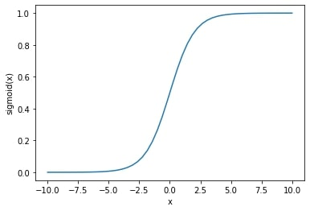

​																													y = sigmoid(x) for x in [-10, 10]

Similar to other activation functions like [softmax](https://sparrow.dev/pytorch-softmax/), there are two patterns for applying the sigmoid activation function in  PyTorch. Which one you choose will depend more on your style preferences than anything else.

```python
import torch

# torch.manual_seed(1)

x = torch.randn((3, 3))
y = torch.sigmoid(x)
print("This is the input:",x)
print("This is the output:",y)
```

output:

```
This is the input: tensor([[ 0.8585,  0.2175,  0.2708],
        [ 0.5805, -0.1018,  0.0460],
        [-0.7045, -0.5274,  1.9040]])
This is the output: tensor([[0.7023, 0.5542, 0.5673],
        [0.6412, 0.4746, 0.5115],
        [0.3308, 0.3711, 0.8703]])
```

Hint: Sigmoid is used for **binary classification** methods where we only have 2 classes, while SoftMax applies to **multiclass problems**. In fact, the SoftMax function is an extension of the Sigmoid function.


#### 105. torch.nn.Parameter()

`torch.nn.Parameter()` is a function that automatically registers tensors as trainable parameters within PyTorch modules, facilitating gradient tracking and optimization during training.


We use `torch.nn.Parameter()` when we need finer control over individual parameters, such as custom initialization or when incorporating parameters into more complex custom modules, whereas `torch.nn.Linear()` is a higher-level abstraction that combines both weights and biases into a single module, providing convenience for standard linear transformations in neural networks.

```python
import torch
import torch.nn as nn

# Define a simple linear regression module
class LinearRegression(nn.Module):
    def __init__(self, input_size, output_size):
        super(LinearRegression, self).__init__()
        self.weight = nn.Parameter(torch.randn(input_size, output_size))
        self.bias = nn.Parameter(torch.zeros(output_size))

    def forward(self, x):
        return torch.matmul(x, self.weight) + self.bias

# Create an instance of the LinearRegression module
model = LinearRegression(input_size=10, output_size=1)

# Access and print the parameters
print("Weight:", model.weight)
print("Bias:", model.bias)

# Create some dummy input data
input_data = torch.randn(5, 10)

# Forward pass
output = model(input_data)
print("Output shape:", output.shape)

```

Hint:

The actual values (e.g., random numbers from torch.randn()) are only the ***initial* values** of the parameter. During training, these values will be updated by the optimizer (e.g., SGD, Adam) based on gradients computed from the loss function.

torch.randn() is a common choice because it provides random values from a standard normal distribution (mean 0, variance 1), which is a reasonable starting point for many neural network parameters. However, you could initialize with zeros (torch.zeros(3, 3)), ones (torch.ones(3, 3)), or any other values, and the Parameter would still work—it’s just that the training process might converge differently depending on the initialization.

##### torch.nn.Parameter()._no_weight_decay = True

explain the difference

```python
# Case 1: With _no_weight_decay = True
param = nn.Parameter(torch.randn(10))
param._no_weight_decay = True
# Weight update during optimization:
# new_weight = weight - learning_rate * gradient
# (No weight decay term!)

# Case 2: Without _no_weight_decay (default behavior)
param = nn.Parameter(torch.randn(10))
# Weight update during optimization:
# new_weight = weight - learning_rate * (gradient + weight_decay * weight)
```


#### 106. torch.utils.data.RandomSampler()&torch.utils.data.SequentialSampler()

1. `SequentialSampler`: Samples elements from the dataset sequentially.

2. `RandomSampler`: Samples elements from the dataset randomly **without replacement**.

   hint: "without replacement" means that once an element is selected from the dataset, it is not put back into the pool of elements to be chosen again. Each element in the dataset can only be selected once until all elements have been sampled.

##### Use sampler instead of the shuffle

It is generally recommended to use a sampler instead of the `shuffle` argument when creating a `DataLoader` , especially when you want more control over the sampling process. Here are some reasons why you might want to use a sampler instead:

1. **Reproducibility: When you use the `shuffle` argument, the order of the data can be different each time you run your code, which can make it difficult to reproduce your results. Using a sampler with a fixed seed allows you to control the order of the data, making your results more reproducible.**
2. Customization: With a sampler, you can define your own sampling strategy, such as sampling a fixed subset of the data, or sampling the data with a certain probability distribution. This can be useful in scenarios where you have imbalanced classes or want to implement a custom sampling strategy.
3. Flexibility: When you use the `shuffle` argument, the data is shuffled before each epoch, which can be computationally expensive for large datasets. With a sampler, you have more control over how often the data is shuffled, which can be useful for optimizing performance.


#### 107. torch.utils.data.WeightedRandomSampler()

PyTorch provides the `torch.utils.data.WeightedRandomSampler` class, which can sample elements from a dataset **with replacement**. This allows you to specify a probability distribution for sampling the elements.

Here's how you can use `WeightedRandomSampler` with replacement:

1. **Initialize Your Dataset**: Prepare your dataset as usual.
2. **Define Weights**: Specify the weights for each element in your dataset. These weights determine the probability of each element being selected.
3. **Create the Sampler**: Use `WeightedRandomSampler` with the `replacement=True` parameter.

Here’s an example to illustrate how to use `WeightedRandomSampler` with replacement:

```python
import torch
from torch.utils.data import Dataset, DataLoader, WeightedRandomSampler

# Define a simple dataset
class MyDataset(Dataset):
    def __init__(self, data):
        self.data = data

    def __len__(self):
        return len(self.data)

    def __getitem__(self, idx):
        return self.data[idx]

# Create an instance of the dataset
data = [1, 2, 3, 4, 5]
dataset = MyDataset(data)

# Define weights for each element in the dataset
weights = [0.1, 0.2, 0.3, 0.2, 0.2]
sampler = WeightedRandomSampler(weights, num_samples=10, replacement=True)

# Create a DataLoader with the sampler
dataloader = DataLoader(dataset, sampler=sampler, batch_size=2)

# Iterate over the DataLoader
for batch in dataloader:
    print(batch)
```

In this example:
- **Weights**: The `weights` list `[0.1, 0.2, 0.3, 0.2, 0.2]` specifies the probability of each element `[1, 2, 3, 4, 5]` being selected.
- **Sampler**: The `WeightedRandomSampler` is created with `replacement=True`, meaning elements can be selected multiple times in the same sampling process.
- **num_samples**: The parameter `num_samples=10` specifies the total number of samples to draw.

When you run this code, you'll get batches of data where elements are sampled according to the specified weights and can be repeated across batches due to sampling with replacement.


#### 108. torch.split()

 `torch.split()` is a PyTorch function used to split a tensor into a specific number of chunks along a given dimension. It takes in three main parameters:

1. `tensor`: The input tensor that you want to split.

2. ```
   split_size_or_sections
   ```

   : This parameter defines how the tensor should be split. It can be either:

   - An integer, in which case `tensor` will be split into chunks of equal size along the specified dimension.
   - A list of integers, indicating the sizes of the chunks you want to create along the specified dimension.

3. `dim` (optional): Specifies the dimension along which the tensor will be split. By default, it's set to 0.

Here's the basic syntax:

```python
output = torch.split(tensor, split_size_or_sections, dim)
```

Let's see an example to illustrate how `torch.split()` works:

```python
import torch

# Create a tensor
tensor = torch.tensor([[1, 2, 3], [4, 5, 6], [7, 8, 9]])

# Split the tensor into chunks of size 2 along dimension 0
chunks = torch.split(tensor, 2, dim=0)

# Display the resulting chunks
for chunk in chunks:
    print(chunk)

```

output:

```
tensor([[1, 2, 3],
        [4, 5, 6]])
tensor([[7, 8, 9]])
```


`torch.split` (when you give it a tuple/list) expects the **sizes of each chunk**, and they must add up exactly to the tensor length along that dimension.

```python
import torch

tensor = torch.tensor([[1, 2, 3], [4, 5, 6], [7, 8, 9], [4, 5, 6], [7, 8, 9], 
                       [4, 5, 6], [7, 8, 9], [7, 8, 9], [4, 5, 6], [7, 8, 9]])

split_indices = (3, 2, 1, 4)  # sums to 10

chunks = torch.split(tensor, split_indices, dim=0)

for chunk in chunks:
    print(chunk)

```

output:

```
tensor([[1, 2, 3],
        [4, 5, 6],
        [7, 8, 9]])
tensor([[4, 5, 6],
        [7, 8, 9]])
tensor([[4, 5, 6]])
tensor([[7, 8, 9],
        [7, 8, 9],
        [4, 5, 6],
        [7, 8, 9]])
```


#### 109. torch.unbind()

It's a PyTorch function used to split a tensor into a tuple of tensors along a specified dimension. Essentially, it "unbinds" the tensor into separate pieces by removing the specified dimension and returning the resulting slices as individual tensors.

Here’s a quick breakdown:
- **Syntax**: `torch.unbind(tensor, dim=0)`
- **Input**: 
  - `tensor`: The input tensor you want to split.
  - `dim`: The dimension along which to unbind (default is 0).
- **Output**: A tuple of tensors, where each tensor is a slice of the original tensor along the specified dimension.

Example

```python
import torch

# Create a 3D tensor (2x3x4)
tensor = torch.arange(24).reshape(2, 3, 4)
print("Original tensor:")
print(tensor)

# Unbind along dimension 0 (splits into 2 tensors of shape 3x4)
unbound = torch.unbind(tensor, dim=0)
print("\nUnbound along dim 0:")
for t in unbound:
    print(t)
```

**Output**:
```
Original tensor:
tensor([[[ 0,  1,  2,  3],
         [ 4,  5,  6,  7],
         [ 8,  9, 10, 11]],

        [[12, 13, 14, 15],
         [16, 17, 18, 19],
         [20, 21, 22, 23]]])

Unbound along dim 0:
tensor([[ 0,  1,  2,  3],
        [ 4,  5,  6,  7],
        [ 8,  9, 10, 11]])
tensor([[12, 13, 14, 15],
        [16, 17, 18, 19],
        [20, 21, 22, 23]])
```

If you unbind along `dim=1`, it would split into 3 tensors of shape (2x4), and along `dim=2`, it would split into 4 tensors of shape (2x3). It’s a handy way to break down a tensor into its components along a specific axis.


| Feature                     | tensor.unbind()                | tensor.split()                    |
| --------------------------- | ------------------------------ | --------------------------------- |
| **Control over split size** | No (splits into single slices) | Yes (specify size or sections)    |
| **Output**                  | Tuple of tensors               | Tuple of tensors                  |
| **Number of outputs**       | Equal to size of dim           | Depends on split_size or sections |
| **Flexibility**             | Less flexible                  | More flexible                     |
| **Dimension removal**       | Effectively removes the dim    | Keeps the dim, splits into chunks |


#### 110. torch.cuda.Event

In PyTorch, `torch.cuda.Event` is a class representing an event that can be recorded and used for synchronization on a CUDA device. It is part of PyTorch's CUDA functionality, which allows for computations to be offloaded and accelerated on NVIDIA GPUs.

Here's a brief overview of how `torch.cuda.Event` can be used:

1. **Recording Events**: Events can be recorded on a CUDA device to mark points in a CUDA stream. This is typically done using the `record()` method.
2. **Synchronization**: Events can be used to synchronize CUDA streams. This is done using the `wait()` method, which blocks the current stream until the event is recorded in another stream.
3. **Timing**: Events can also be used for timing purposes to measure the execution time of CUDA operations. This is achieved by recording two events and then querying the time difference between them.

Here's a simple example demonstrating how `torch.cuda.Event` can be used:

```python
import torch

# Initialize CUDA events
start_event = torch.cuda.Event(enable_timing=True)
end_event = torch.cuda.Event(enable_timing=True)

# Record the start event
start_event.record()

# Perform some CUDA operations
# For example:
# result = some_cuda_operation(input)

# Record the end event
end_event.record()

# Synchronize streams
torch.cuda.synchronize()

# Calculate the elapsed time
elapsed_time_ms = start_event.elapsed_time(end_event)
print("Elapsed Time: {} milliseconds".format(elapsed_time_ms))

```

In this example, `start_event` and `end_event` are recorded at the beginning and end of the CUDA operations, respectively. Then, `torch.cuda.synchronize()` is used to ensure that all CUDA operations are completed before calculating the elapsed time. Finally, the elapsed time between the two events is calculated using the `elapsed_time()` method.


#### 111. torch.cuda.synchronize()

`torch.cuda.synchronize()` is a function used in PyTorch to synchronize /ˈsɪŋkrənaɪz/ the current stream with the host. In CUDA programming, streams are sequences of operations that are executed asynchronously on the GPU. When you call a function like `torch.cuda.synchronize()`, it ensures that all CUDA operations that were issued before this function call have been completed.

This synchronization is useful in scenarios where you want to accurately measure the **time taken** by a specific operation on the GPU or ensure that certain operations are complete before proceeding. For example, you might use it when benchmarking different parts of your code to accurately measure their performance.

Here's a basic example of how you might use `torch.cuda.synchronize()`:

**Make sure matmul operation is complete**

```python
import torch

# Some CUDA operations here
x = torch.randn(1000, 1000, device='cuda')
y = torch.randn(1000, 1000, device='cuda')

torch.cuda.synchronize()  # Synchronize CUDA operations

# Measure time taken by some operation
start_time = torch.cuda.Event(enable_timing=True)
end_time = torch.cuda.Event(enable_timing=True)

start_time.record()
result = torch.matmul(x, y)
end_time.record()
torch.cuda.synchronize()  # Make sure matmul operation is complete

elapsed_time_ms = start_time.elapsed_time(end_time)
print("Time taken for matrix multiplication:", elapsed_time_ms, "milliseconds")

```

output:

```
Time taken for matrix multiplication: 239.35533142089844 milliseconds
```

In this example, `torch.cuda.synchronize()` ensures that the `matmul` operation is complete before measuring the time taken by it.

##### below is an example by normal method for time taken(that is a incorrect demonstration)

used below code, the result of time taken is not correct at all.

```python
import torch
import time 

# Some CUDA operations here
x = torch.randn(10000, 10000, device='cuda')
y = torch.randn(10000, 10000, device='cuda')


# Measure time taken by some operation
start_time = torch.cuda.Event(enable_timing=True)
end_time = torch.cuda.Event(enable_timing=True)

start_time_normal = time.time()
result = torch.matmul(x, y)

total_time = time.time() - start_time_normal

print("normal time taken calculation:", total_time)
```

output:

```
normal time taken calculation: 0.00010776519775390625
```


#### 112. torch.tensor.expand()

[`torch.expand()` is a function in PyTorch that returns a new view of the input tensor with singleton dimensions expanded to a larger size](https://pytorch.org/docs/stable/generated/torch.Tensor.expand.html)[1](https://pytorch.org/docs/stable/generated/torch.Tensor.expand.html). Here’s a more detailed explanation:

- **Singleton dimensions**: These are dimensions of the tensor that have a size of 1. For example, a tensor of size (3, 1) has a singleton dimension at the second dimension.
- **Expanding a tensor**: This means increasing the size of the singleton dimensions of the tensor to a specified larger size. The expanded tensor will have the same values as the original tensor along the expanded dimensions.
- [**New view of the tensor**: This means that the expanded tensor does not allocate new memory, but only creates a new way to access the data of the existing tensor](https://pytorch.org/docs/stable/generated/torch.Tensor.expand.html)[1](https://pytorch.org/docs/stable/generated/torch.Tensor.expand.html). This is efficient in terms of memory usage.

Here’s an example:

```python
import torch

# Create a tensor of size (3, 1)
x = torch.tensor([[1], 
                  [2], 
                  [3]])

# Expand the tensor to size (3, 4)
y = x.expand(3, 4)

print(y)
```

This will output:

```
tensor([[1, 1, 1, 1],
        [2, 2, 2, 2],
        [3, 3, 3, 3]])
```

In this example, the second dimension of the tensor `x` is a singleton dimension. The `expand()` function increases the size of this dimension from 1 to 4. The values along this dimension in the expanded tensor `y` are the same as the values in the original tensor `x`.

One important thing to note is that more than one element of an expanded tensor may refer to a single memory location. As a result, in-place operations (especially ones that are vectorized) may result in incorrect behavior. [If you need to write to the tensors, please clone them first](https://pytorch.org/docs/stable/generated/torch.Tensor.expand.html)[1](https://pytorch.org/docs/stable/generated/torch.Tensor.expand.html).


another example:

```python
import torch

# Create a tensor of size (3, 1)
x = torch.tensor([[1], [2], [3]])

# Expand the tensor to size (3, 4)
y = x.expand(-1, 4) 
 # -1 means not changing the size of that dimension

print(y)
```

output:

```
tensor([[1, 1, 1, 1],
        [2, 2, 2, 2],
        [3, 3, 3, 3]])
```


another example:

```python
import torch

random_tensor = torch.rand(20, 512)
print(random_tensor.shape)

if len(random_tensor.shape) == 2:
    x = random_tensor.expand(1, -1, -1)

print(x.shape)
```

output:

```
torch.Size([20, 512])
torch.Size([1, 20, 512])
```


#### 113. torch.nn.init.zeros_()

Sure, I’d be happy to explain!

[The function `torch.nn.init.zeros_()` is a part of PyTorch’s neural network initialization module](https://pytorch.org/docs/stable/nn.init.html)[1](https://pytorch.org/docs/stable/nn.init.html). This function is used to initialize the parameters of a neural network.

Here’s what it does:

- [`torch.nn.init.zeros_(tensor)` fills the input tensor with the scalar value 0].

This is particularly useful when you want to initialize all the weights or biases of a particular layer in a neural network to zero. [It’s important to note that no gradient will be recorded for this operation](https://pytorch.org/docs/stable/nn.init.html)[2](https://pytorch.org/cppdocs/api/function_namespacetorch_1_1nn_1_1init_1af7e7736ba2d050adc0523d84285564e8.html).

Here’s an example of how you might use it:

```python
import torch

# Create an empty tensor
w = torch.empty(3, 5)

# Initialize the tensor with zeros
torch.nn.init.zeros_(w)
```

In this example, `w` is a tensor with shape (3, 5). After the `torch.nn.init.zeros_(w)` call, all elements in `w` will be 0.

[Remember, while initializing all weights to zero might be useful in certain cases, it’s not always the best approach because it can lead to symmetry during training and might prevent the network from learning effectively](https://stackoverflow.com/questions/49433936/how-do-i-initialize-weights-in-pytorch)[3](https://stackoverflow.com/questions/49433936/how-do-i-initialize-weights-in-pytorch). Therefore, other initialization methods are often used in practice.


​              

#### 114. torch.nn.init.ones_()

The function `torch.nn.init.ones_()` is a part of PyTorch’s neural network initialization module. [This function is used to fill the input tensor with the scalar value 1](https://pytorch.org/docs/stable/nn.init.html)[1](https://pytorch.org/docs/stable/nn.init.html).

Here’s a basic usage example:

```python
import torch
import torch.nn.init as init

# Create an empty tensor
w = torch.empty(3, 5)

# Fill the tensor with ones
init.ones_(w)
```

After running this code, the tensor `w` will be filled with ones. The resulting tensor will look like this:

```
tensor([[1., 1., 1., 1., 1.],
        [1., 1., 1., 1., 1.],
        [1., 1., 1., 1., 1.]])
```

[Please note that the function operates in-place, meaning it modifies the input tensor directly and does not return a new tensor](https://pytorch.org/docs/stable/nn.init.html)[1](https://pytorch.org/docs/stable/nn.init.html). [Also, no gradient will be recorded for this operation](https://pytorch.org/cppdocs/api/function_namespacetorch_1_1nn_1_1init_1a9dcc2051aadbe8ddb37d58bbd2b7943a.html)[2](https://pytorch.org/cppdocs/api/function_namespacetorch_1_1nn_1_1init_1a9dcc2051aadbe8ddb37d58bbd2b7943a.html).

​                 

​             

#### 115. torch.nn.init.constant_()

The `torch.nn.init.constant_` function in PyTorch is used to initialize the parameters (weights or biases) of a neural network module with a constant value. It modifies the tensor *in-place*, meaning it directly alters the input tensor's values without creating a new tensor.

Syntax

```python
torch.nn.init.constant_(tensor, val)
```

Parameters

- **tensor**: The PyTorch tensor to be initialized (e.g., weights or biases of a neural network layer).
- **val**: The constant value (a scalar, typically a float or integer) that will be used to fill the tensor.

Functionality

- This function sets all elements of the input `tensor` to the specified constant value `val`.
- It is commonly used to initialize parameters in a neural network, such as setting biases to a specific value (e.g., 0 or 1) or weights to a constant for specific use cases.
- The operation is performed *in-place*, so the tensor is modified directly, and no new tensor is returned.

Example

```python
import torch
import torch.nn as nn

# Define a linear layer
layer = nn.Linear(3, 2)

# Initialize the weights to a constant value of 0.5
nn.init.constant_(layer.weight, 0.5)

# Initialize the biases to a constant value of 0.0
nn.init.constant_(layer.bias, 0.0)

print(layer.weight)
print(layer.bias)
```

**Output**:

```
Parameter containing:
tensor([[0.5000, 0.5000, 0.5000],
        [0.5000, 0.5000, 0.5000]], requires_grad=True)
Parameter containing:
tensor([0., 0.], requires_grad=True)
```

Key Points

- **In-Place Operation**: The trailing underscore in `constant_` indicates that the function modifies the tensor in-place.
- **Use Case**: Useful for debugging, testing, or when a specific constant initialization is required (e.g., setting biases to 0 or weights to a small constant value).
- **Common Applications**: Often used in scenarios like initializing biases to zero or setting weights to a small constant to avoid large initial gradients.
- **Compatibility**: Works with any PyTorch tensor, typically used with `nn.Parameter` objects (e.g., `layer.weight` or `layer.bias` in a neural network module).

Notes

- Be cautious when using constant initialization, as setting all parameters to the same value can lead to symmetry issues in neural networks, potentially causing poor training dynamics (e.g., neurons learning the same features).
- For weights, other initialization methods like `xavier_uniform_`, `kaiming_uniform_`, or `normal_` are often preferred to introduce diversity in the initial values.
- Always ensure the tensor being initialized is part of a module with `requires_grad=True` if it’s meant to be trainable.

This function is simple but powerful for specific initialization needs in PyTorch neural networks.

​                 

#### 117. torch.nn.utils.clip_grad_norm_() vs torch.nn.utils.clip_grad_norm()

Pytorch uses the **trailing underscore convention** for **in-place** operations. So the difference is that the one with an underscore modifies the tensor in place and the other one leaves the original tensor unmodified and returns a new tensor.  

​            

 `torch.nn.utils.clip_grad_norm_()` is a function in PyTorch used to implement **gradient clipping**. Gradient clipping is a technique used to prevent exploding gradients in very deep networks, usually in the context of Recurrent Neural Networks (RNNs).

Here’s how you can use it:

```python
# Assuming 'model' is your neural network model and 'loss' is the loss function
# 'optimizer' is the optimization algorithm used
# 'data', 'hidden', and 'targets' are your input data, hidden states, and targets respectively
# 'args.clip' is the maximum allowed norm for the gradients (clipping threshold)

optimizer.zero_grad()         # Zero the gradients
loss, hidden = model(data, hidden, targets)  # Forward pass through the network
loss.backward()               # Compute the gradients

torch.nn.utils.clip_grad_norm_(model.parameters(), args.clip)  # Clip the gradients if they explode

optimizer.step()              # Update the weights
```

[In the above code, `torch.nn.utils.clip_grad_norm_(model.parameters(), args.clip)` is inserted between `loss.backward()` and `optimizer.step()`](https://stackoverflow.com/questions/54716377/how-to-do-gradient-clipping-in-pytorch)[1](https://stackoverflow.com/questions/54716377/how-to-do-gradient-clipping-in-pytorch). [The function `clip_grad_norm_` takes two arguments: the parameters of your model and the maximum allowed norm for the gradients](https://stackoverflow.com/questions/54716377/how-to-do-gradient-clipping-in-pytorch)[2](https://pytorch.org/docs/stable/generated/torch.nn.utils.clip_grad_norm_.html). [It computes the norm over all gradients together, as if they were concatenated into a single vector](https://stackoverflow.com/questions/54716377/how-to-do-gradient-clipping-in-pytorch)[2](https://pytorch.org/docs/stable/generated/torch.nn.utils.clip_grad_norm_.html). [If the norm of the gradient vector exceeds the maximum allowed norm, it will rescale the gradients to ensure that their norm is at most equal to the maximum norm](https://stackoverflow.com/questions/54716377/how-to-do-gradient-clipping-in-pytorch)[3](https://ai.stackexchange.com/questions/31991/what-exactly-happens-in-gradient-clipping-by-norm).

[Please replace `args.clip` with the maximum norm value you want to allow for the gradients](https://stackoverflow.com/questions/54716377/how-to-do-gradient-clipping-in-pytorch)[1](https://stackoverflow.com/questions/54716377/how-to-do-gradient-clipping-in-pytorch). This value is problem-specific and is usually chosen based on empirical results.

[Remember, this function modifies the gradients in-place, meaning the gradients of the model parameters are changed without needing to create a new variable](https://stackoverflow.com/questions/54716377/how-to-do-gradient-clipping-in-pytorch)[2](https://pytorch.org/docs/stable/generated/torch.nn.utils.clip_grad_norm_.html).


​              

#### 118. pytorch 中retain_graph==True的作用

总的来说进行一次backward之后，各个节点的值会清除，这样进行第二次backward会报错，如果加上retain_graph==True后,可以再来一次backward。

官方定义:

retain_graph (bool, optional) – If False, the graph used to compute the grad will be freed. Note that in nearly all cases setting this option to True is not needed and often can be worked around in a much more efficient way. Defaults to the value of create_graph.

大意是如果设置为False，计算图中的中间变量在计算完后就会被释放。但是在平时的使用中这个参数默认都为False从而提高效率，和creat_graph的值一样。

具体看一个例子理解：

假设一个我们有一个输入x，y = x **2, z = y*4，然后我们有两个输出，一个output_1 = z.mean()，另一个output_2 = z.sum()。然后我们对两个output执行backward。

```python
import torch
x = torch.randn((1,4),dtype=torch.float32,requires_grad=True)
y = x ** 2
z = y * 4
print("This is s:\n", x)
print("This is y:\n", y)
print("This is z:\n", z)
loss1 = z.mean()
loss2 = z.sum()
print(loss1,loss2)
loss1.backward()    # 这个代码执行正常，但是执行完中间变量都free了，所以下一个出现了问题
print(loss1,loss2)
loss2.backward()    # 这时会引发错误
```

程序正常执行到第12行，所有的变量正常保存。但是在第13行报错：

RuntimeError: Trying to backward through the graph a second time, but the buffers have already been freed. Specify retain_graph=True when calling backward the first time.

分析：计算节点数值保存了，但是计算图x-y-z结构被释放了，而计算loss2的backward仍然试图利用x-y-z的结构，因此会报错。

因此需要retain_graph参数为True去保留中间参数从而两个loss的backward()不会相互影响。正确的代码应当把第11行以及之后改成

```python
1 # 假如你需要执行两次backward,先执行第一个的backward，再执行第二个backward
2 loss1.backward(retain_graph=True)# 这里参数表明保留backward后的中间参数。
3 loss2.backward() # 执行完这个后，所有中间变量都会被释放，以便下一次的循环
4  #如果是在训练网络optimizer.step() # 更新参数
```

   

#### 119. torch.distributed.is_available()

The `torch.distributed.is_available()` function is a utility provided by PyTorch to check whether the distributed package is available and can be used in the current environment. It returns a boolean value indicating whether distributed training functionality is available.

```python
import torch

if torch.distributed.is_available():
    print("Distributed training is available.")
else:
    print("Distributed training is not available.")

```

output:

```
Distributed training is available.
```


#### 120. torch.distributed.get_rank()

`torch.distributed.get_rank()` is a function from PyTorch's distributed computing module. It returns the rank (unique identifier) of the current process in the distributed training setup.

Let me explain briefly:
- In distributed training, multiple processes/GPUs work together
- Each process gets a unique number called "rank" starting from 0
- `get_rank()` returns this number for the current process
- Process with rank 0 is typically considered the primary/master process

For example, if you're running distributed training across 4 GPUs:
```python
# This will return 0, 1, 2, or 3 depending on which GPU process is calling it
current_rank = torch.distributed.get_rank()

# Common usage pattern
if torch.distributed.get_rank() == 0:
    # Do something only on the primary process
    print("This is the master process")
```


#### 121. torch.distributed.barrier()

`torch.distributed.barrier()` is a synchronization primitive in PyTorch's distributed computing module. It creates a barrier that makes all processes wait until the entire group of processes reaches this barrier point in the code. This is useful in distributed training scenarios to ensure all processes are synchronized at certain points.

Here's a simple explanation of how it works:

1. When a process hits `torch.distributed.barrier()`, it waits at that point
2. The process won't continue until all other processes in the distributed group also reach their barrier()
3. Once all processes reach the barrier, they all resume execution

This is commonly used to:
- Synchronize processes before important operations
- Ensure data loading is complete across all processes
- Coordinate model parameter updates in distributed training
- Debug distributed code by ensuring specific execution order


#### 122. torch.exp()

The `torch.exp()` function is a part of the PyTorch library, which is widely used for deep learning and tensor computations. This function calculates the exponential of each element in the input tensor. The exponential function, often denoted as 𝑒𝑥*e**x*, is a mathematical function that raises the base of natural logarithms (approximately equal to 2.71828) to the power of 𝑥*x*.

Here’s a more detailed explanation and example of how `torch.exp()` works:

##### Syntax

```
torch.exp(input)
```

- `input`: A tensor of any shape.

##### Example

Let's go through a practical example to see how it works:

```python
import torch

# Create a tensor
input_tensor = torch.tensor([1.0, 2.0, 3.0])

# Apply the exponential function
output_tensor = torch.exp(input_tensor)

print(output_tensor)
```

##### Explanation

1. **Input Tensor**: The tensor `[1.0, 2.0, 3.0]` is given as input.

2. Exponential Calculation

   : The 

   ```
   torch.exp()
   ```

    function computes the exponential of each element:

   - 𝑒1=2.7183
   - 𝑒2=7.3891
   - 𝑒3=20.0855

3. **Output Tensor**: The result is a new tensor containing the exponential values: `[2.7183, 7.3891, 20.0855]`.


#### 123. tensor.gt(0.0)

`targets.gt(0.0)`: This is applying the `gt` function, which stands for “greater than”. It compares each element in the `targets` tensor to `0.0`, and returns a new tensor of the same shape as `targets` with each element being `True` if the corresponding element in `targets` is greater than `0.0`, and `False` otherwise. This operation does not change the original `targets` tensor.

```
import torch

# original targets tensor
targets = torch.tensor([-1.0, 0.0, 1.0, 2.0])
print("Original targets:", targets)
print("after the tensor.gt(0.0):", targets.gt(0.0))
```

output:

```
Original targets: tensor([-1.,  0.,  1.,  2.])
after the tensor.gt(0.0): tensor([False, False,  True,  True])
```


#### 124. torch.cuda.amp.custom_bwd and custom_fwd

The `@custom_fwd` and `@custom_bwd` are decorators provided by PyTorch’s `torch.cuda.amp` module. [They are used to customize the behavior of forward and backward methods in custom autograd functions, especially when using Automatic Mixed Precision (AMP)](https://pytorch.org/docs/stable/notes/amp_examples.html)[1](https://pytorch.org/docs/stable/notes/amp_examples.html)[2](https://pytorch.org/docs/stable/amp.html).

- `@custom_fwd(cast_inputs=torch.float32)`: This decorator is applied to the forward method of a custom autograd function. [If the forward method runs in an autocast-enabled region, this decorator casts floating-point CUDA Tensor inputs to the specified type (in this case, `torch.float32`) and locally disables autocast during the forward pass](https://pytorch.org/docs/stable/notes/amp_examples.html)[1](https://pytorch.org/docs/stable/notes/amp_examples.html).
- `@custom_bwd`: This decorator is applied to the backward method of a custom autograd function. [It locally disables autocast during the backward pass](https://pytorch.org/docs/stable/notes/amp_examples.html)[1](https://pytorch.org/docs/stable/notes/amp_examples.html). [It’s important to note that backward ops run in the same type that autocast used for corresponding forward ops](https://pytorch.org/docs/stable/amp.html)[2](https://pytorch.org/docs/stable/amp.html).

[Here’s an example of how they might be used in a custom function](https://pytorch.org/docs/stable/notes/amp_examples.html)[3](https://torchsparse.readthedocs.io/en/latest/_modules/torchsparse/nn/functional/voxelize.html):

```python
from torch.autograd import Function
from torch.cuda.amp import custom_bwd, custom_fwd

class MyFunction(Function):
    @staticmethod
    @custom_fwd(cast_inputs=torch.float32)
    def forward(ctx, input):
        # Forward pass implementation
        ...

    @staticmethod
    @custom_bwd
    def backward(ctx, grad_output):
        # Backward pass implementation
        ...
```

[In this example, the forward method of `MyFunction` will always receive inputs as `torch.float32` tensors when running in an autocast-enabled region, and autocast will be locally disabled during the forward and backward passes](https://torchsparse.readthedocs.io/en/latest/_modules/torchsparse/nn/functional/voxelize.html)[3](https://torchsparse.readthedocs.io/en/latest/_modules/torchsparse/nn/functional/voxelize.html). [This can be useful when you have a custom function that requires inputs of a specific data type](https://pytorch.org/docs/stable/notes/amp_examples.html)[1](https://pytorch.org/docs/stable/notes/amp_examples.html).

​                

#### 125. torch.empty() vs torch.rand()

 Sure, let’s clarify the difference between `torch.empty` and `torch.rand` (I assume you meant `torch.rand` as there is no `torch.random` in PyTorch).

- `torch.empty(size)`: This function returns a tensor filled with uninitialized data[1](https://pytorch.org/docs/stable/generated/torch.empty.html)[1](https://pytorch.org/docs/stable/generated/torch.empty.html). The shape of the tensor is defined by the variable argument `size`. The values that are present in the tensor after the call to `torch.empty` are whatever values were already in memory at that location. It’s faster because it **doesn’t have to write any values to the memory**.

Here’s an example of how you might use it:

```python
import torch

# Create an empty tensor
x = torch.empty(5, 3)
print(x)
```

output:

```
tensor([[-2.9967e+21,  4.5643e-41, -2.9967e+21],
        [ 4.5643e-41, -1.3718e+22,  4.5643e-41],
        [-2.9967e+21,  4.5643e-41, -1.9080e+00],
        [ 4.5642e-41, -1.9080e+00,  4.5642e-41],
        [-3.1927e+00,  4.5642e-41, -1.2208e+22]])
```


- `torch.rand(size)`: This function returns a tensor filled with random numbers from a **uniform distribution** on the interval [0, 1). The shape of the tensor is defined by the variable argument `size`.

Here’s an example of how you might use it:

```python
import torch

# Create a random tensor
x = torch.rand(5, 3)
print(x)
```

output:

```
tensor([[0.2441, 0.4754, 0.7705],
        [0.2609, 0.2801, 0.9015],
        [0.2230, 0.5429, 0.2787],
        [0.8308, 0.6675, 0.6638],
        [0.2661, 0.0852, 0.8574]])
```

In summary, `torch.empty` gives you a tensor with uninitialized values, and `torch.rand` gives you a tensor with random values. I hope this helps! Let me know if you have any other questions. 


#### 126. torch.flip([-1])

This function is used to reverse the order of elements in a tensor along specified dimensions.

```python
import torch

x = torch.arange(30).view(2, 5, 3)
print(x)
print("-------------------------")

y = x.flip([-1])
print(y)
print("-------------------------")

z = x.flip([1])
print(z)
```

output:

```
tensor([[[ 0,  1,  2],
         [ 3,  4,  5],
         [ 6,  7,  8],
         [ 9, 10, 11],
         [12, 13, 14]],

        [[15, 16, 17],
         [18, 19, 20],
         [21, 22, 23],
         [24, 25, 26],
         [27, 28, 29]]])
-------------------------
tensor([[[ 2,  1,  0],
         [ 5,  4,  3],
         [ 8,  7,  6],
         [11, 10,  9],
         [14, 13, 12]],

        [[17, 16, 15],
         [20, 19, 18],
         [23, 22, 21],
         [26, 25, 24],
         [29, 28, 27]]])
-------------------------
tensor([[[12, 13, 14],
         [ 9, 10, 11],
         [ 6,  7,  8],
         [ 3,  4,  5],
         [ 0,  1,  2]],

        [[27, 28, 29],
         [24, 25, 26],
         [21, 22, 23],
         [18, 19, 20],
         [15, 16, 17]]])
```


#### 127. torch.clamp()

 `torch.clamp()` is a function in the PyTorch library used to constrain (or "clamp") the values in a tensor to lie within a specified range. Essentially, it clips the values in the tensor so that they do not fall below a minimum value or exceed a maximum value.

Here is the basic usage of `torch.clamp()`:

```python
import torch

# Create a tensor
tensor = torch.tensor([0.5, 1.5, 2.5, 3.5, 4.5])

# Clamp the values in the tensor to be between 1.0 and 3.0
clamped_tensor = torch.clamp(tensor, min=1.0, max=3.0)

print(clamped_tensor)

```

In this example, any values in the original tensor that are less than 1.0 will be set to 1.0, and any values that are greater than 3.0 will be set to 3.0. The resulting tensor will be:

output:

```
tensor([1.0, 1.5, 2.5, 3.0, 3.0])
```


#### 128. loss.backward()

the `backward()` method is used to perform backpropagation through a tensor's computational graph. This is typically done in the context of training neural networks, where you need to calculate the gradients of a loss function with respect to the model parameters.

Here's a quick overview of how it works:

1. **Compute the Loss:** You first compute the loss value using a loss function.
2. **Backward Pass:** You call the `backward()` method on the loss tensor. This computes the gradient of the loss with respect to all tensors that have `requires_grad=True`.
3. **Update Parameters:** You use these gradients to update the model parameters, typically using an optimizer.

Example:

Let's walk through an example of using `tensor.backward()` in a simple neural network training loop.

```python
import torch
import torch.nn as nn
import torch.optim as optim

# Define a simple linear model
model = nn.Linear(1, 1)

# Define a loss function
criterion = nn.MSELoss()

# Define an optimizer
optimizer = optim.SGD(model.parameters(), lr=0.01)

# Generate some dummy data
inputs = torch.tensor([[1.0], [2.0], [3.0], [4.0]], requires_grad=True)
targets = torch.tensor([[2.0], [4.0], [6.0], [8.0]])

# Forward pass: compute predicted outputs by passing inputs to the model
outputs = model(inputs)

# Compute the loss
loss = criterion(outputs, targets)

# Print the gradients before backward pass
print("Gradients before backward pass:", model.weight.grad)

# Backward pass: compute gradient of the loss with respect to model parameters
loss.backward()

# Print the gradients after backward pass
print("Gradients after backward pass:", model.weight.grad)

# Update model parameters
optimizer.step()

```


#### 129. tensor.backward()

Certainly! In PyTorch, the `backward()` function is used to compute the gradient of a tensor (usually a scalar) with respect to some graph of tensors. This is commonly used in the context of training neural networks, where you need to compute the gradients of the loss function with respect to the model parameters.

Here’s a simple example to illustrate how `backward()` works:

1. **Import PyTorch**
2. **Create tensors with `requires_grad=True`**
3. **Perform some operations**
4. **Call `backward()` to compute gradients**
5. **Access the gradients**

Here’s a step-by-step example:

```python
import torch

# Step 1: Create tensors
x = torch.tensor(2.0, requires_grad=True)
y = torch.tensor(3.0, requires_grad=True)

# Step 2: Perform some operations
z = x * y + y**2

# Step 3: Call backward() to compute gradients
z.backward()

# Step 4: Access the gradients
print("Gradient of x:", x.grad)
print("Gradient of y:", y.grad)
```

**Explanation**

1. **Create tensors with `requires_grad=True`:** 
   By setting `requires_grad=True`, we tell PyTorch to keep track of all operations on these tensors so that it can compute gradients later.

2. **Perform some operations:**
   Here, we compute \( z = x \cdot y + y^2 \). This creates a computation graph with `z` as the result.

3. **Call `backward()`:**
   When we call `z.backward()`, PyTorch computes the gradients of `z` with respect to all the tensors that have `requires_grad=True` in the computation graph.

4. **Access the gradients:**
   After calling `backward()`, the gradients are stored in the `.grad` attribute of the original tensors. In this case, `x.grad` and `y.grad` will hold the computed gradients.

**Detailed Calculation**

Given \( z = x \cdot y + y^2 \):
- The gradient of \( z \) with respect to \( x \) is \( \frac{\partial z}{\partial x} = y \).
- The gradient of \( z \) with respect to \( y \) is \( \frac{\partial z}{\partial y} = x + 2y \).

So, if \( x = 2 \) and \( y = 3 \):
- \( \frac{\partial z}{\partial x} = 3 \)
- \( \frac{\partial z}{\partial y} = 2 + 2 \cdot 3 = 8 \)

This is why `x.grad` will be 3.0 and `y.grad` will be 8.0.

I hope this helps! Let me know if you have any questions or need further clarification.


#### 130. model.named_modules() 

In PyTorch, `model.named_modules()` is a method that returns an iterator over all modules in the model, yielding both the name and the module itself. This includes all submodules, such as layers, nested layers, and any other modules defined within the model. Each element returned by the iterator is a tuple consisting of the module's name and the module itself.

```python
import torch
import torch.nn as nn

class SimpleModel(nn.Module):
    def __init__(self):
        super(SimpleModel, self).__init__()
        self.conv1 = nn.Conv2d(1, 32, 3)
        self.conv2 = nn.Conv2d(32, 64, 3)
        self.fc1 = nn.Linear(64*6*6, 128)
        self.fc2 = nn.Linear(128, 10)
    
    def forward(self, x):
        x = torch.relu(self.conv1(x))
        x = torch.relu(self.conv2(x))
        x = torch.flatten(x, 1)
        x = torch.relu(self.fc1(x))
        x = self.fc2(x)
        return x

model = SimpleModel()
for name, module in model.named_modules():
    print(name, module)

```

output:

```scss
 SimpleModel(
  (conv1): Conv2d(1, 32, kernel_size=(3, 3), stride=(1, 1))
  (conv2): Conv2d(32, 64, kernel_size=(3, 3), stride=(1, 1))
  (fc1): Linear(in_features=2304, out_features=128, bias=True)
  (fc2): Linear(in_features=128, out_features=10, bias=True)
)
conv1 Conv2d(1, 32, kernel_size=(3, 3), stride=(1, 1))
conv2 Conv2d(32, 64, kernel_size=(3, 3), stride=(1, 1))
fc1 Linear(in_features=2304, out_features=128, bias=True)
fc2 Linear(in_features=128, out_features=10, bias=True)
```


#### 131. torch.grad()

The wrapper `with torch.no_grad()` temporarily sets all of the `requires_grad` flags to false. 

`Torch.no_grad()` deactivates autograd engine. Eventually it will reduce the memory usage and speed up computations.

Use of `Torch.no_grad()`:

- To perform inference without Gradient Calculation.
- To make sure there's no leak test data into the model.

It's generally used to perform Validation.

```python
x = torch.randn(3, requires_grad=True)
print(x.requires_grad)
print((x ** 2).requires_grad)

with torch.no_grad():
    print((x ** 2).requires_grad)
```

output:

```
True
True
False
```


#### 132. torch.utils.tensorboard

TensorBoard is a visualization toolkit for machine learning experimentation. TensorBoard allows tracking and visualizing metrics such as loss and accuracy, visualizing the model graph, viewing histograms, displaying images and much more. In this tutorial we are going to cover TensorBoard installation, basic usage with PyTorch, and how to visualize data you logged in TensorBoard UI.


Let’s now try using TensorBoard with PyTorch! Before logging anything, we need to create a `SummaryWriter` instance.


**Writer will output to `./runs/` directory by default.**


##### 1. Log scalars

In machine learning, it’s important to understand key metrics such as loss and how they change during training. Scalar helps to save the loss value of each training step, or the accuracy after each epoch.

To log a scalar value, use `add_scalar(tag, scalar_value, global_step=None, walltime=None)`. For example, lets create a simple linear regression training, and log loss value using `add_scalar`

```python
import torch
from torch.utils.tensorboard import SummaryWriter
writer = SummaryWriter()

x = torch.arange(-5, 5, 0.1).view(-1, 1)
y = -5 * x + 0.1 * torch.randn(x.size())

model = torch.nn.Linear(1, 1)
criterion = torch.nn.MSELoss()
optimizer = torch.optim.SGD(model.parameters(), lr = 0.1)

def train_model(iter):
    for epoch in range(iter):
        y1 = model(x)
        loss = criterion(y1, y)
        writer.add_scalar("Loss/train", loss, epoch)
        optimizer.zero_grad()
        loss.backward()
        optimizer.step()

train_model(10)
writer.flush()
```

Call `flush()` method to make sure that all pending events have been written to disk.

See [torch.utils.tensorboard tutorials](https://pytorch.org/docs/stable/tensorboard.html) to find more TensorBoard visualization types you can log.

If you do not need the summary writer anymore, call `close()` method.

```
writer.close()
```


The `flush_secs` parameter in `torch.utils.tensorboard.writer.SummaryWriter()` specifies how often, in seconds, the internal events file is flushed to disk. This means that any pending logs are written to the disk every `flush_secs` seconds. This is useful to ensure that logs are written to disk regularly, especially during long-running training processes, and helps to minimize data loss in case of unexpected interruptions.


#### 133. torch.nn.AdaptiveMaxPool1d() and torch.nn.MaxPool1d()

`torch.nn.AdaptiveMaxPool1d` and `torch.nn.MaxPool1d` are both pooling layers used in PyTorch for downsampling one-dimensional inputs, but they have key differences in how they operate and their use cases.

torch.nn.MaxPool1d

`torch.nn.MaxPool1d` performs max pooling with a fixed kernel size and stride, which are specified by the user. This means that the size of the output is determined by the input size, kernel size, and stride.

Parameters:

- `kernel_size` (int): The size of the window to take a max over.
- `stride` (int, optional): The stride of the window. Default value is `kernel_size`.
- `padding` (int, optional): Implicit zero padding to be added on both sides. Default is 0.
- `dilation` (int, optional): A parameter that controls the stride of elements within the window. Default is 1.
- `return_indices` (bool, optional): If True, will return the max indices along with the outputs. Useful for `torch.nn.MaxUnpool1d`. Default is False.
- `ceil_mode` (bool, optional): When True, will use ceil instead of floor to compute the output shape. Default is False.

Example:

```python
import torch
import torch.nn as nn

# Example input tensor of shape (batch_size, channels, length)
input_tensor = torch.randn(1, 3, 8)

# Define the MaxPool1d layer with a kernel size of 2 and stride of 2
max_pool = nn.MaxPool1d(kernel_size=2, stride=2)

# Apply the max pooling
output_tensor = max_pool(input_tensor)

print(output_tensor.shape)  # Output shape: (1, 3, 4)
```

torch.nn.AdaptiveMaxPool1d

`torch.nn.AdaptiveMaxPool1d` performs adaptive max pooling, where the output size is specified by the user, and the layer automatically adjusts the kernel size and stride to ensure the output size matches the specified value.

Parameters:

- `output_size` (int or tuple): The target output size of the form \(L_{out}\), where \(L_{out}\) is the desired output length.

Example:

```python
import torch
import torch.nn as nn

# Example input tensor of shape (batch_size, channels, length)
input_tensor = torch.randn(1, 3, 8)

# Define the AdaptiveMaxPool1d layer with the desired output size
adaptive_max_pool = nn.AdaptiveMaxPool1d(output_size=4)

# Apply the adaptive max pooling
output_tensor = adaptive_max_pool(input_tensor)

print(output_tensor.shape)  # Output shape: (1, 3, 4)
```

Key Differences:

1. **Output Size Specification**:
   - `MaxPool1d`: The output size is determined by the input size, kernel size, and stride.
   - `AdaptiveMaxPool1d`: The output size is specified directly by the user.

2. **Flexibility**:
   - `MaxPool1d`: Less flexible as you need to calculate the kernel size and stride to get the desired output size.
   - `AdaptiveMaxPool1d`: More flexible and user-friendly, especially when a fixed output size is needed regardless of the input size.

3. **Use Cases**:
   - `MaxPool1d`: Useful when the input size is consistent and known in advance, and specific kernel and stride sizes are suitable.
   - `AdaptiveMaxPool1d`: Ideal when the input size may vary, but a consistent output size is required, such as in fully connected layers where a fixed size is needed for further processing.

In summary, `torch.nn.MaxPool1d` is used when you have fixed pooling parameters, while `torch.nn.AdaptiveMaxPool1d` is used when you want to specify the output size directly, allowing for greater flexibility in handling variable input sizes.


#### 134. torch.nn.functional.dropout()

`torch.nn.functional.dropout()` is a function provided by PyTorch to apply dropout regularization to a tensor during the training of a neural network.

Here’s a brief overview of how `torch.nn.functional.dropout()` works:

Syntax

```python
torch.nn.functional.dropout(input, p=0.5, training=True, inplace=False)
```

Parameters

- **`input`** (Tensor): The input tensor on which dropout is to be applied.
- **`p`** (float, optional): Probability of an element to be zeroed. Default: 0.5 (i.e., 50% dropout).
- **`training`** (bool, optional): Apply dropout if is `True`. Default: `True`. This should be set to `False` during evaluation/inference to disable dropout.
- **`inplace`** (bool, optional): If set to `True`, will do this operation in-place. Default: `False`.

Example Usage

```python
import torch
import torch.nn.functional as F

# Create a random tensor
x = torch.randn(5, 5)

# Apply dropout with 50% drop rate
output = F.dropout(x, p=0.5, training=True)

print("Input tensor:\n", x)
print("Output tensor with dropout:\n", output)
```

output:

```
Input tensor:
 tensor([[ 0.7416,  0.5587,  0.4364,  1.0804, -0.5377],
        [ 0.5823,  2.3491,  0.2210, -0.6253, -1.2514],
        [ 0.7742, -1.6411, -0.2068, -0.8150, -0.7623],
        [-1.3270,  1.1189,  1.8096,  1.3519, -1.3286],
        [-1.1305, -0.2808, -1.0650,  0.6694, -0.3894]])
Output tensor with dropout:
 tensor([[ 0.0000,  1.1174,  0.8728,  2.1607, -0.0000],
        [ 1.1647,  4.6981,  0.0000, -1.2507, -2.5028],
        [ 1.5484, -3.2821, -0.4136, -0.0000, -1.5245],
        [-0.0000,  2.2378,  3.6193,  0.0000, -2.6572],
        [-2.2610, -0.5615, -0.0000,  1.3388, -0.0000]])
```


Explanation

- **`input`**: This is the tensor on which dropout will be applied.
- **`p`**: This parameter controls the dropout rate. For example, if `p=0.5`, each element of the tensor has a 50% chance of being set to zero.
- **`training`**: This should be set to `True` during training to apply dropout and `False` during evaluation to turn off dropout.
- **`inplace`**: If `True`, modifies the input tensor directly, otherwise creates a new tensor.

Important Points

- Dropout is only applied during training to help prevent overfitting by randomly setting a portion of the input units to zero.
- During evaluation or inference, dropout is typically turned off to use the full capacity of the model.

Integration in a Model

Here’s a more practical example within a neural network module:
```python
import torch
import torch.nn as nn
import torch.nn.functional as F

class MyModel(nn.Module):
    def __init__(self):
        super(MyModel, self).__init__()
        self.fc1 = nn.Linear(10, 10)
        self.fc2 = nn.Linear(10, 10)
        
    def forward(self, x):
        x = F.relu(self.fc1(x))
        x = F.dropout(x, p=0.5, training=self.training)
        x = self.fc2(x)
        return x

model = MyModel()
print(model)

# Example input tensor
input_tensor = torch.randn(1, 10)

# Forward pass through the model
output = model(input_tensor)
print("Output tensor:\n", output)
```
In this example, the dropout is applied after the ReLU activation in the forward pass of a simple neural network model. The `self.training` attribute ensures that dropout is only applied during training and not during evaluation.


The primary difference between `timm.models.create_model(drop_rate=...)` and `torch.nn.functional.dropout()` lies in their scope and usage context within a model. Here are the key differences:

Scope and Usage

1. **`timm.models.create_model(drop_rate=...)`**:

   - **High-Level Integration**: This parameter is used when creating a model with the `timm` library, which automatically integrates the specified dropout rate into the appropriate layers of the model.

   - **Automatic Placement**: The dropout rate is applied globally and managed internally within the layers of the model provided by `timm`.

   - **Ease of Use**: It's a convenient way to specify dropout for predefined models without manually modifying the architecture.

   - Example

     :

     ```python
     import timm
     model = timm.create_model('resnet50', pretrained=True, drop_rate=0.2)
     ```

   - **Internally Handled**: Dropout is added to the appropriate layers as determined by the model's architecture.

2. **`torch.nn.functional.dropout()`**:

   - **Low-Level Function**: This is a functional API provided by PyTorch to apply dropout to a given tensor explicitly within the model's forward pass.

   - **Manual Control**: You have to manually decide where and how to apply dropout in your model.

   - **Flexibility**: Provides fine-grained control over the application of dropout, allowing you to apply it exactly where needed in custom model architectures.

   - Example

     :

     ```python
     import torch.nn.functional as F
     
     x = torch.randn(5, 5)
     output = F.dropout(x, p=0.5, training=True)
     ```


#### 135. torch.optim.AdamW()

Certainly! The `torch.optim.AdamW` function in PyTorch is used to create an optimizer based on the AdamW optimization algorithm. This algorithm is a variant of the Adam optimizer that incorporates weight decay in a way that is more beneficial for training certain types of neural networks, particularly transformers and other deep learning models.

Here's a breakdown of the key concepts and usage:

What is AdamW?

AdamW stands for Adaptive Moment Estimation with Weight Decay. It improves upon the standard Adam optimizer by decoupling weight decay (L2 regularization) from the gradient update. In the original Adam optimizer, weight decay is implemented by adding a regularization term to the loss. However, this can lead to undesirable interactions with the adaptive learning rates. AdamW addresses this by applying weight decay directly to the weights during the update step.

How to Use `torch.optim.AdamW`

The `torch.optim.AdamW` function is typically used as part of the training loop in PyTorch. Here's a basic example of its usage:

```python
import torch
import torch.nn as nn
import torch.optim as optim

# Define a simple model
model = nn.Sequential(
    nn.Linear(10, 50),
    nn.ReLU(),
    nn.Linear(50, 1)
)

# Define a loss function
criterion = nn.MSELoss()

# Create the AdamW optimizer
optimizer = optim.AdamW(model.parameters(), lr=0.001, weight_decay=0.01)

# Dummy input and target tensors
input = torch.randn(64, 10)
target = torch.randn(64, 1)

# Training loop
for epoch in range(100):
    optimizer.zero_grad()   # Zero the gradients
    output = model(input)   # Forward pass
    loss = criterion(output, target)  # Compute the loss
    loss.backward()         # Backward pass (compute gradients)
    optimizer.step()        # Update the parameters
```

Key Parameters

- `params`: The parameters of the model that you want to optimize. Typically, you pass `model.parameters()` here.
- `lr` (learning rate): Controls the step size in the parameter space. Default is `1e-3`.
- `weight_decay`: The weight decay (L2 penalty) to apply. This helps regularize the model by penalizing large weights.
- `betas`: Coefficients used for computing running averages of gradient and its square. Default is `(0.9, 0.999)`.
- `eps`: A small value to prevent division by zero. Default is `1e-8`.

Benefits of AdamW

- **Decoupled Weight Decay**: The main benefit of AdamW over Adam is the decoupled weight decay, which tends to result in better training dynamics and generalization, especially for large models like transformers.
- **Adaptive Learning Rates**: Like Adam, AdamW maintains per-parameter learning rates which adapt during training.

In summary, `torch.optim.AdamW` is a powerful optimizer that combines the benefits of adaptive learning rates with a more effective implementation of weight decay, making it particularly useful for training large and complex models.

##### torch.optim.AdamW().param_groups[0]

`.param_groups`

The `param_groups` attribute is a list of parameter groups that the optimizer is managing. Each parameter group is a dictionary containing the parameters and their associated hyperparameters (like learning rate, weight decay, etc.).

A single optimizer can manage multiple parameter groups, which is useful when different parts of the model need different optimization settings. However, most models use a single parameter group.

`[0]`

This accesses the first parameter group in the list. Since `param_groups` is a list of dictionaries, `[0]` gets the first dictionary, which contains information about the first parameter group.

Putting It All Together

If you call `torch.optim.AdamW()` without arguments, it will fail because it needs at least the parameters of the model to optimize. But if we assume `optimizer` has been properly initialized, then:

```python
optimizer = torch.optim.AdamW(model.parameters(), lr=0.001, weight_decay=0.01)
first_param_group = optimizer.param_groups[0]
```

Here, `first_param_group` will be the dictionary containing the parameters and hyperparameters of the first (and often only) parameter group.

Example of the Dictionary

The `first_param_group` dictionary might look something like this:

```python
{
    'params': [Parameter containing: tensor(...), Parameter containing: tensor(...)],
    'lr': 0.001,
    'weight_decay': 0.01,
    ...
}
```

This dictionary includes the actual model parameters to be optimized (`'params'`), along with other settings like learning rate (`'lr'`) and weight decay (`'weight_decay'`).

Why This Might Be Used

Accessing `param_groups[0]` is typically done to inspect or modify the optimization settings on-the-fly, such as changing the learning rate or other hyperparameters during training.

Summary

- `torch.optim.AdamW()` initializes the AdamW optimizer.
- `.param_groups` is a list of parameter groups managed by the optimizer.
- `[0]` accesses the first parameter group.

The full code `torch.optim.AdamW().param_groups[0]` is thus trying to initialize the AdamW optimizer and then access the first parameter group, but without proper initialization, it would result in an error. It should be used in the context where `AdamW` is properly instantiated with model parameters.

##### below is an example for the `.param_groups`

```python
import torch
from torchvision.models import AlexNet

model = AlexNet(num_classes=2)
lr = 0.001
# lrscheduler_start = 2
# lrscheduler_step = 1
# lrscheduler_decay = 0.5
optimizer = torch.optim.Adam(model.parameters(), lr, weight_decay=5e-7, betas=(0.95, 0.999))
# print(optimizer.param_groups)
print(type(optimizer.param_groups))
print(len(optimizer.param_groups))
print(type(optimizer.param_groups[0]))
print(optimizer.param_groups[0].keys())
print(optimizer.param_groups[0]['lr'])
```

output:

```
<class 'list'>
1
<class 'dict'>
dict_keys(['params', 'lr', 'betas', 'eps', 'weight_decay', 'amsgrad', 'maximize', 'foreach', 'capturable', 'differentiable', 'fused'])
0.001
```


#### 136. torch.nn.functional.logsigmoid()

The `torch.nn.functional.logsigmoid` function is often used in deep learning, especially in scenarios involving binary classification or learning binary features, where calculating log probabilities can be more stable or preferable.

Here's how you can use it in PyTorch:

```python
import torch
import torch.nn.functional as F

# Example input tensor
x = torch.tensor([1.0, 2.0, 3.0])

# Applying log-sigmoid function
output = F.logsigmoid(x)

print(output)
```

Output

For the example given, the output will be:

```
tensor([-0.3133, -0.1269, -0.0486])
```

Key Points

- **Element-wise operation**: `logsigmoid` is applied to each element of the input tensor independently.
- **Numerical stability**: Using the log-sigmoid function can provide better numerical stability, especially when dealing with log probabilities or avoiding overflow in exponential functions.
- **Application**: Common in binary classification tasks, especially when using log-loss or cross-entropy loss functions where log-sigmoid can simplify the calculations and enhance stability.


#### 137. checking whether the cuda is available

```python
device = torch.device("cuda" if torch.cuda.is_available() else "cpu")

print("Using device: ", device, f"({torch.cuda.get_device_name(device)})" if torch.cuda.is_available() else "")
```

output:

```
Using device:  cuda (NVIDIA GeForce RTX 3060)
```


#### 138. torch.nn.Tanh()

Applies the Hyperbolic Tangent (Tanh) function element-wise.


#### 

#### 139. torch.topk()

The `torch.topk()` function in PyTorch is used to find the top `k` elements in a tensor along a specified dimension. It returns a named tuple of two tensors: one containing the top `k` values and the other containing the indices of these top `k` values within the original tensor.

```python
import torch

# Create a 2D tensor
tensor = torch.tensor([
    [1.0, 3.0, 2.0],
    [4.0, 0.0, 5.0],
    [6.0, 7.0, 8.0]
])

# Find the top 2 values along the last dimension (dim=1)
values, indices = torch.topk(tensor, k=1, dim=1)

print("Top values:\n", values)
print("Indices of top values:\n", indices)

print("This is the torch.topk(tensor, k=1, dim=1)[1]\n", torch.topk(tensor, k=1, dim=1)[1])
```

output:

```
Top values:
 tensor([[3.],
        [5.],
        [8.]])
Indices of top values:
 tensor([[1],
        [2],
        [2]])
This is the torch.topk(tensor, k=1, dim=1)[1]
 tensor([[1],
        [2],
        [2]])
```


#### 140. torch.cuda.empty_cache()

`torch.cuda.empty_cache()` is a PyTorch function specifically used to free up GPU memory. Here's what it does:

1. It releases all unused cached memory allocated by PyTorch on CUDA (GPU) devices
2. This memory was previously used for computations but is currently not being used
3. It's particularly useful when:
   - You're getting out-of-memory (OOM) errors
   - Between large operations that use a lot of GPU memory
   - After deleting large tensors to ensure memory is actually freed

However, important notes:
- It only frees *cached* allocations that aren't currently in use
- It won't free memory that's still being used by active tensors
- If you want to free memory from active tensors, you need to delete them first:
```python
del tensor  # Delete the tensor
torch.cuda.empty_cache()  # Then clear the cache
```

For monitoring GPU memory usage, you can use:
```python
torch.cuda.memory_allocated()  # See current memory allocation
torch.cuda.memory_reserved()   # See total memory reserved by PyTorch
```


#### 141. torch.optim.lr_scheduler.LambdaLR()

Yes, I know `torch.optim.lr_scheduler.LambdaLR` from PyTorch. It’s a learning rate scheduler that adjusts the learning rate of an optimizer according to a user-defined function (lambda function). This allows for highly customizable learning rate schedules.

Syntax:

```python
torch.optim.lr_scheduler.LambdaLR(optimizer, lr_lambda, last_epoch=-1, verbose=False)
```

Parameters:

- **`optimizer`**: The optimizer for which the learning rate will be scheduled.
- **`lr_lambda`**: A function or a list of functions that computes a multiplicative factor given an epoch index. If a list is provided, each function corresponds to a parameter group in the optimizer.
- **`last_epoch`**: The index of the last epoch. Default is `-1`, meaning it starts from epoch `0`.
- **`verbose`**: If `True`, prints a message to stdout for each update.

Example:

Here’s how you can use it to define a custom learning rate schedule:

```python
import torch
from torch.optim import SGD
from torch.optim.lr_scheduler import LambdaLR

# Example model and optimizer
model = torch.nn.Linear(10, 1)
optimizer = SGD(model.parameters(), lr=0.1)

# Define a lambda function for the learning rate
lambda_lr = lambda epoch: 0.95 ** epoch  # Decay learning rate by 5% per epoch

# Initialize the scheduler
scheduler = LambdaLR(optimizer, lr_lambda=lambda_lr)

# Training loop
for epoch in range(10):
    # Train your model
    optimizer.step()  # Update model parameters
    
    # Update learning rate
    scheduler.step()

    print(f"Epoch {epoch+1}, Learning Rate: {scheduler.get_last_lr()}")
```

Key Features:

- You can use different lambda functions for each parameter group in the optimizer.
- Useful for implementing non-standard learning rate schedules like warm-ups or custom decay patterns.

It seems there was an issue while running the code in the current environment. Let me outline the theoretical calculation of the learning rate values across epochs for the given lambda function lr=0.1×0.95epoch\text{lr} = 0.1 \times 0.95^\text{epoch}:

Epoch-wise Learning Rates:

- **Epoch 0**: 0.1×0.950=0.10.1 \times 0.95^0 = 0.1
- **Epoch 1**: 0.1×0.951=0.0950.1 \times 0.95^1 = 0.095
- **Epoch 2**: 0.1×0.952≈0.090250.1 \times 0.95^2 \approx 0.09025
- **Epoch 3**: 0.1×0.953≈0.08573750.1 \times 0.95^3 \approx 0.0857375
- **Epoch 4**: 0.1×0.954≈0.08145060.1 \times 0.95^4 \approx 0.0814506
- **Epoch 5**: 0.1×0.955≈0.07737810.1 \times 0.95^5 \approx 0.0773781
- **Epoch 6**: 0.1×0.956≈0.07350920.1 \times 0.95^6 \approx 0.0735092
- **Epoch 7**: 0.1×0.957≈0.06983380.1 \times 0.95^7 \approx 0.0698338
- **Epoch 8**: 0.1×0.958≈0.06634210.1 \times 0.95^8 \approx 0.0663421
- **Epoch 9**: 0.1×0.959≈0.0630250.1 \times 0.95^9 \approx 0.063025


#### 142. torch.nn.MultiheadAttention() vs torch.nn.TransformerEncoder()


**Key Differences**

| Feature           | `torch.nn.MultiheadAttention`                | `torch.nn.TransformerEncoder`                         |
| ----------------- | -------------------------------------------- | ----------------------------------------------------- |
| **Scope**         | Focuses only on multi-head attention.        | Implements a full Transformer encoder block.          |
| **Components**    | Multi-head attention only.                   | Multi-head attention, feedforward layers, add & norm. |
| **Customization** | Fine-grained control over attention.         | Higher-level abstraction with pre-defined structure.  |
| **Use Case**      | Custom integration into models (e.g., CNNs). | Sequence modeling or end-to-end Transformer encoder.  |
| **Stacking**      | Needs manual stacking for layers.            | Automatically stacks multiple encoder layers.         |


#### 143. torch.nn.TransformerEncoderLayer and torch.nn.TransformerEncoder

Let’s carefully break down the **contents of `nn.TransformerEncoderLayer` and `nn.TransformerEncoder`** in PyTorch.

------

1️⃣ `nn.TransformerEncoderLayer`

This represents **a single layer of a Transformer encoder**, which is the building block of the full encoder. Internally, it contains:

1. **Multi-Head Self-Attention (`nn.MultiheadAttention`)**

   - Computes attention of each token with every other token in the sequence.
   - `nhead` specifies the number of attention heads.
   - `d_model` specifies the embedding dimension.

2. **Feedforward Neural Network (Position-wise FFN)**

   - A two-layer MLP applied to each position independently:

     FFN(x)=Linear2(ReLU(Linear1(x)))\text{FFN}(x) = \text{Linear}_2(\text{ReLU}(\text{Linear}_1(x)))

   - `d_model` → input/output dimension,

   - `dim_feedforward` → hidden dimension of the feedforward network (default 2048).

3. **Residual Connections & Layer Normalization**

   - After attention and after feedforward, residual connections are applied:

     ```text
     x = x + self_attention(x)
     x = layernorm(x)
     ```

   - Same for the feedforward block.

4. **Dropout layers**

   - Applied to attention weights and feedforward output for regularization.

**In summary:**
 `nn.TransformerEncoderLayer` = **Self-Attention + Feedforward + Residuals + LayerNorm + Dropout**

------

2️⃣ `nn.TransformerEncoder`

This represents the **full encoder**, which is **just a stack of multiple `TransformerEncoderLayer`s**. Internally, it contains:

1. **A sequence of `nn.TransformerEncoderLayer` objects**
   - `num_layers` determines how many layers are stacked.
   - Each layer is identical (same dimensions and number of heads).
2. **Optional final layer normalization (`norm`)**
   - If you pass `norm=nn.LayerNorm(d_model)`, it applies a normalization to the encoder output.

**Essentially:**
 `nn.TransformerEncoder` = **LayerStack([EncoderLayer, EncoderLayer, ...]) + optional final LayerNorm**

------

✅ **Visualization of data flow through one layer:**

```
Input X
   │
   ▼
Multi-Head Self-Attention
   │
+ Residual + LayerNorm
   │
Feedforward (MLP)
   │
+ Residual + LayerNorm
   │
Output of one encoder layer
```

Stack 3 of these (or `num_layers`) → `nn.TransformerEncoder`.

------


#### 144. broadcasting(added together despite having different shapes)

code snippet 1

```python
import torch

x1 = torch.zeros(2, 3, 4)
print(x1)
x2 = torch.ones(1, 3, 4)
print(x2)

combine = x1+x2
print(combine)
```

output:

```
tensor([[[0., 0., 0., 0.],
         [0., 0., 0., 0.],
         [0., 0., 0., 0.]],

        [[0., 0., 0., 0.],
         [0., 0., 0., 0.],
         [0., 0., 0., 0.]]])
tensor([[[1., 1., 1., 1.],
         [1., 1., 1., 1.],
         [1., 1., 1., 1.]]])
tensor([[[1., 1., 1., 1.],
         [1., 1., 1., 1.],
         [1., 1., 1., 1.]],

        [[1., 1., 1., 1.],
         [1., 1., 1., 1.],
         [1., 1., 1., 1.]]])
```

code snippet 2

```python
import torch

x1 = torch.zeros(2, 3, 4)
print(x1)
x2 = torch.ones(2, 3, 4)
print(x2)

combine = x1+x2
print(combine)
```

output:

```
tensor([[[0., 0., 0., 0.],
         [0., 0., 0., 0.],
         [0., 0., 0., 0.]],

        [[0., 0., 0., 0.],
         [0., 0., 0., 0.],
         [0., 0., 0., 0.]]])
tensor([[[1., 1., 1., 1.],
         [1., 1., 1., 1.],
         [1., 1., 1., 1.]],

        [[1., 1., 1., 1.],
         [1., 1., 1., 1.],
         [1., 1., 1., 1.]]])
tensor([[[1., 1., 1., 1.],
         [1., 1., 1., 1.],
         [1., 1., 1., 1.]],

        [[1., 1., 1., 1.],
         [1., 1., 1., 1.],
         [1., 1., 1., 1.]]])
```

I'll help explain this code and the concept of broadcasting in PyTorch.

**The position embedding is frequently used in Vision Transformers based on this concept.**

Let's break it down:

1. First, let's look at the shapes:
- `x1` has shape (2, 3, 4)
- `x2` has shape (1, 3, 4)

The reason they can be added together despite having different shapes is due to a concept called "broadcasting". When PyTorch sees tensors with different but compatible shapes, it automatically broadcasts the smaller tensor to match the larger one.

In this case:
- `x1` is a tensor of zeros with shape (2, 3, 4)
- `x2` is a tensor of ones with shape (1, 3, 4)
- PyTorch will automatically expand `x2` to match the shape of `x1` by copying the single slice along the first dimension

The result would be different if `x2` was `torch.ones(2, 3, 4)`:

With current code (`x2 = torch.ones(1, 3, 4)`):
```python
# x1[0] + x2[0] -> First slice
# x1[1] + x2[0] -> Second slice (x2[0] is reused)
```

With `x2 = torch.ones(2, 3, 4)`:
```python
# x1[0] + x2[0] -> First slice
# x1[1] + x2[1] -> Second slice (x2[1] is used instead of reusing x2[0])
```

To make this clearer, let me show the actual values:

Current code result:
```python
x1 = [[[0, 0, 0, 0],
       [0, 0, 0, 0],
       [0, 0, 0, 0]],
      [[0, 0, 0, 0],
       [0, 0, 0, 0],
       [0, 0, 0, 0]]]

x2 = [[[1, 1, 1, 1],
       [1, 1, 1, 1],
       [1, 1, 1, 1]]]

# Result: both slices of x1 add with the same slice of x2
result = [[[1, 1, 1, 1],
           [1, 1, 1, 1],
           [1, 1, 1, 1]],
          [[1, 1, 1, 1],
           [1, 1, 1, 1],
           [1, 1, 1, 1]]]
```

If `x2` was `torch.ones(2, 3, 4)`, it would be the same result in this case because we're adding zeros and ones, but the computation would be different as each slice would have its own values to add with.


#### 145. torch.argsort()

- **`torch.argsort`** is a PyTorch function that returns the indices that would sort a tensor in ascending order along a specified dimension.
- **`shuffled_indices`** is presumably a tensor (likely 2D, given the `dim=1` argument) containing some permuted or shuffled index values.
- **`dim=1`** tells `argsort` to perform the sorting along dimension 1 (typically the columns if it’s a 2D tensor, like a batch of sequences or samples).
- **`inverse_indices`** is the resulting tensor of indices that, when applied to `shuffled_indices`, would "undo" the shuffling—essentially restoring the original order.

**What does it do?**

This line computes the inverse permutation of `shuffled_indices`. For example:
- If `shuffled_indices` represents a set of indices that were shuffled (e.g., `[2, 0, 1]`), `inverse_indices` would give the positions needed to reverse that shuffle (e.g., `[1, 2, 0]`).
- In practical terms, if you shuffled some data using `shuffled_indices`, you could use `inverse_indices` to recover the original order.

**Example**

Imagine:
```python
import torch

shuffled_indices = torch.tensor([[3, 1, 0, 2], [1, 0, 2, 3]])
inverse_indices = torch.argsort(shuffled_indices, dim=1)
print(inverse_indices)
```
Output might be:
```
tensor([[2, 1, 3, 0],
        [1, 0, 2, 3]])
```
Here, `inverse_indices` tells you where each element in `shuffled_indices` would go to sort it back to `[0, 1, 2, 3]`.

Does that make sense? If you have a specific context or more code you’d like me to analyze with this, feel free to share!


Let’s dive into this step-by-step to make it crystal clear how `torch.argsort` transforms `[[3, 1, 0, 2], [1, 0, 2, 3]]` into `[[2, 1, 3, 0], [1, 0, 2, 3]]`. The key is understanding that `argsort` doesn’t sort the values themselves—it gives you the *indices* that would sort them. Since `dim=1`, we’re working row by row.

**Input** **Tensor**

We start with:
```
shuffled_indices = [[3, 1, 0, 2],
                    [1, 0, 2, 3]]
```
This is a 2D tensor with 2 rows and 4 columns. Each row is processed independently along `dim=1` (the columns).

---

**Row 1: `[3, 1, 0, 2]`**

Imagine this row as a list of numbers. We want to know: *what order of indices would sort `[3, 1, 0, 2]` into ascending order (`[0, 1, 2, 3]`)?*

1. **Original positions and values:**
   - Index 0: 3
   - Index 1: 1
   - Index 2: 0
   - Index 3: 2

2. **Sorted values:**
   - Ascending order: `[0, 1, 2, 3]`

3. **Where do the sorted values come from?**
   - 0 was at index 2
   - 1 was at index 1
   - 2 was at index 3
   - 3 was at index 0

4. **Resulting indices:**
   - The indices that sort `[3, 1, 0, 2]` into `[0, 1, 2, 3]` are `[2, 1, 3, 0]`.

So, for the first row, `torch.argsort([3, 1, 0, 2])` gives `[2, 1, 3, 0]`.

---

**Row 2: `[1, 0, 2, 3]`**

Now let’s do the same for the second row:

1. **Original positions and values:**
   - Index 0: 1
   - Index 1: 0
   - Index 2: 2
   - Index 3: 3

2. **Sorted values:**
   - Ascending order: `[0, 1, 2, 3]`

3. **Where do the sorted values come from?**
   - 0 was at index 1
   - 1 was at index 0
   - 2 was at index 2
   - 3 was at index 3

4. **Resulting indices:**
   - The indices that sort `[1, 0, 2, 3]` into `[0, 1, 2, 3]` are `[1, 0, 2, 3]`.

So, for the second row, `torch.argsort([1, 0, 2, 3])` gives `[1, 0, 2, 3]`.

---

**Putting It Together**

Now combine the results for both rows:
- Row 1: `[2, 1, 3, 0]`
- Row 2: `[1, 0, 2, 3]`

Thus, the full output of `torch.argsort(shuffled_indices, dim=1)` is:
```
[[2, 1, 3, 0],
 [1, 0, 2, 3]]
```

---

**Verification**

Let’s check:
- For Row 1: If you reorder `[3, 1, 0, 2]` using `[2, 1, 3, 0]`:
  - Index 2 → 0
  - Index 1 → 1
  - Index 3 → 2
  - Index 0 → 3
  - Result: `[0, 1, 2, 3]` (sorted!)
- For Row 2: If you reorder `[1, 0, 2, 3]` using `[1, 0, 2, 3]`:
  - Index 1 → 0
  - Index 0 → 1
  - Index 2 → 2
  - Index 3 → 3
  - Result: `[0, 1, 2, 3]` (sorted!)

This confirms the indices are correct—they tell us how to sort each row.

---

**Why "Inverse" in the Variable Name?**

The variable `inverse_indices` suggests this is part of a larger context, likely where `shuffled_indices` was used to shuffle some data. These indices (`[2, 1, 3, 0]` and `[1, 0, 2, 3]`) can “undo” that shuffling when applied appropriately, depending on the original operation.

Does this clear it up? If you’re still unsure about any part, let me know—I’ll happily dig deeper!


#### 146. torch.gather()

**What `torch.gather()` Does**

It allows you to select specific elements from a tensor (`input`) using indices provided in another tensor (`index`), along a particular dimension (`dim`). The output tensor has the same shape as the `index` tensor, with values pulled from the `input` tensor according to those indices.

**Syntax**

```python
torch.gather(input, dim, index, *, out=None) -> Tensor
```

- **`input`**: The source tensor you want to gather values from.
- **`dim`**: The dimension along which to gather values (e.g., 0 for rows, 1 for columns in a 2D tensor).
- **`index`**: A tensor of indices specifying which elements to pick from the `input` tensor. It must have the same shape as the desired output and contain valid indices for the specified dimension.
- **`out` (optional)**: A tensor to store the output (if provided).

**Simple Example**

Suppose you have a 2D tensor and want to gather values from it:
```python
import torch

# Input tensor
input = torch.tensor([[1, 2], [3, 4]])

# Index tensor
index = torch.tensor([[0, 1], [1, 0]])

# Gather along dim=1 (columns)
output = torch.gather(input, dim=1, index=index)

print(output)
```
**Output:**

```
tensor([[1, 2],
        [4, 3]])
```

**Explanation:**

- For `dim=1` (columns):
  - In row 0, `index[0] = [0, 1]` picks `input[0, 0] = 1` and `input[0, 1] = 2`.
  - In row 1, `index[1] = [1, 0]` picks `input[1, 1] = 4` and `input[1, 0] = 3`.

**Key Points**

- The `index` tensor must have the same number of dimensions as `input`, and its values must be within bounds of the `dim` size in `input`.
- It’s super useful for tasks like selecting specific elements in neural network operations (e.g., in attention mechanisms or loss functions).

If you’ve got a specific use case or code snippet you’re working with, feel free to share, and I’ll help you tweak it!


#### 147. tensor.unfold()

 `tensor.unfold()` is a PyTorch function that extracts sliding windows (also known as patches or slices) from a tensor along a specified dimension. It's useful for tasks like implementing convolution-like operations, computing local statistics, or creating overlapping sequences.

**Syntax**

```python
tensor.unfold(dimension, size, step)
```

- **`dimension`**: The dimension along which to extract slices.
- **`size`**: The size of each slice.
- **`step`**: The stride (step size) between the start of consecutive slices.

**Example Usage**

```python
import torch

# Create a 1D tensor
x = torch.arange(10)
print("Original Tensor:", x)

# Extract windows of size 3 with a step of 2
windows = x.unfold(dimension=0, size=3, step=2)
print("Unfolded Tensor:\n", windows)
```

**Output:**

```
Original Tensor: tensor([0, 1, 2, 3, 4, 5, 6, 7, 8, 9])
Unfolded Tensor:
 tensor([[0, 1, 2],
         [2, 3, 4],
         [4, 5, 6],
         [6, 7, 8]])
```

**For 2D Tensors (Image Patching)**

You can also use `unfold()` for extracting patches from matrices, such as image patches:

```python
x = torch.arange(1, 17).view(4, 4)  # 4x4 matrix
patches = x.unfold(0, 2, 1).unfold(1, 2, 1)  # 2x2 patches with stride 1
print(patches)
```


#### 148. torch.nn.AvgPool1d()

It's typically used to downsample 1D signals (like time-series data, audio, or 1D feature maps). It computes the average of input values over a sliding window.

**Syntax:**

```python
torch.nn.AvgPool1d(kernel_size, stride=None, padding=0, ceil_mode=False, count_include_pad=True)
```

**Parameters:**

- `kernel_size` (int): The size of the pooling window.
- `stride` (int, optional): The step size for the pooling operation. If `None`, it defaults to `kernel_size`.
- `padding` (int, optional): Zero-padding added to both sides of the input before pooling.
- `ceil_mode` (bool, optional): If `True`, uses `ceil()` instead of `floor()` to compute output size.
- `count_include_pad` (bool, optional): If `True`, pads are included in the averaging calculation.

**Example Usage:**

```python
import torch
import torch.nn as nn

# Example input tensor (Batch size=1, Channels=1, Length=8)
x = torch.tensor([[1., 2., 3., 4., 5., 6., 7., 8.]]).unsqueeze(0)  # Shape: (1, 1, 8)

# Define a 1D average pooling layer with kernel_size=2, stride=2
avgpool = nn.AvgPool1d(kernel_size=2, stride=2)

# Apply the pooling layer
output = avgpool(x)

print(output)  # Output: tensor([[[1.5, 3.5, 5.5, 7.5]]])
```


#### 149. torch.nn.AdaptiveAvgPool1d()

`torch.nn.AdaptiveAvgPool1d()` is a **1D adaptive average pooling** layer in PyTorch. Unlike `AvgPool1d`, which requires a fixed kernel size and stride, **AdaptiveAvgPool1d allows you to specify the desired output size**, and PyTorch automatically determines the pooling regions.

------

**Syntax:**

```python
torch.nn.AdaptiveAvgPool1d(output_size)
```

**Parameter:**

- `output_size` (int): The target output size of the feature map after pooling.

------

**Key Differences from `AvgPool1d`:**

| Feature                  | `AvgPool1d`                          | `AdaptiveAvgPool1d`           |
| ------------------------ | ------------------------------------ | ----------------------------- |
| **Kernel Size & Stride** | Manually specified                   | Automatically calculated      |
| **Output Size**          | Varies based on input and parameters | Fixed to `output_size`        |
| **Use Case**             | Reducing resolution by fixed window  | Enforcing a fixed output size |

------

**Example Usage:**

```python
import torch
import torch.nn as nn

# Example input tensor (Batch size=1, Channels=1, Length=8)
x = torch.tensor([[1., 2., 3., 4., 5., 6., 7., 8.]]).unsqueeze(0)  # Shape: (1, 1, 8)

# Define an adaptive average pooling layer that outputs a fixed size of 4
adaptive_avgpool = nn.AdaptiveAvgPool1d(output_size=4)

# Apply the layer
output = adaptive_avgpool(x)

print(output)  # Output: tensor([[[1.5, 3.5, 5.5, 7.5]]])
```


PyTorch **automatically determines the kernel size and stride** based on the **input size** and the **desired output size**. However, since there can be multiple possible kernel-stride combinations that achieve the same output size, PyTorch follows a deterministic formula.

------

**Formula for Kernel Size and Stride**

For an **input of size** $L_{\text{in}}$ and a **desired output size** $L_{\text{out}}$, the **effective kernel size** $k$ and **stride** $s$ are computed as:

$s = \lfloor \frac{L_{\text{in}}}{L_{\text{out}}} \rfloor$$k = L_{\text{in}} - (L_{\text{out}} - 1) \times s$

These values ensure that the **entire input is covered without overlap or gaps** while producing exactly `output_size` elements.

------

**Example Calculation**

**Example 1: `input_size = 8`, `output_size = 4`**

```python
import torch
import torch.nn as nn

x = torch.randn(1, 1, 8)  # (Batch=1, Channels=1, Length=8)
adaptive_avgpool = nn.AdaptiveAvgPool1d(4)  # Target output size = 4
output = adaptive_avgpool(x)

print(output.shape)  # Output shape: (1, 1, 4)
```

**Manual Calculation of Kernel Size & Stride:**

- Input size: $L_{\text{in}} = 8$
- Output size: $L_{\text{out}} = 4$
- **Stride**: $s = \lfloor 8 / 4 \rfloor = 2$
- **Kernel size**: $k = 8 - (4-1) \times 2 = 8 - 6 = 2$

So PyTorch will **use `kernel_size=2` and `stride=2`** internally.

------

**Example 2: `input_size = 10`, `output_size = 3`**

**Manual Calculation:**

- $s = \lfloor 10 / 3 \rfloor = 3$
- $k = 10 - (3-1) \times 3 = 10 - 6 = 4$

Thus, PyTorch will internally use **`kernel_size=4`, `stride=3`**.

------

**Key Takeaways**

1. **Stride is roughly `input_size / output_size` (floored).**
2. **Kernel size is adjusted to ensure full coverage** of the input while meeting the output size.
3. **Deterministic behavior:** PyTorch consistently applies this rule, so you don't need to worry about multiple valid solutions.

This method ensures that **no input values are skipped, and the entire sequence contributes to the output.**


#### 150. tensor.chunk()

`torch.chunk()` is a function that splits a tensor into a specific number of chunks along a given dimension. It returns a tuple of tensors, where each tensor is a "chunk" of the original tensor.

Syntax:

```python
torch.chunk(input, chunks, dim=0)
```
- **input**: The tensor you want to split.
- **chunks**: The number of chunks you want to split the tensor into (an integer).
- **dim**: The dimension along which to split the tensor (default is 0).

How it works:

- The tensor is divided as evenly as possible into the specified number of chunks.
- If the size of the tensor along the specified dimension is not perfectly divisible by the number of chunks, the last chunk will be smaller.

Example:

```python
import torch

# Create a sample tensor
tensor = torch.arange(10)  # tensor([0, 1, 2, 3, 4, 5, 6, 7, 8, 9])

# Split into 3 chunks along dimension 0
chunks = torch.chunk(tensor, 3)

print(chunks)
# Output: (tensor([0, 1, 2, 3]), tensor([4, 5, 6, 7]), tensor([8, 9]))
```
Here:
- The tensor has 10 elements.
- We requested 3 chunks.
- The result is 3 tensors: two with 4 elements each, and one with 2 elements (since 10 ÷ 3 isn’t perfectly even).

Notes:

- If the number of chunks is larger than the size of the tensor along the specified dimension, it will return as many chunks as possible, with some being empty.
- Compare this to `torch.split()`, which allows you to specify the size of each chunk instead of the number of chunks.


#### 151. torch.allclose()

Yes, I’m familiar with `torch.allclose()`! It’s a function in PyTorch, a popular deep learning framework. This function checks if two tensors are element-wise equal within a specified tolerance. It’s super useful when you want to compare floating-point numbers, which can have tiny differences due to precision issues.

Here’s the breakdown:

- **Syntax**: `torch.allclose(input, other, rtol=1e-05, atol=1e-08, equal_nan=False)`
  - `input`: First tensor to compare.
  - `other`: Second tensor to compare.
  - `rtol`: Relative tolerance (default: `1e-05`). It scales the difference relative to the size of the values.
  - `atol`: Absolute tolerance (default: `1e-08`). It sets a minimum threshold for the difference.
  - `equal_nan`: If `True`, NaN values in corresponding positions are considered equal.

- **Returns**: A boolean (`True` if the tensors are "close" within the tolerances, `False` otherwise).

How It Works

It computes whether `|input - other| <= atol + rtol * |other|` holds for all elements. If every element satisfies this, it returns `True`.

Example

```python
import torch

a = torch.tensor([1.0, 2.0, 3.0])
b = torch.tensor([1.0 + 1e-6, 2.0, 3.0])
print(torch.allclose(a, b))  # True (small difference within default tolerance)
print(torch.allclose(a, b + 0.1))  # False (difference too large)
```

output:

```
True
False
```


#### 152. torch.nn.sequential()

A sequential container. Modules will be added to it in the order they are passed in the constructor. 

We assume here is 10 categories, and the input has 128 data.

```python
import torch
from torch import nn

model= nn.Sequential(
​            nn.Linear(20, 30),
​            nn.ReLU(),
​            nn.Linear(30, 10)
​        )

input = torch.randn(128, 20)
output=model(input)
print(output.size())
```

output:

```
torch.Size([128, 10])
```


#### 153. tensor.norm()

1-范数：║x║1=│x1│+│x2│+…+│xn│

2-范数：║x║2=（│x1│2+│x2│2+…+│xn│2）1/2

∞-范数：║x║∞=max（│x1│，│x2│，…，│xn│）

```python
import torch
import torch.nn as nn

x = torch.tensor([2, 3, 4], dtype=torch.float, requires_grad=True)
print(x.norm())
```

output:

```
tensor(5.3852, grad_fn=<CopyBackwards>)
```


#### 154. torch.backends.cudnn.benchmark

`torch.backends.cudnn.benchmark = True` is a configuration option used in PyTorch to optimize performance when using NVIDIA CUDA. When this option is set to `True`, PyTorch will **automatically find the best convolution algorithms to use for your specific input sizes and hardware configuration during the first invocation of a CUDA operation. This can lead to faster runtime performance as it avoids the overhead of selecting the best algorithm for each input size dynamically.**

However, it's important to note that enabling `torch.backends.cudnn.benchmark = True` can lead to nondeterministic behavior in the computation, particularly when dealing with different input sizes or non-identical model architectures. Therefore, it's usually recommended to enable it when the input size and model architecture are fixed, such as during model inference or when training on fixed-size data.

Here's a brief breakdown of what this setting does:

- **torch.backends.cudnn.benchmark**: When set to `True`, PyTorch will use CuDNN's auto-tuner to find the best convolution algorithm for the current input size and hardware configuration. This can lead to improved performance but may result in nondeterministic behavior.
- **CuDNN**: CUDA Deep Neural Network library, provided by NVIDIA, which contains highly optimized implementations of deep learning primitives such as convolutions, activation functions, and pooling operations.
- **Auto-tuner**: CuDNN's auto-tuner explores different convolution algorithms and selects the one that provides the best performance for the given input size and hardware.

To use this configuration option in your PyTorch code, simply set it before running any CUDA operations:

```python
import torch

torch.backends.cudnn.benchmark = True

```

Remember to use this option judiciously, especially in scenarios where determinism is crucial, such as when reproducing results or debugging.


#### 155. torch.fft.rfft()

It’s part of PyTorch’s Fast Fourier Transform (FFT) module and is used to compute the one-dimensional discrete Fourier Transform (DFT) of a real-valued input signal, returning only the non-redundant portion of the result (hence the "r" in "**rfft**" for "real FFT").

Details:

- **Input**: A real-valued tensor (typically representing a time-domain signal).
- **Output**: A complex-valued tensor containing the Fourier coefficients up to the Nyquist frequency (half the input length + 1, since the other half would be redundant for real inputs).
- **Purpose**: It’s commonly used in signal processing tasks, such as analyzing the frequency components of a signal.

Syntax:

```python
torch.fft.rfft(input, n=None, dim=-1, norm=None)
```
- **`input`**: The input tensor (real-valued).
- **`n`**: The length of the signal to transform. If `None`, it defaults to the size of the input along the specified dimension.
- **`dim`**: The dimension along which to compute the FFT (default is the last dimension, `-1`).
- **`norm`**: Controls the normalization of the output. Options are:
  - `None` (default): No normalization.
  - `"forward"`: Normalize by `1/n`.
  - `"backward"`: No normalization on the forward transform, but `1/n` on the inverse.
  - `"ortho"`: Normalize by `1/sqrt(n)` for both forward and inverse.

Example:

```python
import torch

# Create a simple real-valued signal
signal = torch.tensor([1.0, 2.0, 3.0, 4.0])

# Compute the real FFT
result = torch.fft.rfft(signal)

print(result)
```
This might output something like:
```
tensor([10.0000+0.j, -2.0000+2.j, -2.0000+0.j])
```
Here, the result is a complex tensor with 3 elements (for an input of length 4), representing the frequency components up to the Nyquist frequency.


#### 156. torch.fft.irfft(input, n=None, dim=-1, norm=None, *, out=None)

Yes, I'm familiar with the `torch.fft.irfft` function in PyTorch. It computes the inverse real Fast Fourier Transform (FFT) of a given input tensor, which represents frequency-domain data, and returns a time-domain signal. This function is typically used when you have a real-valued signal's Fourier coefficients and want to reconstruct the original signal.

Here’s a concise breakdown of `torch.fft.irfft`:

Purpose

- **Input**: A tensor containing the Fourier coefficients of a real-valued signal (typically the output of `torch.fft.rfft`).
- **Output**: A tensor representing the reconstructed real-valued time-domain signal.
- The input tensor is assumed to contain only the non-negative frequency components (since the input to the forward `rfft` is real, the negative frequencies are conjugate symmetric and omitted).

Syntax

```python
torch.fft.irfft(input, n=None, dim=-1, norm=None, *, out=None)
```

Parameters

- **`input`**: The input tensor, typically complex-valued (or real-valued representing complex numbers), containing Fourier coefficients.
- **`n`**: The size of the output signal (in the time domain). If not specified, it’s inferred from the input size. If `n` is larger than expected, the output is zero-padded; if smaller, it’s truncated.
- **`dim`**: The dimension along which to compute the inverse FFT. Default is `-1` (last dimension).
- **`norm`**: Controls the normalization of the transform. Options are:
  - `"forward"`: Normalize by `1/n`.
  - `"backward"`: No normalization (default for `irfft`).
  - `"ortho"`: Normalize by `1/sqrt(n)`.
- **`out`**: Optional tensor to store the output.

Key Notes

- The input tensor typically has shape `(..., n//2 + 1)` for an even `n`, since `rfft` outputs only the non-negative frequency components.
- The output tensor has shape `(..., n)` where `n` is either specified or inferred.
- This function assumes the input is in the format produced by `torch.fft.rfft`, meaning it contains the Fourier coefficients for a real-valued signal.
- It’s commonly used in signal processing tasks like audio analysis, image processing, or solving differential equations in the frequency domain.

Example

```python
import torch

# Create a real-valued signal
signal = torch.tensor([1.0, 2.0, 3.0, 4.0])

# Compute the forward real FFT
freq = torch.fft.rfft(signal)  # Shape: [3] (n//2 + 1 for n=4)

# Compute the inverse real FFT
reconstructed = torch.fft.irfft(freq, n=4)  # Shape: [4]

print(reconstructed)
# Output: tensor([1.0000, 2.0000, 3.0000, 4.0000])
```

Practical Use

- If you’re working with audio, you might use `rfft` to analyze frequencies, modify them, and then use `irfft` to reconstruct the modified audio signal.
- Ensure the input to `irfft` matches the expected format (e.g., output of `rfft`), or you might get incorrect results.


#### 157. torch.abs()

It takes a tensor as input and returns a tensor of the same shape, where each element is the absolute value of the corresponding element in the input tensor.

**Example**:
```python
import torch

tensor = torch.tensor([-1, -2, 3, -4])
result = torch.abs(tensor)
# result = tensor([1, 2, 3, 4])
```

It works element-wise and supports both real and complex tensors. For complex tensors, it returns the magnitude (absolute value) of each complex number.


For complex numbers in PyTorch, `torch.abs()` computes the magnitude (or modulus) of each complex number in the tensor. The magnitude of a complex number \( z = a + bi \) is defined as \( \sqrt{a^2 + b^2} \), where \( a \) is the real part and \( b \) is the imaginary part.

**Example**:
```python
import torch

# Create a complex tensor
complex_tensor = torch.tensor([1+2j, -3+4j], dtype=torch.complex64)
result = torch.abs(complex_tensor)
# result = tensor([2.2361, 5.0000])
# Explanation: 
# For 1+2j, magnitude = sqrt(1^2 + 2^2) = sqrt(5) ≈ 2.2361
# For -3+4j, magnitude = sqrt((-3)^2 + 4^2) = sqrt(25) = 5.0
```

The output is a real-valued tensor of the same shape, containing the magnitudes of the complex numbers. This operation is element-wise, like with real-valued tensors.


#### 158. torch.angle()

For each complex number \( z = a + bi \) in the tensor, it returns the angle \( \theta \) in radians, where \( \theta = \arctan2(b, a) \). This is the angle between the complex number and the positive real axis in the complex plane.

For real-valued tensors, `torch.angle()` returns 0 for non-negative numbers and \( \pi \) for negative numbers, as real numbers lie on the real axis.

**Example**:

```python
import torch

# Complex tensor
complex_tensor = torch.tensor([1+1j, -1+1j, -1-1j], dtype=torch.complex64)
angles = torch.angle(complex_tensor)
# angles = tensor([0.7854, 2.3562, -2.3562])
# Explanation:
# 1+1j: angle = arctan2(1, 1) = π/4 ≈ 0.7854
# -1+1j: angle = arctan2(1, -1) = 3π/4 ≈ 2.3562
# -1-1j: angle = arctan2(-1, -1) = -3π/4 ≈ -2.3562

# Real tensor
real_tensor = torch.tensor([1.0, -1.0, 0.0])
angles_real = torch.angle(real_tensor)
# angles_real = tensor([0.0000, 3.1416, 0.0000])
```

The output is a real-valued tensor of the same shape, containing the angles in radians. The function operates element-wise.


#### 159. torch.einsum()

`torch.einsum()` is a function in PyTorch that performs Einstein summation convention on tensors. It provides a concise way to express multi-dimensional tensor operations like summation, contraction, and transposition by specifying the operation using a string notation.

**Syntax**

```python
torch.einsum(equation, *operands) -> Tensor
```

- **equation**: A string describing the operation. It uses letters (e.g., `i`, `j`, `k`) to represent dimensions of the input tensors and the output tensor. The format is typically `input1,input2,...,inputN->output`.
- **operands**: The input tensors (PyTorch tensors) to operate on.

**How It Works**

- Each letter in the equation corresponds to a dimension in the tensors.
- Repeated letters in the input (e.g., `i` appearing twice) imply summation over that dimension.
- Letters appearing in the output specify the dimensions of the resulting tensor.
- The order of letters in the output defines the order of dimensions in the result.

**Examples**

1. **Matrix Multiplication**:
   ```python
   import torch
   
   A = torch.randn(3, 4)  # Shape: (3, 4)
   B = torch.randn(4, 5)  # Shape: (4, 5)
   result = torch.einsum('ij,jk->ik', A, B)  # Shape: (3, 5)
   ```
   - `ij`: Dimensions of `A` (rows `i`, columns `j`).
   - `jk`: Dimensions of `B` (rows `j`, columns `k`).
   - `j` is repeated, so sum over `j`.
   - Output has dimensions `i,k`.

2. **Element-wise Multiplication and Sum (Dot Product)**:
   ```python
   A = torch.randn(5)
   B = torch.randn(5)
   result = torch.einsum('i,i->', A, B)  # Scalar
   ```
   - `i,i`: Both tensors have dimension `i`.
   - Repeated `i` means sum over `i`.
   - No output dimension (`->`), so result is a scalar.

3. **Batch Matrix Multiplication**:
   ```python
   A = torch.randn(2, 3, 4)  # Batch of 2 matrices (3x4)
   B = torch.randn(2, 4, 5)  # Batch of 2 matrices (4x5)
   result = torch.einsum('bij,bjk->bik', A, B)  # Shape: (2, 3, 5)
   ```
   - `b`: Batch dimension.
   - `ij` and `jk`: Matrix multiplication for each batch.
   - Output: Batch of matrices with shape `(2, 3, 5)`.

4. **Transpose**:
   ```python
   A = torch.randn(3, 4)
   result = torch.einsum('ij->ji', A)  # Shape: (4, 3)
   ```
   - Swaps dimensions `i` and `j`.

**Key Features**

- **Flexibility**: Handles arbitrary tensor operations (e.g., contractions, reductions, permutations).
- **Readability**: The equation string makes the operation explicit.
- **Performance**: Optimized for efficient computation in PyTorch.
- **Broadcasting**: Supports broadcasting when dimensions match or are omitted.

**Notes**

- The letters in the equation are arbitrary (e.g., `i`, `j`, or `a`, `b` work equally well).
- Dimension sizes must be consistent (e.g., repeated indices must have the same size).
- If you’re familiar with NumPy, `torch.einsum` is similar to `np.einsum`, but operates on PyTorch tensors and leverages GPU acceleration when available.


#### 160. torch.nn.ReLU()

Applies the rectified linear unit function element-wise:

```python
import torch
from torch import nn

m = nn.ReLU()
input = torch.randn(6)
print(input)
print("-------------------")
output = m(input)
print(output)
```

output:

```
tensor([ 0.4323, -0.1210, -0.3644,  0.0493,  1.2092,  0.7658]) 
-------------------
tensor([0.4323, 0.0000, 0.0000, 0.0493, 1.2092, 0.7658])
```


#### 161. torch.nn.SiLU()

​         

[`torch.nn.SiLU()` is a method in PyTorch that applies the **Sigmoid Linear Unit (SiLU)** function, also known as the **Swish** function, element-wise to the input](https://pytorch.org/docs/stable/generated/torch.nn.SiLU.html)[1](https://pytorch.org/docs/stable/generated/torch.nn.SiLU.html).

The SiLU function is defined as:

silu(x)=x∗σ(x)

where 

σ(x)

[  is the logistic sigmoid function](https://pytorch.org/docs/stable/generated/torch.nn.SiLU.html) 

```python
import torch
import torch.nn as nn

m = nn.SiLU()
input = torch.randn(2)
print("This is the input:", input)
output = m(input)
print("This is the output:", output)

```

output:

```
This is the input: tensor([1.4487, 0.3081])
This is the output: tensor([1.1732, 0.1776])
```


The Sigmoid Linear Unit (SiLU) function, also known as the Swish function, has several advantages that make it special compared to other activation functions:

1. **Non-Monotonicity**: Unlike the ReLU (and other commonly used activation units such as sigmoid and tanh units), the activation of the SiLU is not monotonically increasing. Instead, it has a global minimum value of approximately −0.28 for 

   z_k ≈ −1.28zk≈−1.28

2. **Self-Stabilizing Property**: An attractive feature of the SiLU is that it has a self-stabilizing property. [The global minimum, where the derivative is zero, functions as a ‘‘soft floor’’ on the weights that serves as an implicit regularizer that inhibits the learning of weights of large magnitudes](https://sh-tsang.medium.com/review-silu-sigmoid-weighted-linear-unit-be4bc943624d)[1](https://sh-tsang.medium.com/review-silu-sigmoid-weighted-linear-unit-be4bc943624d).

3. **Improved Accuracy**: One of the key benefits of using SiLU over other activation functions is its improved accuracy in deep neural networks. [It benefits from a gradual rise and fall, making it less likely to overfit and more likely to produce accurate results](https://sh-tsang.medium.com/review-silu-sigmoid-weighted-linear-unit-be4bc943624d)[2](https://serp.ai/sigmoid-linear-unit/).

4. [**Usage in Various Fields**: SiLU is later used by many papers from other fields such as object detection](https://sh-tsang.medium.com/review-silu-sigmoid-weighted-linear-unit-be4bc943624d)[1](https://sh-tsang.medium.com/review-silu-sigmoid-weighted-linear-unit-be4bc943624d).

These properties make SiLU a valuable tool in the toolbox of activation functions for neural networks. However, the choice of activation function can depend on the specific task and the nature of the data. It’s always a good idea to experiment with different activation functions and see which one works best for your specific use case.


#### 162. torch.nn.functional.layer_norm()

Yes, I'm familiar with both `torch.nn.functional.layer_norm()` and `torch.nn.LayerNorm()` in PyTorch. They both perform layer normalization, but they differ in their implementation and usage. Here's a clear explanation of each and their differences:

`torch.nn.functional.layer_norm()`

- **Type**: Function (stateless)
- **Module**: `torch.nn.functional`
- **Description**: This is a functional interface for layer normalization, which applies normalization directly to the input tensor. It computes the mean and variance across the specified dimensions and normalizes the input accordingly.
- **Parameters**:
  - `input`: The input tensor to normalize.
  - `normalized_shape`: The shape of the dimensions to normalize (e.g., the last few dimensions of the input tensor).
  - `weight`: Optional learnable scale parameter (default: None).
  - `bias`: Optional learnable bias parameter (default: None).
  - `eps`: Small value added to the denominator for numerical stability (default: 1e-5).
- **Usage**: You call this function directly, passing the input tensor and parameters each time. It does not maintain any internal state (e.g., no learnable parameters are stored within the function itself).
- **Example**:
  ```python
  import torch
  import torch.nn.functional as F
  
  x = torch.randn(2, 3, 4)
  normalized_shape = (4,)  # Normalize over the last dimension
  weight = torch.ones(4)
  bias = torch.zeros(4)
  output = F.layer_norm(x, normalized_shape, weight, bias, eps=1e-5)
  ```

#### 163. torch.nn.functional.layer_norm() vs torch.nn.LayerNorm()

The main differences between `torch.nn.functional.layer_norm()` and `torch.nn.LayerNorm()` are:

Function vs Module

- `torch.nn.functional.layer_norm()` is a **function** that performs layer normalization computation directly
- `torch.nn.LayerNorm()` is a **module/layer** that you instantiate and can be part of a model

Parameter Management

- `torch.nn.functional.layer_norm()` requires you to pass weight and bias parameters explicitly each time you call it
- `torch.nn.LayerNorm()` manages its own learnable weight and bias parameters internally

Usage Pattern

```python
import torch
import torch.nn as nn
import torch.nn.functional as F

# Using the functional version
x = torch.randn(2, 3, 4)
weight = torch.ones(4)
bias = torch.zeros(4)
output = F.layer_norm(x, normalized_shape=(4,), weight=weight, bias=bias)

# Using the module version
layer_norm = nn.LayerNorm(4)  # Creates learnable parameters internally
output = layer_norm(x)
```

When to Use Each

- **Use `nn.LayerNorm()`** when:
  - Building neural network models
  - You want learnable parameters that get updated during training
  - You need the layer to be part of `model.parameters()`
- **Use `F.layer_norm()`** when:
  - You want more control over the parameters
  - Implementing custom layers or operations
  - You're managing parameters manually
  - You need the functional interface for specific algorithmic reasons

Parameter Initialization

- `nn.LayerNorm()` automatically initializes weight to 1s and bias to 0s
- `F.layer_norm()` requires you to provide these parameters or pass `None` for no scaling/shifting

#### 164. tensor.shape[-1] & tensor.shape[-2]

shape[-1]代表有多少列, shape[-2]代表有多少行. 有没有-3,-4,-5... 取决于tensor的维度。

```python
import torch
import numpy as np


target=torch.tensor(np.array([[1, 2, 7],[9,3,6], [4, 5, 6],[4, 5, 6],[4, 5, 6]]))
column=target.shape[-1]# shape[-1]代表有多少列, shape[-2]代表有多少行.
line=target.shape[-2]

print(column)
print(line)
```

output:

```bash
3 
5
```


#### 165. add_module()

`add_module()` is a method used to add a new module (layer) to a neural network. It takes two parameters:

- First parameter ('norm5'): The name you want to give to this layer
- Second parameter: The actual layer module

```python
import torch.nn as nn

class MyNetwork(nn.Module):
    def __init__(self, num_features=64):
        super(MyNetwork, self).__init__()
        # Using add_module to add batch norm
        self.add_module('norm5', nn.BatchNorm2d(num_features))
        # You might also have other layers
        self.add_module('conv', nn.Conv2d(3, num_features, kernel_size=3))

    def forward(self, x):
        # When using add_module, you can access the layer in two ways:
        
        # Method 1: Using getattr
        x = self.conv(x)
        x = getattr(self, 'norm5')(x)
        
        # OR Method 2: Access directly like before
        x = self.conv(x)
        x = self.norm5(x)  # This also works!
        
        return x
```


#### 166. tensor.stride(-1)

You have a tensor `xz` and this code:

```python
if xz.stride(-1) != 1:
    xz = xz.contiguous()
```

------

1. What is `stride`?

- In PyTorch, the **stride** of a tensor tells you how many steps in memory you need to take to move to the next element along a given dimension.
- For example:
  - A standard contiguous 2D tensor (row-major, C-style) will have:
    - `stride(0) = number of columns`
    - `stride(1) = 1` (because the next column element is right next to the previous one in memory).
- If you slice or transpose tensors, the stride may change — the tensor may no longer be **contiguous** in memory.

------

2. `xz.stride(-1) != 1`

- `stride(-1)` means “the stride of the last dimension.”
- If this value is `1`, it means the last dimension elements are stored **contiguously** in memory.
- If it’s not `1`, the last dimension is **strided** (skipping memory locations).

Example:

```python
x = torch.arange(12).reshape(3, 4)
print(x.stride())  # (4, 1) → contiguous
```

But if you transpose:

```python
y = x.t()  # shape (4, 3)
print(y.stride())  # (1, 4) → NOT contiguous
```

Here, `y.stride(-1) = 4`, not `1`.

------

3. Why call `.contiguous()`?

- `.contiguous()` **makes a copy of the tensor** in memory so that it is stored in the standard contiguous layout.
- This is often required by operations (like `view()`, some CUDA kernels, etc.) that assume contiguous memory.

So your code basically says:
 👉 *If the tensor’s last dimension is not laid out contiguously in memory, make it contiguous.*

------

✅ **Summary**:
 This code ensures that the tensor `xz` has its last dimension stored in contiguous memory. It prevents hidden bugs or slowdowns when performing operations that require or expect contiguous memory.


#### 167. torch.roll(input, shifts, dims=None) → Tensor

-  input (Tensor) —— 输入张量。
-  shifts (python:int 或 tuple of python:int) —— 张量元素移位的位数。如果该参数是一个元组（例如shifts=(x,y)），dims必须是一个相同大小的元组（例如dims=(a,b)），相当于在第a维度移x位，在b维度移y位
-  dims (int 或 tuple of python:int) 确定的维度。

沿给定维数滚动张量，移动到最后一个位置以外的元素将在第一个位置重新引入。如果没有指定尺寸，张量将在轧制前被压平，然后恢复到原始形状。


>>> ```python
>>> x = torch.tensor([1, 2, 3, 4, 5, 6, 7, 8]).view(4, 2)
>>> x
>>> tensor([[1, 2],
>>> [3, 4],
>>> [5, 6],
>>> [7, 8]])
>>> '''第0维度向下移1位，多出的[7,8]补充到顶部'''
>>> torch.roll(x, 1, 0)
>>> tensor([[7, 8],
>>> [1, 2],
>>> [3, 4],
>>> [5, 6]])
>>> '''第0维度向上移1位，多出的[1,2]补充到底部'''
>>> torch.roll(x, -1, 0)
>>> tensor([[3, 4],
>>> [5, 6],
>>> [7, 8],
>>> [1, 2]])
>>> '''tuple元祖,维度一一对应：
>>> 第0维度向下移2位，多出的[5,6][7,8]补充到顶部，
>>> 第1维向右移1位，多出的[6,8,2,4]补充到最左边'''
>>> torch.roll(x, shifts=(2, 1), dims=(0, 1))
>>> tensor([[6, 5],
>>> [8, 7],
>>> [2, 1],
>>> [4, 3]])
>>> ```

简单理解：shifts的值为正数相当于向下挤牙膏，挤出的牙膏又从顶部塞回牙膏里面；shifts的值为负数相当于向上挤牙膏，挤出的牙膏又从底部塞回牙膏里面


## About timm

最近一年 Vision Transformer 及其相关改进的工作层出不穷，在他们开源的代码中，大部分都用到了这样一个库：timm。各位炼丹师应该已经想必已经对其无比熟悉了，本文将介绍其中最关键的函数之一：create_model 函数。

timm简介
PyTorchImageModels，简称timm，是一个巨大的PyTorch代码集合，包括了一系列：

- image models
- layers
- utilities
- optimizers
- schedulers
- data-loaders / augmentations
- training / validation scripts

旨在将各种 SOTA 模型、图像实用工具、常用的优化器、训练策略等视觉相关常用函数的整合在一起，并具有复现ImageNet训练结果的能力。

create_model 函数的使用及常用参数
本小节先介绍 create_model 函数，及常用的参数 **kwargs。

顾名思义，create_model 函数是用来创建一个网络模型（如 ResNet、ViT 等），timm 库本身可供直接调用的模型已有接近400个，用户也可以自己实现一些模型并注册进 timm （这一部分内容将在下一小节着重介绍），供自己调用。

model_name
我们首先来看最简单地用法：直接传入模型名称 model_name

#### 01. timm.create_model()

```python
import timm 

# 创建 resnet-34 

model = timm.create_model('resnet34')

# 创建 efficientnet-b0

model = timm.create_model('efficientnet_b0')
```

我们可以通过 list_models 函数来查看已经可以直接创建、有预训练参数的模型列表：

```python
all_pretrained_models_available = timm.list_models(pretrained=True)
print(all_pretrained_models_available)
print(len(all_pretrained_models_available))
```


输出：

```python
[..., 'vit_large_patch16_384', 'vit_large_patch32_224_in21k', 'vit_large_patch32_384', 'vit_small_patch16_224', 'wide_resnet50_2', 'wide_resnet101_2', 'xception', 'xception41', 'xception65', 'xception71']
452
```


如果没有设置 pretrained=True 的话有将会输出612，即有预训练权重参数的模型有452个，没有预训练参数，只有模型结构的共有612个。

pretrained
如果我们传入 pretrained=True，那么 timm 会从对应的 URL 下载模型权重参数并载入模型，只有当第一次（即本地还没有对应模型参数时）会去下载，之后会直接从本地加载模型权重参数。

```python
model = timm.create_model('resnet34', pretrained=True)

```

输出：

```bash
Downloading: "https://github.com/rwightman/pytorch-image-models/releases/download/v0.1-weights/resnet34-43635321.pth" to /home/song/.cache/torch/hub/checkpoints/resnet34-43635321.pth
```

arguments

Absolutely! [The `timm.create_model()` function accepts several arguments](https://huggingface.co/docs/timm/reference/models)[1](https://huggingface.co/docs/timm/reference/models)[2](https://timm.fast.ai/create_model):

- `model_name (str)`: The name of the model architecture you want to create. [This is a required argument](https://huggingface.co/docs/timm/reference/models)[1](https://huggingface.co/docs/timm/reference/models)[2](https://timm.fast.ai/create_model).
- `pretrained (bool)`: If set to `True`, the function will return a model with pretrained weights. [The default value is `False`](https://huggingface.co/docs/timm/reference/models)[1](https://huggingface.co/docs/timm/reference/models)[2](https://timm.fast.ai/create_model).
- [`pretrained_cfg (Union)`: This argument is used to specify the configuration for the pretrained model](https://huggingface.co/docs/timm/reference/models)[1](https://huggingface.co/docs/timm/reference/models).
- [`pretrained_cfg_overlay (Optional)`: This argument is used to overlay the configuration of the pretrained model](https://huggingface.co/docs/timm/reference/models)[1](https://huggingface.co/docs/timm/reference/models).
- [`checkpoint_path (str)`: This argument is used to specify the path to the checkpoint file for the model](https://huggingface.co/docs/timm/reference/models)[1](https://huggingface.co/docs/timm/reference/models).
- [`scriptable (Optional)`: This argument is used to specify whether the model should be scriptable](https://huggingface.co/docs/timm/reference/models)[1](https://huggingface.co/docs/timm/reference/models).
- [`exportable (Optional)`: This argument is used to specify whether the model should be exportable](https://huggingface.co/docs/timm/reference/models)[1](https://huggingface.co/docs/timm/reference/models).
- [`no_jit (Optional)`: This argument is used to specify whether the JIT compiler should be disabled](https://huggingface.co/docs/timm/reference/models)[1](https://huggingface.co/docs/timm/reference/models).
- [`**kwargs`: Additional keyword arguments that will be passed through the entrypoint function to `timm.models.build_model_with_cfg()` and then the model class `__init__()`](https://huggingface.co/docs/timm/reference/models)[1](https://huggingface.co/docs/timm/reference/models). Some of the common keyword arguments include:
  - [`num_classes (int)`: The number of output classes for the model](https://huggingface.co/docs/timm/reference/models)[1](https://huggingface.co/docs/timm/reference/models).
  - [`drop_rate (float)`: The dropout rate for the classifier during training](https://huggingface.co/docs/timm/reference/models)[1](https://huggingface.co/docs/timm/reference/models).
  - [`drop_path_rate (float)`: The stochastic depth drop rate for training](https://huggingface.co/docs/timm/reference/models)[1](https://huggingface.co/docs/timm/reference/models).
  - [`global_pool (str)`: The type of global pooling for the classifier](https://huggingface.co/docs/timm/reference/models)[1](https://huggingface.co/docs/timm/reference/models).

Here’s an example of how to use these arguments:

```python
import timm

# Create a MobileNetV3-Large model with pretrained weights and a new head with 10 classes.
model = timm.create_model('mobilenetv3_large_100', pretrained=True, num_classes=10)
```

[In this example, `mobilenetv3_large_100` is the `model_name`, `pretrained=True` specifies that we want to use pretrained weights, and `num_classes=10` specifies that we want the model to have an output layer with 10 classes](https://huggingface.co/docs/timm/reference/models)[1](https://huggingface.co/docs/timm/reference/models).

​                 

 

#### 02. timm.models.layers.to_2tuple,to_3tuple

这两个内置函数的作用是将输入转为元组(tuple)

```python
from timm.models.layers import to_2tuple,to_3tuple  # 导入
a = 224
b = to_2tuple(a)
c = to_3tuple(a)
print("a:{},b:{},c:{}".format(a,b,c))
print(type(a),type(b))
```


output:

```
a:224,b:(224, 224),c:(224, 224, 224)
<class 'int'> <class 'tuple'>
```


#### 03. timm.models.registry.register_model()

`timm.models.registry.register_model` is a method used in the `timm` (pytorch-image-models) library, which is used for registering custom model architectures. This method allows users to register their custom model architectures so that they can be easily accessed via string identifier.

Here's an example of how you might use it:

```python
from timm.models import registry

class CustomModel(nn.Module):
    def __init__(self, ...):
        super(CustomModel, self).__init__()
        # Define your model architecture here

# Register your custom model
registry.register_model({
    'custom_model': CustomModel,
})

```

After registering your custom model with a string identifier ('custom_model' in this example), you can later instantiate it using `create_model` method like so:

```python
import timm

model = timm.create_model('custom_model', pretrained=False, ...)

```

This allows you to easily use your custom model architecture alongside the pre-defined models in the `timm` library.


#### 04. timm.data.Mixup()

To use the `Mixup()` method from the `timm.data` module, you typically need to follow these steps:

1. **Import the necessary modules**: Make sure you import the `timm` library and any other required libraries such as PyTorch.
2. **Instantiate the Mixup object**: Create an instance of the `Mixup()` class with appropriate parameters, such as the alpha parameter which controls the strength of mixing. The alpha parameter typically represents the concentration parameter of the Beta distribution used to sample the mixing ratio.
3. **Apply Mixup augmentation to your dataset**: Use the instantiated Mixup object within your data loading pipeline to apply Mixup augmentation to your training dataset.

Here's an example of how you might use the `Mixup()` method:

```python
import torch
import timm
from torch.utils.data import DataLoader, Dataset
from timm.data import Mixup

# Define your custom dataset class
class CustomDataset(Dataset):
    def __init__(self, data, targets):
        self.data = data
        self.targets = targets

    def __len__(self):
        return len(self.data)

    def __getitem__(self, index):
        return self.data[index], self.targets[index]

# Assuming you have your training data and labels loaded into 'train_data' and 'train_labels'
train_dataset = CustomDataset(train_data, train_labels)

# Define your DataLoader with Mixup augmentation
mixup = Mixup(alpha=0.4)  # You can adjust alpha as needed
train_loader = DataLoader(train_dataset, batch_size=64, shuffle=True, num_workers=4, collate_fn=mixup)

# Iterate through the train_loader in your training loop
for inputs, targets in train_loader:
    # Inputs and targets will now contain mixed data and labels respectively
    # Use these mixed samples for training your model
    pass

```

In this example:

- We first define a custom dataset class (`CustomDataset`) that wraps your training data and labels.
- Then, we instantiate the `Mixup` object with a chosen alpha value (0.4 in this case).
- Next, we create a `DataLoader` (`train_loader`) that utilizes the `Mixup` object for augmentation. We pass `mixup` to the `collate_fn` parameter of the DataLoader, which means Mixup augmentation will be applied to each batch during loading.
- Finally, within your training loop, you'll receive mixed inputs and labels, which you can use for training your model.

Adjust the parameters such as the batch size, number of workers, and alpha value according to your specific use case and requirements.


#### 05. timm.utils.ModelEma()

This function is designed to facilitate the implementation of exponential moving averages (EMAs) of model parameters during training.

Similar to the general concept discussed earlier, `timm.utils.ModelEma()` would offer functionality to maintain an exponentially moving average of model parameters. It could be used within your training loop to update the EMA of the model's parameters over time, providing a more stable representation of the model's learned parameters.

```python
import torch
from timm.utils import ModelEma

# Assuming you have already defined your model
model = MyModel()

# Initialize ModelEma with your model and a decay factor
ema = ModelEma(model, decay=0.999)

# Assuming you have already defined your training data loader
for inputs, targets in train_loader:
    optimizer.zero_grad()
    outputs = model(inputs)
    loss = criterion(outputs, targets)
    loss.backward()
    optimizer.step()
    
    # Update the exponential moving average of the model's parameters
    ema.update(model)

# After training, you can use ema.model for inference

```

The purpose of using `ModelEma` is to create a more **stable and generalized model by incorporating the history of parameter updates throughout training, rather than relying solely on the final parameters obtained at the end of training.** This can potentially improve the performance of the model, especially in tasks where ensembling or model averaging is beneficial.


#### 06. timm.data.create_transform()

This function is used to create image transforms, which are transformations applied to images before feeding them into a neural network for tasks like classification or object detection.

Here's a basic example of how you might use `timm.data.create_transform()`:

```python
import timm
import torchvision.transforms as transforms

# Define parameters for creating image transformations
input_size = (224, 224)  # Input size of the images
is_training = True       # Whether the transform is for training or not
normalize = True         # Apply normalization
auto_augment = 'rand-m9-mstd0.5'  # Auto-augmentation strategy
color_jitter = 0.1       # Degree of color jittering
interpolation = 'bilinear'  # Interpolation method for resizing
re_prob = 0.25           # Probability of applying random erasing augmentation
re_mode = 'pixel'        # Method used to fill erased region
re_count = 2             # Number of random erasing operations

# Create image transformations using create_transform() function
transform = timm.data.create_transform(
    input_size=input_size,
    is_training=is_training,
    normalize=normalize,
    auto_augment=auto_augment,
    color_jitter=color_jitter,
    interpolation=interpolation,
    re_prob=re_prob,
    re_mode=re_mode,
    re_count=re_count
)

# Now, you can use this transform with your dataset
# For example, with torchvision.datasets.ImageFolder
dataset = torchvision.datasets.ImageFolder(root='path/to/your/data', transform=transform)

```

Explanation:

- `input_size`: Defines the size to which images will be resized.
- `is_training`: Specifies whether the transformation is for training or not.
- `normalize`: Indicates whether normalization will be applied to the images.
- `auto_augment`: Specifies the auto-augmentation strategy to be applied.
- `color_jitter`: Controls the degree of color jittering applied to images.
- `interpolation`: Determines the interpolation method for resizing images.
- `re_prob`: Sets the probability of applying random erasing augmentation.
- `re_mode`: Determines how the erased region will be filled.
- `re_count`: Specifies the number of random erasing operations to apply.

By adjusting these parameters, you can customize the image transformations to suit the characteristics of your dataset and the requirements of your computer vision task.


#### 07. timm.data.constants

In `timm`, `constants` is a module that typically includes various constants used within the library.

```python
DEFAULT_CROP_PCT = 0.875
IMAGENET_DEFAULT_MEAN = (0.485, 0.456, 0.406)
IMAGENET_DEFAULT_STD = (0.229, 0.224, 0.225)
IMAGENET_INCEPTION_MEAN = (0.5, 0.5, 0.5)
IMAGENET_INCEPTION_STD = (0.5, 0.5, 0.5)
IMAGENET_DPN_MEAN = (124 / 255, 117 / 255, 104 / 255)
IMAGENET_DPN_STD = tuple([1 / (.0167 * 255)] * 3)
```

below is an example:

```python
import torch
import torchvision.transforms as transforms

# Assuming you have an input image in PIL format
input_image = ...  # Your input image

# Define the transformations to normalize the input image
transform = transforms.Compose([
    transforms.Resize(256),  # Resize the image to 256x256
    transforms.CenterCrop(224),  # Crop the image to 224x224 around the center
    transforms.ToTensor(),  # Convert the image to a PyTorch tensor
    transforms.Normalize(mean=timm.data.constants.IMAGENET_DEFAULT_MEAN, 
                         std=timm.data.constants.IMAGENET_DEFAULT_STD)  # Normalize the image
])

# Apply the transformations to the input image
input_tensor = transform(input_image)

# Check the shape and range of the normalized tensor
print("Shape of normalized tensor:", input_tensor.shape)
print("Minimum value in normalized tensor:", torch.min(input_tensor))
print("Maximum value in normalized tensor:", torch.max(input_tensor))

```


#### 08. timm.loss.LabelSmoothingCrossEntropy()

The `LabelSmoothingCrossEntropy` is a loss function provided by the `timm` library. [It’s essentially the same as the Negative Log-Likelihood (NLL) loss with label smoothing](https://timm.fast.ai/loss.cross_entropy)[1](https://timm.fast.ai/loss.cross_entropy).

Label smoothing is a regularization technique that prevents the model from becoming too confident about the class labels. [It works by encouraging the model to output a small amount of probability for incorrect classes, which can lead to better generalization and performance](https://timm.fast.ai/loss.cross_entropy)[1](https://timm.fast.ai/loss.cross_entropy).

Here’s how it works:

```python
import torch
import torch.nn.functional as F
from timm.loss import LabelSmoothingCrossEntropy

# Define the inputs and targets
x = torch.eye(2)  # Model's correct predictions
x_i = 1 - x  # Model's incorrect predictions
y = torch.arange(2)  # Target labels

# Create the loss function with different smoothing values
lsce_0 = LabelSmoothingCrossEntropy(0.0)
lsce_01 = LabelSmoothingCrossEntropy(0.1)

# Compute the loss
loss_0_correct = lsce_0(x, y)
loss_0_incorrect = lsce_0(x_i, y)
loss_01_correct = lsce_01(x, y)
loss_01_incorrect = lsce_01(x_i, y)

print(loss_0_correct, loss_0_incorrect)  # tensor(0.3133), tensor(1.3133)
print(loss_01_correct, loss_01_incorrect)  # tensor(0.3633), tensor(1.2633)

```

In this example, `x` represents the model’s correct predictions and `x_i` represents the model’s incorrect predictions. The target labels are represented by `y`. The `LabelSmoothingCrossEntropy` loss function is created with different smoothing values (0.0 and 0.1). [The loss is then computed for the correct and incorrect predictions with each smoothing value](https://timm.fast.ai/loss.cross_entropy)[1](https://timm.fast.ai/loss.cross_entropy).

As you can see, label smoothing increases the loss when the model’s predictions are correct and decreases the loss when the model’s predictions are incorrect. [This means that the model is not punished as harshly for incorrect predictions, which can be beneficial in situations where incorrect labels are expected](https://timm.fast.ai/loss.cross_entropy)[1](https://timm.fast.ai/loss.cross_entropy).


#### 09. timm.loss.SoftTargetCrossEntropy()

The `SoftTargetCrossEntropy` is another loss function provided by the `timm` library. [It’s designed to be used with soft targets, which are probability distributions over classes, rather than hard targets, which are single class labels](https://timm.fast.ai/loss.cross_entropy)[1](https://timm.fast.ai/loss.cross_entropy).

[This loss function is particularly useful when you’re using techniques like mixup, where each training example is a combination of two examples, and the target is a weighted average of the two original targets](https://timm.fast.ai/loss.cross_entropy)[1](https://timm.fast.ai/loss.cross_entropy).

Here’s how it works:

```python
import torch
import torch.nn.functional as F
from timm.loss import SoftTargetCrossEntropy
from timm.data.mixup import mixup_target

# Define the inputs and targets
x = torch.tensor([[[0,1.,0,0,1.]],[[1.,1.,1.,1.,1.]]], device='cuda')
y = mixup_target(torch.tensor([1,4], device='cuda'), 5, lam=0.7)

# Create the loss function
stce = SoftTargetCrossEntropy()

# Compute the loss
loss = stce(x[0], y)
print(loss)  # tensor(1.1326, device='cuda:0')

```

In this example, `x` represents the model’s predictions and `y` represents the soft targets. [The `SoftTargetCrossEntropy` loss function is then used to compute the loss](https://timm.fast.ai/loss.cross_entropy)[1](https://timm.fast.ai/loss.cross_entropy).

The loss is computed as the sum of the negative log probabilities of the target classes, weighted by the target probabilities. [This encourages the model to increase the probabilities of the target classes](https://github.com/huggingface/pytorch-image-models/blob/main/timm/loss/cross_entropy.py)[2](https://github.com/huggingface/pytorch-image-models/blob/main/timm/loss/cross_entropy.py).


#### 10. timm.utils.NativeScaler()


```python
from timm.utils import NativeScaler
 
loss_scaler = NativeScaler()
loss_scaler(loss_G, optimizer, parameters=model_restoration.parameters())

loss_G.backward()
optimizer.step()
等价于下面的代码：
loss_scaler(loss_G, optimizer, parameters=model_restoration.parameters())
```


#### 11. timm.optim.create_optimizer()

[The `timm.optim.create_optimizer()` function is a factory method in the `timm` library that creates an optimizer for training a model](https://timm.fast.ai/Optimizers)[1](https://timm.fast.ai/Optimizers). [It’s designed to be used with PyTorch models and supports a variety of optimizers](https://timm.fast.ai/Optimizers)[1](https://timm.fast.ai/Optimizers).

Here’s how you can use it:

```python
from types import SimpleNamespace
from timm.optim.optim_factory import create_optimizer
from timm import create_model

model = create_model('resnet34')
args = SimpleNamespace()
args.weight_decay = 0
args.lr = 1e-4
args.opt = 'adamw'  # 'lookahead_adam' to use `lookahead`
args.momentum = 0.9

optimizer = create_optimizer(args, model)

```

[In this example, `args` is a `SimpleNamespace` object that mimics the `args` parameter from `ArgumentParser` in the `timm` training script](https://timm.fast.ai/Optimizers)[1](https://timm.fast.ai/Optimizers). [The `args` object should have the following attributes set](https://timm.fast.ai/Optimizers)[1](https://timm.fast.ai/Optimizers):

- `opt`: Optimizer name
- `weight_decay`: Weight decay if any
- `lr`: Learning rate
- `momentum`: Decay rate for momentum if passed and not 0

[The `model` is the model that you want to train](https://timm.fast.ai/Optimizers)[1](https://timm.fast.ai/Optimizers).

Please note that the `create_optimizer` function in `timm` accepts `args` as the first argument. [This `args` parameter is from `ArgumentParser` so you might have to mock it to create an optimizer for your custom training script](https://timm.fast.ai/Optimizers)[1](https://timm.fast.ai/Optimizers).


#### 12. timm.scheduler.create_scheduler()

🔧 Purpose

`create_scheduler()` sets up the **learning rate scheduler** (like cosine decay, step decay, etc.) based on the provided arguments, often parsed from a training script.

------

✅ Basic Usage

```python
from timm.scheduler import create_scheduler
from timm.optim import create_optimizer

# Typical setup
optimizer = create_optimizer(args, model)  # You define `args` (or a config dict)
lr_scheduler, num_epochs = create_scheduler(args, optimizer)
```

------

📌 Required Input

It usually expects:

- `args`: An `argparse.Namespace` or similar config object with the following fields:
  - `sched`: Scheduler type (e.g., `'cosine'`, `'step'`, `'plateau'`, etc.)
  - `lr`: Base learning rate
  - `epochs`: Total training epochs
  - `warmup_lr`: Warmup starting LR
  - `warmup_epochs`: Number of warmup epochs
  - `decay_rate`: (for step-based schedulers)
  - `cooldown_epochs`, `patience_epochs` (for plateau)
  - `min_lr`: Minimum LR for cosine decay

------

📘 Example args Namespace

```python
import argparse

args = argparse.Namespace(
    sched='cosine',
    lr=5e-4,
    epochs=100,
    warmup_lr=1e-5,
    warmup_epochs=5,
    cooldown_epochs=10,
    patience_epochs=10,
    decay_rate=0.1,
    min_lr=1e-6,
    noise=None,  # Optional noise
)
```

Then:

```python
scheduler, num_epochs = create_scheduler(args, optimizer)
```

------

🧠 Behind the Scenes

Internally, `create_scheduler()` will:

- Choose the correct scheduler class (e.g., `CosineLRScheduler`, `StepLRScheduler`, etc.).
- Configure it with parameters from `args`.
- Return:
  - The scheduler instance
  - The total number of epochs (possibly adjusted)

------

✅ Supported Schedulers (as of latest versions)

- `cosine` (CosineAnnealing)
- `step` (MultiStepLR-style)
- `plateau` (ReduceLROnPlateau)
- `tanh`, `onecycle`, etc.

You can find the scheduler code in:

```python
timm/scheduler/scheduler_factory.py
```


​         

#### 13. timm.utils.accuracy()

[Sure, the `timm.utils.accuracy()` function in the PyTorch Image Models (timm) library is used to compute the accuracy of a model’s predictions](https://huggingface.co/spaces/Roll20/pet_score/blob/3653888366407445408f2bfa8c68d6cdbdd4cba6/lib/timm/utils/metrics.py)[1](https://huggingface.co/spaces/Roll20/pet_score/blob/3653888366407445408f2bfa8c68d6cdbdd4cba6/lib/timm/utils/metrics.py).

Here is a brief explanation of the function:

```python
def accuracy(output, target, topk=(1,)):
    """Computes the accuracy over the k top predictions for the specified values of k"""
    maxk = min(max(topk), output.size()[1])
    batch_size = target.size(0)
    _, pred = output.topk(maxk, 1, True, True)
```

- `output`: This is the tensor containing the raw output values from your model, typically before the softmax or sigmoid activation function. The size of `output` is typically `(batch_size, num_classes)`.
- `target`: This is the tensor containing the ground truth labels for the batch of data. The size of `target` is typically `(batch_size,)`.
- `topk`: This is a tuple specifying the top-k accuracies to be computed. For example, `topk=(1,5)` would compute the top-1 and top-5 accuracies.

The function computes the top-k accuracy, which is a standard metric in image classification tasks. [Top-k accuracy is the proportion of test images where the true label is among the k classes predicted as most probable by the model](https://huggingface.co/spaces/Roll20/pet_score/blob/3653888366407445408f2bfa8c68d6cdbdd4cba6/lib/timm/utils/metrics.py)[1](https://huggingface.co/spaces/Roll20/pet_score/blob/3653888366407445408f2bfa8c68d6cdbdd4cba6/lib/timm/utils/metrics.py).

[Please note that this function does not consider a weighted accuracy, it is calculated in terms of the batch and it is gradually updated](https://github.com/huggingface/pytorch-image-models/discussions/1272)[2](https://github.com/huggingface/pytorch-image-models/discussions/1272). This means that all classes are treated equally regardless of their frequency in the dataset. If your dataset is imbalanced, you might want to consider other metrics that take this into account.

I hope this helps! Let me know if you have any other questions.

##### Top-1 Accuracy vs Top-5 Accuracy

Sure, I’d be happy to explain!

- **Top-1 Accuracy**: This is the conventional accuracy metric. [It checks if the class with the highest predicted probability exactly matches the true class](https://stackoverflow.com/questions/37668902/evaluation-calculate-top-n-accuracy-top-1-and-top-5)[1](https://stackoverflow.com/questions/37668902/evaluation-calculate-top-n-accuracy-top-1-and-top-5). [In other words, the model’s top prediction must be the correct label](https://stackoverflow.com/questions/37668902/evaluation-calculate-top-n-accuracy-top-1-and-top-5)[1](https://stackoverflow.com/questions/37668902/evaluation-calculate-top-n-accuracy-top-1-and-top-5).
- **Top-5 Accuracy**: This is a more lenient metric. [It checks if the true class is among the top 5 classes predicted as most probable by the model](https://stackoverflow.com/questions/37668902/evaluation-calculate-top-n-accuracy-top-1-and-top-5)[1](https://stackoverflow.com/questions/37668902/evaluation-calculate-top-n-accuracy-top-1-and-top-5). [So, even if the model’s top prediction (highest probability) is not the correct label, but the correct label is among the model’s top 5 predictions, it is considered correct under Top-5 accuracy](https://stackoverflow.com/questions/37668902/evaluation-calculate-top-n-accuracy-top-1-and-top-5)[1](https://stackoverflow.com/questions/37668902/evaluation-calculate-top-n-accuracy-top-1-and-top-5).

For example, let’s say you’re applying machine learning to object recognition using a neural network. A picture of a cat is shown, and these are the outputs of your neural network:

```
Tiger: 0.4
Dog: 0.3
Cat: 0.1
Lynx: 0.09
Lion: 0.08
Bird: 0.02
Bear: 0.01
```

Using top-1 accuracy, you count this output as wrong, because it predicted a tiger. [Using top-5 accuracy, you count this output as correct, because cat is among the top-5 guesses](https://stackoverflow.com/questions/37668902/evaluation-calculate-top-n-accuracy-top-1-and-top-5)[1](https://stackoverflow.com/questions/37668902/evaluation-calculate-top-n-accuracy-top-1-and-top-5).

[In a classification problem with `k` possible classes, every classifier has 100% top-`k` accuracy](https://stackoverflow.com/questions/37668902/evaluation-calculate-top-n-accuracy-top-1-and-top-5)[1](https://stackoverflow.com/questions/37668902/evaluation-calculate-top-n-accuracy-top-1-and-top-5). [The “normal” accuracy is top-1](https://stackoverflow.com/questions/37668902/evaluation-calculate-top-n-accuracy-top-1-and-top-5)[1](https://stackoverflow.com/questions/37668902/evaluation-calculate-top-n-accuracy-top-1-and-top-5).

Hint: The `accuracy()` function in the `timm` library is typically used for single-label classification tasks. This is because it compares the model’s top `k` predictions with the actual target to compute accuracy.


#### 14. timm.models.layers.trunc_normal_()

timm.layers.trunc_normal_(), However, for future-proofing and to follow best practices, import from timm.layers instead of the deprecated timm.models.layers.

[The `trunc_normal_()` function is an initializer that generates a **truncated normal distribution**](https://zhuanlan.zhihu.com/p/521318833)[2](https://zhuanlan.zhihu.com/p/521318833). In the context of neural networks, initializers are used to set the initial random weights of network layers.

[A truncated normal distribution is similar to a standard normal distribution, but values that are more than two standard deviations from the mean are discarded and re-drawn](http://man.hubwiz.com/docset/TensorFlow.docset/Contents/Resources/Documents/api_docs/python/tf/keras/initializers/TruncatedNormal.html)[3](http://man.hubwiz.com/docset/TensorFlow.docset/Contents/Resources/Documents/api_docs/python/tf/keras/initializers/TruncatedNormal.html). This is particularly useful in neural networks as it helps to avoid large weights, which can lead to unstable training results. [It’s a recommended initializer for neural network weights and filters](http://man.hubwiz.com/docset/TensorFlow.docset/Contents/Resources/Documents/api_docs/python/tf/keras/initializers/TruncatedNormal.html)[3](http://man.hubwiz.com/docset/TensorFlow.docset/Contents/Resources/Documents/api_docs/python/tf/keras/initializers/TruncatedNormal.html).

Here’s a simple usage example:

```python
from timm.models.layers import trunc_normal_

# Initialize a tensor with the truncated normal distribution
weights = torch.empty(3, 5)
trunc_normal_(weights)
```

In this example, a tensor of size 3x5 is created and then initialized with the truncated normal distribution using the `trunc_normal_()` function. The resulting `weights` tensor now holds the initial weights for a layer in a neural network, ready to be trained.


#### 15. timm.models.layers.lecun_normal_()

timm.layers.lecun_normal_(), For best practices, use timm.layers.lecun_normal_ to avoid deprecated modules.

In the context of neural networks, initializers are used to set the initial random weights of network layers. [The LeCun normal initializer draws samples from a truncated normal distribution centered on 0 with `stddev = sqrt(1 / fan_in)` where `fan_in` is the number of input units in the weight tensor](https://discuss.pytorch.org/t/default-weight-initialisation-for-conv-layers-including-selu/87012)[2](https://discuss.pytorch.org/t/default-weight-initialisation-for-conv-layers-including-selu/87012).

Here’s a simple usage example:

```python
from timm.models.layers import lecun_normal_

# Initialize a tensor with the LeCun normal distribution
weights = torch.empty(3, 5)
lecun_normal_(weights)
```

AI-generated code. Review and use carefully. [More info on FAQ](https://www.bing.com/new#faq).

In this example, a tensor of size 3x5 is created and then initialized with the LeCun normal distribution using the `lecun_normal_()` function. The resulting `weights` tensor now holds the initial weights for a layer in a neural network, ready to be trained.

​              

| **Aspect**               | **trunc_normal_**                                  | **lecun_normal_**                                |
| ------------------------ | -------------------------------------------------- | ------------------------------------------------ |
| **Distribution**         | Truncated normal (clips values > 2 std devs)       | Normal with `std = sqrt(1 / fan_in)`             |
| **Variance Scaling**     | Fixed std (e.g., 0.02), not tied to layer size     | Scaled by `fan_in` (number of input units)       |
| **Use Case**             | General-purpose, esp. for ViTs and modern networks | Optimized for sigmoid/tanh, convolutional layers |
| **Activation Functions** | Works well with ReLU, GELU, etc.                   | Best for sigmoid, tanh, or softsign              |
| **Framework Alignment**  | Matches JAX/TensorFlow initialization schemes      | Matches LeCun’s 1998 initialization for CNNs     |


#### 16. timm.utils.AverageMeter

AverageMeter可以记录当前的输出，累加到某个变量之中，然后根据需要可以打印出历史上的平均
这个class是一种常用的工具

```python
class AverageMeter(object):
    def __init__(self):
        self.reset()
    def is_empty(self):
        return self.cnt == 0
    def reset(self):
        self.avg = 0.
        self.sum = 0.
        self.cnt = 0
    def update(self, val, n=1):
        self.sum += val*n
        self.cnt += n
        self.avg = self.sum / self.cnt
```

这样在调用的时候，可以先声明

```python
obj = AverageMeter()
```

需要将所有变量清零的时候，调用

```python
obj.reset()
```

然后需要更新某个变量的时候

```python
obj.update(x)
```

这样的话比如想要求平均，就可以直接用

```python
obj.avg
```


example:

```python
from timm.utils import accuracy, AverageMeter

losses = AverageMeter()
loss_list = [0.1, 0.2, 0.3, 0.4, 0.5]

for los in loss_list:
    losses.update(los)
    print("This is the value of losses:",losses.val)
    print("This is the average of losses:",losses.avg)

print("--------------------------")
print(losses.avg)
print(losses.val)
losses.reset()
print(losses.avg)


```

output:

```bash
This is the value of losses: 0.1
This is the average of losses: 0.1
This is the value of losses: 0.2
This is the average of losses: 0.15000000000000002
This is the value of losses: 0.3
This is the average of losses: 0.20000000000000004
This is the value of losses: 0.4
This is the average of losses: 0.25
This is the value of losses: 0.5
This is the average of losses: 0.3
--------------------------
0.3
0.5
0
```


#### 17.timm.scheduler.cosine_lr.CosineLRScheduler()

💡 Overview of the Schedule Components

You’re using:

```python
optimizer = torch.optim.Adam(
    model.parameters(), 
    lr=0.0006,  # <- peak LR
    betas=(0.9, 0.98), 
    eps=1e-9
)
lr_scheduler = CosineLRScheduler(
    optimizer,
    t_initial=13,         # decay phase: 13 epochs
    lr_min=1e-6,          # final LR after cosine decay
    warmup_lr_init=1e-5,  # starting LR at epoch 0
    warmup_t=5,           # 5 epochs of warm-up
    cycle_limit=1,        # only 1 cosine cycle
    t_in_epochs=True,
    warmup_prefix=True    # warmup is treated as part of the schedule
)
```

------

🔄 How the Learning Rate Evolves

🟡 Epochs 0 to 4 (Warmup Phase: 5 epochs)

- Learning rate increases **linearly** from `1e-5` → `0.0006`.

- The LR at each warmup epoch is:

  lr(t)=warmup_lr_init+twarmup_t⋅(lr−warmup_lr_init)\text{lr}(t) = \text{warmup\_lr\_init} + \frac{t}{\text{warmup\_t}} \cdot (\text{lr} - \text{warmup\_lr\_init})

| Epoch | Learning Rate (approx) |
| ----- | ---------------------- |
| 0     | 0.00001                |
| 1     | ~0.00014               |
| 2     | ~0.00027               |
| 3     | ~0.00041               |
| 4     | 0.0006                 |

🔵 Epochs 5 to 17 (Cosine Decay Phase: 13 epochs)

- After reaching `0.0006`, the LR **decays following a cosine curve** from `0.0006` → `1e-6`.

- Cosine decay formula:

  lr(t)=lr_min+0.5⋅(lr−lr_min)⋅(1+cos⁡(π⋅(t−warmup_t)tinitial))\text{lr}(t) = \text{lr\_min} + 0.5 \cdot (\text{lr} - \text{lr\_min}) \cdot \left(1 + \cos\left(\frac{\pi \cdot (t - \text{warmup\_t})}{t_{\text{initial}}}\right)\right)

| Epoch | Learning Rate (approx) |
| ----- | ---------------------- |
| 5     | 0.0006                 |
| 6     | ↓                      |
| 11    | ↓                      |
| 17    | ~0.000001              |

⚫ Epochs >17

- Since `cycle_limit=1`, the scheduler **stops** decaying after 1 cycle.
- LR will **remain constant at `1e-6`** from epoch 18 onward.

------

🧠 Summary

- **Epoch 0–4**: Warmup from `1e-5` → `0.0006` linearly.
- **Epoch 5–17**: Cosine decay from `0.0006` → `1e-6`.
- **Epoch 18+**: Constant at `1e-6`.


## About python's syntax

#### 1.关于python中self的问题

Python编写类的时候，每个函数参数第一个参数都是self，一开始我不管它到底是干嘛的，只知道必须要写上。后来对Python渐渐熟悉了一点，再回头看self的概念，似乎有点弄明白了。

首先明确的是self只有在类的方法中才会有，独立的函数或方法是不必带有self的。self在定义类的方法时是必须有的，虽然在调用时不必传入相应的参数。

self名称不是必须的，在python中self不是关键词，你可以定义成a或b或其它名字都可以,但是约定成俗（为了和其他编程语言统一，减少理解难度），不要搞另类，大家会不明白的。

下例中将self改为myname一样没有错误：

```python
lass Person:
    def __init__(myname,name):
        myname.name=name
    def sayhello(myname):
        print ('My name is:',myname.name)
p=Person('Bill')
print(p)
```

另一个例子:

```python
class Employee:

   empCount = 0


   '所有员工的基类'

   def __init__(self, name, salary):

​        self.name = name

​        self.salary = salary

​        Employee.empCount += 1

   

   def displayCount(self):

​        print ("Total Employee %d" % Employee.empCount)


   def displayEmployee(self):

​        print ("Name :", self.name) 

​        print ("Salary :", self.salary)

"创建 Employee 类的第一个对象"

emp1 = Employee("Zara", 2000)

"创建 Employee 类的第二个对象"

emp2 = Employee("Manni", 5000)


emp1.displayEmployee()# 这里注意:如果想要调用类里面的方法,要记得在方法名字后面加"()"

emp2.displayEmployee()

print ("Total Employee %d" % Employee.empCount)
```


#### 2. Dunder or magic methods <u>__</u>setattr<u>__</u>()

**1、实例属性管理__dict__**

下面的测试代码中定义了三个实例属性，每个实例属性注册后都print()此时的__dict__，代码如下：

```python
class AnotherFun:
    def __init__(self):
        self.name = "Liu"
        print(self.__dict__)
        self.age = 12
        print(self.__dict__)
        self.male = True
        print(self.__dict__)
another_fun = AnotherFun()
```


得到的结果显示出，每次实例属性赋值时，都会将属性名和对应值存储到__dict__字典中：

```python3
{'name': 'Liu'}
{'name': 'Liu', 'age': 12}
{'name': 'Liu', 'age': 12, 'male': True}
```


**2、__setattr__()与__dict__**

由于每次类实例进行属性赋值时都会调用__setattr__()，所以可以重载__setattr__()方法，来动态的观察每次实例属性赋值时__dict__()的变化。下面的Fun类重载了__setattr__()方法，并且将实例的属性和属性值作为__dict__的键-值对：

```python
class Fun:
    def __init__(self):
        self.name = "Liu"
        self.age = 12
        self.male = True
        
    def __setattr__(self, key, value):
        print("*"*50)
        print("setting:{},  with:{}".format(key[], value))
        print("current __dict__ : {}".format(self.__dict__))
        # 属性注册
        self.__dict__[key] = value
fun = Fun()    
```


通过在__setattr__()中将属性名作为key，并将属性值作为value，添加到了__dict__中，得到的结果如下：

```python3
**************************************************
setting:name,  with:Liu
current __dict__ : {}
**************************************************
setting:age,  with:12
current __dict__ : {'name': 'Liu'}
**************************************************
setting:male,  with:True
current __dict__ : {'name': 'Liu', 'age': 12}
```

可以看出，__init__()中三个属性赋值时，每次都会调用一次__setattr__()函数。


**3、重载__setattr__()必须谨慎**

由于__setattr__()负责在__dict__中对属性进行注册，所以自己在重载时必须进行属性注册过程，下面是__setattr__()不进行属性注册的例子：

```python
class NotFun:
    def __init__(self):
        self.name = "Liu"
        self.age = 12
        self.male = True
    
    def __setattr__(self, key, value):
        pass
not_fun = NotFun()
print(not_fun.name)
```

由于__setattr__中并没有将属性注册到__dict__中，所以not_fun对象并没有name属性，因此最后的print（not_fun.name）会报出属性不存在的错误：

```python3
AttributeError                            Traceback (most recent call last)
<ipython-input-21-6158d7aaef71> in <module>()
      8         pass
      9 not_fun = NotFun()
---> 10 print(not_fun.name)

AttributeError: 'NotFun' object has no attribute 'name'
```

所以，重载__setattr__时必须要考虑是否在__dict__中进行属性注册。


#### 3.继承(inheritance[ɪnˈherɪtəns])

##### 什么是继承？

继承是一种创建新的类的方式，新创建的叫子类，继承的叫父类、超类、基类。

特点：**子类可以使用父类的属性（特征、技能）**

继承是类与类之间的关系

##### 为什么要继承？

***减少代码冗余、提高重用性***

##### 如何用继承？

单继承

```python
class grandFather():
  	print('我是爷爷')

class Parent(grandFather):
  	print('我是父类')
  
class SubClass(Parent):
	  print('我是子类')
    
sub = SubClass() 

#结果：我是爷爷
#			我是父类
#			我是子类
#注意：类在定义的时候就执行类体代码，执行顺序是从上到下
```

多继承

```python
class Parent2():
    print('我是第二个爹')

class Parent():
    print('我是第一个爹')
    
class SubClass(Parent, Parent2):
    print('我是子类')
    
#	
# 结果：我是第二个爹
#		我是第一个爹
# 		 我是子类
#注意：类在定义的时候就执行类体代码，执行顺序是从上到下
```

- 使用__bases__方法可以获取子类继承的类

  ```python
  class Parent2():
      print('我是第二个爹')
  
  class Parent():
      print('我是第一个爹')
      
  class SubClass(Parent, Parent2):
      print('我是子类')
  
  print(SubClass.__bases__)
  #注意，如果sub = SubClass(),sub是没有__bases__方法的
  ```

##### 新式类、经典类

- 继承了object的类以及该类的子类，都是新式类。

  在Python3中如果一个类没有继承任何类，则默认继承object类。因此python3中都是新式类

- 没有继承object的类以及该类的子类，都是经典类。

  在Python2中如果一个类没有继承任何类，不会继承object类。因此，只有Python2中有经典类。

##### 继承与抽象

抽象：通过抽象可以得到类，抽象是一种分析的过程。例如：从小猪佩奇、猪八戒、猪刚鬣、猪猪侠这些具体的对象中，可以分析一下，抽象出一个类，这个类就是猪类。接着，可以从猪、猫、狗等中，可以抽象出一个动物类。先分析、抽象之后，就可以通过继承，在程序上实现这个结构。

```python
class Animals:
  	pass
  
class Pig(Animals):
  	pass
 
class Dog(Animals):
  	pass
  
class Cat(Animals):
  	pass
```

##### 派生类

概念：派生，就是在子类继承父类的属性的基础上，派生出自己的属性。子类有不同于父类的属性，这个子类叫做派生类。通常情况下，子类和派生类是同一个概念，因为子类都是有不同于父类的属性，如果子类和父类属性相同，就没必要创建子类了。

```python
class Animals:
		pass
		
class Dog(Animals):
  	pass
  
#这时候Dog类不是派生类
class Animals:
  	def __init__(self, name):
      	self.name = name
       
    def walk(self):
		print('我会走')
       
class Dog(Animals):
  	#Dog类派生出bite功能
    #派生：狗有咬人的技能
  	def bite(self):
      	print('我会咬人')
```

##### 组合

除了继承之外，还有一种提高重用性的方式：组合

组合指的是，在一个类A中，使用另一个类B的对象作为类A的数据属性（特征）（变量），成为类的组合。

```python
#例子：人和手机，人想要有打电话的功能，想要打电话，就需要用到手机，人想要用到手机里面的打电话功能，肯定不能用继承，人继承手机就非常尴尬了，这时候就可以用到组合。
class Mobile():
  	def __init__(self, color):
      	self.color = color
        
    def call(self):
      	print('老子可以打电话')
        
class People():
  	def __init__(self, name, mobile):
      	self.name = name
        self.mobile = mobile
        
mobile = Mobile('yellow')
people = People('小白', mobile)
people.mobile.call()

#结果：老子可以打电话
```

继承建立了派生类和基类的关系，是一种是的关系，比如白马是马，人是动物。

组合建立了两个类之间'有'的关系，比如人有手机，然后人可以使用手机打电话。

##### 属性查找顺序

对象查找属性的顺序：对象自己的 - > 所在类中 -> 找父类 - >父类的父类 ->Object


#### 4. super() 重写(overrides)和继承(inheritance)

今天我们介绍的主角是super(), 在类的继承里面super()非常常用， 它解决了子类调用父类方法的一些问题， 父类多次被调用时只执行一次， 优化了执行逻辑，下面我们就来详细看一下。

举一个例子：


```python
class Foo:
  def bar(self, message):
    print(message)
```


```ruby
>>> Foo().bar("Hello, Python.")
Hello, Python.
```

当存在继承关系的时候，有时候需要在子类中调用父类的方法，此时最简单的方法是把对象调用转换成类调用，需要注意的是这时self参数需要显式传递，例如：


```ruby
class FooParent:
  def bar(self, message):
    print(message)
class FooChild(FooParent):
  def bar(self, message):
    FooParent.bar(self, message)
```


```ruby
>>> FooChild().bar("Hello, Python.")
Hello, Python.
```

这样做有一些缺点，比如说如果修改了父类名称，那么在子类中会涉及多处修改，另外，Python是允许多继承的语言，如上所示的方法在多继承时就需要重复写多次，显得累赘。为了解决这些问题，Python引入了super()机制，例子代码如下：


```ruby
class FooParent:
  def bar(self, message):
    print(message)
class FooChild(FooParent):
  def bar(self, message):
    super(FooChild, self).bar(message)
```


```ruby
>>> FooChild().bar("Hello, Python.")
Hello, Python.
```

表面上看 super(FooChild, self).bar(message)方法和FooParent.bar(self, message)方法的结果是一致的，实际上这两种方法的内部处理机制大大不同，当涉及多继承情况时，就会表现出明显的差异来，直接给例子：

代码一：


```python
class A:
  def __init__(self):
    print("Enter A")
    print("Leave A")
class B(A):
  def __init__(self):
    print("Enter B")
    A.__init__(self)
    print("Leave B")
class C(A):
  def __init__(self):
    print("Enter C")
    A.__init__(self)
    print("Leave C")
class D(A):
  def __init__(self):
    print("Enter D")
    A.__init__(self)
    print("Leave D")
class E(B, C, D):
  def __init__(self):
    print("Enter E")
    B.__init__(self)
    C.__init__(self)
    D.__init__(self)
    print("Leave E")
E()
```

结果：


```undefined
Enter E
Enter B
Enter A
Leave A
Leave B
Enter C
Enter A
Leave A
Leave C
Enter D
Enter A
Leave A
Leave D
Leave E
```

执行顺序很好理解，唯一需要注意的是公共父类A被执行了多次。

代码二：


```python
class A:
  def __init__(self):
    print("Enter A")
    print("Leave A")
class B(A):
  def __init__(self):
    print("Enter B")
    super(B, self).__init__()
    print("Leave B")
class C(A):
  def __init__(self):
    print("Enter C")
    super(C, self).__init__()
    print("Leave C")
class D(A):
  def __init__(self):
    print("Enter D")
    super(D, self).__init__()
    print("Leave D")
class E(B, C, D):
  def __init__(self):
    print("Enter E")
    super(E, self).__init__()
    print("Leave E")
E()
```

结果：


```javascript
Enter E
Enter B
Enter C
Enter D
Enter A
Leave A
Leave D
Leave C
Leave B
Leave E
```


在super机制里可以保证公共父类仅被**执行一次**，至于执行的顺序，是按照MRO（Method Resolution Order）：方法解析顺序 进行的。后续会详细介绍一下这个MRO机制。

##### simple explanation regarding the super().__init__():

`super().__init__()` in Python is a way to call the constructor of the parent class within a child class. 

In object-oriented programming, when you create a subclass (a class that inherits from another class), you often need to invoke the initialization method (`__init__`) of the parent class explicitly to ensure that any initialization logic defined in the parent class is executed. 

`super()` returns a proxy object that allows you to invoke methods of the parent class. When you call `super().__init__()`, you're essentially calling the `__init__()` method of the parent class from within the child class, ensuring that both the parent's and child's initialization code is executed.

Here's a simple example:

```python
class Parent:
    def __init__(self):
        print("Parent class initialized")

class Child(Parent):
    def __init__(self):
        super().__init__()  # Calling the parent class' constructor
        print("Child class initialized")

child = Child()
```

Output:
```
Parent class initialized
Child class initialized
```

In this example, when you create an instance of the `Child` class, both the `__init__` methods of the `Parent` and `Child` classes are called, thanks to `super().__init__()`.

**another example:**

```python
class Parent:
    def __init__(self):
        print("Parent class initialized")

class Child(Parent):
    def __init__(self):
        print("Child class initialized")
        # super().__init__()  # Calling the parent class' constructor

child = Child()
```

output:

```
Child class initialized
```

**another example 2:**

```python
class Parent:
    def __init__(self):
        print("2. Parent class initialized")

class Child(Parent):
    def __init__(self):
        print("1. Child class initialized")
        super().__init__()  # Calling the parent class' constructor

child = Child()
```

output:

```
1. Child class initialized
2. Parent class initialized
```

##### another way to write the super().__init__()

In the `super()` function, the `name` parameter refers to the class name from which you want to start searching for the next method in the method resolution order (MRO). By specifying `name`, you explicitly indicate the class from which you want to invoke the method.

However, it's important to note that specifying `name` is not commonly needed unless you're dealing with multiple inheritance and want to control the method resolution order explicitly. In most cases, `super().__init__()` suffices.

##### Using the attributes of parent class when we use super().__init__()

Yes, when you use `super().__init__()` to call the parent class's constructor, the child class inherits all attributes and methods from the parent class, and you can use them within the child class.

Here's an example to illustrate this:

```python
class Parent:
    def __init__(self, name):
        self.name = name
        self.name2 = "Bob"

    def greet(self):
        print(f"Hello, I am {self.name}.")

class Child(Parent):
    def __init__(self, name, age):
        super().__init__(name)
        self.age = age

    def introduce(self):
        print(f"My name is {self.name} and {self.name2} and I am {self.age} years old.")

child = Child("Alice", 10)
child.introduce()  # Output: My name is Alice and I am 10 years old.
child.greet()      # Output: Hello, I am Alice.
```

output:

```
My name is Alice and Bob and I am 10 years old.
Hello, I am Alice.
```

In this example, `Child` inherits from `Parent`, and `Child`'s constructor initializes both `name` (inherited from `Parent`) and `age`. The `Child` class also defines its own method `introduce()`, which utilizes both the inherited `name` attribute and the `age` attribute.

When you call `child.greet()`, it invokes the `greet()` method of the parent class `Parent`, using the `name` attribute inherited from `Parent`.

So, yes, you can use both attributes and methods of the parent class within the child class when you call `super().__init__()` to initialize the parent class in the child class's constructor.

##### without `super().__init__()` ,  the child class is not able to use the attribute of parent, but the parent class can use the attribute of child

below is the example

```python
class Parent:
    def __init__(self, name):
        self.name = name
        self.name2 = "Bob"

    def greet(self):
        print(f"Hello, I am {self.name}.")

class Child(Parent):
    def __init__(self, age):
        
        self.age = age

    def introduce(self):
        print(f"My name is {self.name2} and I am {self.age} years old.")

child = Child(10)
child.introduce()  
```

output:

```
---------------------------------------------------------------------------
AttributeError                            Traceback (most recent call last)
Cell In[16], line 18
     15         print(f"My name is {self.name2} and I am {self.age} years old.")
     17 child = Child(10)
---> 18 child.introduce()

Cell In[16], line 15
     14 def introduce(self):
---> 15     print(f"My name is {self.name2} and I am {self.age} years old.")

AttributeError: 'Child' object has no attribute 'name2'
```

**below is another example, e.g. parent class can use the child class:**

```python
class Parent:
    def show_child_age(self, child):
        print(f"{child.name} is {child.age} years old.")

class Child(Parent):
    def __init__(self, name, age):
        self.name = name
        self.age = age

child = Child("Alice", 10)
parent = Parent()

parent.show_child_age(child)  # Output: Alice is 10 years old.
```

output:

```
Alice is 10 years old.
```

##### without `super().__init__()` , the children can use the method of parent class.

```python
class Parent:
    def __init__(self, name):
        self.name = name

    def greet(self):
        print(f"Hello, I am {self.age}.,and this attribute from child not parent")

class Child(Parent):
    def __init__(self, name, age):
        self.name1 = name  # Initialize name directly in the child class
        self.age = age

    def introduce(self):
        print(f"My name is {self.name1} and I am {self.age} years old.")

child = Child("Alice", 10)
child.introduce()  # Output: My name is Alice and I am 10 years old.
child.greet()      # Output: Hello, I am Alice.
```

output:

```
My name is Alice and I am 10 years old.
Hello, I am 10.,and this attribute from child not parent
```


#### 05. class-level initialization or defining class-level attributes

The statements inside the class body, outside of any method or attribute, will indeed be executed as soon as the class is defined or imported. **However, these statements are typically used for class-level initialization or defining class-level attributes, and they are not dependent on the instantiation of the class.**

When a class is defined or imported, Python executes the statements in the class body, including any print statements or other executable code. This allows you to perform any necessary class-level initialization or define class-level attributes before any instances of the class are created.

For example, consider the following class:

```python
pythonCopy codeclass MyClass:
    print("The program passes through here, MyClass")
    
    def __init__(self):
        print("Initialized instance of MyClass")
```

output:

```
The program passes through here, MyClass
```

When you import or execute the module containing this class, the statement `"The program passes through here, MyClass"` will be executed immediately, regardless of whether you create instances of `MyClass` or not. **This behavior allows you to define class-level behavior or set up any necessary initializations before creating instances of the class.**

In contrast, the `__init__` method is a special method that is called when an instance of the class is created. The code inside the `__init__` method will only be executed when you instantiate the class by creating an instance.

To summarize, the statements outside of any method or attribute in a class body are executed when the class is defined or imported, regardless of whether instances of the class are created.


#### 06. inheritance explanation

Certainly! In Python, inheritance is a powerful mechanism that allows you to create new classes based on existing classes. The new class, called the "child" class or "subclass," inherits attributes and behaviors from the existing class, known as the "parent" class or "superclass." This enables code reuse and facilitates the creation of specialized classes that inherit and extend the functionality of their parent class.

To define a subclass that inherits from a superclass, you specify the superclass name in parentheses after the subclass name when defining the class. Here's the general syntax:

```python
pythonCopy codeclass Subclass(Superclass):
    # Subclass-specific attributes and methods
    ...
```

The subclass inherits all the attributes (variables) and methods (functions) defined in the superclass. It can also add its own attributes and methods or override the ones inherited from the superclass.

Here's an example to illustrate inheritance:

```python
pythonCopy codeclass Animal:
    def __init__(self, name):
        self.name = name

    def make_sound(self):
        print("The animal makes a sound.")


class Dog(Animal):
    def __init__(self, name, breed):
        super().__init__(name)
        self.breed = breed

    def make_sound(self):
        print("Woof!")


# Create instances of the classes
animal = Animal("Generic Animal")
dog = Dog("Buddy", "Labrador")

# Access attributes and methods
print(animal.name)        # Output: Generic Animal
animal.make_sound()       # Output: The animal makes a sound.

print(dog.name)           # Output: Buddy
print(dog.breed)          # Output: Labrador
dog.make_sound()          # Output: Woof!
```

In this example, we have a superclass `Animal` with an `__init__` method and a `make_sound` method. The subclass `Dog` inherits from `Animal` and adds its own `__init__` method and `make_sound` method. The `super().__init__(name)` line in the `Dog` class's `__init__` method calls the superclass's `__init__` method to initialize the `name` attribute.

When we create instances of `Animal` and `Dog` and call their respective methods, we can see how the subclass inherits the attributes and methods from the superclass. The `Dog` class's `make_sound` method overrides the implementation of `Animal` class, demonstrating how a subclass can provide its own specialized behavior while still utilizing the superclass's structure.

Inheritance allows for code reuse, promotes modularity, and facilitates creating class hierarchies where specialized behavior can be defined at different levels of the hierarchy.


#### 07. the subclass call the method from superclass

In fact, calling superclass methods from a subclass is a common practice in inheritance to leverage and extend the functionality provided by the superclass.

To call a method from the superclass within a subclass, you can use the `super()` function. The `super()` function returns a temporary object of the superclass, allowing you to access its methods and attributes.

Here's an example demonstrating how to call a superclass method from a subclass:

```python
pythonCopy codeclass Animal:
    def __init__(self, name):
        self.name = name

    def make_sound(self):
        print("The animal makes a sound.")


class Dog(Animal):
    def __init__(self, name, breed):
        super().__init__(name)
        self.breed = breed

    def make_sound(self):
        super().make_sound()  # Call superclass method
        print("Woof!")


# Create an instance of the subclass
dog = Dog("Buddy", "Labrador")

# Call the overridden method in the subclass
dog.make_sound()
```

output:

```
The animal makes a sound. 
Woof!
```


In this example, the `Dog` subclass inherits from the `Animal` superclass. The `Dog` class overrides the `make_sound` method. Inside the overridden `make_sound` method, `super().make_sound()` is called to invoke the `make_sound` method of the superclass.

By calling `super().make_sound()`, the subclass `Dog` first executes the `make_sound` method of the superclass (`Animal`), printing "The animal makes a sound." Then, it adds its own behavior by printing "Woof!".

Calling the superclass method from a subclass allows you to extend or modify the behavior defined in the superclass while still benefiting from its functionality. It promotes code reuse and provides a way to build upon the existing implementation in the superclass.

#### 08. Method Overriding in Python

In object-oriented programming, method overriding is the ability of a subclass to provide a different implementation of a method that is already defined in its superclass. By overriding a method, the subclass can customize the behavior of that method without modifying the superclass's implementation.

To override a method, the subclass needs to define a method with the same name and signature (parameters) as the method in the superclass. When an instance of the subclass calls the overridden method, the subclass's implementation will be executed instead of the superclass's implementation.

Here's an example that demonstrates method overriding:

```python
class Animal:
    def make_sound(self):
        print("The animal makes a sound.")


class Dog(Animal):
    def make_sound(self):
        print("Woof!")


# Create instances of the classes
animal = Animal()
dog = Dog()

# Call the overridden methods
animal.make_sound()  # Output: The animal makes a sound.
dog.make_sound()     # Output: Woof!
```

In this example, the superclass `Animal` has a `make_sound` method, and the subclass `Dog` overrides this method with its own implementation. When we create instances of `Animal` and `Dog` and call the `make_sound` method on each instance, we can see that the overridden method in the subclass is executed.

The `animal.make_sound()` call invokes the `make_sound` method of the `Animal` class, printing "The animal makes a sound." Since the `Dog` class overrides the `make_sound` method, the `dog.make_sound()` call executes the overridden method in the `Dog` class, printing "Woof!" instead.

Method overriding allows subclasses to provide specialized behavior, customize functionality, or extend the behavior of the superclass. It is a fundamental concept in inheritance that promotes code flexibility and allows for polymorphism, where objects of different classes can be used interchangeably based on their common superclass.


#### 09.difference between `super()` and `super(xxx, self)` 

The usage of `super()` and `super(Dog, self)` in Python serves a similar purpose but with slight differences in syntax and behavior. Let's examine the distinctions:

1. `super().make_sound()`: This syntax uses `super()` without any arguments, which automatically refers to the superclass of the current class. It is commonly used when there is only single inheritance involved, as in the example provided. It simplifies the code by allowing Python to determine the superclass based on the class hierarchy.
2. `super(Dog, self).make_sound()`: This syntax explicitly specifies the subclass (`Dog`) and the instance (`self`) when calling the superclass's method. It is useful when dealing with multiple inheritance scenarios or when you need to access a specific superclass in a class hierarchy.

In most cases, using `super()` without arguments (`super().make_sound()`) is sufficient and recommended. It allows for cleaner and more flexible code, especially when dealing with complex inheritance structures. Python determines the appropriate superclass based on the method resolution order (MRO) defined by the class hierarchy.

However, if you're working with multiple inheritance and want to call a specific superclass's method, you can use `super(Dog, self).make_sound()` to explicitly specify the subclass and instance.

Here's an example demonstrating the difference between the two forms:

```python
class Animal:
    def make_sound(self):
        print("Animal sound.")


class Dog(Animal):
    def make_sound(self):
        super().make_sound()  # Calls superclass method using super()
        super(Dog, self).make_sound()  # Calls superclass method explicitly


class Terrier(Dog):
    def make_sound(self):
        super().make_sound()  # Calls superclass (Dog) method using super()
        super(Dog, self).make_sound()  # Calls superclass (Animal) method explicitly


terrier = Terrier()
terrier.make_sound()
```

Output:

```
Copy codeAnimal sound.
Animal sound.
```

In this example, the `Terrier` class inherits from the `Dog` class, which, in turn, inherits from the `Animal` class. The `make_sound` method is overridden in each class.

When `super().make_sound()` is used, it calls the immediate superclass's method. In the `Terrier` class, `super().make_sound()` invokes the `make_sound` method of the `Dog` class, which, in turn, calls the `make_sound` method of the `Animal` class.

On the other hand, `super(Dog, self).make_sound()` explicitly calls the `make_sound` method of the `Animal` class from within the `Dog` class. This syntax allows you to directly specify the superclass to use when calling the method.

Note that in the example provided, both forms of `super()` produce the same result since there is only single inheritance involved. The difference becomes more significant when dealing with complex inheritance hierarchies or multiple inheritance scenarios.


#### 10. what is the polymorphism

Polymorphism in Python refers to the ability of an object to take on different forms or to be treated as an instance of a different class that it inherits from. It is one of the fundamental principles of object-oriented programming (OOP).

Polymorphism allows objects of different classes to be used interchangeably if they share a common interface or base class. This means that a single function or method can work with objects of different types, as long as they adhere to the same interface or inherit from the same base class.

There are two main types of polymorphism in Python:

1. **Compile-time Polymorphism**: Also known as method overloading, it involves defining multiple methods with the same name but different parameter types or a different number of parameters. However, Python does not support true method overloading based on the parameters like some other languages (e.g., Java). Instead, you can achieve a similar effect by using default argument values or using variable-length argument lists with `*args` and `**kwargs`.
2. **Runtime Polymorphism**: Also known as method overriding, it occurs when a subclass provides a different implementation of a method that is already defined in its parent class. The method in the subclass must have the same name and compatible parameters as the method in the parent class. When the method is called on an object of the subclass, the overridden method in the subclass is executed instead of the method in the parent class.

Here's an example to illustrate polymorphism in Python:

```python
class Animal:
    def sound(self):
        pass

class Dog(Animal):
    def sound(self):
        return "Woof!"

class Cat(Animal):
    def sound(self):
        return "Meow!"

def make_sound(animal):
    print(animal.sound())

dog = Dog()
cat = Cat()

make_sound(dog)  # Output: Woof!
make_sound(cat)  # Output: Meow!
```

In the example, both the `Dog` and `Cat` classes inherit from the `Animal` class and provide their own implementation of the `sound` method. The `make_sound` function takes an `Animal` object as a parameter and calls its `sound` method. Despite being called with different objects (a `Dog` and a `Cat`), the function behaves correctly and outputs the appropriate sound for each object. This demonstrates the polymorphic behavior of the `sound` method.11. float("inf")


#### 11. subclass will call the __init__ of superclass

subclass will call the __init__ of superclass if subclass doesn't have own __init__ function.

```python
class son(Parent):
​    pass

​    

class Parent():
    
​    def __init__(self):
​        print("go goes function of father's initialization here")
​    def make_sound(self):
​        print("The animal makes a sound.")


second_son=son()
second_son.make_sound()
```

output:

```
go goes function of father's initialization here 
The animal makes a sound.
```

##### counter-example

```python
class son(Parent):

​    def __init__(self):
​        print("go goes function of son's initialization here")

​    

class Parent():

​    def __init__(self):
​        print("go goes function of father's initialization here")

​    def make_sound(self):
​        print("The animal makes a sound.")

second_son=son()
second_son.make_sound()
```

output:

```
go goes function of son's initialization here 
The animal makes a sound.
```


#### 12.try ... except ... finally

在编码中难免会遇到各种各样的问题，尤其是在对数据进行处理的时候会因为数据的各种问题而抛出异常，如果将数据舍弃太可以，所以数据都过一遍逻辑又太费时间。如果只是对出错的部分进行处理的话会很好的解决问题。

Python中错误处理的语句是：

try....except.....finally

在有可能出错的代码前面加上try，然后捕获到错误之后，在except下处理，finally部分无论try会不是捕获错误都会执行，而且不是必须的。

以简单的除以0的为例：


```python
i = 0

j = 12

try:

​    n = j/i

except ZeroDivisionError as e:

​    print("except:",e)

​    i = 1

​    n = j/i

except ValueError as value_err:  #可以写多个捕获异常

​    print("ValueError")

finally:

​    print("final print")
```

output:

```powershell
except: division by zero 

final print
```


#### 13.Python—print(f “{}”) 

python的print字符串前面加f表示格式化字符串，加f后可以在字符串里面使用用花括号括起来的变量和表达式，如果字符串里面没有表达式，那么前面加不加f输出应该都一样.

```python
a=1

b=2

S=a+b

P=a*b

print(f"Sum of a and b is {S}, and product is {P}")


```

output:

```powershell
Sum of a and b is 3, and product is 2
```


#### 14.eval()

eval函数就是将str to list、dict、tuple.

1.str to list

```python
a = "[[1,2], [3,4], [5,6], [7,8], [9,0]]"

print(type(a))

b = eval(a)

print(type(b))

print(b)
```

output:

```bash
<class 'str'> 

<class 'list'> 

[[1, 2], [3, 4], [5, 6], [7, 8], [9, 0]]
```

2.str to dic

```python
a = "{1: 'a', 2: 'b'}"

print(type(a))

b = eval(a)

print(type(b))

print(b)
```

output:

```bash
<class 'str'> 

<class 'dict'> 

{1: 'a', 2: 'b'}
```

3.str to tuple

```python
a = "([1,2], [3,4], [5,6], [7,8], (9,0))"

print(type(a))

b=eval(a)

print(type(b))

print(b)
```

output:

```python
<class 'str'> 

<class 'tuple'> 

([1, 2], [3, 4], [5, 6], [7, 8], (9, 0))
```


#### 15.str.zfill(width)

Python zfill() 方法返回指定长度的字符串，原字符串右对齐，前面填充0。

```python
str = "this is string example....wow!!!";

print str.zfill(40);
print str.zfill(50);
```

this output:

```bash
00000000this is string example....wow!!!
000000000000000000this is string example....wow!!!
```


#### 16. About [:,integer]

```python
import numpy as np

y_predprob =np.array([[0.9,0.1],[0.6,0.4],[0.65,0.35],[0.2,0.8]])
y_scores=y_predprob[:,1] 
print(f"This is y_scroes:{y_scores}") 
x_scores=y_predprob[1,:] 
x_scores
```

output:

```bash
This is y_scroes:[0.1  0.4  0.35 0.8 ]

array([0.6, 0.4])
```


#### 17. About python 中单引号和双引号区别

在Python中使用单引号或双引号是没有区别的，都可以用来表示一个[字符串](https://so.csdn.net/so/search?q=字符串&spm=1001.2101.3001.7020)。但是这两种通用的表达方式可以避免出错之外，还可以减少转义字符的使用，使程序看起来更清晰。

举两个例子：
1、包含单引号的字符串
定义一个字符串my_str，其值为： I’m a student，可以用转义字符和不用转义字符\

```python
my_str = 'I\ 'm a student'
my_str = "I'm a student"
```

2、包含双引号的字符串
定义一个字符串my_str，其值为： Jason said “I like you” ，可以用转义字符和不用转义字符\

```python
my_str = "Jason said \"I like you\""
my_str = 'Jason said "I like you"'
```


#### 18. 删减字符串其中的内容: string.replace() 函数


```python
string="./data/short-audio-master/short_audio/0_1-100038-A-14.wav"

ret=string.replace("./","")# 这里将'./'转化为空.

print(f"This is the answer: {ret}")
```

output:

```bash
This is the answer: data/short-audio-master/short_audio/0_1-100038-A-14.wav
```


#### 19. Python中的*args和**kwargs

在Python中的代码中经常会见到这两个词 args 和 kwargs，前面通常还会加上一个或者两个星号。其实这只是编程人员约定的变量名字，args 是 arguments 的缩写，表示位置参数；kwargs 是 keyword arguments 的缩写，表示关键字参数。这其实就是 Python 中可变参数的两种形式，并且  *args 必须放在 **kwargs 的前面，因为位置参数在关键字参数的前面。

***args的用法**

*args就是就是传递一个可变参数列表给函数实参，这个参数列表的数目未知，甚至长度可以为0。下面这段代码演示了如何使用args

```python
def test_args(first, *args):
    print('Required argument: ', first)
    print(type(args))
    for v in args:
        print ('Optional argument: ', v)

test_args(1, 2, 3, 4)
```

第一个参数是必须要传入的参数，所以使用了第一个形参，而后面三个参数则作为可变参数列表传入了实参，并且是作为元组tuple来使用的。代码的运行结果如下


```cpp
Required argument:  1
<class 'tuple'>
Optional argument:  2
Optional argument:  3
Optional argument:  4
```

****kwargs**

而**kwargs则是将一个可变的关键字参数的"字典"传给函数实参，同样参数列表长度可以为0或为其他值。下面这段代码演示了如何使用kwargs


```python
def test_kwargs(first, *args, **kwargs):
   print('Required argument: ', first)
   print(type(kwargs))
   for v in args:
      print ('Optional argument (args): ', v)
   for k, v in kwargs.items():
      print ('Optional argument %s (kwargs): %s' % (k, v))

test_kwargs(1, 2, 3, 4, k1=5, k2=6)
```

正如前面所说的，args类型是一个tuple，而kwargs则是一个字典dict (详情可以参考元组列表字典区别)，并且args只能位于kwargs的前面。代码的运行结果如下


```kotlin
Required argument:  1
<class 'dict'>
Optional argument (args):  2
Optional argument (args):  3
Optional argument (args):  4
Optional argument k2 (kwargs): 6
Optional argument k1 (kwargs): 5
```

**调用函数**

args和kwargs不仅可以在函数定义中使用，还可以在函数调用中使用。在调用时使用就相当于pack（打包）和unpack（解包），类似于元组的打包和解包。

首先来看一下使用args来解包调用函数的代码，


```python
def test_args_kwargs(arg1, arg2, arg3):
    print("arg1:", arg1)
    print("arg2:", arg2)
    print("arg3:", arg3)

args = ("two", 3, 5)
test_args_kwargs(*args)

#result:
arg1: two
arg2: 3
arg3: 5
```

将元组解包后传给对应的实参，kwargs的用法与其类似。


```bash
kwargs = {"arg3": 3, "arg2": "two", "arg1": 5}
test_args_kwargs(**kwargs)

#result
arg1: 5
arg2: two
arg3: 3
```

args和kwargs组合起来可以传入任意的参数，这在参数未知的情况下是很有效的，同时加强了函数的可拓展性。


##### kwargs.get(key, default=None)

Yes! The `kwargs.get` function is used to safely access optional keyword arguments in Python. Here's how it works:

- **`kwargs`**: This is typically a dictionary of keyword arguments passed to a function using `**kwargs`.
- **`get(key, default=None)`**: The `.get()` method retrieves the value associated with the specified `key` in the dictionary. If the key does not exist, it returns the `default` value instead of raising a `KeyError`.

Example:

```python
def example_function(**kwargs):
    value = kwargs.get('key', 'default_value')
    print(f"Value: {value}")

example_function(key='Hello')  # Output: Value: Hello
example_function()            # Output: Value: default_value
```

Key Points:

1. **Prevents errors**: It avoids `KeyError` if the key doesn't exist in the `kwargs` dictionary.
2. **Default values**: You can specify a default value to use when the key is not found.

**Another example:**

```python
from timm.models.registry import register_model
from timm.models import create_model

@register_model
def test_model(depth = 5, **kwargs):
    print("This is the depth", depth)
    print("This is the block", kwargs.get('block', 'default_value'))
    print("This is the depth", kwargs.get('depth', 'default_value'))
    return 1

model_name = "test_model"
model = create_model(
        model_name,
        pretrained=False,
        depth = 24,
        drop_block_rate=None,
        block = "HAHAHHAHHA",
        img_size=8192
    )
```

output:

```
This is the depth 24
This is the block HAHAHHAHHA
This is the depth default_value
```

output explanation:

1. First line 

   ```
   This is the depth 24:
   ```

   - `depth=24` from `create_model()` overrides the default value `depth=5` in the function definition
   - Since `depth` is a named parameter in the function, it's directly accessible as `depth`

2. Second line 

   ```
   This is the block HAHAHHAHHA:
   ```

   - `block="HAHAHHAHHA"` from `create_model()` goes into `kwargs` because `block` isn't a named parameter
   - `kwargs.get('block', 'default_value')` finds 'block' in kwargs and returns "HAHAHHAHHA"

3. Third line 

   ```
   This is the depth default_value:
   ```

   - Even though we passed `depth=24`, it's not in `kwargs`
   - This is because `depth` was captured as a named parameter
   - So `kwargs.get('depth', 'default_value')` returns 'default_value'

In summary, when we pass parameters to the function:

- Named parameters (`depth`) are captured directly
- All other parameters go into `kwargs`
- The same parameter can't be in both places (that's why `kwargs.get('depth')` doesn't find the depth value)

##### kwargs.update()

the `kwargs.update()` method in Python is typically used when working with keyword arguments (`**kwargs`) in functions. Here's a breakdown of how it works:

1. **What is `kwargs`?**
   - `kwargs` is a special syntax in Python that allows a function to accept any number of keyword arguments. It is a dictionary containing all the keyword arguments passed to the function.
2. **What does `kwargs.update()` do?**
   - Since `kwargs` is a dictionary, the `update()` method is used to add new key-value pairs or update existing ones. It works like the `update()` method for any dictionary.

Example

```python
def my_function(**kwargs):
    print("Original kwargs:", kwargs)
    
    # Update kwargs with additional key-value pairs
    kwargs.update({'new_key': 'new_value', 'another_key': 42})
    
    print("Updated kwargs:", kwargs)

my_function(existing_key='existing_value')
```

**Output:**

```
Original kwargs: {'existing_key': 'existing_value'}
Updated kwargs: {'existing_key': 'existing_value', 'new_key': 'new_value', 'another_key': 42}
```

Use Cases

- Adding default values to `kwargs`.
- Dynamically modifying keyword arguments before using them.


#### 20. 列表，元组，字典的区别

1、元组是不可变的，而列表、字典是可以改变的

元组是不可变对象，对象一旦生成，它的值将不能更改；列表是可变对象，对象生成之后，可以对其元素进行更改、添加、删除、清空、排序等操作；

2、元组通常有不同数据组成，而列表是相同的数据队列

元组表示的是结构，列表表示的是顺序，列表权限大于元组；

3、列表不能作为字典的key值，而元组可以，字典的键是唯一的。


#### 21. About decorator of python

什么是装饰器@：

对于什么是装饰器，我们其实应该知道为什么会存在装饰器。

 装饰器是 python 引入的一个非常有意思的功能，它主要用于解决想要在原有函数或类的基础上进行功能扩展，但又不会破坏这个函数本身的功能。并且我们可以方便的添加和去除这一部分扩展的功能的需求。

 例如：当你在调试代码的时候，你想要给一些功能函数添加打印调试信息。但是，这个功能只在我们调试的时候使用，正式发布的时候是不需要的。如果此时，你在函数内部修改，由于有多个函数都需要添加相同的或类似的信息，那么，你就需要逐一修改，这个就有点麻烦了，此时我们就可以使用装饰器来解决这一问题。

 在解释如何使用装饰器之前，我们需要先把和装饰器有关的基本概念给讲一下。

Below is an example of Decorator

```python
def my_decorator(func):
    def wrapper():
        print("Something is happening before the function is called.")
        func()
        print("Something is happening after the function is called.")
    return wrapper

@my_decorator
def say_hello():
    print("Hello!")

say_hello()

```

output:

```
Something is happening before the function is called.
Hello!
Something is happening after the function is called.
```

Let's simplify it further.

In Python, **a decorator is a special type of function that takes another function as an argument and returns a new function.** It allows you to "decorate" or modify functions or classes without changing their source code directly.

Here's a basic example to illustrate:

```python
# Define a decorator function
def my_decorator(func):
    def wrapper():
        print("Something is happening before the function is called.")
        func()  # Call the original function
        print("Something is happening after the function is called.")
    return wrapper

# Define a function to be decorated
def say_hello():
    print("Hello!")

# Decorate the function using the decorator function
say_hello = my_decorator(say_hello)

# Now when we call say_hello, it will invoke the wrapper function
say_hello()

```

In this example:

- `my_decorator` is a decorator function that takes `func` as an argument. It defines a new function `wrapper` that adds behavior before and after calling `func`.
- `say_hello` is a function we want to decorate.
- We apply the decorator `my_decorator` to `say_hello` by reassigning `say_hello` to the result of calling `my_decorator` with `say_hello` as an argument.
- When we call `say_hello()`, it actually invokes the `wrapper` function, which then calls the original `say_hello` function inside it.

The `@` symbol provides a more convenient syntax for applying decorators, as shown below:

```python
@my_decorator
def say_hello():
    print("Hello!")

say_hello()

```

This is functionally equivalent to the previous example where we manually applied the decorator.


#### 22. Python index()

The method `index()` returns the lowest index in the list where the element searched for appears. If any element which is not present is searched, it returns a **ValueError**.

```python
list_numbers = [1, 2, 3, 4, 5, 6, 7, 8, 9, 10]
element = 3
list_numbers.index(element)

```

output:

```
2
```


#### 


#### 23. Using range()

Using the `range()` function to create a list from 1 to 100 in Python

```python
lst = list(range(1,101))
print(lst)  
```

output:

```
[1, 2, 3, 4, 5, 6, 7, 8, 9, 10, 11, 12, 13, 14, 15, 16, 17, 18, 19, 20, 21, 22, 23, 24, 25, 26, 27, 28, 29, 30, 31, 32, 33, 34, 35, 36, 37, 38, 39, 40, 41, 42, 43, 44, 45, 46, 47, 48, 49, 50, 51, 52, 53, 54, 55, 56, 57, 58, 59, 60, 61, 62, 63, 64, 65, 66, 67, 68, 69, 70, 71, 72, 73, 74, 75, 76, 77, 78, 79, 80, 81, 82, 83, 84, 85, 86, 87, 88, 89, 90, 91, 92, 93, 94, 95, 96, 97, 98, 99, 100]
```


#### 24. Python函数中的参数带**

**背景**

前几天看了些python的代码，发现有些函数的参数前带有(`*`)号，有的甚至有两个（`*`）号，它们代表什么意思的？

**解释**

查阅资料后发现，参数前面加上`*`号 ，意味着参数的个数不止一个，另外带一个星号（`*`）参数的函数传入的参数存储为一个[元组](https://so.csdn.net/so/search?q=元组&spm=1001.2101.3001.7020)（`tuple`），带两个（`**`）号则是表示字典（`dict`）

下面我们实际操作一下：

```python
def t1(param1, *param2):
        print(param1)
        print(param2)
t1(1,2,3,4)

# 1
# (2,3,4)

def t2(param1, **param2):
        print param1
        print param2
t2(1,a=2,b=3)

# 1
# {a:2, b:3}

```

此外，一个（`*`）号还可以解压参数列表:

```python
def t3(p1, p2):
        print(p1, p2)
args = [1, 2]
t3(*args)

# 1 2
```

最后，还可以同时使用一个（`*`）和（`**`）

```python
def t4(a, b=10, *args, **kwargs):
        print(a)
        print(b)
        print(args)
        print(kwargs)
t4(1, 2, 3, 4, e=5, f=6, g=7)

# 1
# 2
# 3 4
# {'e': 5, 'g': 7, 'f': 6}
```


#### 25. for in zip() 并行遍历

In Python, `for` and `zip()` are often used together to loop over multiple iterables in parallel. Here's a basic example:

```python
list1 = [1, 2, 3]
list2 = ['a', 'b', 'c']

for num, letter in zip(list1, list2):
    print(num, letter)
```

In this example, `zip(list1, list2)` combines the two lists into pairs, and the `for` loop iterates over these pairs. The output will be:

```
1 a
2 b
3 c
```

The `zip()` function stops when the shortest iterable is exhausted. If the lists are of different lengths, it will only loop up to the length of the shorter one.


#### 26. assert /əˈsɜːrt/ [verb]  断言，声称函数

In Python, the `assert` statement is used as a debugging aid. It tests whether a condition is true. If the condition is false, it raises an `AssertionError` exception with an optional error message.

Here's the basic syntax:

```python
assert condition, message
```

- `condition`: The expression that is tested. If it evaluates to False, the assertion fails.
- `message` (optional): A string that will be output if the assertion fails. It's useful for providing additional information about why the assertion failed.

Here's an example:

```python
x = 10
assert x == 10, "x should be 10"
```

In this example, the assertion will pass because `x` is indeed equal to 10. However, if `x` were not equal to 10, the assertion would fail, and Python would raise an `AssertionError` with the message "x should be 10". You can see this counter-example from below:

```python
x = 5
assert x == 10, "x should be 10, and this is edited by programmer"
```

output:

```
---------------------------------------------------------------------------
AssertionError                            Traceback (most recent call last)
Cell In[12], line 2
      1 x = 5
----> 2 assert x == 10, "x should be 10, and this is edited by programmer"

AssertionError: x should be 10, and this is edited by programmer
```

You can also use `assert` without a message:

```python
assert x == 10
```

However, it's generally good practice to include a descriptive message to help you understand why the assertion failed, especially in more complex programs.

It's worth noting that you can disable all assertions at once by running Python with the `-O` (optimize) option, which will turn off assertion checking. This can be useful in production environments to improve performance, as assertions are primarily used for debugging during development.


#### 27. tensor.numel()

##### 获取tensor中一共包含多少个元素

numel就是"number of elements"的简写。numel()可以直接返回**int类型的元素个数**

```python
import` `torch``
x ``=` `torch.randn(``3``,``3``)``
print``(``"number elements of x is "``,x.numel())``
y ``=` `torch.randn(``3``,``10``,``5``)``
print``(``"number elements of y is "``,y.numel())
```

输出：

> number elements of x is 9
>
> number elements of y is 150


```python
from torch import nn 

class CNN(nn.Module):
​    def __init__(self, num_channels=1, d=56, s=12, m=4):
​        super(CNN, self).__init__()
​        self.first_part = nn.Sequential(
​            nn.Conv2d(num_channels, d, kernel_size=3, padding=5//2),
​            nn.Conv2d(num_channels, d, kernel_size=(1,3), padding=5//2),
​            nn.Conv2d(num_channels, d, kernel_size=(3,1), padding=5//2),
​            nn.PReLU(d)
​        )

  

​    def forward(self, x):
​        x = self.first_part(x)
​        return x

  

model = CNN()
for m in model.first_part:
​    if isinstance(m, nn.Conv2d):
​        # print('m:',m.weight.data)
​        print('m:',m.weight.data[0])
​        print('m:',m.weight.data[0][0])
​        print('m:',m.weight.data.numel()) #numel() 计算矩阵中元素的个数
```


output:

```bash
m: tensor([[[-0.3248, -0.1678, -0.3063],         
[-0.0031,  0.2495,  0.1157],         
[ 0.0179, -0.1872,  0.1289]]]) 
m: tensor([[-0.3248, -0.1678, -0.3063],        
[-0.0031,  0.2495,  0.1157],        
[ 0.0179, -0.1872,  0.1289]]) 
m: 504 

m: tensor([[[ 0.0091, -0.2459, -0.5540]]]) 
m: tensor([[ 0.0091, -0.2459, -0.5540]]) 
m: 168 

m: tensor([[[-0.4213],         [-0.5050],         [ 0.2829]]]) 
m: tensor([[-0.4213],        [-0.5050],        [ 0.2829]]) 
m: 168
```


#### 28. sum() 函数

Python 内建的 **sum()** 函数用于对序列 ( 可迭代的对象 ) 进行求和计算

##### 语法

```
sum(iterable[, start])
```

##### 参数

| 参数     | 说明                                         |
| -------- | -------------------------------------------- |
| iterable | 可迭代对象，如列表                           |
| start    | 指定相加的参数，如果没有设置这个值，默认为 0 |

##### 返回值

返回计算结果

##### 范例

下面的代码演示了 sum() 方法的**简单**使用

```python
>>>sum([0,1,2])  
3  
>>> sum((2, 3, 4), 1)        # 元组计算总和后再加 1
10
>>> sum([0,1,2,3,4], 2)      # 列表计算总和后再加 2
12
```


#### 29. for in if (遍历加判断)

先遍历再判断, 最后提取.

```python
int_list=[1,2,3,4,5,6]
# return sum(p.numel() for p in module.parameters() if p.requires_grad)
print(sum(i for i in int_list if i>3))
```

output:

```bash
15
```


#### 30. "/" &"//"

/ 是除法
python语法中， / 是除法，
例如：2/3 = 0.6666。
/ 返回的是浮点类型的结果

//表示向下取整的除法
python语法中, //是表示向下取整的除法，
例如3//2=1，6.0//4 = 1。
// 返回的是整数结果(可以理解为/的整数部分)。

//等价于int函数
int()函数就是将一个要取整的数向下取整为最接近的整数


#### 31. Convert string to list

```python
# Python code to convert string to list


def Convert(string):
 li = list(string.split(" "))
 return li


# Driver code

str1 = "Geeks for Geeks"
print(Convert(str1))
```

output:

```bash
['Geeks', 'for', 'Geeks']
```


#### 32. Remove Specified Index from list

```python
thislist = ["apple", "banana", "cherry"]
thislist.pop(1)
print(thislist)
```

output:

```bash
['apple', 'cherry']
```


#### 33. file.readlines()

The `readlines()` method returns a list containing each line in the file as a list item.

Use the hint parameter to limit the number of lines returned. If the total number of bytes returned exceeds the specified number, no more lines are returned.

Running uses a lot computer memory 

```python
*file*.readlines(*hint*)
```


```python
with open('./data/speech_commands_v0.02/train_list_1.txt', 'r') as f:
	filelist = f.readlines()

print(filelist) #the output is a list 
```


output:

```bash
['one/333784b7_nohash_2.wav\n', 'one/a04817c2_nohash_2.wav\n', 'one/fb7c9b3b_nohash_1.wav\n', 'one/fb8c31a9_nohash_2.wav\n', 'one/cc1e9101_nohash_0.wav\n', 'one/fe31cb13_nohash_0.wav\n', 'one/c1b7c224_nohash_0.wav\n', 'one/890cc926_nohash_3.wav\n', 'one/bbbf4fbd_nohash_1.wav\n', 'one/5fe4a278_nohash_0.wav\n', 'one/61ab8fbc_nohash_1.wav\n', 'one/6c429c7b_nohash_0.wav\n', 'one/ec5ab5d5_nohash_0.wav\n', 'one/7fb8d703_nohash_4.wav\n', 'one/616420be_nohash_0.wav\n', 'one/39833acb_nohash_1.wav\n', 'one/b0ae6326_nohash_3.wav\n', 'one/6ace4fe1_nohash_1.wav\n', 'one/b5552931_nohash_4.wav\n', 'one/a243fcc2_nohash_1.wav\n', 'one/195c120a_nohash_1.wav\n', 'one/cd7f8c1b_nohash_3.wav\n', 'one/3b3d2f59_nohash_1.wav\n', 'one/de3fe344_nohash_3.wav\n', 'one/5c39594f_nohash_1.wav\n']
```


#### 34. file.read()

Running uses less computer memory 

```python
with open('train_list_1.txt') as f:
    test_list = f.read()	
    
print(test_list)# the outputs are string, meanwhile, the last element is empty
```


output:

```bash
one/333784b7_nohash_2.wav 
one/a04817c2_nohash_2.wav 
one/fb7c9b3b_nohash_1.wav 
one/fb8c31a9_nohash_2.wav 
one/cc1e9101_nohash_0.wav 
one/fe31cb13_nohash_0.wav 
one/c1b7c224_nohash_0.wav 
one/890cc926_nohash_3.wav 
one/bbbf4fbd_nohash_1.wav 
one/5fe4a278_nohash_0.wav 
one/61ab8fbc_nohash_1.wav 
one/6c429c7b_nohash_0.wav 
one/ec5ab5d5_nohash_0.wav 
one/7fb8d703_nohash_4.wav 
one/616420be_nohash_0.wav 
one/39833acb_nohash_1.wav 
one/b0ae6326_nohash_3.wav 
one/6ace4fe1_nohash_1.wav 
one/b5552931_nohash_4.wav 
one/a243fcc2_nohash_1.wav 
one/195c120a_nohash_1.wav 
one/cd7f8c1b_nohash_3.wav 
one/3b3d2f59_nohash_1.wav 
one/de3fe344_nohash_3.wav 
one/5c39594f_nohash_1.wav 

---------------------------
```


#### 35. dictionary.items()

```python
label_dictionary={"beater": "bea","cooking":"coo","cupboard/wardrobe": "cup","dishwasher":"dis","door":"doo",
"drawer":"dra","furniture movement":"fur","microwave":"mic","object falling":"obj","smoke extractor":"smo","speech":"spe",
"switch":"swi","television":"tel","vacuum cleaner":"vac","walking":"wal","washing machine":"was",
"water tap":"wat","window":"win"}

print(label_dictionary.items())
```


output:

```
dict_items([('beater', 'bea'), ('cooking', 'coo'), ('cupboard/wardrobe', 'cup'), ('dishwasher', 'dis'), ('door', 'doo'), ('drawer', 'dra'), ('furniture movement', 'fur'), ('microwave', 'mic'), ('object falling', 'obj'), ('smoke extractor', 'smo'), ('speech', 'spe'), ('switch', 'swi'), ('television', 'tel'), ('vacuum cleaner', 'vac'), ('walking', 'wal'), ('washing machine', 'was'), ('water tap', 'wat'), ('window', 'win')])
```


#### 36. how to enumerate a dictionary **through both keys and values**

Instead of using the range() function, we can instead use the built-in [*enumerate()*](https://docs.python.org/3/library/functions.html#enumerate) function in python. *enumerate()* allows us to iterate through a sequence but it keeps track of both the index and the element.

> enumerate(iterable, start=0)

The enumerate() function takes in an iterable as an argument, such as a list, string, tuple, or dictionary.

example 1:

```python
num_list= [42, 56, 39, 59, 99]

for index, element in enumerate(num_list):
    print(index, element)

# output: 
0 42
1 56
2 39
3 59
4 99
```


example 2:

```python
example_dict = {1:'a', 2:'b', 3:'c', 4:'d'}

for index, (key, value) in enumerate(example_dict.items()):
    print(index, key, value)
```

output:

```py
0 1 a
1 2 b
2 3 c
3 4 d
```

The vital significance of using `for in` with `enumerate()` is that it allows you to access both the **index** and **value** of each element **simultaneously**/ˌsaɪməlˈteɪniəsli/. This can be particularly useful when you need to perform operations that depend on the position of the elements in the iterable or when you want to create a mapping between elements and their indices.

While it is true that you can achieve a similar result using just the `for...in` loop and manually keeping track of the index, the `enumerate()` function provides a **convenient and readable way** to achieve the same result with less code. It is especially useful when you need to perform operations that depend on both the index and the value of each element.


#### 37. extrating the .mat file and Convert dic to list

```python
import scipy.io
import numpy as np

mat = scipy.io.loadmat('../chapman_shaoxing/g1/JS00001.mat')
print(mat)
print("------------------------")
print(mat.items())
print("------------------------")
print(mat.keys())
print("------------------------")
dictlist=[]
for key, value in mat.items():
​    dictlist.append(value)
new_list=np.array(dictlist)
print(new_list.shape)
```

output:

```
{'val': array([[-254, -254, -254, ...,  -34,   24,    5],       [ 264,  264,  264, ...,  -68,  -49,  -34],       [ 517,  517,  517, ...,  -34,  -73,  -39],       ...,       [ 810,  810,  810, ..., -205, -200, -171],       [ 810,  810,  810, ..., -200, -195, -166],       [ 527,  527,  527, ...,  102,   93,  112]], dtype=int16)} 
------------------------ 
dict_items([('val', array([[-254, -254, -254, ...,  -34,   24,    5],       [ 264,  264,  264, ...,  -68,  -49,  -34],       [ 517,  517,  517, ...,  -34,  -73,  -39],       ...,       [ 810,  810,  810, ..., -205, -200, -171],       [ 810,  810,  810, ..., -200, -195, -166],       [ 527,  527,  527, ...,  102,   93,  112]], dtype=int16))]) 
------------------------ 
dict_keys(['val']) 
------------------------ 
(1, 12, 5000)
```


#### 38. Python sorted() Function

**Definition and Usage**

The `sorted()` function returns a sorted list of the specified iterable object.

You can **specify** ascending or descending order. Strings are sorted alphabetically, and numbers are sorted numerically.

```python
a = (1, 11, 2)
x = sorted(a)
print(x)
print("-----------------------------------")

a = ("h", "b", "a", "c", "f", "d", "e", "g")
x = sorted(a)
print(x)
print("-----------------------------------")

a = ("h", "b", "a", "c", "f", "d", "e", "g")
x = sorted(a, reverse=True)
print(x)
```

output:

```
[1, 2, 11] 
-----------------------------------
['a', 'b', 'c', 'd', 'e', 'f', 'g', 'h'] 
-----------------------------------
['h', 'g', 'f', 'e', 'd', 'c', 'b', 'a']
```


#### 39. Python代码中函数名称前后下划线的作用

**1.函数名前单下划线**

```bash
_function
```

该类函数不是API的一部分，所以该函数只有类和子类能够访问调用，无法通过Import引入。

**2.函数名前双下划线**

```bash
__function
```

该类函数不想让任何人重写它，只能从定义它的类内部访问，即此函数只有类对象本身能够访问。

**3.函数名前后双下划线**

```bash
__function__
```

此类函数为系统定义函数名，命名函数时尽量避免此类命名方式，比如__init__()

below is the specific procedure:


```python
class Compute:
​    def __init__(self, a, b):
​        self.a = a
​        self.b = b

​    def add(self):
​        print("******** add ********")
​        print(f"{self.a} + {self.b} = {self.a + self.b}")

​    \# 单下划线，提示程序员该函数只能在类内部使用
​    def _mul(self):
​        print("******** _mul ********")
​        print(f"{self.a} x {self.b} = {self.a * self.b}")

​    \# 双下划线，私有函数
​    def __div(self):
​        print("******** __div ********")
​        print(f"{self.a} / {self.b} = {self.a / self.b}")

​    def test(self):
​        print("******** test ********")
​        self.add()
​        self._mul()
​        self.__div()


if __name__ == '__main__':
​    com = Compute(10, 5)
​    com.add()
​    com._mul()
​    com.test()
​    com.__div()# 这里程序会报错，因为带有双下划线的私有函数不能被调用。
```

output:

```
****** add ******** 
10 + 5 = 15 
******** _mul ******** 
10 x 5 = 50 
******** test ******** 
******** add ******** 
10 + 5 = 15 
******** _mul ******** 
10 x 5 = 50 
******** __div ******** 
10 [/] 5 = 2.0

-------------------------------------------------------------------------- AttributeError: 'Compute' object has no attribute '__div'
```


#### 40. Python String startswith() Method

The Python `startswith()` method is used to check if a string starts with a specified prefix. It returns `True` if the string starts with the prefix, and `False` otherwise.

Syntax:

```python
str.startswith(prefix[, start[, end]])
```

Parameters:

- **prefix**: The string (or tuple of strings) to check.
- **start** *(optional)*: The position in the string to start checking.
- **end** *(optional)*: The position in the string to stop checking.

Examples:

```python
text = "hello world"

# Basic usage
print(text.startswith("hello"))     # True
print(text.startswith("world"))     # False

# With start and end
print(text.startswith("world", 6))  # True

# With tuple of prefixes
print(text.startswith(("hi", "hello")))  # True
```


#### 41. relative path

./ ：代表文件所在的目录（通常情况下可以省略不写）

../ ：代表文件所在的父级目录（也就是上一级目录）

../../ ：代表文件所在的父级目录的父级目录（也就是上一级上一级目录）

/ ：代表文件所在的根目录


In file systems, a relative path is a path that specifies the location of a file or directory relative to the current working directory of the user or application. The "../" notation in a relative path refers to the parent directory of the current working directory.

So, "../../" in a relative path means to go up two levels from the current directory to access a file or directory. For example, if you have a file located in the directory "C:/Users/Username/Documents/Folder1/Folder2/File.txt" and you want to reference a file located in "C:/Users/Username/Documents/OtherFolder/OtherFile.txt", you could use the relative path "../../OtherFolder/OtherFile.txt" to reference the file, assuming that your current working directory is "C:/Users/Username/Documents/Folder1/Folder2/".

The "../../" notation can be repeated multiple times to reference parent directories further up the directory tree. For example, "../../../OtherFolder/OtherFile.txt" would go up three levels from the current directory to access the file.


#### 42. python with...as 

In Python, the `with...as` statement is used to simplify exception handling and resource management for objects that support a context manager. A context manager is an object that defines the methods `__enter__()` and `__exit__()` which are called when the block of code under the `with` statement is entered and exited, respectively.

Here's an example of using `with...as` with a file object:

```python
with open('file.txt', 'r') as f:
    data = f.read()
    # do something with data

# f is automatically closed when the with block is exited
```

In this example, the `open()` function returns a file object that supports a context manager. The `with` statement ensures that the file is automatically closed when the block of code is exited, even if an exception is raised.

You can also define your own context managers by creating a class with `__enter__()` and `__exit__()` methods. Here's an example:

```python
class MyContext:
    def __enter__(self):
        # do something before the block
        return self

    def __exit__(self, exc_type, exc_val, exc_tb):
        # do something after the block
        pass

with MyContext() as c:
    # do something with c
```

In this example, the `MyContext` class defines a context manager that does something before and after the block of code under the `with` statement. The `with` statement ensures that the `__exit__()` method is called even if an exception is raised.

below is an example:

```python
class testclass(object):
​    def test(self):
​        print("test123")
​        print("")

class testwith(object):
​    def __init__(self):
​        print("创建testwith类")
​        print("")

​    def __enter__(self):
​        print("进入with...as..前")
​        print("创建testclass实体")
​        print("")
​        tt = testclass()
​        return tt

​    def __exit__(self, exc_type, exc_val, exc_tb):
​        print("退出with...as...")
​        print("释放testclass资源")
​        print("")
  
with testwith() as t:
​    print("with...as...程序内容")
​    print("with_body")
​    t.test()
```

output:

```
创建testwith类 

进入with...as..前 
创建testclass实体 

with...as...程序内容 
with_body 
test123 

退出with...as... 
释放testclass资源
```


#### 43. str() Function

The `str()` function converts the specified value into a string.

```python
x = str(3.5)
print(x)

```

output:

```
3.5
```


#### 44. functionName.static_variable_name

this syntax just like static variable

```python
def select():
​    select.calls+=1
​    print("This is calls:",select.calls)
​    print("check")

select.calls=2
select.b=0
select()
select() 
```

output:

```
This is calls: 3 
check 
This is calls: 4 
check
```


#### 45. iter() and next()

 `iter()` and `next()` are functions in Python that are often used together to work with iterators.

1. **`iter()` Function:**

   - The `iter()` function is used to create an iterator object from an iterable. An iterable is any object capable of returning its elements one at a time, like strings, lists, tuples, etc.
   - Syntax: `iter(iterable)`

2. **`next()` Function:**

   - The `next()` function is used to retrieve the next item from an iterator. When all items are exhausted, it raises the `StopIteration` exception.

   - Syntax: 

     ```
     next(iterator[, default])
     ```

     - `iterator`: The iterator to retrieve the next item from.
     - `default` (optional): If provided, it is returned when the iterator is exhausted instead of raising an exception.

```python
# Using iter() and next() to iterate over a list
my_list = [1, 2, 3, 4, 5]

# Creating an iterator from the list
my_iterator = iter(my_list)

# Using next() to retrieve elements from the iterator
print(next(my_iterator))  # Output: 1
print(next(my_iterator))  # Output: 2

# Using next() with default value to handle the end of the iterator
print(next(my_iterator, "End of iterator"))  # Output: 3
print(next(my_iterator, "End of iterator"))  # Output: 4
print(next(my_iterator, "End of iterator"))  # Output: 5
print(next(my_iterator, "End of iterator"))  # Output: "End of iterator"

```

In this example, `iter(my_list)` creates an iterator from the list, and `next(my_iterator)` is used to retrieve the next element from the iterator. The iterator keeps track of the current position, allowing you to traverse the elements of the iterable one by one.

The iter() also can be used for the 

```
from torch.utils.data import DataLoader
```

 

#### 43. Tilde Operator ~

Python’s Tilde `~n` operator is the [bitwise negation operator](https://en.wikipedia.org/wiki/Bitwise_operation#NOT): it takes the number `n` as binary number and “flips” all bits `0 to 1` and `1 to 0` to obtain the complement binary number. **For example, the tilde operation `~1` becomes `0` and `~0` becomes `1` and `~101` becomes `010`.**


But be careful because the integer value `0` is represented by many bits. For example, if you have the integer 0 represented by eight bits (one byte) `0000 0000`, the tilde operation `~0000 0000` results in the value `1111 1111` which is the integer value `-1`.

**The general formula to calculate the tilde operation `~i` on an integer value `i` is `~i=-i-1`.**

Have a look at the Python code where you convert the integer 42 with binary representation `0010 1010` to the complement `-0010 1011`:

Here’s a table showing the results of various tilde operations on negative integer values.

| Tilde Operation | Bit Transformation     | Integer Result |
| :-------------- | :--------------------- | :------------- |
| `~0`            | `~00000000-->11111111` | `-1`           |
| `~-1`           | `~11111111-->00000000` | `0`            |
| `~-2`           | `~11111110-->00000001` | `1`            |
| `~-3`           | `~11111101-->00000010` | `2`            |
| `~-4`           | `~11111100-->00000011` | `3`            |
| `~-5`           | `~11111011-->00000100` | `4`            |
| `~-6`           | `~11111010-->00000101` | `5`            |
| `~-7`           | `~11111001-->00000110` | `6`            |
| `~-8`           | `~11111000-->00000111` | `7`            |
| `~-9`           | `~11110111-->00001000` | `8`            |
| `~-10`          | `~11110110-->00001001` | `9`            |
| `~-11`          | `~11110101-->00001010` | `10`           |


#### 44. in-place

Certainly! Here's an example of using an in-place algorithm to reverse a list in Python:

```python
def reverse_list_in_place(lst):
    left = 0
    right = len(lst) - 1

    while left < right:
        lst[left], lst[right] = lst[right], lst[left]
        left += 1
        right -= 1

# Example usage
my_list = [1, 2, 3, 4, 5]
reverse_list_in_place(my_list)
print(my_list)
```

In this example, the function `reverse_list_in_place` takes a list (`lst`) as input and reverses its elements using an in-place approach. It initializes two pointers, `left` and `right`, pointing to the start and end of the list, respectively.

The algorithm then enters a loop that continues until the `left` pointer surpasses the `right` pointer. In each iteration, it swaps the elements at the `left` and `right` positions using a simultaneous assignment. **This swapping operation modifies the list in-place without requiring any additional memory.** *Since we didn't make any new list for this purpose here.* 

After the function call `reverse_list_in_place(my_list)`, the original list `[1, 2, 3, 4, 5]` is reversed to `[5, 4, 3, 2, 1]`. The modification is done directly on the original list, without creating a new reversed list. Finally, we print the modified list, which outputs `[5, 4, 3, 2, 1]`.

-------------------------------------------------------------------------------------------------

The term "in-place" typically refers to performing an operation or modification directly on the existing object or data structure, without creating a new copy or allocating additional memory. It means that the changes are made within the same memory location or container, without requiring extra resources.

In programming, performing an operation in-place can be more efficient in terms of time and space complexity, as it avoids the overhead of creating new objects or allocating additional memory. However, it is not always possible or practical to perform all operations in-place, depending on the nature of the task and the data structure involved.

For example, if you have an array of numbers and you want to sort them in non-decreasing order, an in-place sorting algorithm like Quicksort or Heapsort modifies the original array directly without creating a new sorted array. On the other hand, an algorithm like Merge Sort typically requires additional memory to store temporary arrays during the sorting process and therefore is not considered an in-place sorting algorithm.

The concept of in-place modifications is not limited to sorting algorithms. It can apply to various operations and modifications in different programming contexts, such as modifying a string in-place, modifying the structure of a tree without creating a new one, or updating elements of a matrix without creating a new matrix.

Overall, performing operations in-place can be a useful technique in programming when efficiency and resource utilization are important considerations.


#### 46. %s 字符串, %d 整型, %f 浮点型(%操作符的使用)

##### %s 字符串

```python
string="hello"  

#%s打印时结果是hello  
print "string=%s" % string      # output: string=hello  

#%2s意思是字符串长度为2，当原字符串的长度超过2时，按原长度打印，所以%2s的打印结果还是hello  
print "string=%2s" % string     # output: string=hello  

#%7s意思是字符串长度为7，当原字符串的长度小于7时，在原字符串左侧补空格，  
#所以%7s的打印结果是  hello  
print "string=%7s" % string     # output: string=  hello  

#%-7s意思是字符串长度为7，当原字符串的长度小于7时，在原字符串右侧补空格，  
#所以%-7s的打印结果是  hello  
print "string=%-7s!" % string     # output: string=hello  !  

#%.2s意思是截取字符串的前2个字符，所以%.2s的打印结果是he  
print "string=%.2s" % string    # output: string=he  

#%.7s意思是截取字符串的前7个字符，当原字符串长度小于7时，即是字符串本身，  
#所以%.7s的打印结果是hello  
print "string=%.7s" % string    # output: string=hello  

#%a.bs这种格式是上面两种格式的综合，首先根据小数点后面的数b截取字符串，  
#当截取的字符串长度小于a时，还需要在其左侧补空格  
print "string=%7.2s" % string   # output: string=     he  
print "string=%2.7s" % string   # output: string=hello  
print "string=%10.7s" % string  # output: string=     hello  

#还可以用%*.*s来表示精度，两个*的值分别在后面小括号的前两位数值指定  
print "string=%*.*s" % (7,2,string)      # output: string=     he  
```


##### %d 整型

```python
num=14  
  
#%d打印时结果是14  
print "num=%d" % num            # output: num=14  
  
#%1d意思是打印结果为1位整数，当整数的位数超过1位时，按整数原值打印，所以%1d的打印结果还是14  
print "num=%1d" % num           # output: num=14  
  
#%3d意思是打印结果为3位整数，当整数的位数不够3位时，在整数左侧补空格，所以%3d的打印结果是 14  
print "num=%3d" % num           # output: num= 14  
  
#%-3d意思是打印结果为3位整数，当整数的位数不够3位时，在整数右侧补空格，所以%3d的打印结果是14_  
print "num=%-3d" % num          # output: num=14_  
  
#%05d意思是打印结果为5位整数，当整数的位数不够5位时，在整数左侧补0，所以%05d的打印结果是00014  
print "num=%05d" % num          # output: num=00014  
  
#%.3d小数点后面的3意思是打印结果为3位整数，  
#当整数的位数不够3位时，在整数左侧补0，所以%.3d的打印结果是014  
print "num=%.3d" % num          # output: num=014  
  
#%.0003d小数点后面的0003和3一样，都表示3，意思是打印结果为3位整数，  
#当整数的位数不够3位时，在整数左侧补0，所以%.3d的打印结果还是014  
print "num=%.0003d" % num       # output: num=014  
  
#%5.3d是两种补齐方式的综合，当整数的位数不够3时，先在左侧补0，还是不够5位时，再在左侧补空格，  
#规则就是补0优先，最终的长度选数值较大的那个，所以%5.3d的打印结果还是  014  
print "num=%5.3d" % num         # output: num=  014  
  
#%05.3d是两种补齐方式的综合，当整数的位数不够3时，先在左侧补0，还是不够5位时，  
#由于是05，再在左侧补0，最终的长度选数值较大的那个，所以%05.3d的打印结果还是00014  
print "num=%05.3d" % num        # output: num=00014  
  
#还可以用%*.*d来表示精度，两个*的值分别在后面小括号的前两位数值指定  
#如下，不过这种方式04就失去补0的功能，只能补空格，只有小数点后面的3才能补0  
print "num=%*.*d" % (04,3,num)  # output: num= 014  
```


##### %f 浮点型

```python
import math  

#%a.bf，a表示浮点数的打印长度，b表示浮点数小数点后面的精度  

#只是%f时表示原值，默认是小数点后5位数  
print "PI=%f" % math.pi             # output: PI=3.141593  

#只是%9f时，表示打印长度9位数，小数点也占一位，不够左侧补空格  
print "PI=%9f" % math.pi            # output: PI=_3.141593  

#只有.没有后面的数字时，表示去掉小数输出整数，03表示不够3位数左侧补0  
print "PI=%03.f" % math.pi          # output: PI=003  

#%6.3f表示小数点后面精确到3位，总长度6位数，包括小数点，不够左侧补空格  
print "PI=%6.3f" % math.pi          # output: PI=_3.142  

#%-6.3f表示小数点后面精确到3位，总长度6位数，包括小数点，不够右侧补空格  
print "PI=%-6.3f" % math.pi         # output: PI=3.142_  

#还可以用%*.*f来表示精度，两个*的值分别在后面小括号的前两位数值指定  
#如下，不过这种方式06就失去补0的功能，只能补空格  
print "PI=%*.*f" % (06,3,math.pi)   # output: PI=_3.142  
```

#### 47. split()

Split a string into a list where each word is a list item

split()：拆分字符串。通过指定分隔符对字符串进行切片，并返回分割后的字符串列表（list）
os.path.split()：按照路径将文件名和路径分割开

```python
import h5py

dir_order_test = "data/test_order.h5"

with h5py.File(dir_order_test, "r") as hf:

  test_order = hf["order"][:]

print("This is test_order:",test_order)

print("This is length of test_order: ",len(test_order))


f = open("data/Annotations.txt", "r") # There are 4143 lines.

dataset = f.readlines()

print("The dataset contains %d samples" % (len(dataset)))

f.close()

data = dataset[test_order[0]]
x = data.split("&")

print("This is x1:", x[1])
```


#### 50. len() 方法

##### 描述

len() 方法返回列表元素个数。

##### 语法

len()方法语法：

```
len(list)
```

##### 参数

- list -- 要计算元素个数的列表。

##### 返回值

返回列表元素个数。

##### 实例

以下实例展示了 len()函数的使用方法：

```python
#!/usr/bin/python

list1, list2 = [123, 'xyz', 'zara'], [456, 'abc']

print "First list length : ", len(list1);
print "Second list length : ", len(list2);
```

以上实例输出结果如下：


#### 51. [0.0]+list

```python
a = [1,2,3]
b = [0.0]+a
print(b)
```

output:

```
[0.0, 1, 2, 3]
```


#### 52. Python中的for in if 用法

1.if in 判断

```python
def demo():
    L = ["1", "2", "3"]
    if "1" or "4" in L:  # 注意if in组合居于的结尾行有以一个冒号
        print("第一个条件成立")
    if "1" in L and "4" in L:
        print("第二个条件成立")
```

输出结果：

```powershell
第一个条件成立
```


2. for in 循环 

```python
def demo():
    for i in [1, 2, 3]:
        print(i)
```

 输出结果：

```powershell
1
2
3
```

3.for in range()函数

```python
def demo():
    for i in range(3):
        print(i)
```

 输出结果：

```powershell
0
1
2
```

 4.简单的for in if

```python
def demo():
    a = [12, 3, 4, 6, 7, 13, 21]
    newList1 = [x for x in a]
    print(newList1)
    newList2 = [x for x in a if x % 2 == 0]
    print(newList2)
```

输出结果：

```powershell
[12, 3, 4, 6, 7, 13, 21]
[12, 4, 6]
```

newList1构建了一个与a具有相同元素的List，newList2是从a中选取满足x%2==0的元素组成的List

5.嵌套的for in if

```python
def demo():
    a = [12, 3, 4, 7]
    b = ['a', 'x']
    newList1 = [(x, y) for x in a for y in b]
    print(newList1)
    newList2 = [(x, y) for x in a for y in b if x % 2 == 0]
    print(newList2)
```

输出结果：

```powershell
[(12, 'a'), (12, 'x'), (3, 'a'), (3, 'x'), (4, 'a'), (4, 'x'), (7, 'a'), (7, 'x')]
[(12, 'a'), (12, 'x'), (4, 'a'), (4, 'x')]
```


#### 53. float("inf")

表示正负无穷：

```python
# 正无穷 

print(float("inf")) 
print(float("inf")+1) 

# 负无穷 

print(float("-inf")) 
print(float("-inf")+1)
```

output:

```powershell
inf 
inf 
-inf 
-inf
```


```python
if float(1/3)>float("inf"):
    print(0)
else:
    print(1)
if float(1/3)>float("-inf"):
    print(0)
else:
    print(1)
```

output:

```powershell
1
0
```


#### 54. break Statement with for/while Loop

We can use the `break` statement with the `for` loop to terminate the loop when a certain condition is met. For example,

```python
for i in range(5):
    if i == 3:
        break
    print(i)
```

output:

```
0
1
2
```

Another example:

In the realm of deep learning and machine learning code, the usage of `for` loops combined with `enumerate()` is quite common. This powerful function allows us to efficiently iterate over data while simultaneously keeping track of the index and the corresponding elements in one go. However, there are instances when we might only need to inspect the data for the first or second iteration. In such cases, we can leverage the `break` statement to exit the loop prematurely after the desired number of iterations.

```python
for i, (audio_input, labels) in enumerate(train_loader):
    print("This is the ID:", i)
    print("This is the audio input:", audio_input.shape)
    print("This is the labels:", labels)
    if i == 5:
        break
```


#### 55. subscript operator '[]'

In Python, the subscript operator (also known as the **indexing operator**) is used to access individual elements of a sequence or collection data type, such as lists, strings, tuples, and more. The subscript operator is denoted by **square brackets `[]`** following the variable that holds the collection.

For example:

```python
my_list = [10, 20, 30, 40, 50]
element = my_list[2]  # Accessing the third element (index 2) of the list
print(element)  # Output: 30

my_string = "Hello, World!"
character = my_string[7]  # Accessing the eighth character (index 7) of the string
print(character)  # Output: W
```

The subscript operator takes an index value inside the square brackets. The index is usually an integer that specifies the position of the element you want to access. In Python, indexing is zero-based, which means the first element is at index 0, the second element is at index 1, and so on.

You can also use negative indices to access elements from the end of the collection. For example, `-1` refers to the last element, `-2` refers to the second-to-last element, and so on.

```python
my_list = [10, 20, 30, 40, 50]
last_element = my_list[-1]  # Accessing the last element using negative index
print(last_element)  # Output: 50
```

Keep in mind that not all data types support subscripting. For instance, dictionaries use keys instead of numerical indices for accessing values.


#### 56. Python Sets

Sets are used to store multiple items in a single variable.

Set is one of 4 built-in data types in Python used to store collections of data, the other 3 are [List](https://www.w3schools.com/python/python_lists.asp), [Tuple](https://www.w3schools.com/python/python_tuples.asp), and [Dictionary](https://www.w3schools.com/python/python_dictionaries.asp), all with different qualities and usage.

A set is a collection which is ***unordered*, *unchangeable**, and *unindexed*.**

*** Note:** Set *items* are unchangeable, but you can remove items and add new items.

```python
thisset = {"apple", "banana", "cherry"}
print(thisset)

```

output:

```
{'cherry', 'apple', 'banana'}
```


#### 57. Python set add() method

The ***\*Python set add() method\**** adds a given element to a set if the element is **not present** in the set in [Python](https://www.geeksforgeeks.org/python-programming-language/).

```python
GEEK = set()
GEEK.add('s')
print("Letters are:", GEEK)
 
# adding 'e' again
GEEK.add('e')
print("Letters are:", GEEK)
# adding 's' again
GEEK.add('s')
print("Letters are:", GEEK)
```

output:

```
Letters are: {'s'}
Letters are: {'e', 's'}
Letters are: {'e', 's'}
```


#### 58. Greater than or equal to

This operator (>=) only returns True if the value on the left side is greater or equal to the value on the right side.

```python
x = 5
y = 5
z = 10
res = x >= y
res2 = x >= z
print (res)
print (res2)
```

output:

```
TRUE
FALSE
```


#### 59. String join() Method

Example_1:

Join all items in a tuple into a string, using a hash character as separator:

```python
myTuple = ("John", "Peter", "Vicky")
x = "#".join(myTuple)
print(x)
```

output:

```
John#Peter#Vicky
```


Example_2:

Join all items in a dictionary into a string, using the word "TEST" as separator:

```python
myDict = {"name": "John", "country": "Norway"}
mySeparator = "TEST"

x = mySeparator.join(myDict)

print(x)
```

output:

```
nameTESTcountry
```


#### 60. String join( fro in ) method

```python
classes=['164889003', '164890007', '6374002', '426627000', '733534002', '713427006', '270492004', '713426002', '39732003',
        '445118002', '164947007', '251146004', '111975006', '698252002', '426783006', '284470004', '10370003', '365413008',
        '427172004', '164917005', '47665007', '427393009', '426177001', '427084000', '164934002', '59931005']

class_string = ','.join(str(c) for c in classes)

print(class_string)
```

output:

```
164889003,164890007,6374002,426627000,733534002,713427006,270492004,713426002,39732003,445118002,164947007,251146004,111975006,698252002,426783006,284470004,10370003,365413008,427172004,164917005,47665007,427393009,426177001,427084000,164934002,59931005
```


#### 61. String format() Method

##### Definition and Usage

The `format()` method formats the specified value(s) and insert them inside the string's placeholder.

The placeholder is defined using curly brackets: {}. Read more about the placeholders in the Placeholder section below.

The `format()` method returns the formatted string.

The placeholders can be identified using named indexes `{price}`, numbered indexes `{0}`, or even empty placeholders `{}`.

```python
txt1 = "My name is {fname}, I'm {age}".format(fname = "John", age = 36)
txt2 = "My name is {0}, I'm {1}".format("John",36)
txt3 = "My name is {}, I'm {}".format("John",36)
```

output:

```
My name is John, I'm 36
My name is John, I'm 36
My name is John, I'm 36
```


#### 62. About decorator of python

A decorator is **a design pattern in Python that allows a user to add new functionality to an existing object without modifying its structure**. Decorators are usually called before the definition of a function you want to decorate.


As mentioned earlier, A Python decorator is a function that takes in a function and returns it by adding some functionality.

In fact, any object which implements the special `__call__()` method is termed callable. So, in the most basic sense, a decorator is a callable that returns a callable.

Basically, a decorator takes in a function, adds some functionality and returns it.

```python
def make_pretty(func):
    def inner():
        print("I got decorated")
        func()
    return inner


def ordinary():
    print("I am ordinary")

# Output: I am ordinary
```

[Run Code](https://www.programiz.com/python-programming/online-compiler)

Here, we have created two functions:

- `ordinary()` that prints `"I am ordinary"`
- `make_pretty()` that takes a function as its argument and has a nested function named `inner()`, and returns the inner function.

We are calling the `ordinary()` function normally, so we get the output `"I am ordinary"`. Now, let's call it using the decorator function.

```python
def make_pretty(func):
    # define the inner function 
    def inner():
        # add some additional behavior to decorated function
        print("I got decorated")

        # call original function
        func()
    # return the inner function
    return inner

# define ordinary function
def ordinary():
    print("I am ordinary")
    
# decorate the ordinary function
decorated_func = make_pretty(ordinary)

# call the decorated function
decorated_func()
```

[Run Code](https://www.programiz.com/python-programming/online-compiler)

**Output**

```
I got decorated
I am ordinary
```

In the example shown above, `make_pretty()` is a decorator. Notice the code,

```
decorated_func = make_pretty(ordinary)
```

- We are now passing the `ordinary()` function as the argument to the `make_pretty()`.
- The `make_pretty()` function returns the inner function, and it is now assigned to the decorated_func variable.

```
decorated_func()
```

Here, we are actually calling the `inner()` function, where we are printing

@ Symbol With Decorator

Instead of assigning the function call to a variable, Python provides a much more elegant way to achieve this functionality using the `@` symbol. For example,

```python
def make_pretty(func):
    def inner():
        print("I got decorated")
        func()
    return inner

@make_pretty
def ordinary():
    print("I am ordinary")

ordinary()  
```

[Run Code](https://www.programiz.com/python-programming/online-compiler)

**Output**

```
I got decorated
I am ordinary
```

Here, the `ordinary()` function is decorated with the `make_pretty()` decorator using the `@make_pretty` syntax, which is equivalent to calling `ordinary = make_pretty(ordinary)`.


#### 63. nested funciton

the inside function of function will not be called when we call the outside function 

below is the example:

```python
def make_pretty(func):
    print("the code is going here")
    
    # define the inner function 
    def inner():
        # add some additional behavior to decorated function
        print("I got decorated")

        # call original function
        func()
    # return the inner function
    return inner

# define ordinary function
def ordinary():
    print("I am ordinary")
    
# decorate the ordinary function
decorated_func = make_pretty(ordinary)
```

output:

```
the code is going here
```

but we can through another way to call the inside function

```python
def make_pretty(func):
    print("the code is going here")
    
    # define the inner function 
    def inner():
        # add some additional behavior to decorated function
        print("I got decorated")

        # call original function
        func()
    # return the inner function
    return inner

# define ordinary function
def ordinary():
    print("I am ordinary")
    
# decorate the ordinary function
decorated_func = make_pretty(ordinary)
print("------------------------------")
# call the decorated function
decorated_func()
```

output:

```
the code is going here
------------------------------
I got decorated
I am ordinary
```


#### 64. decorator-@staticmethod

In Python, `@staticmethod` is a decorator used to define a static method within **a class(Hint: will have error if more than one class)**. **Static methods are methods that belong to a class rather than an instance of the class.** They are called on the class itself rather than on an object created from the class. Static methods can be used for utility functions that don't depend on the state of the instance and don't modify the instance's attributes.

Here's how you define a static method using the `@staticmethod` decorator:

```python
class MyClass:
    def __init__(self, value):
        self.value = value

class MyClass2:
    def __init__(self, value):
        self.value = value

    @staticmethod
    def static_method():
        print("This is a static method")

# You can call a static method on the class itself
# MyClass.static_method()


MyClass2.static_method()
```

output:

```
This is a static method
```

In the example above, `static_method` is a static method, and you can call it on the `MyClass` class directly without creating an instance of `MyClass`. **Static methods don't have access to instance-specific data, and they are primarily used when you need a method that is related to the class but doesn't depend on individual instances.**

> Using one sentence to summary the function of `@staticmethod`, we can use the method of class without instantiation.


#### 65. decorator-@classmethod

`@classmethod` is a decorator in Python used to define a method that operates on the class itself rather than on instances of the class. When you decorate a method with `@classmethod`, the method receives the class itself as the first argument, traditionally named `cls`, instead of an instance of the class. This allows you to access or modify class-level variables and methods within the method.

Here's a basic example:

```python
class MyClass:
    class_variable = 10

    @classmethod
    def class_method(cls):
        print(cls.class_variable)

MyClass.class_method()  # Output: 10
```

In this example, `class_method` can access the `class_variable` directly via the `cls` argument, which refers to the `MyClass` class itself. This makes `@classmethod` useful for creating alternative constructors, accessing class-level variables, or modifying class state.

`@classmethod` can indeed be called directly on the class **without instantiation**. This is because a class method receives the class itself as its first argument (`cls` by convention), allowing you to work with class-level variables and methods.


#### 66. @staticmethod vs @classmethod

In Python, `@staticmethod` and `@classmethod` are decorators used to define methods in a class that aren't tied to an instance in the typical way. Here's a breakdown of their differences:

- **@staticmethod**:
  - A static method is a method that belongs to a class but doesn't require access to the instance (`self`) or the class (`cls`).
  - It behaves like a regular function but is defined within the class's namespace for organization.
  - Use it when the method doesn't need to access or modify instance or class state.
  - Called on the class or an instance, but no implicit `self` or `cls` is passed.
  - Example:
    ```python
    class MathUtils:
        @staticmethod
        def add(a, b):
            return a + b
    
    print(MathUtils.add(2, 3))  # Output: 5
    print(MathUtils().add(2, 3))  # Output: 5
    ```

- **@classmethod**:
  - A class method takes the class itself as its first argument, conventionally named `cls`.
  - It can access and modify class-level data (shared across all instances).
  - Useful for alternative constructors or methods that need to work with the class rather than an instance.
  - Called on the class or an instance, with `cls` passed implicitly.
  - Example:
    ```python
    class MyClass:
        class_name = "MyClass"
    
        @classmethod
        def from_string(cls, name):
            return cls()  # Creates an instance of the class
    
        @classmethod
        def get_class_name(cls):
            return cls.class_name
    
    obj = MyClass.from_string("test")  # Creates instance
    print(MyClass.get_class_name())  # Output: MyClass
    ```

**Key Differences**:
- **First Argument**:
  - `@staticmethod`: No implicit argument (`self` or `cls`).
  - `@classmethod`: Receives `cls` as the first argument.
- **Use Case**:
  - `@staticmethod`: For utility functions that don't need instance or class state.
  - `@classmethod`: For methods that need to interact with the class, like creating instances or accessing class attributes.
- **Access to State**:
  - `@staticmethod`: Can't access instance or class attributes unless explicitly passed.
  - `@classmethod`: Can access and modify class attributes.
- **Inheritance**:
  - `@classmethod`: Useful in inheritance because `cls` refers to the calling class, not the parent class.
  - `@staticmethod`: No special behavior in inheritance; just a function in the class.

**When to Use**:
- Use `@staticmethod` for standalone helper functions that logically belong to the class but don't depend on its state (e.g., utility calculations).
- Use `@classmethod` for alternative constructors or methods that need to work with class-level data or behavior.

Both can be called on the class or an instance, but `@classmethod` is more flexible for class-related operations, while `@staticmethod` is simpler for independent functions.


#### 67. __abs__() Method

The **__abs__()** method in Python specifies what happens when you call the built-in[ **abs()**](https://docs.python.org/3/library/functions.html#abs) function on an object.

For example, let’s call **abs()** on a negative number:

```python
n = -10
print(abs(n))
print(n.__abs__())
```

output:

```
10
10
```


#### 68. Max()

The max() function returns the largest item in an iterable. It can also be used to find the largest item between two or more parameters.

```python
numbers = [9, 34, 11, -4, 27]

# find the maximum number
max_number = max(numbers)
print(max_number)

# Output: 34
```

output:

```
34
```

#### 69. Sequences and Iterables 

A sequence is an **ordered** collection of values. Once a list is initialized, the index of the values will not change. Some examples of sequences are ***\*List, Dictionary, Tuples, and Strings\****.

Iterables are a collection of values over which you can **loop over**. **All sequences are iterables, but not all iterables are sequences.** For example, ***\*Sets\****.

```python3
x = {12, 6, 9}
print(x)

# Result
>> {6, 9, 12}
```

So the order in which the values in the set are initialized is not the way it appears. Also, ***\*Sets return only unique elements.\****

```python3
x = {12, 6, 9, 9}
print(x)

# Result
>> {6, 9, 12}
```


#### 70. python unpacking 

You can carry out the unpacking procedure for all kinds of iterables like ***\*lists, tuples, strings, iterators and generators\****.

There are 2 ways to unpack iterables in Python.

1. ***\*For known length iterables\**** - Providing the exact number of variables to unpack as the number of elements in the sequence/iterable.
2. ***\*For arbitrary length iterables\**** - Using `**star expressions (\*)**` to unpack when you are unsure of the number of variables to pass.

Let’s look at a few examples.

##### Unpacking known length iterables


When the length of the data type is very obvious, you can pass in the exact number of variables as the number of values in the data type to unpack the values.

```python3
my_info = ["Lenin", "Mishra", 28, "Amsterdam"]

name, surname, age, place = my_info

# Result
>>> name
'Lenin'
>>> surname
'Mishra'
>>> age
28
>>> place
'Amsterdam'
```

Since I know that there are 4 values inside my list. I am passing in 4 variables to unpack those values. The values are unpacked in the ***\*same order\**** as the provided variables.

**If there is a mismatch of values and variables, Python will throw you an error.**

In case when fewer variables are provided, Python will tell you that there are **too many values to unpack.**

###### Example 1

```python3
my_info = ["Lenin", "Mishra", 28, "Amsterdam"]
name, other_info = my_info

# Result
Traceback (most recent call last):
  File <input>, line 2, in <module>
    name, other_info = my_info
ValueError: too many values to unpack (expected 2)
```

In case when more variables are provided, Python will tell you that there are **not enough values to unpack.**

###### Example 2

```python3
my_info = ["Lenin", "Mishra", 28, "Amsterdam"]
name, surname, age, place, other = my_info

# Result
Traceback (most recent call last):
  File <input>, line 2, in <module>
    name, surname, age, place, other = my_info
ValueError: not enough values to unpack (expected 5, got 4)
```


##### Unpacking Sequence within a Sequence


Let’s look at another example. Let’s assume you provide the name and surname as a ***\*tuple (or any sequence)\****.

```python3
my_info = [("Lenin", "Mishra"), 28, "Amsterdam"]

name, age, place = my_info

# Result
>>> name
('Lenin', 'Mishra')
>>> age
28
>>> place
'Amsterdam'
```

Now the `name` variable stores the tuple as a value with both the first name and surname as information. If we want to extract both parts of the name, we can pass in a ***\*sequence of variables\****.

```python3
my_info = [("Lenin", "Mishra"), 28, "Amsterdam"]

(name, surname), age, place = my_info

# Result
>>> name
'Lenin'
>>> surname
'Mishra'
>>> age
28
>>> place
'Amsterdam'
```


##### How to discard values while unpacking?


It is also possible to ***\*discard certain values\**** that you may not need while unpacking.

Let’s say you are not interested in the `place` information. You can use a `_` to disregard the unpacked value.

```python3
my_info = ["Lenin", "Mishra", 28, "Amsterdam"]

name, surname, age, _ = my_info

# Result
>>> name
'Lenin'
>>> surname
'Mishra'
>>> age
28
```


##### How to unpack a Python dictionary?


The process for unpacking a python dictionary is not the same as unpacking a python tuple or a list. When you apply the above method to a dictionary, you will be unpacking ***\*just the keys\****.

```python3
my_info = {"name":"Lenin", "age":28}

x, y = my_info

# Result
>>> x
'name'
>>> y
'age'
```

Now to get the values for the respective dictionary keys, you have to call the dictionary key.

```python3
>>> my_info[x]
'Lenin'
>>> my_info[y]
28
```


##### Unpacking arbitrary length iterables


Let’s be honest! It's not always possible to provide all the required variables to unpack the values. Imagine providing a million variables to unpack a list containing 1000 records! That is just sloppy.

Let’s look at an example. Suppose you have a list of university scores from the 1st to the 6th semester. While averaging, you decide to ***\*leave out the first and last score\****.

In this case, you need to unpack all the scores between the first and last values.

```python3
scores = [92, 90, 87, 64, 75, 91]
first, *middle, last = scores

>>> middle
[90, 87, 64, 75]
```

Let’s look at a log message. To learn more about Logging in Python, check out [this article](https://www.pylenin.com/blogs/python-logging-guide/).

What we want to achieve is get the `logging level` and the `logging message`.

```python3
log_msg = "2019-06-05 17:43:07,889 :: __main__ :: INFO :: I am a separate Logger"
log_msg_comps = [x.strip() for x in log_msg.split('::')] 

t_stamp, file, *req_entities = log_msg_comps

>>> req_entities
['INFO', 'I am a separate Logger']
```

The use of `star expression (*)` makes unpacking very convenient for arbitrary length iterables. Imagine reading a file in Python and you want to ignore the headers. You can apply a similar technique as above.

You can also ***\*discard irrelevant values\**** by using the `_` with the `star expression (*)`.

```python3
log_msg = "2019-06-05 17:43:07,889 :: __main__ :: INFO :: I am a separate Logger"
log_msg_comps = [x.strip() for x in log_msg.split('::')] 

# Ignore all values except the message
*_, log_message = log_msg_comps

>>> log_message
I am a separate Logger
```


#### 71. Star or Asterisk operator ( * )

- **Passing a Function Using with an arbitrary number of positional arguments**
  Here a single asterisk( * ) is also used in **args*. It  is used to pass a variable number of arguments to a function, it is mostly used to pass a non-key argument and variable-length argument list.
  It has many uses, one such example is illustrated below, we make an addition function that takes any number of arguments and able to add them all together using **args*.

```python
# using asterisk
def addition(*args):
  return sum(args)
 
print(addition(5, 10, 20, 6))
a=(5, 10, 20, 6)
addition(*a)
```

**Output:**

```
41

41
```

- **Passing a  Function Using with an arbitrary number of keyword arguments**
  Here a double asterisk( ** ) is also used as ***kwargs*, the double asterisks allow passing keyword arguments. This special symbol is used to pass a keyword arguments and variable-length argument lists. It has many uses, one such example is illustrated below
  


```python
# using asterisk
def food(**kwargs):
  for items in kwargs:
    print(f"{kwargs[items]} is a {items}")
     
     
food(fruit = 'cherry', vegetable = 'potato', boy = 'srikrishna')
```

**Output:**

```
cherry is a fruit
potato is a vegetable
srikrishna is a boy
```

Just another example of using ***kwargs*, for much better understanding.

```python
# using asterisk
def food(**kwargs):
  for items in kwargs:
    print(f"{kwargs[items]} is a {items}")
     
     
dict = {'fruit' : 'cherry', 'vegetable' : 'potato', 'boy' : 'srikrishna'}
# using asterisk
food(**dict)
```

**Output:**

```
cherry is a fruit
potato is a vegetable
srikrishna is a boy
```


#### 72. Keyword and Positional Argument in Python

Difference between the Keyword and Positional Argument

|                    Keyword-Only Argument                     |                   Positional-Only Argument                   |
| :----------------------------------------------------------: | :----------------------------------------------------------: |
| Parameter Names are used to pass the argument during the function call. | Arguments are passed in the order of parameters. The order defined in the order function declaration. |
| Order of parameter Names can be changed to pass the argument(or values). | Order of values cannot be changed to avoid the unexpected output. |
| Syntax : –  | Syntax :- |


#### 73. tuple

In Python, a tuple is an ordered, immutable collection of elements. **Tuples are similar to lists, but the key difference is that tuples cannot be modified once they are created.** They are defined using parentheses `()` and can contain elements of different data types.

Here's a simple example of a tuple:

```python
my_tuple = (1, "hello", 3.14, True)

```

In this example, `my_tuple` contains four elements: an integer (`1`), a string (`"hello"`), a float (`3.14`), and a boolean (`True`). You can access individual elements of a tuple using indexing, just like with lists:

```python
print(my_tuple[0])  # Output: 1
print(my_tuple[1])  # Output: "hello"
```

Since tuples are immutable, you cannot modify, add, or remove elements once the tuple is created. However, you can perform operations such as concatenation and repetition to create new tuples:

```python
tuple1 = (1, 2, 3)
tuple2 = ("a", "b", "c")

concatenated_tuple = tuple1 + tuple2
# Output: (1, 2, 3, "a", "b", "c")

repeated_tuple = tuple1 * 2
# Output: (1, 2, 3, 1, 2, 3)

```

Tuples are commonly used when you want to create a collection of values that should remain constant throughout the program or in situations where immutability is desired. They are often used as keys in dictionaries and for returning multiple values from functions.


#### 74. list and list[::number]

In Python, square brackets ([]) indicate a list, and individual elements in the list are separated by commas. Here’s a simple example of a list that contains a few kinds of bicycles:

for example:

```python
bicycles = ['trek', 'cannondale', 'redline', 'specialized'] 

print(bicycles)
```

keyword: can be changed  orderly []

**hint**: 当索引列表时，索引值为negative. (-1永远表示最后一项)

```python
li=[1,2,3,4,5,6]

print("This is test: ",li[-1])

print("This is test: ",li[-2])

print("This is test: ",li[-3])
```

output:

```powershell
This is test:  6 

This is test:  5 

This is test:  4
```

##### list[::number]

```python
t_wave = [1, 2, 3, 4, 5, 6, 7, 8, 9, 10]

print(t_wave[::1])
print(t_wave[::2])
print(t_wave[::3])
```

output:

```
[1, 2, 3, 4, 5, 6, 7, 8, 9, 10]
[1, 3, 5, 7, 9]
[1, 4, 7, 10]
```


#### 75. dictionary 

Consider a game featuring aliens that can have different colors and point values. This simple dictionary stores information about a particular alien

字典是另一种可变容器模型，且可存储任意类型对象。

字典的每个键值 **key=>value** 对用冒号 : 分割，每个键值对之间用逗号 , 分割，整个字典包括在花括号 {} 中 ,格式如下所示：

for example:

```python
alien_0 = {'color': 'green', 'points': 5} 

print(alien_0['color']) 

print(alien_0['points'])
```

keyword: {} is fast of inserting and searching  waste memory


##### dict.keys()

```python
tinydict = {'Name': 'Zara', 'Age': 7}

print("Value : %s" %  tinydict.keys())
```

以列表返回一个字典所有的键

```powershell
Value : ['Age', 'Name']
```

##### dict.items()

Definition and Usage

The `items()` method returns a view object. The view object contains the key-value pairs of the dictionary, as tuples in a list.

The view object will reflect any changes done to the dictionary, see example below.

```python
car = {
  "brand": "Ford",
  "model": "Mustang",
  "year": 1964
}

x = car.items()

print(x)
```

output:

```
dict_items([('brand', 'Ford'), ('model', 'Mustang'), ('year', 1964)])
```


**nested dictionary**:

```python
#多级字典（嵌套字典）
FamousDict ``=` `{
 ``'薛之谦'``:{
  ``'身高'``:``178``,
  ``'体重'``:``130``,
  ``'口头禅'``:[``'你神经病啊！'``,``'我不要面子啊'``] ``#相应的值可以是 一个列表
 ``},
 ``'吴青峰'``:{
  ``'身高'``:``170``,
  ``'体重'``:``120``,
  ``'口头禅'``:[``'我叫吴青峰'``,``'你好'``]
 ``}
}
#访问多级字典：
print``(``'薛之谦的体重为：'``,FamousDict[``'薛之谦'``][``'体重'``],``'斤'``)
#修改薛之谦体重为125
FamousDict[``'薛之谦'``][``'体重'``] ``=` `125
print``(``'减肥后的薛之谦体重为：'``,FamousDict[``'薛之谦'``][``'体重'``],``'斤'``)
#新添薛之谦腰围100
FamousDict[``'薛之谦'``][``'腰围'``] ``=` `100
print``(``'薛之谦的腰围为：'``,FamousDict[``'薛之谦'``][``'腰围'``],``'cm'``)
#多级字典删除
FamousDict[``'吴青峰'``].pop(``'身高'``) ``#标准删除
del` `FamousDict[``'吴青峰'``][``'体重'``] ``#另一个删除方法
print``(``'关于吴青峰现在只剩下：'``,FamousDict[``'吴青峰'``])
```


**set**:

for example:

```python
\>>> basket = {'apple', 'orange', 'apple', 'pear', 'orange', 'banana'}
\>>> **print**(basket)            # 这里演示的是去重功能
{'orange', 'banana', 'pear', 'apple'}
```

keyword: no orderly  on repeat


**slice from list**:

1. 切片操作不是列表特有的，python中的有序序列都支持切片，如字符串，元组。
2. 切片的返回结果类型和切片对象类型一致，返回的是切片对象的子序列，如：对一个列表切片返回一个列表，
3. 字符串切片返回字符串。
4. 切片生成的子序列元素是源版的拷贝。因此切片是一种浅拷贝。

```python
li=["A","B","C","D"]
```

格式： li[start : end : step]  

start是切片起点索引，end是切片终点索引，但切片结果不包括**终点索引的值**。step是步长默认是1。

```python
t=li[0:3]      ["A","B","C"]     #起点的0索引可以省略，t=li[:3]

t=li[2: ]      ["C","D"]         #省略end，则切到末尾

t=li[1:3]      ["B","C"]

t=li[0:4:2]    ["A","C"]         #从li[0]到li[3],设定步长为2。
```

如何确定start和end，他们是什么关系？

 在step的符号一定的情况下，start和end可以混合使用正向和反向索引，无论怎样，你都要保证start和end之间有和step方向一致元素 间隔，否则会切出空列表.

```python
       t=li[0:2]

​      t=li[0:-2]

​      t=li[-4:-2]

​      t=li[-4:2]

# 上面的结果都是一样的；t为["A","B"]
```

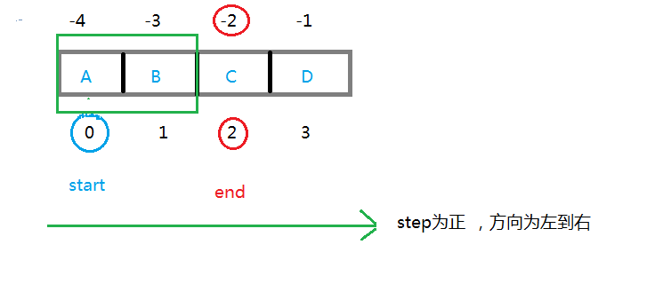

```python
     t=li[-1:-3:-1]

​     t=li[-1:1:-1]

​     t=li[3:1:-1]

​     t=li[3:-3:-1]

# 上面的结果都是一样的；t为["D","C"]
```


```python
      t=li[-1:-3]

​     t=li[-1:1]

​     t=li[3:1]

​     t=li[3:-3]


# 都切出空列表
```


 同时，step的正负决定了切片结果的元素采集的先后,省略**start 和 end**表示以原列表全部为目标.

```python
   t=li[::-1]   t--->["D","C","B","A"]   #反向切，切出全部

   t=li[:]    t--->["A","B","C","D"]     #正向切全部
```


**slice from Numpy**:

```python
import numpy as np  

a = np.array([[1, 2, 3, 4], [3, 4, 5, 6], [4, 5, 6, 7]])
print(a[..., 1])  # 第2列元素
print(a[1, ...])  # 第2行元素
print(a[..., 1:])  # 第2列及剩下的所有元素
```

output:

```bash
[2 4 5]
[3 4 5 6]
[[2 3 4]
 [4 5 6]
 [5 6 7]]
```

Hint: 

As of Python version 3.7, dictionaries are *ordered*. In Python 3.6 and earlier, dictionaries are *unordered*.


#### 76. list.append() and list.extend()

The `list.append()` to append *a single* value, and `list.extend()` to append *multiple* values.

```python
>>> lst = [1, 2]
>>> lst.append(3)
>>> lst.append(4)
>>> lst
[1, 2, 3, 4]

>>> lst.extend([5, 6, 7])
>>> lst.extend((8, 9, 10))
>>> lst
[1, 2, 3, 4, 5, 6, 7, 8, 9, 10]

>>> lst.extend(range(11, 14))
>>> lst
[1, 2, 3, 4, 5, 6, 7, 8, 9, 10, 11, 12, 13]
```


#### 77. string.find()

In Python, the `string.find()` method is used to find the index of the first occurrence of a substring within a string. If the substring is found, the method returns the index of the first character of the first occurrence; otherwise, it returns -1. The basic syntax is as follows:

```python
string.find(substring, start, end)
```

- `string`: The string in which you want to search for the substring.
- `substring`: The substring you want to find within the string.
- `start` (optional): The starting index for the search (default is 0).
- `end` (optional): The ending index for the search (default is the length of the string).

Here's an example:

```python
sentence = "Hello, how are you today?"
substring = "how"

index = sentence.find(substring)

if index != -1:
    print(f"The substring '{substring}' was found at index {index}.")
else:
    print(f"The substring '{substring}' was not found in the string.")

```

In this example, the output would be:

```
The substring 'how' was found at index 7.
```

If the substring is not found, the method returns -1, and the corresponding message is printed.


#### 78. the order of execution is top to bottom and if __name__ == "__main__":

```python
def main():
    print("This is the main function.")

if __name__ == "__main__":
    main()

```

In this example, the `main()` function will only be called if the script is executed directly (i.e., as the main program). **If the script is imported as a module into another script, the `main()` function won't be automatically executed**, allowing the importing script to use the functions/classes defined within it without any unintended side effects.


#### 79. string.strip()

The `string.strip()` method is a built-in string method in many programming languages, including Python. It is used to remove leading and trailing whitespaces (spaces, tabs, and newline characters) from a string. The method does not modify the original string; instead, it returns a new string with the leading and trailing whitespaces removed.

Here's an example in Python:

```python
original_string = "   Hello, World!   "
stripped_string = original_string.strip()

print("Original String:", repr(original_string))
print("Stripped String:", repr(stripped_string))

```

output:

```
Original String: '   Hello, World!   '
Stripped String: 'Hello, World!'

```

As you can see, the `strip()` method has removed the leading and trailing spaces from the original string.


#### 80. Python getattr() 函数 

描述

**getattr()** 函数用于返回一个对象属性值。

语法

```python
getattr(object, name[, default])
```

参数

- object -- 对象。
- name -- 字符串，对象属性。
- default -- 默认返回值，如果不提供该参数，在没有对应属性时，将触发 AttributeError。

Example 1: How getattr() works in Python?

```python
class Person:
    age = 23
    name = "Adam"

person = Person()
print('The age is:', getattr(person, "age"))
print('The age is:', person.age)
```

**Output**

```powershell
The age is: 23
The age is: 23
```

------

Example 2: getattr() when named attribute is not found

```python
class Person:
    age = 23
    name = "Adam"

person = Person()

# when default value is provided
print('The sex is:', getattr(person, 'sex', 'Male'))

# when no default value is provided
print('The sex is:', getattr(person, 'sex'))
```

**Output**

```powershell
The sex is: Male
AttributeError: 'Person' object has no attribute 'sex'
```


#### 81. python hasattr()

The hasattr() method returns true if an object has the given named attribute and false if it does not.

The syntax of `hasattr()` method is:

```
hasattr(object, name)
```

`hasattr()` is called by [getattr()](https://www.programiz.com/python-programming/methods/built-in/getattr) to check to see if AttributeError is to be raised or not.

------

##### hasattr() Parameters

`hasattr()` method takes two parameters:

- **object** - object whose named attribute is to be checked
- **name** - name of the attribute to be searched

------

##### Return value from hasattr()

`hasattr()` method returns:

- **True**, if object has the given named attribute
- **False**, if object has no given named attribute

------

##### Example: How hasattr() works in Python?

```python
class Person:
    age = 23
    name = 'Adam'

person = Person()

print('Person has age?:', hasattr(person, 'age'))
print('Person has salary?:', hasattr(person, 'salary'))
```

**Output**

```powershell
Person has age?: True
Person has salary?: False
```


#### 82. Python Anonymous [əˈnɒnɪməs]  [əˈnɑːnɪməs] Function

##### 1 for 简写

先举一个例子：

```python
y = [1,2,3,4,5,6]
[(i*2) for i in y ]
```

会输出  [2, 4, 6, 8, 10, 12]

##### 1.1 一层for循环简写：

一层 for 循环的简写格式是：（注意有中括号）

```python
[ 对i的操作 for i in 列表 ]

```

它相当于：

```python
for i in 列表:
    对i的操作
```

##### 1.2 两层for循环

两层的for循环就是：

```python
[对i的操作 for 单个元素 in 列表 for i in 单个元素]

```

举个简单的例子：

```python
y_list = ['assss','dvv']
[print(i) for y in y_list for i in y]
```

得到结果：a s s s s d v v

他类似于：

```python
y_list = ['assss','dvv']
for y in y_list:
    for i in y:
        print(i) 
```

##### 2 if 简写

格式是：

```python
True的逻辑 if 条件 else False的逻辑

```

举个例子：

```python
y = 0
x = y+3 if y > 3 else y-1
```

此时 x = -1

因为 y = 0 ，所以判断 y>3 时执行了 False的逻辑：y-1，所以x的值为 -1

##### 2.1 for 与 if 的结合怎么简写

举个l例子：

```python
x = [1,2,3,4,5,6,7]
[print(i) for i in x if i > 3 ]
```

它会输出：4 5 6 7

注：使用简写的方式无法对 if 判断为 False 的对象执行操作。

所以它的模板是：

```python
[判断为True的i的操作 for i in 列表 if i的判断 ]
```


#### 83. method 与 function的区别

我们在阅读英文资料时，可能经常会遇到method和function这两个单词，还可能经常以为两个是一样的。

这次在读python的说明文档时，这两个词出现的频率挺高，所以我就查了以下它们的区别。

method是依赖与一个对象的，function是独立于对象的。

在c中，只有function;

在c++中，既有method也有function,一个函数的称呼取决于它是否是一个类的对象，同理，python也是，php也是。

在java中，只有method，因为它是一门纯面向对象的语言。

下面是一段 python的代码：

```python
def function(data):
        return data;
class A:
        str1 = "I'm a method in class"
        def method(self):
                return self.str1

str2 = "I'm a function"
print(function(str2))
a = A()
print(a.method()) 
```


从上面中可以看出来两者之间的差别:

1 function是直接通过名字来调用的，它只能被传递参数来处理或者使用全局变量。

2 method 是通过与一个对象相关联的名字来调用的，它既可以被传递参数也可以，使用对象内部的数据。

  method 隐式的被传递了调用它的对象。


#### 84. python underscore

**Python****里的单下划线，双下划线，以及前后都带下划线的意义：**

1. 单下划线如：_name

   意思是：不能通过from modules import * 导入，如需导入需要：from modules import _name

2. 对象前面加双下划线如：__name

   意思是：生命对象为私有

3. 前后双下划线如：__init __:python系统自带的一些函数和方法


#### 85. python中的类型提示(type hint)

在刷leetcode或者一些官方源码的时候，经常看到如下字样：

```python
class Solution:
    def sortList(self, head: ListNode) -> ListNode:
```

这就是类型提示(type hint)，下面来个简单的例子，

```python
def greeting(name: str) -> str:
    return 'Hello ' + name
```

如上，其中name是传入的参数，而:右边的str则是name期望的类型即str，而->则指向期望函数的返回类型。
如果不期望有返回值可以直接指向None，如下：

```python
def feeder(get_next_item: Callable[[], str]) -> None:

```

Variable Type Hints:

```python
age: int = 25
name: str = "Alice"
```


#### 86.关于 from . import 问题

一个点表示当前路径，二个点表示上一层路径。

```python
from . import echo

from .. import formats
```


#### 87.关于 from XXX import * ,import,from XXX import问题

1. from XXX import* 会导入XXX模块的所有函数, 不建议用这个. 
2. import  XXX (here the XXX can't be folder)
3. **import 模块**：导入一个模块；注：相当于导入的是一个文件夹，是个相对路径。
4. **from…import**：导入了一个模块中的一个函数；注：相当于导入的是一个文件夹中的文件，是个绝对路径。


#### 88.关于sys模块

Python sys模块通过sys.argv提供对任何命令行参数的访问。这有两个常用指令：

sys.argv 返回的是包含命令行参数的一个 list

len(sys.argv) 返回的是命令行参数的个数

```python
import sys

print('Number of arguments:'+ len(sys.argv) + ' arguments.')
print('Argument List:', str(sys.argv)
```

cmd 直接以下命令：

```powershell
 python test.py arg1 arg2 arg3

```

可返回如下结果：

```powershell
Number of arguments: 4 arguments.
Argument List: ['test.py', 'arg1', 'arg2', 'arg3']
```

返回的第一个参数永远是文件名，且会被计入参数个数中。


#### 89. for i in range()

Create a sequence of numbers from 0 to 5, and print each item in the sequence:

```python
for i in range(10,15):

​    print(i)
```

```powershell
10 11 12 13 14
```

another example:

```python
x = range(3, 20, 2)

for n in x:
  print(n)
```

output:

```
3
5
7
9
11
13
15
17
19
```


#### 90. split() function

##### 描述

split() 通过指定分隔符对字符串进行**切片**，如果第二个参数 num 有指定值，则分割为 num+1 个子字符串。

##### 语法

split() 方法语法：

```python
str.split(str="", num=string.count(str))
```

##### 参数

- str -- 分隔符，默认为所有的空字符，包括空格、换行(\n)、制表符(\t)等。
- num -- 分割次数。默认为 -1, 即分隔所有。

##### 返回值

返回分割后的字符串列表。

##### 实例

以下实例展示了 split() 函数的使用方法：

##### Example

```python
#!/usr/bin/python3  


str = "this is string example....wow!!!" 

print (str.split( ))       # 以空格为分隔符 

print (str.split('i',1))   # 以 i 为分隔符 

print (str.split('w'))     # 以 w 为分隔符
```

以上实例输出结果如下：

```python
['this', 'is', 'string', 'example....wow!!!']
['th', 's is string example....wow!!!']
['this is string example....', 'o', '!!!']
```

以下实例以 # 号为分隔符，指定第二个参数为 1，返回两个参数列表。

##### Example

```python
#!/usr/bin/python3  

txt = "Google#Runoob#Taobao#Facebook"   

x = txt.split("#", 1)  

print(x)
```

以上实例输出结果如下：

```powershell
['Google', 'Runoob#Taobao#Facebook']
```


#### 91. add_argument函数的metavar参数

add_argument函数的metavar参数，用来控制部分命令行参数的显示，注意：它只是影响部分参数的显示信息，不影响代码内部获取命令行参数的对象。

```python
>>> parser = argparse.ArgumentParser()
>>> parser.add_argument('--foo', metavar='YYY')
>>> parser.add_argument('bar', metavar='XXX')
>>> parser.parse_args('X --foo Y'.split())
Namespace(bar='X', foo='Y')
>>> parser.print_help()
usage:  [-h] [--foo YYY] XXX

positional arguments:
 XXX

optional arguments:
 -h, --help  show this help message and exit
 --foo YYY
```


metavar参数可以让命令的帮助信息更好看一些！

初次之外，还有个功能可以关注，对于有nargs参数的命令行参数，可以用metavar来设置每一个具体的参数的名称：

```python
>>> parser = argparse.ArgumentParser(prog='PROG')
>>> parser.add_argument('-x', nargs=2)
>>> parser.add_argument('--foo', nargs=2, metavar=('bar', 'baz'))
>>> parser.print_help()
usage: PROG [-h] [-x X X] [--foo bar baz]

optional arguments:
 -h, --help     show this help message and exit
 -x X X
 --foo bar baz
```

-x参数没有使用metavar，显示出来的帮助信息就是两个X，而--foo参数也可以接收两个参数，这两个参数的名称就用metavar进行了具体的定义，看起来好多了。本文代码示例都是python官方文档中的。


Q1：*请问博主，第一个位置参数假如说是--max_episode_len,然后也有人写是--max-episode-len,但是他在调用的时候仍然用的是args.max_episode_len，也没报错，请问这个下划线_和-的区别在哪里呢？*

A1：没啥区别，在这里表示同一个意思，-对应_，代码里写的不一样或者都改成一样的都可以


For anyone who doesn't know what is nargs:

nargs stands for Number Of Arguments

3: 3 values, can be any number you want
?: a single value, which can be optional
*: a flexible number of values, which will be gathered into a list
+: like *, but requiring at least one value
argparse.REMAINDER: all the values that are remaining in the command line

#### 92. add_argument函数的prefix_chars

许多命令行会使用 `-` 当作前缀，比如 `-f/--foo`。如果解析器需要支持不同的或者额外的字符，比如像 `+f` 或者 `/foo` 的选项，可以在参数解析构建器中使用 `prefix_chars=` 参数。

```python
>>> parser = argparse.ArgumentParser(prog='PROG', prefix_chars='-+')
>>> parser.add_argument('+f')
>>> parser.add_argument('++bar')
>>> parser.parse_args('+f X ++bar Y'.split())
Namespace(bar='Y', f='X')
```

`prefix_chars=` 参数默认使用 `'-'`。 提供一组不包括 `-` 的字符将导致 `-f/--foo` 选项不被允许。


#### 93. python var函数

```python
class My():

​    'Test'
​    def __init__(self,name):
​        self.name=name

​    def test(self):
​        print (self.name)

​    def abc(self):
​        print("roll out")


vars(My)#返回一个字典对象，他的功能其实和  My.__dict__  很像

for key,value in vars(My).items():

​    print (key,':',value)
```

output:

```powershell
__module__ : __main__ 
__doc__ : Test 
__init__ : <function My.__init__ at 0x7f21202c0170> 
test : <function My.test at 0x7f21202c0ef0> 
abc : <function My.abc at 0x7f21202c05f0> 
__dict__ : <attribute '__dict__' of 'My' objects> 
__weakref__ : <attribute '__weakref__' of 'My' objects>
```


#### 94. types.SimpleNamespace()

`SimpleNamespace` is a lightweight class that provides a simple way to create namespaces without defining a custom class. It takes keyword arguments during instantiation and creates an object with attributes corresponding to those arguments. Here's an example:

```python
import types

# Creating a SimpleNamespace object
person = types.SimpleNamespace(name="John", age=30, city="New York")

# Accessing attributes
print(person.name)  # Output: John
print(person.age)   # Output: 30
print(person.city)  # Output: New York

```

In the above example, `person` is an instance of `SimpleNamespace` with attributes `name`, `age`, and `city`. These attributes are set to the values provided during instantiation. This approach is useful for creating simple objects to hold data without needing to define a custom class.


#### 95. `if-else`  ternary / ˈtɜːrnəri / operator

In Python, you can write an `if-else` statement in one line using the ternary operator. Here’s the syntax:

```python
value_if_true if condition else value_if_false
```

For example, let’s say we want to assign the value `"even"` to a variable `result` if a number `num` is even, and `"odd"` otherwise. Here’s how you can do it in one line:

```python
num = 10
result = "even" if num % 2 == 0 else "odd"
print(result)  # Output: "even"
```

In this code, `"even"` is assigned to `result` if `num % 2 == 0` (i.e., `num` is even), else `"odd"` is assigned. The `print(result)` statement will output `"even"` because `10` is an even number. If `num` was an odd number, it would output `"odd"`. This is a concise way to write an `if-else` statement in Python. It’s especially useful when you want to assign a value to a variable based on a condition. However, for more complex conditions or actions, it’s usually clearer to write a full `if-else` statement over multiple lines.

**Hint: the ternary operator is always used with an `if-else` structure.**

​              

#### 96. kwargs.update()

In Python, `kwargs` is a convention used for keyword arguments in a function. It allows you to pass a variable-length list of keyword arguments (i.e., arguments preceded by identifiers). It’s represented as a dictionary.

The `update()` method is a built-in method for dictionaries in Python. It’s used to add or update the keys-value pairs from other dictionary or iterable to the existing dictionary.

So, `kwargs.update()` is used to add or update the keys-value pairs in the `kwargs` dictionary. Here’s an example:

```python
def my_function(**kwargs):
    print("Before update:", kwargs)
    kwargs.update({"key1": "value1", "key2": "value2"})
    print("After update:", kwargs)

my_function(key3="value3", key4="value4")
```

output:

```
Before update: {'key3': 'value3', 'key4': 'value4'}
After update: {'key3': 'value3', 'key4': 'value4', 'key1': 'value1', 'key2': 'value2'}
```


In this example, `kwargs` initially contains `{"key3": "value3", "key4": "value4"}`. After the `update()` method is called, `kwargs` is updated to `{"key3": "value3", "key4": "value4", "key1": "value1", "key2": "value2"}`.

I hope this helps! Let me know if you have any other questions. 😊

​              

#### 97. function for i in range()

This is a powerful feature of Python that allows you to create complex lists in a very concise way. 

Here are 2 examples.

example 1

```python
def square(x):
    return x ** 2

squares = [square(i) for i in range(10)]
print(squares)
```

output:

```
[0, 1, 4, 9, 16, 25, 36, 49, 64, 81]
```

example 2

```python
def square(x):
    return x ** 2

k = 5
squares = [square(k) for i in range(10)]
print(squares)
```

output；

```
[25, 25, 25, 25, 25, 25, 25, 25, 25, 25]
```


#### 98. '//' in python

In Python, the double forward slash `//` is the floor division operator. It performs division where the result is rounded down to the nearest whole number (integer). For example:

```python
result = 11 // 3
print(result)  # Output will be 3
```

This is useful when you want to get the quotient of a division operation without any remainder. It's particularly handy when you're dealing with indices or situations where you need integer division.


#### 99. lambda

Sure! In Python, a lambda function is a small anonymous function defined using the `lambda` keyword. It allows you to create a function on-the-fly without needing to formally define it using the `def` keyword. Lambda functions can take any number of arguments, but they can only have one expression.

Here's a basic syntax of a lambda function:

```python
lambda arguments: expression
```

For example, suppose you want to create a simple function that squares a number using a lambda function:

```python
square = lambda x: x * x
```

In this example, `lambda x: x * x` creates an anonymous function that takes one argument `x` and returns its square. You can then use this `square` function like any other function:

```python
result = square(5)
print(result)  # Output will be 25
```

Lambda functions are often used in conjunction with functions like `map()`, `filter()`, and `reduce()` for functional programming paradigms. They are also commonly used in situations where a small, throwaway function is needed, such as when passing a function as an argument to another function. However, lambda functions are limited in that they can only contain a single expression, which can make them less suitable for complex logic compared to named functions defined with `def`.


#### 100. isinstance() 函数

  isinstance() 函数来判断一个对象是否是一个已知的类型，类似 type()。

**1.1 使用方法**
语法：
isinstance(object, classinfo)
参数含义：
object – 实例对象。
classinfo – 可以是直接或间接类名、基本类型或者由它们组成的元组。
返回值：
如果对象的类型与参数二的类型（classinfo）相同则返回 True，否则返回 False.


**1.2 案例分析**

  需要注意的是第三个小例子，a的类型只要是元组中的一个就会返回True。

```python
a = 9
isinstance (a,int)
isinstance (a,str)
isinstance (a,(str,int,list))   # 是元组中的一个返回 True
"""--------------------------------------输出-------------------------------------------"""
True
False
True

```

- type() 与 isinstance()区别，通过下面代码片段可得出以下要点：

  - type() 不会认为子类是一种父类类型，不考虑继承关系。

  - 譬如sinstance() 会认为子类是一种父类类型，**考虑继承关系**。

  - 如果要判断两个类型是否相同推荐使用 isinstance()。

    

```python
class A:
    pass

class B(A):
    pass
isinstance(A(), A)    # returns True
type(A()) == A        # returns True
isinstance(B(), A)    # returns True
type(B()) == A        # returns False
```


#### 101. set()

In Python, `set()` is a built-in data type that represents an **unordered** collection of unique elements. Sets are mutable, meaning you can add or remove elements from them, but they are unordered, so they do not record element position or order of insertion. 

You can create a set in Python by enclosing a comma-separated sequence of elements inside curly braces `{}`, or by passing an iterable (like a list or tuple) to the `set()` constructor. 

For example:
```python
# Creating a set using curly braces
my_set = {1, 2, 3, 4, 5}

# Creating a set using the set() constructor
another_set = set([1, 2, 3, 4, 5])
```

Sets are commonly used for tasks like removing duplicates from a list, performing mathematical set operations like union, intersection, difference, and symmetric difference, and checking for membership or existence of elements efficiently.


Sure, here's an example to demonstrate that sets are unordered:

```python
my_set = {4, 1, 6, 3, 2}

print("Original set:", my_set)

# Adding an element to the set
my_set.add(5)

print("After adding 5:", my_set)

# Removing an element from the set
my_set.remove(3)

print("After removing 3:", my_set)
```

Output:
```css
Original set: {1, 2, 3, 4, 6}
After adding 5: {1, 2, 3, 4, 5, 6}
After removing 3: {1, 2, 4, 5, 6}
```

As you can see, the order of elements in the set changes after adding and removing elements. This demonstrates that sets do not preserve the order of elements.


#### 102. Unpacking with the `*` Operator

The `*` operator in Python is used for unpacking, which essentially means it takes all the elements of a list (or any iterable) and passes them as individual arguments to a function.

Let's consider a simple example with a function that takes multiple arguments:

```python
def print_args(a, b, c):
    print(f"a: {a}, b: {b}, c: {c}")

args = [1, 2, 3]
print_args(*args)
```

In this example:

1. `args` is a list containing `[1, 2, 3]`.
2. `print_args(*args)` unpacks the list so that it's equivalent to calling `print_args(1, 2, 3)`.
3. The function `print_args` then receives three separate arguments: `a=1`, `b=2`, and `c=3`.

**another example:**

```python
args = [1, 2, 3]
print(*args)
print(args)
```

output:

```
1 2 3
[1, 2, 3]
```


#### 103. filter()

In Python, the `filter()` function is used to construct an iterator from elements of an iterable (like a list, tuple, etc.) for which a function returns true. Essentially, it filters the elements based on a condition.

Here’s the syntax for `filter()`:

```python
filter(function, iterable)
```

- **function**: A function that tests each element of the iterable. It should return a boolean value (`True` or `False`).
- **iterable**: An iterable like a list, tuple, etc.

The `filter()` function returns an iterator (filter object), which can be converted into a list, tuple, etc.

##### Example Usage

Here's a simple example to demonstrate how `filter()` works:

```python
# Define a function that returns True for even numbers
def is_even(num):
    return num % 2 == 0

# Create a list of numbers
numbers = [1, 2, 3, 4, 5, 6, 7, 8, 9, 10]

# Use filter to get even numbers
even_numbers = filter(is_even, numbers)

# Convert the filter object to a list
even_numbers_list = list(even_numbers)

print(even_numbers_list)  # Output: [2, 4, 6, 8, 10]
```

##### Using `filter()` with a Lambda Function

Often, it's convenient to use a lambda function with `filter()` to avoid defining a separate function. Here’s an example:

```python
# Create a list of numbers
numbers = [1, 2, 3, 4, 5, 6, 7, 8, 9, 10]

# Use filter with a lambda function to get even numbers
even_numbers = filter(lambda num: num % 2 == 0, numbers)

# Convert the filter object to a list
even_numbers_list = list(even_numbers)

print(even_numbers_list)  # Output: [2, 4, 6, 8, 10]
```

##### Key Points

- `filter()` is useful for extracting elements from an iterable based on a condition.
- The function used in `filter()` should return a boolean value.
- The result is an iterator, so you may need to convert it to a list or another iterable type if you need it in that form.

##### Practical Example

Here's a practical example where `filter()` is used to remove empty strings from a list:

```python
# List with some empty strings
str_list = ["apple", "", "banana", "", "cherry"]

# Use filter to remove empty strings
non_empty_strings = filter(lambda x: x != "", str_list)

# Convert the filter object to a list
non_empty_strings_list = list(non_empty_strings)

print(non_empty_strings_list)  # Output: ['apple', 'banana', 'cherry']
```

This way, `filter()` can be very handy for cleaning and processing data in Python.


#### 104.@ Matrix Multiplication

The `@` operator in Python is used for matrix multiplication. This is defined by [PEP 465](https://www.python.org/dev/peps/pep-0465/), which introduced the `@` operator specifically for this purpose in Python 3.5 and later.

Here’s how I know this and why it's commonly used in the context of libraries like PyTorch:

##### Matrix Multiplication Operator (`@`)

1. **PEP 465**:
   - PEP 465 was introduced to add a dedicated infix operator for matrix multiplication. This was aimed at making matrix operations more intuitive and readable, especially for those working in scientific computing and machine learning.

2. **Usage in PyTorch and Other Libraries**:
   - Libraries like NumPy and PyTorch have adopted the `@` operator for matrix multiplication, making it a standard way to perform such operations.
   - In PyTorch, the `@` operator can be used with `torch.Tensor` objects to perform matrix multiplication.

##### Example

Consider a simple example using NumPy to illustrate how the `@` operator is used:

```python
import numpy as np

A = np.array([[1, 2], [3, 4]])
B = np.array([[5, 6], [7, 8]])

# Matrix multiplication using @ operator
C = A @ B
print(C)
```

This would output:
```
[[19 22]
 [43 50]]
```

Here, `A @ B` performs the matrix multiplication of matrices `A` and `B`.

##### Application in PyTorch

In PyTorch, you can similarly use the `@` operator:

```python
import torch

A = torch.tensor([[1, 2], [3, 4]])
B = torch.tensor([[5, 6], [7, 8]])

# Matrix multiplication using @ operator
C = A @ B
print(C)
```

This would also output:
```
tensor([[19, 22],
        [43, 50]])
```

##### Why Use `@` for Matrix Multiplication?

- **Readability**: The `@` operator makes the code more readable, clearly indicating that a matrix multiplication is being performed, which is often more intuitive than using functions like `np.dot()` or `torch.mm()`.
- **Consistency**: Using a dedicated operator for matrix multiplication helps avoid confusion with element-wise multiplication (`*` operator) and ensures consistency in codebases that deal with linear algebra operations frequently.

##### Conclusion

The use of the `@` operator for matrix multiplication is a standard and recommended practice in Python, especially for those working in fields that involve a lot of matrix computations, such as machine learning, scientific computing, and data analysis.


#### 105. tensor.contiguous()

In PyTorch, the `tensor.contiguous()` method is used to ensure that a tensor is stored in **contiguous memory**. This is important for certain operations that require the data to be stored in a specific memory layout.

##### Understanding Tensor Contiguity

Tensors in PyTorch can be stored in memory in various ways. Contiguous tensors are those where the elements are stored in a contiguous block of memory without any gaps. When a tensor is created or transformed (e.g., via transposing, slicing, or permuting dimensions), it might no longer be contiguous. This can affect performance and the ability of some operations to work correctly.

##### Why Contiguity Matters

1. **Performance**: Many operations in PyTorch are optimized for contiguous memory access. Non-contiguous tensors can lead to inefficiencies.
2. **Compatibility**: Some PyTorch functions require the input tensor to be contiguous. If you pass a non-contiguous tensor to such a function, it may result in an error.

##### Usage of `tensor.contiguous()`

The `tensor.contiguous()` method creates a contiguous copy of the tensor if it is not already contiguous. If the tensor is already contiguous, this method has no effect.

Here's an example to illustrate its use:

```python
import torch

# Create a tensor
tensor = torch.randn(3, 4)

# Transpose the tensor to make it non-contiguous
tensor_t = tensor.t()

# Check if the tensor is contiguous
print(tensor_t.is_contiguous())  # Output: False

# Make the tensor contiguous
tensor_contiguous = tensor_t.contiguous()

# Check if the new tensor is contiguous
print(tensor_contiguous.is_contiguous())  # Output: True
```

In this example:
- `tensor.t()` transposes the tensor, making it non-contiguous.
- `tensor_t.contiguous()` creates a contiguous copy of the transposed tensor.

##### Summary

- **`tensor.contiguous()`**: Ensures that the tensor is stored in contiguous memory.
- **Usage**: Important for performance and required by certain functions.
- **Effect**: Creates a new contiguous tensor if the original is non-contiguous; otherwise, it does nothing.


#### 106. open.write() mode 'a' and 'w'

`open.write()` is not a standalone function in Python. Instead, it is typically used as part of the `open` function and `write` method to write data to a file. Here is how you can use it:

1. **Open a File**: Use the `open()` function to open a file. You can specify the mode in which you want to open the file, such as `'w'` for writing, `'a'` for appending, `'r+'` for reading and writing, etc.
2. **Write to the File**: Use the `write()` method to write data to the file.
3. **Close the File**: Always close the file after you're done to ensure all data is properly saved and resources are freed.

Here is an example:

```python
# Open a file for writing
file = open('example.txt', 'w')

# Write some data to the file
file.write('Hello, World!\n')
file.write('This is a test.\n')

# Close the file
file.close()
```

In this example:
- `open('example.txt', 'w')` opens the file `example.txt` in write mode. If the file does not exist, it will be created. If it exists, its contents will be overwritten.
- `file.write('Hello, World!\n')` writes the string `'Hello, World!\n'` to the file.
- `file.close()` closes the file.

To handle files more safely and ensure they are properly closed, it is common to use the `with` statement, which automatically takes care of closing the file for you:

```python
# Open a file for writing using the with statement
with open('example.txt', 'w') as file:
    # Write some data to the file
    file.write('Hello, World!\n')
    file.write('This is a test.\n')
# No need to explicitly close the file, it's done automatically
```

This way, the file is automatically closed when the block inside the `with` statement is exited, even if an error occurs.


##### The mode 'a'

Sure! In Python, the mode `'a'` stands for "append." When you open a file in append mode, any data you write to the file will be added (or appended) to the end of the file, rather than overwriting the existing content. If the file does not exist, it will be created.

Here is how appending works in practice:

1. **Open the File in Append Mode**: Use the `open()` function with `'a'` as the mode.
2. **Write to the File**: Use the `write()` method to add new data to the end of the file.
3. **Close the File**: Close the file when you're done writing.

Example of Appending to a File

Let's say we have a file called `log.txt` with the following content:

```
Log Entry 1: Start of log
```

We want to add more log entries without deleting the existing ones. We can do this by opening the file in append mode:

```python
# Open the file in append mode
with open('log.txt', 'a') as file:
    # Write additional data to the file
    file.write('Log Entry 2: Adding another log entry\n')
    file.write('Log Entry 3: Another entry\n')

# The file is automatically closed after the with block
```

After running this code, the `log.txt` file will look like this:

```
Log Entry 1: Start of log
Log Entry 2: Adding another log entry
Log Entry 3: Another entry
```

Key Points

- **Appending Mode**: Using `'a'` as the mode in the `open()` function ensures that new data is added to the end of the file without altering the existing content.
- **File Creation**: If the file does not exist, it will be created when you open it in append mode.
- **Automatic File Closure**: Using the `with` statement ensures that the file is properly closed after the block of code is executed, even if an error occurs within the block.

By using append mode, you can continuously add new information to a file without losing any previously stored data. This is especially useful for logging, data collection, and similar tasks where maintaining a historical record is important.


##### The difference between `'a'` (append) and `'w'` (write) modes

The difference between `'a'` (append) and `'w'` (write) modes in Python is primarily in how they handle the file content when it already exists.

`'a'` Mode (Append)

1. **File Existence**: If the file exists, it opens the file and moves the file pointer to the end of the file.
2. **File Content**: It preserves the existing content of the file and allows new data to be written to the end of the file.
3. **File Creation**: If the file does not exist, it creates a new file.
4. **Usage**: Used when you want to add new data to the end of the file without deleting the existing data.

```python
# Open a file in append mode
with open('example.txt', 'a') as file:
    file.write('This is an appended line.\n')
```

`'w'` Mode (Write)

1. **File Existence**: If the file exists, it opens the file and truncates (clears) the existing content.
2. **File Content**: It deletes the existing content and allows new data to be written to the file from the beginning.
3. **File Creation**: If the file does not exist, it creates a new file.
4. **Usage**: Used when you want to start fresh and do not need to preserve the existing content of the file.

```python
# Open a file in write mode
with open('example.txt', 'w') as file:
    file.write('This will overwrite any existing content.\n')
```

Summary

- **`'a'` (Append Mode)**: Adds new data to the end of the file without modifying the existing content.
- **`'w'` (Write Mode)**: Clears the existing content of the file and starts writing from the beginning.

Here is a practical comparison:

Suppose `example.txt` initially contains:
```
Initial content.
```

Using Append Mode ('a'):

```python
with open('example.txt', 'a') as file:
    file.write('Appended content.\n')
```

After running the above code, `example.txt` will contain:
```
Initial content.
Appended content.
```

Using Write Mode ('w'):

```python
with open('example.txt', 'w') as file:
    file.write('New content.\n')
```

After running the above code, `example.txt` will contain:
```
New content.
```

In the append mode, the new content is added to the end of the existing content. In the write mode, the new content replaces the existing content.


#### 107. protected attribute in the class

In Python, `self._step` and `self.step` are conventions used to indicate the intended access level of instance variables (attributes) within a class. Here's the difference between them:

1. **`self.step`**:
    - This is a public attribute.
    - It is intended to be accessible from outside the class.
    - There are no naming conventions or restrictions on accessing or modifying this attribute from outside the class.

    ```python
    class MyClass:
        def __init__(self, step):
            self.step = step
    
    obj = MyClass(5)
    print(obj.step)  # Accessing public attribute
    obj.step = 10    # Modifying public attribute
    print(obj.step)
    ```

2. **`self._step`**:
    - This is a protected attribute.
    - It is a convention to indicate that this attribute is intended for internal use within the class and its subclasses.
    - By convention, it should not be accessed or modified directly from outside the class. However, it is still technically accessible (i.e., Python does not enforce access restrictions).
    
    ```python
    class MyClass:
        def __init__(self, step):
            self._step = step
    
    obj = MyClass(5)
    print(obj._step)  # Accessing protected attribute (not recommended)
    obj._step = 10    # Modifying protected attribute (not recommended)
    print(obj._step)
    ```

In summary:
- `self.step` is a public attribute meant to be freely accessed and modified.
- `self._step` is a protected attribute meant to signal that it should not be accessed or modified directly outside the class or its subclasses, although it is still technically possible to do so.


#### 108. min()

the `min()` function in Python is used to find the smallest (minimum) value in an iterable (like a list, tuple, or set) or among two or more arguments. Here’s a quick overview:

Syntax:

```python
min(iterable)
```
or
```python
min(arg1, arg2, *args)
```

Examples:

1. **Finding the minimum value in a list**:
    ```python
    numbers = [10, 3, 7, 1, 9]
    smallest = min(numbers)
    print(smallest)  # Output: 1
    ```

2. **Finding the minimum among several values**:
    ```python
    smallest = min(5, 8, 3, 9)
    print(smallest)  # Output: 3
    ```

3. **With custom key function (optional)**:
    You can provide a key function to `min()` for custom comparisons, like finding the minimum based on length.
    ```python
    words = ["apple", "banana", "cherry"]
    shortest_word = min(words, key=len)
    print(shortest_word)  # Output: "apple"
    ```


#### 109. python flag -u

```python
import time
print("Step 1")
time.sleep(2)
print("Step 2")
```

- With python run.py
  - If output is buffered (e.g., redirected to a file or piped), you might not see "Step 1" until the buffer is flushed, which could be after "Step 2" or when the script ends.
- With python -u run.py
  - "Step 1" appears immediately, followed by "Step 2" after the 2-second delay, regardless of whether the output is to a terminal, file, or pipe.

**Trade-offs**

- Pros
  - Immediate output for better debugging and real-time monitoring.
  - Ensures compatibility with tools expecting instant data (e.g., pipes, logs).
- Cons
  - Slightly slower performance due to frequent I/O operations (writing small chunks of data instead of large buffered chunks).
  - Rarely noticeable unless dealing with massive output.

#### 110. del

In Python, `del` is a keyword used to **delete objects**, including:

1. **Variables**:

   ```python
   x = 10
   del x  # Now x is deleted and cannot be used anymore
   ```

2. **Items from a list or dictionary**:

   ```python
   my_list = [1, 2, 3]
   del my_list[1]  # Now my_list becomes [1, 3]
   
   my_dict = {'a': 1, 'b': 2}
   del my_dict['a']  # Now my_dict becomes {'b': 2}
   ```

3. **Slices of a list**:

   ```python
   nums = [0, 1, 2, 3, 4]
   del nums[1:3]  # Now nums becomes [0, 3, 4]
   ```

4. **Attributes of objects** (if the object allows it):

   ```python
   class MyClass:
       def __init__(self):
           self.value = 10
   
   obj = MyClass()
   del obj.value  # Now obj no longer has the 'value' attribute
   ```

It doesn’t free memory immediately but **decreases the reference count** of the object. If the count reaches zero, Python's garbage collector will clean it up.


#### 111. type annotation

Type Annotations: These are explicit declarations of the expected type of a variable, parameter, or return value using a colon (:) for variables/parameters and an arrow (->) for function return types.

```python
x: int = 42  # Variable annotation
def add(a: int, b: int) -> int:  # Function with parameter and return type annotations
    return a + b
```

**If the type hint does not match the actual return type of function(), it won't raise an error at runtime because Python's type hints are not enforced during execution.**


#### 112. print(,flush=True)

In Python, the `flush=True` parameter in the `print()` function forces the output to be written to the console or file immediately, bypassing any buffering. By default, `print()` buffers output, meaning it may not display instantly, especially when outputting to files or in non-interactive environments like scripts. Setting `flush=True` ensures immediate output, which is useful for real-time updates, such as progress bars or logging in long-running processes.

Example:
```python
import time

for i in range(5):
    print(f"Processing {i}...", flush=True)
    time.sleep(1)  # Simulate work
```
Here, `flush=True` makes each line print immediately, rather than waiting until the buffer is full or the program ends. Without it, output might appear delayed or in chunks.


#### 113. the underscore (_) is used in class

In Python, the underscore (`_`) is used in class definitions in several ways, each with a specific meaning depending on the context. Here's a concise overview:

1. **Single Leading Underscore (`_attribute`)**:
   - Indicates a "protected" attribute or method, suggesting it’s intended for internal use within the class or its subclasses.
   - It’s a convention, not enforced by Python, to signal developers that the attribute/method should not be accessed directly from outside the class.
   - Example:
     ```python
     class MyClass:
         def __init__(self):
             self._protected_var = 42
     
         def _protected_method(self):
             return "This is protected"
     
     obj = MyClass()
     print(obj._protected_var)  # Accessible but discouraged (42)
     ```

2. **Double Leading Underscore (`__attribute`)**:
   
   - Triggers **name mangling**, where the attribute name is prefixed with `_ClassName` to make it harder to access from outside the class.
   - Used to avoid naming conflicts in subclasses, effectively making the attribute "private" (though not truly private, as Python doesn’t enforce strict encapsulation).
   - Example:
     ```python
     class MyClass:
         def __init__(self):
             self.__private_var = 100
     
         def get_private(self):
             return self.__private_var
     
     obj = MyClass()
     print(obj.get_private())  # 100
     # print(obj.__private_var)  # Raises AttributeError
     print(obj._MyClass__private_var)  # 100 (bypassing name mangling, but bad practice)
     ```
   
3. **Single Trailing Underscore (`attribute_`)**:
   - Used to avoid naming conflicts with Python keywords or built-in names (e.g., `class_`, `type_`).
   - It’s a convention to make variable names valid without altering their intended meaning.
   - Example:
     ```python
     class MyClass:
         def __init__(self, class_):
             self.class_ = class_  # Avoids conflict with 'class' keyword
     ```

4. **Double Leading and Trailing Underscore (`__method__`)**:
   - Reserved for Python’s **special methods** (also called magic or dunder methods), like `__init__`, `__str__`, or `__len__`.
   - These define behavior for built-in operations (e.g., object initialization, string representation).
   - You should only define these for specific functionality, not for general use.
   - Example:
     ```python
     class MyClass:
         def __init__(self, value):
             self.value = value
     
         def __str__(self):
             return f"MyClass with value {self.value}"
     
     obj = MyClass(10)
     print(obj)  # MyClass with value 10
     ```

5. **Single Underscore as a Variable (`_`)**:
   - Used as a throwaway variable in class methods or loops when the variable isn’t needed.
   - Example:
     ```python
     class MyClass:
         def ignore_values(self, items):
             for _ in items:
                 print("Ignoring item")
     ```

**Summary**:
- `_attribute`: Protected, internal use (convention only).
- `__attribute`: Private, name-mangled to avoid subclass conflicts.
- `attribute_`: Avoids keyword conflicts.
- `__method__`: Special methods for Python’s built-in behavior.
- `_`: Throwaway variable.


#### 114. super().__init__()

The `super().__init__()` code in Python is used in class inheritance to call the parent (or superclass) class's `__init__` method from a subclass. Let me break down why it's needed, when to use it, and where to place it.

**Why We Need `super().__init__()`**

- **Purpose**: When a subclass inherits from a parent class, it may need to initialize attributes or run setup code defined in the parent class’s `__init__` method. Calling `super().__init__()` ensures the parent class is properly initialized before the subclass adds its own initialization logic.
- **Avoiding Redundancy**: Without `super().__init__()`, you’d have to manually replicate the parent class’s initialization code in the subclass, which is error-prone and violates the DRY (Don’t Repeat Yourself) principle.
- **Proper Inheritance**: It ensures the parent class’s state is set up correctly, maintaining the integrity of the inheritance chain, especially in complex hierarchies or multiple inheritance scenarios.

**When Do We Need It?**

You need `super().__init__()` when:
1. **Your class inherits from another class** that has an `__init__` method defining important initialization logic (e.g., setting attributes or resources).
2. **The subclass needs to extend or modify the parent’s initialization** while still executing the parent’s setup.
3. **You’re using multiple inheritance** (to ensure all parent classes are initialized properly, following Python’s Method Resolution Order, or MRO).
4. You **don’t want to override the parent’s initialization entirely** but rather extend it.

You may *not* need it if:
- The parent class doesn’t define an `__init__` method (in which case Python’s default `__init__` does nothing).
- The subclass completely overrides the parent’s initialization and doesn’t need the parent’s logic.

**Where to Put `super().__init__()`**

- **Location**: Place `super().__init__()` inside the subclass’s `__init__` method, typically as the *first* statement, unless the subclass needs to perform some setup before calling the parent’s initialization.
- **Reason for Placement**: Calling it first ensures the parent’s attributes and state are set up before the subclass modifies or adds to them, preventing potential issues (e.g., accessing uninitialized attributes).

**Syntax and Usage**

The `super()` function provides access to the parent class. In Python 3, the common syntax is:
```python
super().__init__(arguments)
```
Here, `arguments` are any parameters the parent class’s `__init__` method expects.

**Example**

```python
class Animal:
    def __init__(self, name):
        self.name = name
        print(f"Animal initialized with name: {self.name}")

class Dog(Animal):
    def __init__(self, name, breed):
        super().__init__(name)  # Call parent’s __init__ to set name
        self.breed = breed      # Add subclass-specific initialization
        print(f"Dog initialized with breed: {self.breed}")

dog = Dog("Max", "Labrador")
```
**Output**:
```
Animal initialized with name: Max
Dog initialized with breed: Labrador
```
- Here, `super().__init__(name)` ensures `Animal`’s `__init__` sets the `name` attribute before `Dog` adds its `breed` attribute.


```python
class Animal:
    def __init__(self, ):
        self.name = "hahaha"
        print(f"Animal initialized with name: {self.name}")

class Dog(Animal):
    def __init__(self, name, breed):
        super().__init__()      # Call parent’s __init__ to set name
        self.breed = breed      # Add subclass-specific initialization
        print(f"Dog initialized with breed: {self.breed}")

dog = Dog("Max", "Labrador")
```

output:

```
Animal initialized with name: hahaha
Dog initialized with breed: Labrador
```


**Multiple Inheritance**

In cases of multiple inheritance, `super()` follows the MRO to ensure all parent classes are initialized properly:
```python
class A:
    def __init__(self):
        print("A initialized")

class B:
    def __init__(self):
        print("B initialized")

class C(A, B):
    def __init__(self):
        super().__init__()  # Calls A’s __init__, which may call B’s if needed
        print("C initialized")

c = C()
```
**Output** (depends on MRO, typically):
```
A initialized
C initialized
```
Use `C.__mro__` to check the method resolution order if needed.

**Key Notes**

- **Arguments**: Pass the correct arguments to `super().__init__()` as required by the parent class’s `__init__`.
- **No Parent `__init__`**: If the parent class has no `__init__`, calling `super().__init__()` is harmless but unnecessary.
- **Python 2 vs. 3**: In Python 2, you’d use `super(Subclass, self).__init__()`. Python 3’s `super()` is simpler and preferred.
- **Placement Flexibility**: While usually first, you might delay `super().__init__()` if the subclass needs to preprocess data before passing it to the parent (rare).

**Common Mistakes**

- Forgetting to call `super().__init__()` when the parent class expects it, leading to uninitialized attributes.
- Passing incorrect arguments to `super().__init__()`, causing errors.
- Misplacing `super().__init__()` after subclass logic that depends on parent initialization.


## About collections

#### 01. collections.OrderedDict()

In Python, `OrderedDict` is a class from the `collections` module that functions like a regular dictionary but **preserves the insertion order** of its keys. This means that when you iterate over an `OrderedDict`, the items are returned in the order in which they were added.

**Move-to-end Feature**: `OrderedDict` has a `.move_to_end(key, last=True)` method to reposition elements.

```python
from collections import OrderedDict

od = OrderedDict()
od['apple'] = 1
od['banana'] = 2
od['cherry'] = 3

print(od)  # Output: OrderedDict([('apple', 1), ('banana', 2), ('cherry', 3)])

od.move_to_end('banana')
print(od)  # Moves 'banana' to the end
```

output:

```
OrderedDict([('apple', 1), ('banana', 2), ('cherry', 3)])
OrderedDict([('apple', 1), ('cherry', 3), ('banana', 2)])
```


Summary: Since Python 3.7, regular dictionaries preserve order, making OrderedDict less necessary unless you need its specific methods, explicit order semantics, or compatibility with older Python versions. Use OrderedDict for specialized cases; otherwise, a regular dict is usually fine.


## About dataclasses

#### 01. @dataclass

Certainly! The `@dataclass` decorator simplifies the process of creating classes to store data by automatically generating special methods like `__init__()`, `__repr__()`, `__eq__()`, and others. This can save you from writing **boilerplate** code, making your code more **concise** and **readable**.

Here's a more elaborate example:

```python
from dataclasses import dataclass

@dataclass
class Car:
    make: str
    model: str
    year: int
    color: str
    mileage: float = 0.0

    def drive(self, distance):
        self.mileage += distance

car1 = Car("Toyota", "Camry", 2020, "Red")
car2 = Car("Honda", "Accord", 2019, "Blue", 15000)

print(car1)  # Output: Car(make='Toyota', model='Camry', year=2020, color='Red', mileage=0.0)
print(car2)  # Output: Car(make='Honda', model='Accord', year=2019, color='Blue', mileage=15000.0)

car1.drive(100)
print(car1)  # Output: Car(make='Toyota', model='Camry', year=2020, color='Red', mileage=100.0)
print(car1.make, car1.model, car1.year, car1.color)
```

In this example, `Car` is a data class with attributes `make`, `model`, `year`, `color`, and an optional attribute `mileage` with a default value. The `drive()` method allows you to simulate driving the car and incrementing its mileage. The `__repr__()` method generated by `@dataclass` provides a string representation of the `Car` object.

output:

```
Car(make='Toyota', model='Camry', year=2020, color='Red', mileage=0.0)
Car(make='Honda', model='Accord', year=2019, color='Blue', mileage=15000)
Car(make='Toyota', model='Camry', year=2020, color='Red', mileage=100.0)
Toyota Camry 2020 Red
```


The significance of `@dataclass` is that it simplifies the process of creating such classes by automatically generating common methods based on the class attributes, reducing the amount of boilerplate code you need to write. It enhances code readability and maintainability by making your intentions clear and concise.


#### 02. dataclasses.field()

Certainly! In Python, the `dataclasses.field()` function is used **within** the `dataclasses` module, which provides a convenient way to create classes that are primarily used to store data. The `field()` function is used as a decorator to specify fields within such classes.

Here's a breakdown of how it works:

1. **Usage**: `dataclasses.field()` is typically used as a decorator within a data class definition.

2. **Purpose**: It's used to define default values, metadata, and other attributes for fields within a data class.

3. **Parameters**: The `field()` function can take several parameters, including `default`, `default_factory`, `init`, `repr`, `compare`, `hash`, and `metadata`, among others. These parameters allow you to customize various aspects of how the field behaves.

    - `default`: Specifies a default value for the field.
    - `default_factory`: Specifies a function that will be called with no arguments to produce the default value for the field. This is useful when you want to create a new default object each time.
    - `init`: If set to `True`, the field will be included as a parameter to the automatically generated `__init__` method of the data class. If set to `False`, it will not be included.
    - `repr`: If set to `True`, the field will be included in the string representation (`__repr__`) of the data class.
    - `compare`: If set to `True`, the field will be included in comparisons between instances of the data class.
    - `hash`: If set to `True`, the field will be included in the hash value of the data class.
    - `metadata`: A dictionary containing additional metadata about the field.

4. **Example**:

```python
from dataclasses import dataclass, field

@dataclass
class MyClass:
    name: str
    value: int = field(default=0)

# Here, we're defining a data class 'MyClass' with two fields: 'name' and 'value'.
# 'name' is a required field, while 'value' has a default value of 0.

obj1 = MyClass("Object 1")
print(obj1)  # Output: MyClass(name='Object 1', value=0)

obj2 = MyClass("Object 2", value=10)
print(obj2)  # Output: MyClass(name='Object 2', value=10)
```

In this example, `field(default=0)` is used to specify a default value of 0 for the `value` field. When creating an instance of `MyClass`, if the `value` argument is not provided, it will default to 0.


## About opencv4

#### Regular Contour detection

##### cv2.threshold()函数

```python
Python: cv2.threshold(src, thresh, maxval, type[, dst]) → retval, dst
```

在其中：

src：表示的是图片源
thresh：表示的是阈值（起始值）
maxval：表示的是最大值
type：表示的是这里划分的时候使用的是什么类型的算法**，常用值为0（cv2.THRESH_BINARY）**

```python
- cv2.THRESH_BINARY //大于ret的pixels变成255,反之则to zero
- cv2.THRESH_BINARY_INV //和第一个相反
- cv2.THRESH_TRUNC //大于thresh，变成thresh,反之的不变 "The maxValue is ignored"
- cv2.THRESH_TOZERO // 大于thresh,不变。反之to zero
- cv2.THRESH_TOZERO_INV //大于thresh，to zero.反之不变。
```

##### cv2.drawContours()

```python
cv2.drawContours(image, contours, contourIdx, color, thickness=None, lineType=None, hierarchy=None, maxLevel=None, offset=None)
```

**第一个参数是指明在哪幅图像上绘制轮廓；image为三通道才能显示轮廓**

**第二个参数是轮廓本身，在Python中是一个list;**

**第三个参数指定绘制轮廓list中的哪条轮廓，如果是-1，则绘制其中的所有轮廓。后面的参数很简单。其中thickness表明轮廓线的宽度，如果是-1（cv2.FILLED），则为填充模式。**

steps:详情可以参考下面的大致代码.

1. convert img(This is image is gray usually) to binary image(thresh)
2. put binary image(thresh) into findContours(), and then get return value(contour)
3. convert img to color via cvtColor().
4. put contour and color into drawContour(), and then get img( it is new one)

##### cv2.waitKey()

是一个键盘绑定函数。它的时间量度是毫秒ms。函数会等待（n）里面的n毫秒，看是否有键盘输入。若有键盘输入，则返回按键的ASCII值。没有键盘输入，则返回-1.一般设置为0，他将无线等待键盘的输入。

##### cv2.destroyAllWindows() 

用来删除窗口的，（）里不指定任何参数，则删除所有窗口，删除特定的窗口，往（）输入特定的窗口值。


```python
import cv2
import numpy as np

OPENCV_MAJOR_VERSION = int(cv2.__version__.split('.')[0])
print(OPENCV_MAJOR_VERSION)
img = np.zeros((200, 200), dtype=np.uint8)
img[50:150, 50:150] = 255

ret, thresh = cv2.threshold(img, 127, 255, 0)
print("This is ret",ret)
cv2.imshow("threshold",thresh)

if OPENCV_MAJOR_VERSION >= 4:
    # OpenCV 4 or a later version is being used.
    contours, hier = cv2.findContours(thresh, cv2.RETR_EXTERNAL,
                                      cv2.CHAIN_APPROX_SIMPLE)  
    # int型的mode，定义轮廓的检索模式： CV_RETR_TREE "检测所有轮廓"
    # int型的method，定义轮廓的近似方法： cv2.CHAIN_APPROX_SIMPLE  "仅保存轮廓的拐点信息"  
    # 这里的第一个参数thresh必须是binary图片（即非黑即白）                
else:
    # OpenCV 3 or an earlier version is being used.
    # cv2.findContours has an extra return value.
    # The extra return value is the thresholded image, which is
    # unchanged, so we can ignore it.
    _, contours, hier = cv2.findContours(thresh, cv2.RETR_TREE,
                                         cv2.CHAIN_APPROX_SIMPLE)

color = cv2.cvtColor(img, cv2.COLOR_GRAY2BGR) # gray to BGR image 
cv2.imshow("color",color)
img = cv2.drawContours(color, contours, -1, (0,255,0), 2)# 第一个参数必须是三通道图片
cv2.imshow("contours", color)
cv2.imshow("img",img)
cv2.waitKey() # 让函数图像始终显示,否则只会显示一下就闪退。等待keyboard(不是鼠标)输入然后显示下一行.
cv2.destroyAllWindows() # delete all windows
```


#### irregular contour detection

##### Gauss pyramid [ˈpɪrəmɪd] 

 操作一次一个 MxN 的图像就变成了一个 M/2xN/2 的图像。所以这幅图像的面积就变为原来图像面积的四分之一,这被称为 Octave。连续进行这样的操作我们就会得到一个分辨率不断下降的图像金字塔。使用函数 
cv2.pyrDown() 和 cv2.pyrUp() 构建图像金字塔。

##### cv2.IMREAD_UNCHANGED：

顾名思义，读入完整图片，包括alpha通道，可用-1作为实参替代

PS：alpha通道，又称A通道，是一个8位的灰度通道，该通道用256级灰度来记录图像中的透明度复信息，定义透明、不透明和半透明区域，其中黑表示全透明，白表示不透明，灰表示半透明.

##### cv2.pyrDown()

cv2.pyrDown() 从一个高分辨率大尺寸的图像向上构建一个金字塔（尺寸变小，分辨率降低）

```python
cv2.pyrDown(src, dst=None, dstsize=None, borderType=None)
```

函数的作用：
对图像进行滤波然后进行下采样

参数含义：
src：表示输入图像
dst：表示输出图像
dstsize：表示输出图像的大小
borderType：表示图像边界的处理方式

```python
import cv2

import numpy as np


img0 = cv2.imread("hammer.jpg")

img1 = cv2.imread("hammer.jpg", cv2.IMREAD_UNCHANGED)

img  = cv2.pyrDown(cv2.imread("hammer.jpg", cv2.IMREAD_UNCHANGED))

cv2.imshow("img0",img0)

cv2.imshow("img1",img1)

cv2.imshow("img",img)


cv2.waitKey()

cv2.destroyAllWindows()
```


##### cv2.boundingRect（）和cv2.rectangle（）

cv2.boundingRect(img) 这个函数可以获得一个图像的最小矩形边框一些信息，参数img是一个轮廓点集合，也就是它的参数，可以通过cv2.findContours获取.它可以返回四个参数，左上角坐标，矩形的宽高，一般形式为：

```python
x,y,w,h = cv2.boundingRect(img)
```

配合cv2.rectangle（）可以画出该最小边框，cv2.rectangle(img, (x,y), (x+w,y+h), (0,255,0), 2)这个函数功能就是画框的函数。

```python
 cv2.rectangle(image, start_point, end_point, color, thickness)
```

##### cv2.minAreaRect(), cv2.boxPoints(), np.int0()

OpenCV provides a function cv2.minAreaRect() for finding the minimum area rotated rectangle. This takes as input a 2D point set and returns a Box2D structure which contains the following details – (center(x, y), (width, height), angle of rotation). The syntax is given below.

```python
(center(x, y), (width, height), angle of rotation) = cv2.minAreaRect(points)
```

But to draw a rectangle, we need 4 corners of the rectangle. So, to convert the Box2D structure to 4 corner points, OpenCV provides another function cv2.boxPoints(). This takes as input the Box2D structure and returns the 4 corner points. The 4 corner points are ordered clockwise starting from the point with the highest y. The syntax is given below.

```python
points = cv2.boxPoints(box)
```

Before drawing the rectangle, you need to convert the 4 corners to the integer type. You can use np.int32 or np.int64 (Don’t use np.int8 as it permits value up to 127 and leads to truncation after that). Sometimes, you might see np.int0 used, don’t get confused, this is equivalent to np.int32 or np.int64 depending upon your system architecture. The full code is given below.

```
rect=cv2.minAreaRect(c)
box = cv2.boxPoints(rect)
box = np.int0(box)
```

This is output of np.int0 method:

```powershell
This is cooradiates of box: [[ 31.05075  495.5042  ] 

[ 96.635895  65.38774 ] 

[481.40945  124.0589  ] 

[415.8243   554.17535 ]] 

after inte0(box) method: [[ 31 495] 

[ 96  65] 

[481 124] 

[415 554]]
```

##### cv2.minEnclosingCircle()


```python
import cv2
import numpy as np


img = cv2.pyrDown(cv2.imread("hammer.jpg", cv2.IMREAD_UNCHANGED))

ret, thresh = cv2.threshold(cv2.cvtColor(img, cv2.COLOR_BGR2GRAY),127, 255, cv2.THRESH_BINARY)

contours, hier = cv2.findContours(thresh, cv2.RETR_EXTERNAL,cv2.CHAIN_APPROX_SIMPLE)


for c in contours:
​    \# find bounding box coordinates
​    x, y, w, h = cv2.boundingRect(c)
​    cv2.rectangle(img, (x,y), (x+w, y+h), (0, 255, 0), 2)


​    \# find minimum area
​    rect = cv2.minAreaRect(c)
​    \# calculate coordinates of the minimum area rectangle
​    box = cv2.boxPoints(rect)

​    \# normalize coordinates to integers

​    box = np.int0(box)

​    \# draw contours

​    cv2.drawContours(img, [box], 0, (0,0, 255), 3)


​    \# calculate center and radius of minimum enclosing circle

​    (x, y), radius = cv2.minEnclosingCircle(c)

​    \# cast to integers

​    center = (int(x), int(y))

​    radius = int(radius)

​    \# draw the circle

​    img = cv2.circle(img, center, radius, (0, 255, 0), 2)


cv2.drawContours(img, contours, -1, (255, 0, 0), 1)
cv2.imshow("contours", img)


cv2.waitKey()
cv2.destroyAllWindows()
```


#### Contours Hierarchy

In this image, there are a few shapes which I have numbered from **0-5**. *2 and 2a* denotes the external and internal contours of the outermost box.


In this image, there are a few shapes which I have numbered from **0-5**. *2 and 2a* denotes the external and internal contours of the outermost box.

Here, contours 0,1,2 are **external or outermost**. We can say, they are in **hierarchy-0** or simply they are in **same hierarchy level**.

Next comes **contour-2a**. It can be considered as a **child of contour-2** (or in opposite way, contour-2 is parent of contour-2a). So let it be in **hierarchy-1**. Similarly contour-3 is child of contour-2 and it comes in next hierarchy. Finally contours 4,5 are the children of contour-3a, and they come in the last hierarchy level. From the way I numbered the boxes, I would say contour-4 is the first child of contour-3a (It can be contour-5 also).

I mentioned these things to understand terms like **same hierarchy level**, **external contour**, **child contour**, **parent contour**, **first child** etc. Now let's get into OpenCV.


##### Hierarchy Representation in OpenCV

So each contour has its own information regarding what hierarchy it is, who is its child, who is its parent etc. OpenCV represents it as an array of four values : **[Next, Previous, First_Child, Parent]**

*"Next denotes next contour at the same hierarchical level."*

For eg, take contour-0 in our picture. Who is next contour in its same level ? It is contour-1. So simply put Next = 1. Similarly for Contour-1, next is contour-2. So Next = 2.

What about contour-2? There is no next contour in the same level. So simply, put Next = -1. What about contour-4? It is in same level with contour-5. So its next contour is contour-5, so Next = 5.

*"Previous denotes previous contour at the same hierarchical level."*

It is same as above. Previous contour of contour-1 is contour-0 in the same level. Similarly for contour-2, it is contour-1. And for contour-0, there is no previous, so put it as -1.

*"First_Child denotes its first child contour."*

There is no need of any explanation. For contour-2, child is contour-2a. So it gets the corresponding index value of contour-2a. What about contour-3a? It has two children. But we take only first child. And it is contour-4. So First_Child = 4 for contour-3a.

*"Parent denotes index of its parent contour."*

It is just opposite of **First_Child**. Both for contour-4 and contour-5, parent contour is contour-3a. For contour-3a, it is contour-3 and so on.

- Note

  If there is no child or parent, that field is taken as -1

So now we know about the hierarchy style used in OpenCV, we can check into Contour Retrieval Modes in OpenCV with the help of same image given above. ie what do flags like [cv.RETR_LIST](https://docs.opencv.org/4.x/d3/dc0/group__imgproc__shape.html#gga819779b9857cc2f8601e6526a3a5bc71a48b9c2cb1056f775ae50bb68288b875e), [cv.RETR_TREE](https://docs.opencv.org/4.x/d3/dc0/group__imgproc__shape.html#gga819779b9857cc2f8601e6526a3a5bc71ab10df56aed56c89a026580adc9431f58), [cv.RETR_CCOMP](https://docs.opencv.org/4.x/d3/dc0/group__imgproc__shape.html#gga819779b9857cc2f8601e6526a3a5bc71a7d1d4b509fb2a9a8dc2f960357748752), [cv.RETR_EXTERNAL](https://docs.opencv.org/4.x/d3/dc0/group__imgproc__shape.html#gga819779b9857cc2f8601e6526a3a5bc71aa7adc6d6608609fd84650f71b954b981) etc mean?

##### Contour Retrieval Mode

###### 1. RETR_LIST

This is the simplest of the four flags (from explanation point of view). It simply retrieves all the contours, but doesn't create any parent-child relationship. **Parents and kids are equal under this rule, and they are just contours**. ie they all belongs to same hierarchy level.

So here, 3rd and 4th term in hierarchy array is always -1. But obviously, Next and Previous terms will have their corresponding values. Just check it yourself and verify it.

Below is the result I got, and each row is hierarchy details of corresponding contour. For eg, first row corresponds to contour 0. Next contour is contour 1. So Next = 1. There is no previous contour, so Previous = -1. And the remaining two, as told before, it is -1.

```
>>> hierarchy

array([[[ 1, -1, -1, -1],

​        [ 2,  0, -1, -1],

​        [ 3,  1, -1, -1],

​        [ 4,  2, -1, -1],

​        [ 5,  3, -1, -1],

​        [ 6,  4, -1, -1],

​        [ 7,  5, -1, -1],

​        [-1,  6, -1, -1]]])
```

This is the good choice to use in your code, if you are not using any hierarchy features.

###### 2. RETR_EXTERNAL

If you use this flag, it returns only extreme outer flags. All child contours are left behind. **We can say, under this law, Only the eldest in every family is taken care of. It doesn't care about other members of the family :)**.

So, in our image, how many extreme outer contours are there? ie at hierarchy-0 level?. Only 3, ie contours 0,1,2, right? Now try to find the contours using this flag. Here also, values given to each element is same as above. Compare it with above result. Below is what I got :

```
>>> hierarchy

array([[[ 1, -1, -1, -1],

​        [ 2,  0, -1, -1],

​        [-1,  1, -1, -1]]])
```

You can use this flag if you want to extract only the outer contours. It might be useful in some cases.

###### 3. RETR_CCOMP

This flag retrieves all the contours and arranges them to a 2-level hierarchy. ie external contours of the object (ie its boundary) are placed in hierarchy-1. And the contours of holes inside object (if any) is placed in hierarchy-2. If any object inside it, its contour is placed again in hierarchy-1 only. And its hole in hierarchy-2 and so on.

Just consider the image of a "big white zero" on a black background. Outer circle of zero belongs to first hierarchy, and inner circle of zero belongs to second hierarchy.

We can explain it with a simple image. Here I have labelled the order of contours in red color and the hierarchy they belongs to, in green color (either 1 or 2). The order is same as the order OpenCV detects contours.


image

So consider first contour, ie contour-0. It is hierarchy-1. It has two holes, contours 1&2, and they belong to hierarchy-2. So for contour-0, Next contour in same hierarchy level is contour-3. And there is no previous one. And its first is child is contour-1 in hierarchy-2. It has no parent, because it is in hierarchy-1. So its hierarchy array is [3,-1,1,-1]

Now take contour-1. It is in hierarchy-2. Next one in same hierarchy (under the parenthood of contour-1) is contour-2. No previous one. No child, but parent is contour-0. So array is [2,-1,-1,0].

Similarly contour-2 : It is in hierarchy-2. There is not next contour in same hierarchy under contour-0. So no Next. Previous is contour-1. No child, parent is contour-0. So array is [-1,1,-1,0].

Contour - 3 : Next in hierarchy-1 is contour-5. Previous is contour-0. Child is contour-4 and no parent. So array is [5,0,4,-1].

Contour - 4 : It is in hierarchy 2 under contour-3 and it has no sibling. So no next, no previous, no child, parent is contour-3. So array is [-1,-1,-1,3].

Remaining you can fill up. This is the final answer I got:

```
>>> hierarchy

array([[[ 3, -1,  1, -1],

​        [ 2, -1, -1,  0],

​        [-1,  1, -1,  0],

​        [ 5,  0,  4, -1],

​        [-1, -1, -1,  3],

​        [ 7,  3,  6, -1],

​        [-1, -1, -1,  5],

​        [ 8,  5, -1, -1],

​        [-1,  7, -1, -1]]])

###### 
```

###### 4. RETR_TREE

And this is the final guy, Mr.Perfect. It retrieves all the contours and creates a full family hierarchy list. **It even tells, who is the grandpa, father, son, grandson and even beyond... :)**.

For example, I took above image, rewrite the code for [cv.RETR_TREE](https://docs.opencv.org/4.x/d3/dc0/group__imgproc__shape.html#gga819779b9857cc2f8601e6526a3a5bc71ab10df56aed56c89a026580adc9431f58), reorder the contours as per the result given by OpenCV and analyze it. Again, red letters give the contour number and green letters give the hierarchy order.


image

Take contour-0 : It is in hierarchy-0. Next contour in same hierarchy is contour-7. No previous contours. Child is contour-1. And no parent. So array is [7,-1,1,-1].

Take contour-2 : It is in hierarchy-1. No contour in same level. No previous one. Child is contour-3. Parent is contour-1. So array is [-1,-1,3,1].

And remaining, try yourself. Below is the full answer:

```
>>> hierarchy

array([[[ 7, -1,  1, -1],

​        [-1, -1,  2,  0],

​        [-1, -1,  3,  1],

​        [-1, -1,  4,  2],

​        [-1, -1,  5,  3],

​        [ 6, -1, -1,  4],

​        [-1,  5, -1,  4],

​        [ 8,  0, -1, -1],

​        [-1,  7, -1, -1]]])


```


#### Image moments from opencv


##### Area:

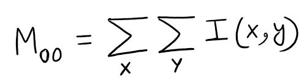

For a binary image, this corresponds to counting all the non-zero pixels and that is equivalent to the area. For greyscale image, this corresponds to the sum of pixel intensity values.

##### Centroid:

Centroid simply is the arithmetic mean position of all the points. In terms of image moments, centroid is given by the relation.

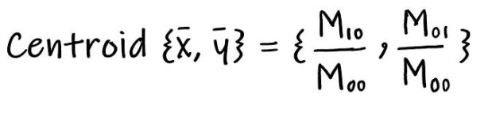

This is simple to understand. For instance, for a binary image M10 corresponds to the sum of all non-zero pixels (x-coordinate) and M00 is the total number of non-zero pixels and that is what the centroid is.

Let’s take a simple example to understand how to calculate image moments for a given image.


Below are the area and centroid calculation for the above image.


#### 1.Convex contours

##### cv2.arcLength

It is also called arc length. It can be found out using cv.arcLength() function. Second argument specify whether shape is a closed contour (if passed True), or just a curve.

```python
perimeter = cv.arcLength(cnt,True)
```


```python
import cv2

import numpy as np


OPENCV_MAJOR_VERSION = int(cv2.__version__.split('.')[0])


img = cv2.pyrDown(cv2.imread("hammer.jpg", cv2.IMREAD_UNCHANGED))


ret, thresh = cv2.threshold(cv2.cvtColor(img, cv2.COLOR_BGR2GRAY),

​                            127, 255, cv2.THRESH_BINARY)


if OPENCV_MAJOR_VERSION >= 4:

​    \# OpenCV 4 or a later version is being used.

​    contours, hier = cv2.findContours(thresh, cv2.RETR_EXTERNAL,

​                                      cv2.CHAIN_APPROX_SIMPLE)

else:

​    \# OpenCV 3 or an earlier version is being used.

​    \# cv2.findContours has an extra return value.

​    \# The extra return value is the thresholded image, which is

​    \# unchanged, so we can ignore it.

​    _, contours, hier = cv2.findContours(thresh, cv2.RETR_EXTERNAL,

​                                         cv2.CHAIN_APPROX_SIMPLE)

cnt = contours[0]

perimeter = cv2.arcLength(cnt,True)

print("This is a perimeter: ", perimeter)

epsilon = 0.1*cv2.arcLength(cnt,True)

approx = cv2.approxPolyDP(cnt,epsilon,True)

print("This is an approx: ",approx)


black = np.zeros_like(img)

for cnt in contours:

​    epsilon = 0.01 * cv2.arcLength(cnt,True) 

​    approx = cv2.approxPolyDP(cnt,epsilon,True)

​    hull = cv2.convexHull(cnt)

​    cv2.drawContours(black, [cnt], -1, (0, 255, 0), 2)

​    cv2.drawContours(black, [approx], -1, (255, 255, 0), 2) 
# contour approximation

​    cv2.drawContours(black, [hull], -1, (0, 0, 255), 2) 
# Convex Hull 


cv2.imshow("hull", black)

cv2.waitKey()

cv2.destroyAllWindows()
```

This is a output:


#### 2.Hough Detecting Lines

```python
import cv2

import numpy as np


img = cv2.imread('lines.jpg')

gray = cv2.cvtColor(img, cv2.COLOR_BGR2GRAY)

edges = cv2.Canny(gray, 50, 120)

minLineLength = 20

maxLineGap = 5

lines = cv2.HoughLinesP(edges, 1, np.pi/180.0, 20,

​                        minLineLength, maxLineGap)

for x1, y1, x2, y2 in lines[0]:

​    cv2.line(img, (x1, y1), (x2, y2), (0,255,0),2)


cv2.imshow("edges", edges)

cv2.imshow("lines", img)

cv2.waitKey()

cv2.destroyAllWindows()
```


#### 3.Hough Detecting Circles

####  

```python

import cv2

import numpy as np


planets = cv2.imread('planet_glow.jpg')

gray_img = cv2.cvtColor(planets, cv2.COLOR_BGR2GRAY)

gray_img = cv2.medianBlur(gray_img, 5)


circles = cv2.HoughCircles(gray_img,cv2.HOUGH_GRADIENT,1,120,

​                           param1=100,param2=30,minRadius=0,maxRadius=0)


circles = np.uint16(np.around(circles))


for i in circles[0,:]:

​    \# draw the outer circle

​    cv2.circle(planets,(i[0],i[1]),i[2],(0,255,0),2)

​    \# draw the center of the circle

​    cv2.circle(planets,(i[0],i[1]),2,(0,0,255),3)


cv2.imwrite("planets_circles.jpg", planets)

cv2.imshow("HoughCirlces", planets)

cv2.waitKey()

cv2.destroyAllWindows()
```


#### 4.cv2.applyColorMap() 函数


```python
import numpy as np

import cv2


im_gray =  cv2.imread("horses.jpg", cv2.IMREAD_GRAYSCALE)

im_color =  cv2.applyColorMap(im_gray[0:200,0:200], cv2.COLORMAP_JET)

# cv2.COLORMAP_JET 是热力图的模式

cv2.imwrite("try1.jpg", im_color)
```


#### 5.cv2.resize()

interpolation algorithm


## About numpy

#### 01. numpy.zeros_like and numpy.reshape()

Examples:

```python
>>> x = np.arange(6)
>>> x = x.reshape((2, 3))
>>> x
array([[0, 1, 2],
       [3, 4, 5]])
>>> np.zeros_like(x)
array([[0, 0, 0],
       [0, 0, 0]])
>>> y = np.arange(3, dtype=float)
>>> y
array([0., 1., 2.])
>>> np.zeros_like(y)
array([0.,  0.,  0.])
```

也就是说，先前我们不知道z的shape属性是多少，但是想让z变成只有一列，行数不知道多少，通过`z.reshape(-1,1)`，Numpy自动计算出有12行，新的数组shape属性为(16, 1)，与原来的(4, 4)配套。

```python
z = np.array([[1, 2, 3, 4],
          [5, 6, 7, 8],
          [9, 10, 11, 12],
          [13, 14, 15, 16]])
z.shape
(4, 4)

z.reshape(-1)
array([ 1,  2,  3,  4,  5,  6,  7,  8,  9, 10, 11, 12, 13, 14, 15, 16])

z.reshape(-1, 1)
 array([[ 1],
        [ 2],
        [ 3],
        [ 4],
        [ 5],
        [ 6],
        [ 7],
        [ 8],
        [ 9],
        [10],
        [11],
        [12],
        [13],
        [14],
        [15],
        [16]])
    
# newshape等于-1，列数等于2，行数未知，reshape后的shape等于(8, 2)
z.reshape(-1, 2)
array([[ 1,  2],
       [ 3,  4],
       [ 5,  6],
       [ 7,  8],
       [ 9, 10],
       [11, 12],
       [13, 14],
       [15, 16]])

audio = np.reshape(audio, (1, -1, 1))
    # 这里面维度会变成(1, 441000, 1)

```


#### 02. about numpy.uint8

用opencv处理图像时，可以发现获得的矩阵类型都是uint8

```python
import cv2 as cv
img=cv.imread(hello.png)
print(img)
array([[[...],
        [...],
        [...]]],dtype='uint8')
```

uint8是专门用于存储各种图像的（包括RGB，灰度图像等），范围是从0–255
这里要注意如何转化到uint8类型
1: numpy有np.uint8()函数，但是这个函数仅仅是对原数据和0xff相与(和最低1字节数据相与)，这就容易导致如果原数据是大于255的，那么在直接使用np.uint8()后，比第八位更大的数据都被截断了，比如:

```python
a=[2000,100,2]
np.uint8(a)
array([208, 100, 2], dtype=uint8)
```

2: 用cv2.normalize函数配合cv2.NORM_MINMAX，可以设置目标数组的最大值和最小值，然后让原数组等比例的放大或缩小到目标数组，如下面的例子中是将img的所有数字等比例的放大或缩小到0–255范围的数组中，

```python
cv2.normalize(img, out, 0, 255, cv2.NORM_MINMAX) 

# 然后改变数据类型 np.array([out],dtype=‘uint8’)
```

总结：
要想将当前的数组作为图像类型来进行各种操作，就要转换到uint8类型，转换的方式推荐使用第二种，因为第一种在值大于255以后就容易丢失。


#### 03. about np.repeat()

```python
import numpy as np

# 随机生成[0,5)之间的数，形状为(1,4),将此数组重复3次

pop = np.random.randint(0, 10, size=(3, 4))
bob = pop.repeat(3, axis=0)
coc = pop.repeat(3, axis=1)
dod = pop.repeat(3, axis=-1)
print("pop\n",pop)
print("bob\n",bob)
print("coc\n",coc)
print("dod\n",dod)
```

 output:

```powershell
pop
 [[3 9 5 8]
 [5 0 1 7]
 [8 4 5 2]]
bob
 [[3 9 5 8]
 [3 9 5 8]
 [3 9 5 8]
 [5 0 1 7]
 [5 0 1 7]
 [5 0 1 7]
 [8 4 5 2]
 [8 4 5 2]
 [8 4 5 2]]
coc
 [[3 3 3 9 9 9 5 5 5 8 8 8]
 [5 5 5 0 0 0 1 1 1 7 7 7]
 [8 8 8 4 4 4 5 5 5 2 2 2]]
dod
 [[3 3 3 9 9 9 5 5 5 8 8 8]
 [5 5 5 0 0 0 1 1 1 7 7 7]
 [8 8 8 4 4 4 5 5 5 2 2 2]]
```


**PyTorch view和reshape的区别**

**相同之处**

都可以用来重新调整 tensor 的形状。

**不同之处**

view 函数只能用于 contiguous 后的 tensor 上，也就是只能用于内存中连续存储的 tensor。如果对 tensor 调用过 transpose, permute 等操作的话会使该 tensor 在内存中变得不再连续，此时就不能再调用 view 函数。因此，需要先使用 contiguous 来返回一个 contiguous copy。
reshape 则不需要依赖目标 tensor 是否在内存中是连续的。


#### 04. about numpy.min()

`numpy.min()` is a function in the NumPy library for Python that returns the minimum value of an array along a specified axis or of the entire array if no axis is specified.

**Details:**

- **Syntax**: `numpy.min(a, axis=None, out=None, keepdims=False, initial=None, where=True)`
- **Parameters**:
  - `a`: Input array (NumPy array or array-like).
  - `axis`: (Optional) Axis or axes along which to compute the minimum. If `None`, the minimum is computed over the flattened array.
  - `out`: (Optional) Alternative output array to store the result.
  - `keepdims`: (Optional) If `True`, the reduced axes are left in the result as dimensions with size one.
  - `initial`: (Optional) The maximum value of an output element, used as a starting point.
  - `where`: (Optional) A boolean array to indicate which elements to include in the minimum computation.
- **Returns**: The minimum value(s) along the specified axis or the entire array.

**Example:**

```python
import numpy as np

# Sample array
arr = np.array([[1, 2, 3], [4, 0, 5]])

# Minimum of the entire array
min_value = np.min(arr)  # Returns 0

# Minimum along axis 0 (columns)
min_axis0 = np.min(arr, axis=0)  # Returns [1, 0, 3]

# Minimum along axis 1 (rows)
min_axis1 = np.min(arr, axis=1)  # Returns [1, 0]
```

**Hint: For numpy.min(), the input must be a NumPy array or an array-like object (e.g., a Python list, tuple, or other sequence that can be converted to a NumPy array). NumPy will automatically convert array-like inputs to a NumPy array before computing the minimum.**


#### 05. numpy.min() vs numpy.minimum()

In NumPy, `numpy.min()` and `numpy.minimum()` serve different purposes:

- **numpy.min()**:
  - A method of a NumPy array (e.g., `array.min()`) or a function (`np.min(array)`).
  - Computes the minimum value along a specified axis of a single array or returns the minimum of all elements if no axis is specified.
  - Example:
    ```python
    import numpy as np
    arr = np.array([3, 1, 4, 2])
    print(np.min(arr))  # Output: 1
    print(arr.min())    # Output: 1
    ```

- **numpy.minimum()**:
  - A function (`np.minimum(x1, x2)`) that performs element-wise comparison between two arrays (or an array and a scalar) and returns a new array with the minimum value at each position.
  - Requires two inputs of compatible shapes (or a scalar for one input).
  - Example:
    ```python
    import numpy as np
    arr1 = np.array([3, 1, 4, 2])
    arr2 = np.array([2, 3, 3, 5])
    print(np.minimum(arr1, arr2))  # Output: [2, 1, 3, 2]
    print(np.minimum(arr1, 3))     # Output: [3, 1, 3, 2]
    ```

**Key Differences**:
1. **Purpose**: `np.min()` finds the single minimum value in an array (or along an axis), while `np.minimum()` compares two arrays/scalars element-wise to produce an array of minimums.
2. **Inputs**: `np.min()` takes one array; `np.minimum()` takes two inputs (arrays or scalar).
3. **Output**: `np.min()` returns a scalar (or reduced array if axis is specified); `np.minimum()` returns an array of the same shape as the input arrays.
4. **Usage**: Use `np.min()` to find the smallest value in an array; use `np.minimum()` for element-wise minimum comparisons.


#### 06. about numpy: Set whether to print full or truncated ndarray

If `threshold` is set to infinity `np.inf`, full elements will always be printed without truncation.

```python
np.set_printoptions(threshold=np.inf)
```


#### 07. numpy.argmax()

一维数组: 获取数组最大值的**索引值**

```python
import numpy as np

a = np.array([3, 1, 2, 4, 6, 1])

print(np.argmax(a))
```

output:4

二维数组: 每一行的最大值的**索引值**

```python
import numpy as np

a = np.array([[1, 5, 5, 2],

​              [9, 6, 2, 8],

​              [3, 7, 9, 1]])

print(np.argmax(a, axis=1))
```

output: 

[1 0 2]


#### 08. numpy.assert_allclose()

借助`**numpy.assert_allclose()**`方法，当两个数组对象不相等时，可以通过使用来获得断言错误`numpy.assert_allclose()`。

```
用法： numpy.assert_allclose(actual_array, desired_array)
```

**返回：**如果两个数组对象不相等，则返回断言错误。

**范例1：**
在这个例子中，我们可以看到`numpy.assert_allclose()`方法，如果两个数组不相等，我们就能得到断言错误。

```python
# import numpy 
import numpy as np 
  
# using numpy.assert_allclose() method 
gfg1 = [1, 2, 3] 
gfg2 = np.array(gfg1) 
  
if np.testing.assert_allclose(gfg1, gfg2): 
     print("Matched")
```

**输出：**

> Matched

**范例2：**

```python
# import numpy 
import numpy as np 
  
# using numpy.assert_allclose() method 
gfg1 = [1, 2, 3] 
gfg2 = np.array([4, 5, 6]) 
  
print(np.testing.assert_allclose(gfg1, gfg2))
```

**输出：**

> AssertionError:  
>
> Not equal to tolerance rtol=1e-07, atol=0 
>
> Mismatched elements: 3 / 3 (100%) 
>
> Max absolute difference: 3 
>
> Max relative difference: 0.75 
>
> x: array([1, 2, 3]) 
>
> y: array([4, 5, 6])


#### 09. numpy.cos() and numpy.arccos()

求cos和反cos

```python
import numpy as np  
import math   

in_array = [0, math.pi / 2, np.pi / 3, np.pi]  
print ("Input array : \n", in_array)   

cos_Values = np.cos(in_array)  
print ("\nCosine values : \n", cos_Values)

print(np.arccos(cos_Values))
```


```bash
Input array : 
 [0, 1.5707963267948966, 1.0471975511965976, 3.141592653589793]

Cosine values : 
 [ 1.000000e+00  6.123234e-17  5.000000e-01 -1.000000e+00]
[0.         1.57079633 1.04719755 3.14159265]
```


#### 10. np.set_printoptions(linewidth=300)

调整numpy输出的宽度

linewidth : int, optional

​        The number of characters per line for the purpose of inserting

​        line breaks (default 75).

```python
import numpy as np

np.set_printoptions(linewidth=300)
```


#### 11. numpy.ndarray.T

View of the transposed array.

```python
a = np.array([[1, 2], [3, 4]])
>>> a
array([[1, 2],
       [3, 4]])
>>> a.T
array([[1, 3],
       [2, 4]])
```


#### 12. numpy.squeeze()

**`numpy.squeeze()`** function is used when we want to remove single-dimensional entries from the shape of an array.

```python
import numpy as np

in_arr = np.array([[[2, 2, 2], [2, 2, 2]]])

print ("Input array : ", in_arr) 
print("Shape of input array : ", in_arr.shape)  

out_arr = np.squeeze(in_arr) 

print ("output squeezed array : ", out_arr)
print("Shape of output array : ", out_arr.shape)
```


```
Input array :  [[[2 2 2]  [2 2 2]]] 
Shape of input array :  (1, 2, 3) 
output squeezed array :  [[2 2 2] [2 2 2]] 
Shape of output array :  (2, 3)
```


#### 13. numpy.random.rand()

Create an array of the given shape and **populate** it with random samples from a uniform distribution over `[0, 1)`.

```python
np.random.rand(3,2)
array([[ 0.14022471,  0.96360618],  #random
       [ 0.37601032,  0.25528411],  #random
       [ 0.49313049,  0.94909878]]) #random
```


#### 14. softmax function

To do softmax for each column

```python
import numpy as np

def softmax(Z):
  A = np.exp(Z) / sum(np.exp(Z))
  return A
  

print(softmax([[2.0, -1.0, 0.5], [0.8, 1.2, -0.5]]))
```


output:

```
[[0.26894142 0.26894142 0.26894142 0.26894142 0.5        0.5       ] 

[0.73105858 0.73105858 0.73105858 0.73105858 0.5        0.5       ]]
```


#### 15. numpy.array.dot()

matrix multiplication [ˈmeɪtrɪks ˌmʌltɪplɪˈkeɪʃn] 


```python
import numpy as np

a=np.array([[2,3,4],[6,5,7]])
b=np.array([[3,4,6,9],[2,5,6,5],[7,7,8,4]])
answer=a.dot(b)

print(answer)
```

output:

```
[[ 40  51  62  49] 
[ 77  98 122 107]]
```


#### 16. np.isnan

Test element-wise for NaN and return result as a boolean array.

Example 1: 

```python
import numpy as np

print("NaN value  - : ", np.isnan(933), "n")  # Scalar Values
print("NaN value  - : ", np.isnan(444), "n")
print("NaN value  - : ", np.isnan(np.inf), "n")  
# checking for infinity value
print("NaN value  - : ", np.isnan(np.NINF), "n")
print("NaN value  - : ", np.isnan(np.nan))  # Checking for nan values
```

output:

```bash
NaN value  - :  False n 
NaN value  - :  False n 
NaN value  - :  False n 
NaN value  - :  False n 
NaN value  - :  True
```


Example 2: 

```python
import numpy as np

np.random.seed(100)
array = np.random.rand(10, 6)

array[0][0] = np.nan
array[1][0] = np.nan
array[0][3] = np.nan
array[5][2] = 0
array[5][4] = np.nan

print(array)
print(np.isnan(array))
```

output:

```
[[       nan 0.27836939 0.42451759        nan 0.00471886 0.12156912] 
[       nan 0.82585276 0.13670659 0.57509333 0.89132195 0.20920212] [0.18532822 0.10837689 0.21969749 0.97862378 0.81168315 0.17194101] [0.81622475 0.27407375 0.43170418 0.94002982 0.81764938 0.33611195] [0.17541045 0.37283205 0.00568851 0.25242635 0.79566251 0.01525497] [0.59884338 0.60380454 0.         0.38194344        nan 0.89041156] [0.98092086 0.05994199 0.89054594 0.5769015  0.74247969 0.63018394] [0.58184219 0.02043913 0.21002658 0.54468488 0.76911517 0.25069523] [0.28589569 0.85239509 0.97500649 0.88485329 0.35950784 0.59885895] [0.35479561 0.34019022 0.17808099 0.23769421 0.04486228 0.50543143]] 
[[ True False False  True False False] 
[ True False False False False False] 
[False False False False False False] 
[False False False False False False] 
[False False False False False False] 
[False False False False  True False] 
[False False False False False False] 
[False False False False False False] 
[False False False False False False] 
[False False False False False False]]
```


#### 17. numpy.arange()

Return evenly spaced values within a given interval.

Example 1:

```python
import numpy

thresholds=numpy.arange(start=0.2, stop=0.7, step=0.05)
print("threshold:",thresholds)
```

output:

```
threshold: [0.2  0.25 0.3  0.35 0.4  0.45 0.5  0.55 0.6  0.65]
```


Example 2:

```python
import numpy as np

print(np.arange(20))
```

output:

```
[ 0  1  2  3  4  5  6  7  8  9 10 11 12 13 14 15 16 17 18 19]
```


#### 18. numpy.concatenate()

Join a sequence of arrays along an existing axis.

```python
import numpy as np

a = [[5,6]]
print(a)
b = np.concatenate(a,axis=0)
print(b)
print("------------------------")
a = np.array([[1, 2], [3, 4]])
b = np.array([[5, 6]])
c=np.concatenate((a, b), axis=0)
print(c)
```

output:

```
[[5, 6]] 
[5 6] 
------------------------
[[1 2] 
[3 4] 
[5 6]]
```


#### 19. numpy.stack()

**Join** a sequence of arrays along a new axis.

```python
import numpy as np

a = np.array([1, 2, 3])
b = np.array([4, 5, 6])
print(np.stack((a, b)))
print(np.stack((a, b), axis=-1))
```

output:

```
[[1 2 3] 
 [4 5 6]] 

[[1 4]
 [2 5]
 [3 6]]
```


#### 20. ndarray.tolist()

Return the array as an `a.ndim`-levels deep nested list of Python scalars.

Return a copy of the array data as a (nested) Python list. Data items are converted to the nearest compatible builtin Python type, via the [`item`](https://numpy.org/doc/stable/reference/generated/numpy.ndarray.item.html#numpy.ndarray.item) function.

If `a.ndim` is 0, then since the depth of the nested list is 0, it will not be a list at all, but a simple Python scalar.

- Parameters:

  **none**

- Returns:

  **y**object, or list of object, or list of list of object, or …The possibly nested list of array elements.

Example:

For a 1D array, `a.tolist()` is almost the same as `list(a)`, except that `tolist` changes numpy scalars to Python scalars:

```python
>>> a = np.uint32([1, 2])
>>> a_list = list(a)
>>> a_list
[1, 2]
>>> type(a_list[0])
<class 'numpy.uint32'>
>>> a_tolist = a.tolist()
>>> a_tolist
[1, 2]
>>> type(a_tolist[0])
<class 'int'>
```

Additionally, for a 2D array, `tolist` applies recursively:

```python
>>> a = np.array([[1, 2], [3, 4]])
>>> list(a)
[array([1, 2]), array([3, 4])]
>>> a.tolist()
[[1, 2], [3, 4]]
```


#### 21. [:,0] or [0,:] 

It is a notation used in `Numpy` and `Pandas`.

In essence, `[:,]` is a way of specifying a full slice along both dimensions of the array. The colon `:` indicates that you want to select all elements along that particular dimension. So, `[:,]` can be thought of as a shorthand for selecting all rows and all columns in a two-dimensional array.

```python
import numpy as np

np.random.seed(0)  
F = np.random.randint(2,100,size=(13, 4), dtype = 'int32' )
print("Original matrix:\n",F)

'''
x[:,:] would mean u want every row and every column.
x[3,3] would mean u want the 3 row and the 3 column value
x[:3,:3] would mean u want the rows and columns until 3
x[:, 0] would mean u want the 0 column and every row
'''
print("0 column and every row:",F[:,0])
```

output:

```
Original matrix: 
[[46 49 66 69] 
[69 11 85 23] 
[38 89 72 90] 
[90 14 60 67] 
[41 89 48 90] 
[83 39 27 79] 
[74 11 22 82] 
[71 81 49 66] 
[84 90 51 31] 
[21 21 16 41] 
[34 67 11 59] 
[34 33 76 25] 
[37 77 57 30]] 
0 column and every row: [46 69 38 90 41 83 74 71 84 21 34 34 37]
```


#### 22. numpy.nanmean()

Parameters:

- **a**array_like

  Array containing numbers whose mean is desired. If *a* is not an array, a conversion is attempted.

- **axis**{int, tuple of int, None}, optional

  Axis or axes along which the means are computed. The default is to compute the mean of the flattened array.

- **dtype**data-type, optional

  Type to use in computing the mean. For integer inputs, the default is [`float64`](https://numpy.org/doc/stable/reference/arrays.scalars.html#numpy.float64); for inexact inputs, it is the same as the input dtype.

- **out**ndarray, optional

  Alternate output array in which to place the result. The default is `None`; if provided, it must have the same shape as the expected output, but the type will be cast if necessary. See [Output type determination](https://numpy.org/doc/stable/user/basics.ufuncs.html#ufuncs-output-type) for more details.

- **keepdims**bool, optional

  If this is set to True, the axes which are reduced are left in the result as dimensions with size one. With this option, the result will broadcast correctly against the original *a*.If the value is anything but the default, then *keepdims* will be passed through to the [`mean`](https://numpy.org/doc/stable/reference/generated/numpy.mean.html#numpy.mean) or [`sum`](https://numpy.org/doc/stable/reference/generated/numpy.sum.html#numpy.sum) methods of sub-classes of [`ndarray`](https://numpy.org/doc/stable/reference/generated/numpy.ndarray.html#numpy.ndarray). If the sub-classes methods does not implement *keepdims* any exceptions will be raised.

- **where**array_like of bool, optional

  Elements to include in the mean. See [`reduce`](https://numpy.org/doc/stable/reference/generated/numpy.ufunc.reduce.html#numpy.ufunc.reduce) for details. 


Compute the arithmetic mean along the specified axis, ignoring NaNs.

Returns the average of the array elements. The average is taken over the flattened array by default, otherwise over the specified axis. [`float64`](https://numpy.org/doc/stable/reference/arrays.scalars.html#numpy.float64) intermediate and return values are used for integer inputs.

For all-NaN slices, NaN is returned and a *RuntimeWarning* is raised.

**we can use axis=1 means row wise or axis=0 means column wise.**

Hint: When we use this function and the array contains NAN values, the NAN will be consider as 0 and the NAN will be flattened when we use division to obtain the mean.

below are two examples:

```python
import numpy as np

# np.nan 归0, 并且不计数
a = np.array([[1, np.nan], [3, 4]])

print(np.nanmean(a))
print("----------------------------")
print(np.nanmean(a, axis=0)) 
print("----------------------------")
print(np.nanmean(a, axis=1)) 
# 1 is same with -1 if the dimension of input is 2.
print("----------------------------")
print(np.nanmean(a, axis=-1)) 
```

output:

```
2.6666666666666665
----------------------------
[2. 4.]
----------------------------
[1.  3.5]
----------------------------
[1.  3.5]
```


example 2 :

```python
import numpy as np

# np.nan 归0, 并且不计数
a = np.array([[1, np.nan], [3, 4]])

print(np.nanmean(a), np.nanmean(a, keepdims=True))
print("----------------------------")
print(np.nanmean(a, axis=0, keepdims=True)) 
print("----------------------------")
print(np.nanmean(a, axis=1, keepdims=True))  
# 1 is same with -1 if the dimension of input is 2.
print("----------------------------")
print(np.nanmean(a, axis=-1, keepdims=True)) 
```

output:

```
2.6666666666666665 [[2.66666667]]
----------------------------
[[2. 4.]]
----------------------------
[[1. ]
 [3.5]]
----------------------------
[[1. ]
 [3.5]]
```


#### 23. numpy.nanstd

Compute the standard deviation along the specified axis, while ignoring NaNs.

Returns the standard deviation, a measure of the spread of a distribution, of the non-NaN array elements. The standard deviation is computed for the flattened array by default, otherwise over the specified axis.

For all-NaN slices or slices with zero degrees of freedom, NaN is returned and a *RuntimeWarning* is raised.

```python
import numpy as np

a = np.array([[1, np.nan], [3, 4]])

print(np.nanstd(a))
print(np.nanstd(a, axis=0))
print(np.nanstd(a, axis=1))
```

output:

```
1.247219128924647 
[1. 0.] 
[0.  0.5]
```


#### 24. calculate the number of non-NaN

Calculating the number of non-NaN elements in a numpy ndarray matrix. 

```python
import numpy as np

np.random.seed(100)
array = np.random.rand(10, 6)

array[0][0] = np.nan
array[1][0] = np.nan
array[0][3] = np.nan
array[5][2] = 0
array[5][4] = np.nan

np.count_nonzero(~np.isnan(array))
```

output:

```
56
```


#### 25. numpy.nan_to_num

Replace nan with zero and inf with finite numbers.

Returns an array or scalar replacing Not a Number (NaN) with zero, (positive) infinity with a very large number and negative infinity with a very small (or negative) number.

```python
import numpy as np

x=np.array([np.inf, -np.inf,np.nan, -128, 128])
print(np.nan_to_num(x))
```

output:

```
[ 1.79769313e+308 -1.79769313e+308  0.00000000e+000 -1.28000000e+002
  1.28000000e+002]
```


#### 26. np.zeros((n,))

**numpy.****zeros****(***shape***,** *dtype=float***,** *order='C'***,** *****,** *like=None***)**

Return a new array of given shape and type, filled with zeros.

Parameters:

- **shape**int or tuple of ints

  Shape of the new array, e.g., `(2, 3)` or `2`.or (12,)

```python
import numpy as np

output_leads = np.zeros((12,))
print(output_leads)
print(output_leads[8])
```

output:

```
[0. 0. 0. 0. 0. 0. 0. 0. 0. 0. 0. 0.]
0.0
```


#### 27. np.zeros()[None]

```python
import numpy as np

# Create a 1-dimensional array of zeros with 20 elements
m = np.zeros(20)
print(m)

```

This part initializes an array `m` with 20 elements, all set to zero. The output will look like this:

```
[0. 0. 0. 0. 0. 0. 0. 0. 0. 0. 0. 0. 0. 0. 0. 0. 0. 0. 0. 0.]
```

Now, let's move on to the second part of the code:

```python
n = np.zeros(20)[None]
print(n)
```

Here, an array of zeros is created just like before, but there is an additional `[None]` indexing. This indexing is used to add an extra dimension to the array. In NumPy, `None` is equivalent to `np.newaxis`, and it is used to add a new axis (dimension) to the array. In this case, it adds a new axis to the array created by `np.zeros(20)`.

The output will look like this:

```
[[0. 0. 0. 0. 0. 0. 0. 0. 0. 0. 0. 0. 0. 0. 0. 0. 0. 0. 0. 0.]]
```

So, `n` is now a 2D array with one row and 20 columns. Adding the extra dimension can be useful in certain operations where you need to work with arrays of different dimensions.


#### 28. numpy.nanargmax()

Return the indices of the maximum values in the specified axis ignoring NaNs. For all-NaN slices `ValueError` is raised. Warning: the results cannot be trusted if a slice contains only NaNs and -Infs.

Parameters:

- **a**array_like

  Input data.

- **axis**int, optional

  Axis along which to operate. By default flattened input is used.

- **out**array, optional

  If provided, the result will be inserted into this array. It should be of the appropriate shape and dtype.**New in version 1.22.0.**

- **keepdims**bool, optional

  If this is set to True, the axes which are reduced are left in the result as dimensions with size one. With this option, the result will broadcast correctly against the array.**New in version 1.22.0.**

Returns:

- **index_array**ndarray

  An array of indices or a single index value.

  

```python
import numpy as np

a = np.array([[np.nan, 4], [2, 3],[5, 6]])

print("This is the np.argmax(): ",np.argmax(a))
print("This is the default flattened np.nanargmax(): ",np.nanargmax(a))

print("This is the axis=0 np.nanargmax(): ",np.nanargmax(a, axis=0))
print("This is the axis=1 np.nanargmax(): ",np.nanargmax(a, axis=1))
```

output:

```
This is the np.argmax():  0
This is the default flattened np.nanargmax():  5
This is the axis=0 np.nanargmax():  [2 2]
This is the axis=1 np.nanargmax():  [1 1 1]
```


#### 29. numpy.nanmax()

Return the maximum of an array or maximum along an axis, **ignoring any NaNs**. When all-NaN slices are encountered a `RuntimeWarning` is raised and NaN is returned for that slice.

Parameters:

- **a**array_like

  Array containing numbers whose maximum is desired. If *a* is not an array, a conversion is attempted.

- **axis**{int, tuple of int, None}, optional

  Axis or axes along which the maximum is computed. The default is to compute the maximum of the flattened array.

- **out**ndarray, optional

  Alternate output array in which to place the result. The default is `None`; if provided, it must have the same shape as the expected output, but the type will be cast if necessary. See [Output type determination](https://numpy.org/doc/stable/user/basics.ufuncs.html#ufuncs-output-type) for more details.**New in version 1.8.0.**

- **keepdims**bool, optional

  If this is set to True, the axes which are reduced are left in the result as dimensions with size one. With this option, the result will broadcast correctly against the original *a*.If the value is anything but the default, then *keepdims* will be passed through to the [`max`](https://numpy.org/doc/stable/reference/generated/numpy.max.html#numpy.max) method of sub-classes of [`ndarray`](https://numpy.org/doc/stable/reference/generated/numpy.ndarray.html#numpy.ndarray). If the sub-classes methods does not implement *keepdims* any exceptions will be raised.**New in version 1.8.0.**

- **initial**scalar, optional

  The minimum value of an output element. Must be present to allow computation on empty slice. See [`reduce`](https://numpy.org/doc/stable/reference/generated/numpy.ufunc.reduce.html#numpy.ufunc.reduce) for details.**New in version 1.22.0.**

- **where**array_like of bool, optional

  Elements to compare for the maximum. See [`reduce`](https://numpy.org/doc/stable/reference/generated/numpy.ufunc.reduce.html#numpy.ufunc.reduce) for details.**New in version 1.22.0.**

Returns:

- **nanmax**ndarray

  An array with the same shape as *a*, with the specified axis removed. If *a* is a 0-d array, or if axis is None, an ndarray scalar is returned. The same dtype as *a* is returned.

  

```python
import numpy as np

a = np.array([[1, 2], [3, np.nan]])

print("This is the default flattened array:",np.nanmax(a))
print("This is the axis=0 array:",np.nanmax(a, axis=0))
print("This is the axis=1 array:",np.nanmax(a, axis=1))
```

output:

```
This is the default flattened array: 3.0
This is the axis=0 array: [3. 2.]
This is the axis=1 array: [2. 3.]
```


#### 30. numpy.sum()

Sum of array elements over a given axis.

```python
np.sum([[0, 1], [0, 5]], axis=0)
array([0, 6])
np.sum([[0, 1], [0, 5]], axis=1)
array([1, 5])
```


#### 31. numpy.random.randint()

 `numpy.random.randint()` is a function in the NumPy library that generates random integers from a specified low (inclusive) to a high (exclusive) value. Its syntax is as follows:

```python
numpy.random.randint(low, high=None, size=None, dtype=int)

```

- `low`: The lowest (inclusive) integer to be drawn from the distribution.
- `high`: (Optional) If provided, one above the largest (exclusive) integer to be drawn from the distribution. If not provided, `high` is set to `low + 1`.
- `size`: (Optional) Output shape. If the given shape is, e.g., `(m, n, k)`, then `m * n * k` samples are drawn, and the output shape is `(m, n, k)`.
- `dtype`: (Optional) Data type of the output. If not specified, the data type is inferred from the input values.

Here's an example:

```python
import numpy as np

# Generate a single random integer between 0 (inclusive) and 10 (exclusive)
random_int = np.random.randint(0, 10)
print(random_int)

# Generate a 1D array of 5 random integers between 0 (inclusive) and 10 (exclusive)
array_1d = np.random.randint(0, 10, size=5)
print(array_1d)

# Generate a 2D array of shape (2, 3) with random integers between 0 (inclusive) and 5 (exclusive)
array_2d = np.random.randint(0, 5, size=(2, 3))
print(array_2d)

```

Keep in mind that the generated random numbers are pseudo-random and depend on the internal state of the NumPy random number generator. You can set the seed using `numpy.random.seed()` if you want reproducible results.


#### 32. Why does the shape of a 1D array not show the number of rows as 1?

The concept of *rows* and *columns* applies when you have a 2D array. However, the array `numpy.array([1,2,3,4])` is a 1D array and so has only one dimension, therefore `shape` rightly returns a single valued iterable.

For a 2D version of the same array, consider the following instead:

```python
>>> a = numpy.array([[1,2,3,4]]) # notice the extra square braces
>>> a.shape
(1, 4)
```


```python
a = numpy.array([1,2,3,4])
a.shape
>> [4,]
```


#### 33. numpy.ravel()

`numpy.ravel()` is a function provided by the NumPy library in Python. It's used to flatten multi-dimensional arrays into a one-dimensional array.

Here's how it works:

```python
import numpy as np

# Create a multi-dimensional array
arr = np.array([[1, 2, 3], [4, 5, 6]])

# Flatten the array using ravel()
flattened_arr = np.ravel(arr)

print(flattened_arr)

```

output:

```
[1 2 3 4 5 6]
```

As you can see, the original 2D array `arr` is flattened into a one-dimensional array `[1 2 3 4 5 6]`. This is particularly useful when you want to perform operations that require a one-dimensional array or when you want to simplify the manipulation of multi-dimensional data.


#### 34. numpy.unique()

`numpy.unique()` is a function in the NumPy library in Python, and it's used to find the unique elements of an array.

Here's the basic syntax:

```python
numpy.unique(ar, return_index=False, return_inverse=False, return_counts=False, axis=None)
```

- `ar`: This is the input array. It could be a 1D or 2D array.
- `return_index`: If True, it returns the indices of the unique elements.
- `return_inverse`: If True, it returns the indices that can be used to reconstruct the original array from the unique array.
- `return_counts`: If True, it returns the counts of each unique element.
- `axis`: If not None, the operation is performed on the specified axis.

Here's an example of how you can use it:

```python
import numpy as np

arr = np.array([1, 2, 3, 4, 4, 5, 6, 6])
unique_elements = np.unique(arr)
print(unique_elements)
```

This will output:

```
[1 2 3 4 5 6]
```


#### 35. numpy.where()

The `numpy.where()` function in NumPy is a versatile function used to create arrays based on conditions. Here’s how you can use it:

Basic Syntax

```python
numpy.where(condition, [x, y])
```

- `condition`: An array-like boolean expression.
- `x`: Values from this array are selected if the condition is `True`.
- `y`: Values from this array are selected if the condition is `False`.

Examples

1. **Using `numpy.where()` with one argument (condition only)**

When `numpy.where()` is used with only the condition, it returns the indices of the elements that are `True`.

```python
import numpy as np

arr = np.array([0, 1, 2, 3, 4, 5, 6, 7, 8, 9])
condition = arr > 5
result = np.where(condition)

print(result)  # (array([6, 7, 8, 9]),)
```

**2. Using `numpy.where()` with three arguments (condition, x, y)**

When `numpy.where()` is used with three arguments, it returns an array where elements are taken from `x` if the condition is `True`, and from `y` if the condition is `False`.

```python
import numpy as np

arr = np.array([0, 1, 2, 3, 4, 5, 6, 7, 8, 9])
condition = arr > 5
result = np.where(condition, arr, -1)

print(result)  # [-1 -1 -1 -1 -1 -1  6  7  8  9]
```


#### 36. numpy.random.beta()

Yes, the `numpy.random.beta` function is part of the NumPy library, which is widely used for numerical computing in Python. This function is used to draw samples from a Beta distribution.

**Beta Distribution**

The Beta distribution is a continuous probability distribution defined on the interval \([0, 1]\). It is parameterized by two positive shape parameters, \(\alpha\) (often referred to as \(a\)) and \(\beta\) (often referred to as \(b\)).

**Usage**

The syntax for `numpy.random.beta` is:

```python
numpy.random.beta(a, b, size=None)
```

- `a` (float or array_like of floats): The \(\alpha\) parameter of the Beta distribution. Must be greater than 0.
- `b` (float or array_like of floats): The \(\beta\) parameter of the Beta distribution. Must be greater than 0.
- `size` (int or tuple of ints, optional): Output shape. If the given shape is, for example, `(m, n, k)`, then `m * n * k` samples are drawn. If `size` is `None` (default), a single value is returned if `a` and `b` are both scalars. Otherwise, `np.broadcast(a, b).size` samples are drawn.

**Example**

Here is an example of how to use `numpy.random.beta`:

```python
import numpy as np

# Draw a single sample from a Beta distribution with parameters a=2.0, b=5.0
sample = np.random.beta(2.0, 5.0)
print("Single sample:", sample)

# Draw 10 samples from a Beta distribution with parameters a=2.0, b=5.0
samples = np.random.beta(2.0, 5.0, size=10)
print("10 samples:", samples)
```

**Properties**

The Beta distribution is often used in Bayesian statistics, random proportion models, and scenarios where the outcome is constrained to the interval \([0, 1]\). The distribution is flexible and can take on various shapes depending on the values of \(a\) and \(b\).

- If \(a = b = 1\), the Beta distribution is uniform on \([0, 1]\).
- If \(a > 1\) and \(b > 1\), the distribution is bell-shaped.
- If \(a < 1\) and \(b < 1\), the distribution is U-shaped.

 


NumPy provides a variety of functions to generate random samples from different probability distributions. Here are some of the most commonly used random distribution functions in NumPy:

##### Uniform Distribution

- **Function**: `numpy.random.uniform(low=0.0, high=1.0, size=None)`
- **Description**: Draws samples from a uniform distribution over the interval `[low, high)`.
- **Example**:
    ```python
    samples = np.random.uniform(low=0.0, high=10.0, size=5)
    print(samples)
    ```

##### Normal (Gaussian) Distribution
- **Function**: `numpy.random.normal(loc=0.0, scale=1.0, size=None)`
- **Description**: Draws samples from a normal (Gaussian) distribution.
- **Parameters**: 
  - `loc`: Mean of the distribution.
  - `scale`: Standard deviation of the distribution.
- **Example**:
    ```python
    samples = np.random.normal(loc=0.0, scale=1.0, size=5)
    print(samples)
    ```

##### Binomial Distribution(二项分布)
- **Function**: `numpy.random.binomial(n, p, size=None)`
- **Description**: Draws samples from a binomial distribution.
- **Parameters**:
  - `n`: Number of trials.
  - `p`: Probability of success in each trial.
- **Example**:
    ```python
    samples = np.random.binomial(n=10, p=0.5, size=5)
    print(samples)
    ```

##### Poisson Distribution
- **Function**: `numpy.random.poisson(lam=1.0, size=None)`
- **Description**: Draws samples from a Poisson distribution.
- **Parameters**:
  
  - `lam`: Expected number of events (λ).
- **Example**:
    ```python
    samples = np.random.poisson(lam=5.0, size=5)
    print(samples)
    ```

##### Exponential Distribution
- **Function**: `numpy.random.exponential(scale=1.0, size=None)`
- **Description**: Draws samples from an exponential distribution.
- **Parameters**:
  - `scale`: Inverse of the rate parameter (β = 1/λ).
- **Example**:
    ```python
    samples = np.random.exponential(scale=2.0, size=5)
    print(samples)
    ```

##### Gamma Distribution
- **Function**: `numpy.random.gamma(shape, scale=1.0, size=None)`
- **Description**: Draws samples from a Gamma distribution.
- **Parameters**:
  - `shape`: Shape parameter (k).
  - `scale`: Scale parameter (θ).
- **Example**:
    ```python
    samples = np.random.gamma(shape=2.0, scale=1.0, size=5)
    print(samples)
    ```

##### Beta Distribution
- **Function**: `numpy.random.beta(a, b, size=None)`
- **Description**: Draws samples from a Beta distribution.
- **Parameters**:
  - `a`: Alpha parameter.
  - `b`: Beta parameter.
- **Example**:
    ```python
    samples = np.random.beta(a=2.0, b=5.0, size=5)
    print(samples)
    ```

##### Chi-Square Distribution
- **Function**: `numpy.random.chisquare(df, size=None)`
- **Description**: Draws samples from a chi-square distribution.
- **Parameters**:
  - `df`: Degrees of freedom.
- **Example**:
    ```python
    samples = np.random.chisquare(df=2.0, size=5)
    print(samples)
    ```

##### Multinomial Distribution
- **Function**: `numpy.random.multinomial(n, pvals, size=None)`
- **Description**: Draws samples from a multinomial distribution.
- **Parameters**:
  - `n`: Number of trials.
  - `pvals`: Probabilities of each of the possible outcomes.
- **Example**:
    ```python
    samples = np.random.multinomial(n=10, pvals=[0.2, 0.3, 0.5], size=5)
    print(samples)
    ```

##### Example Code for Multiple Distributions
Here is a combined example demonstrating the usage of some of these distributions:

```python
import numpy as np

# Uniform distribution
uniform_samples = np.random.uniform(low=0.0, high=10.0, size=5)
print("Uniform samples:", uniform_samples)

# Normal distribution
normal_samples = np.random.normal(loc=0.0, scale=1.0, size=5)
print("Normal samples:", normal_samples)

# Binomial distribution
binomial_samples = np.random.binomial(n=10, p=0.5, size=5)
print("Binomial samples:", binomial_samples)

# Poisson distribution
poisson_samples = np.random.poisson(lam=5.0, size=5)
print("Poisson samples:", poisson_samples)

# Exponential distribution
exponential_samples = np.random.exponential(scale=2.0, size=5)
print("Exponential samples:", exponential_samples)
```

These are just a few of the random sampling functions available in NumPy. Each function can be tailored to different needs and scenarios depending on the nature of the data and the required statistical properties.


#### 37. numpy.random.permutation()

Yes, `numpy.random.permutation()` is a function in the NumPy library used for randomly permuting a sequence or returning a permuted range. Here's a brief overview of its functionality:

1. **Permuting a sequence**: When given an array, it returns a new array with the elements randomly permuted.

2. **Permuting a range**: When given an integer \( n \), it returns a randomly permuted range of integers from 0 to \( n-1 \).

Syntax

```python
numpy.random.permutation(x)
```

Parameters

- **x**: An integer or an array-like object.
  - If `x` is an integer, it will create a permutation of `numpy.arange(x)`.
  - If `x` is an array-like object, it will create a permutation of its elements.

Returns

- A new array with the elements permuted.

Examples

Here are a few examples to illustrate how it works:

1. **Permuting a range of integers**:
    ```python
    import numpy as np
    
    permuted_range = np.random.permutation(10)
    print(permuted_range)
    # Output might be: [3 0 4 1 7 5 2 8 6 9]
    ```

2. **Permuting an array**:
    ```python
    import numpy as np
    
    array = np.array([1, 2, 3, 4, 5])
    permuted_array = np.random.permutation(array)
    print(permuted_array)
    # Output might be: [4 1 3 5 2]
    ```

Use Cases

- **Shuffling elements of an array**: Useful in scenarios like shuffling data for machine learning purposes.
- **Generating random permutations of a set of numbers**: Useful in combinatorial problems and simulations.

Would you like more details or examples on how to use `numpy.random.permutation()`?


#### 38. how to obtain the top n column data

To extract the top 5 columns from a matrix, you can use array slicing in NumPy. Here's how you can modify your code to get the top 5 columns from a `2x10` matrix filled with ones:

```python
import numpy as np

# Generate a 2x10 matrix filled with ones
ones_matrix = np.ones((2, 10))

# Extract the top 5 columns
top_5_columns = ones_matrix[:, :5]

print("Original Matrix:")
print(ones_matrix)

print("\nTop 5 Columns:")
print(top_5_columns)
```

In this code:
- `ones_matrix[:, :5]` uses slicing to select all rows (`:`) and the first 5 columns (`:5`).

When you run this code, it will print the original matrix and the extracted top 5 columns. Here’s what the output will look like:

```
Original Matrix:
[[1. 1. 1. 1. 1. 1. 1. 1. 1. 1.]
 [1. 1. 1. 1. 1. 1. 1. 1. 1. 1.]]

Top 5 Columns:
[[1. 1. 1. 1. 1.]
 [1. 1. 1. 1. 1.]]
```


#### 39. numpy.ceil()

**Function**: `numpy.ceil()`

**Purpose**: To compute the ceiling of each element in an input array.

**Input**: An array-like structure (e.g., a list, tuple, or NumPy array) containing numerical values.

**Output**: A NumPy array with the ceiling of each element from the input array.

```python
import numpy as np

# Example array
array = np.array([1.2, 2.5, 3.1, -4.8])

# Applying numpy.ceil() to the array
result = np.ceil(array)

print(result)

```

output:

```
[ 2.  3.  4. -4.]
```


#### 40. numpy.random.randint()

It generates random integers from a specified range.

Function Details:

- **Syntax**: `numpy.random.randint(low, high=None, size=None, dtype=int)`
- **Parameters**:
  - `low`: The lower bound (inclusive) of the random integers.
  - `high`: The upper bound (exclusive) of the random integers. If not provided, `low` is treated as the upper bound, and the lower bound is 0.
  - `size`: The shape of the output array. Can be an integer (for a 1D array) or a tuple (for a multi-dimensional array). If not provided, a single integer is returned.
  - `dtype`: The data type of the integers (e.g., `int`, `np.int32`, `np.int64`). Default is `np.int64` (or `int` in older versions).

- **Returns**: An array (or single integer if `size` is not specified) of random integers within the range `[low, high)`.

Example:

```python
import numpy as np

# Generate a single random integer between 1 and 10 (inclusive of 1, exclusive of 10)
single_num = np.random.randint(1, 10)
print(single_num)  # e.g., 7

# Generate a 1D array of 5 random integers between 1 and 10
array_1d = np.random.randint(1, 10, size=5)
print(array_1d)  # e.g., [3, 8, 1, 6, 4]

# Generate a 2x3 array of random integers between 0 and 5
array_2d = np.random.randint(0, 5, size=(2, 3))
print(array_2d)  # e.g., [[2, 4, 1], [0, 3, 4]]
```

Notes:

- The `high` value is **exclusive**, so `np.random.randint(1, 10)` generates numbers from 1 to 9.
- If you only provide one number (e.g., `np.random.randint(10)`), it generates integers from 0 to 9.
- The `size` parameter allows flexible array shapes, such as scalars, 1D arrays, or multi-dimensional arrays.
- The random numbers are generated using NumPy's random number generator, which can be seeded for reproducibility with `np.random.seed()`.


#### 41. numpy.diff()

`numpy.diff()` is a function in the NumPy library used to calculate the n-th discrete difference along a specified axis. It computes the difference between consecutive elements of an array. Here's an example:

```python
import numpy as np

# Example array
arr = np.array([1, 2, 4, 7, 11])

# Compute the difference between consecutive elements
diff_arr = np.diff(arr)
print(diff_arr)
```

Output:
```
[1 2 3 4]
```

In this example, the differences are calculated as:
- 2 - 1 = 1
- 4 - 2 = 2
- 7 - 4 = 3
- 11 - 7 = 4

By default, `numpy.diff()` operates along the last axis. You can also specify the `n` parameter to calculate higher-order differences, like so:

```python
diff_arr_2 = np.diff(arr, n=2)
print(diff_arr_2)
```

Output:
```
[1 1 1]
```

In this case, it computes the second-order difference, which is the difference of the differences.


#### 42. numpy.linspace()

`numpy.linspace()` is a function in NumPy that generates an array of evenly spaced numbers over a specified range. Here's the basic syntax:

```python
numpy.linspace(start, stop, num=50, endpoint=True, retstep=False, dtype=None, axis=0)
```

- `start`: The starting value of the sequence.
- `stop`: The ending value of the sequence.
- `num`: The number of evenly spaced samples to generate. The default is 50.
- `endpoint`: If `True`, the `stop` value is included in the sequence. If `False`, it is excluded. The default is `True`.
- `retstep`: If `True`, it returns a tuple of the array and the spacing between values.
- `dtype`: The data type of the output array.
- `axis`: The axis along which the samples are generated.

Example:

To generate 5 points between 0 and 1, including both endpoints:

```python
import numpy as np
arr = np.linspace(0, 1, num=5)
print(arr)
```

Output:
```
[0.   0.25 0.5  0.75 1.  ]
```


#### 43. numpy.interp()

 `numpy.interp` is a function in the NumPy library used for one-dimensional linear interpolation. It can be used to find interpolated values between points in a dataset. Here's how it works:

Syntax:

```python
numpy.interp(x, xp, fp, left=None, right=None, period=None)
```

Parameters:

- **x**: The x-coordinates at which to evaluate the interpolated values.
- **xp**: The x-coordinates of the data points, must be increasing.
- **fp**: The y-coordinates of the data points, same length as `xp`.
- **left**: Optional. Value to return for `x < xp[0]`, defaults to `fp[0]`.
- **right**: Optional. Value to return for `x > xp[-1]`, defaults to `fp[-1]`.
- **period**: Optional. If given, the x-coordinates are considered periodic with the period `period`.

Example:

```python
import numpy as np

# Define known points
xp = [1, 2, 3]
fp = [3, 2, 0]

# Interpolate at specific points
x = [2.5, 1.5, 3.5]
interpolated_values = np.interp(x, xp, fp)

print(interpolated_values)
```

This will interpolate values at `x = 2.5`, `x = 1.5`, and `x = 3.5` based on the known data points `xp` and `fp`.

```
[1.  2.5 0. ]
```


Let's break down how to calculate the values using `numpy.interp`.

In your example:
- You have known x-values: `xp = [1, 2, 3]`
- You have known y-values: `fp = [3, 2, 0]`
- You want to interpolate y-values at new x-points: `x = [2.5, 1.5, 3.5]`

Step-by-Step Interpolation:

1. **At `x = 2.5`:**
   - The closest points in `xp` are `2` and `3` (the values between which you are interpolating).
   - The corresponding `fp` values are `2` (for `x = 2`) and `0` (for `x = 3`).
   - Since `2.5` is halfway between `2` and `3`, the interpolated value will be halfway between `2` and `0`. Therefore, the value at `2.5` will be `1.0`.

2. **At `x = 1.5`:**
   - The closest points in `xp` are `1` and `2`.
   - The corresponding `fp` values are `3` (for `x = 1`) and `2` (for `x = 2`).
   - Since `1.5` is halfway between `1` and `2`, the interpolated value will be halfway between `3` and `2`. Therefore, the value at `1.5` will be `2.5`.

3. **At `x = 3.5`:**
   - Since `x = 3.5` is outside the range of `xp`, the function will return the value `fp[-1] = 0` because, by default, the right-most value is returned for points beyond the range.

Full Calculation:

For `x = [2.5, 1.5, 3.5]`, the corresponding interpolated values will be `[1.0, 2.5, 0.0]`.


#### 44. numpy.abs()

`numpy.abs()` is a function in the NumPy library that returns the absolute value of each element in an array. It can handle arrays of any size or shape, as well as scalars. The function works element-wise, and for complex numbers, it returns the magnitude.

Here’s an example:

```python
import numpy as np

arr = np.array([-1, -2, 3, -4])
abs_arr = np.abs(arr)
print(abs_arr)  # Output: [1 2 3 4]
```

For complex numbers:

```python
complex_arr = np.array([1+2j, -3-4j])
abs_complex_arr = np.abs(complex_arr)
print(abs_complex_arr)  # Output: [2.23606798 5.        ]  # Magnitudes
```


#### 45. numpy.all()

`numpy.all()` function is used to check whether all elements in an array evaluate to `True`. It can be applied to an entire array or along a specified axis. If any element in the array is `False`, the function returns `False`; otherwise, it returns `True`.

Syntax:

```python
numpy.all(a, axis=None, out=None, keepdims=<no value>)
```

Parameters:

- **a**: The input array or object that can be converted to an array.
- **axis**: The axis or axes along which to perform the check. If `None`, the check is done over the entire array.
- **out**: An alternative output array to store the result. It must have the same shape as the expected output.
- **keepdims**: If set to `True`, the reduced axes are left in the result as dimensions with size 1.

Examples:

1. **Check all elements in an array:**
   ```python
   import numpy as np
   arr = np.array([True, True, False])
   result = np.all(arr)
   print(result)  # Output: False
   ```

2. **Check along a specific axis:**
   ```python
   arr = np.array([[True, True], [True, False]])
   result = np.all(arr, axis=1)
   print(result)  # Output: [True False]
   ```

In the first example, since there's a `False` value in the array, the result is `False`. In the second example, `numpy.all()` is applied along `axis=1`, returning an array of `True` or `False` values for each row.


#### 46. numpy.any()

 `numpy.any()` is a function in NumPy that checks if **any** of the elements in an array are `True`. It returns a boolean value (`True` or `False`). Here's how it works:

- If applied to an array without specifying an axis, it checks the entire array and returns `True` if **any** element is `True`.
- If applied with an axis, it checks along that axis and returns an array of boolean values indicating whether any element in that slice is `True`.

Syntax:

```python
numpy.any(a, axis=None, out=None, keepdims=<no value>)
```

- **a**: Input array or object that can be converted to an array.
- **axis**: The axis or axes along which to perform the logical OR operation. If not specified, it checks the whole array.
- **out**: (Optional) Alternate output array to store the result.
- **keepdims**: (Optional) If `True`, the reduced axes are left in the result as dimensions with size one.

Example:

1. Without `axis`:
```python
import numpy as np

arr = np.array([0, 0, 1, 0])
print(np.any(arr))  # Output: True
```

2. With `axis`:
```python
arr2 = np.array([[0, 1, 0], [0, 0, 0]])
print(np.any(arr2, axis=0))  # Output: [False  True False]
```

Would you like help with a specific use case?


#### 47. numpy.isfinite()

Yes, `numpy.isfinite()` is a function in NumPy that checks whether the elements of an array are finite. It returns a boolean array, where each element is `True` if the corresponding element in the input is a finite number (i.e., not `NaN`, positive infinity, or negative infinity), and `False` otherwise.

Example:

```python
import numpy as np

arr = np.array([1, np.inf, np.nan, -np.inf, 5])
result = np.isfinite(arr)

print(result)
```

Output:

```
[ True False False False  True]
```

In this example, `numpy.isfinite()` returns `True` for `1` and `5`, and `False` for `np.inf`, `np.nan`, and `-np.inf`, since they are not finite values.


#### 48. numpy.sqrt()

The `numpy.sqrt()` function calculates the square root of a given input. It can handle single numbers, arrays, or even multi-dimensional arrays, returning the non-negative square root(s) element-wise.

Here’s a quick rundown:

- **Input**: A number or array-like object (e.g., list, NumPy array).
- **Output**: The square root of the input. For arrays, it computes the square root for each element.
- **Notes**: 
  - The input must be non-negative (since it returns real numbers, not complex ones).
  - It’s optimized for performance with large datasets compared to Python’s built-in `math.sqrt()`, which only works on scalars.

Example in Python:
```python
import numpy as np

# Single number
print(np.sqrt(16))  # Output: 4.0

# Array
arr = np.array([1, 4, 9, 16])
print(np.sqrt(arr))  # Output: [1. 2. 3. 4.]
```


#### 50. about 简单的归一化函数

```python
import numpy as np

input = np.random.randint(0, 10, size=(10,7,7))

print("This is input: ",input)


def normalize(x, min=0, max=255):


  num, row, col = x.shape

  for i in range(num):

​    xi = x[i, :, :]

​    xi = max * (xi - np.min(xi)) / (np.max(xi) - np.min(xi))

​    x[i, :, :] = xi

  return x

input = normalize(input, 0, 255)


print("This is a new input: ",input)
```


## About sklearn

#### 1. about sklearn.preprocessing.MinMaxScaler()

```python
from sklearn import preprocessing
import numpy as np
import matplotlib.pyplot as plt

X_train = np.array([[1., -1., 2.],

​          [2., 0., 0.],

​          [0., 1., -1.]])

\# axis=0, 我们可以获取每一列的最小值

print("This is X_train.min(axis=0): ",X_train.min(axis=0))

mini_max_scaler = preprocessing.MinMaxScaler()

X1 = np.array([[1,2,3]]).T

print("This is X1: ",X1)

X1_STD = (X1 - X1.min()) / (X1.max() - X1.min())

print("This is X1.min: ",X1.min())

print("This is X1-min: ",X1 - X1.min())

print("This is X1-10: ",X1 - 10)

print("This is X1_STD: ",X1_STD)

min = 0.1

max = 0.6

X1_scaled = X1_STD * (max - min) + min

print('X1_scaled',X1_scaled)

mini_max_scaler.fit(X_train)

print('min_',mini_max_scaler.min_) # 未知

print('scale_',mini_max_scaler.scale_) # 未知

print('data_max_',mini_max_scaler.data_max_) # 每一列中最大的那个数

print('data_min_',mini_max_scaler.data_min_) # 每一列中最小的那个数

print('data_range_',mini_max_scaler.data_range_) # 每一列的范围
```

output:

```powershell
This is X_train.min(axis=0):  [ 0. -1. -1.] This is X1:  [[1] [2] [3]] This is X1.min:  1 This is X1-min:  [[0] [1] [2]] This is X1-10:  [[-9] [-8] [-7]] This is X1_STD:  [[0. ] [0.5] [1. ]] X1_scaled [[0.1 ] [0.35] [0.6 ]] min_ [0.         0.5        0.33333333] scale_ [0.5        0.5        0.33333333] data_max_ [2. 1. 2.] data_min_ [ 0. -1. -1.] data_range_ [2. 2. 3.]
```


#### 2.xxx sklearn.metrics.roc_auc_score()

```python
sklearn.metrics.roc_auc_score(y_true, y_score, *, average='macro', sample_weight=None, max_fpr=None, multi_class='raise', labels=None)
```

y_true：样本的真实标签，形状（样本数）
y_score：预测为1的概率值，形状（样本数）

```python
import numpy as np
from sklearn.metrics import roc_auc_score

y_true = np.array([0, 0, 1, 1])
print(y_true.shape) #(4,)

y_predprob =np.array([[0.9,0.1],[0.6,0.4],[0.65,0.35],[0.2,0.8]])
\#print(y_predprob)
y_scores=y_predprob[:,1] #取预测标签为1的概率

print(f"This is y_scroes:{y_scores}") 
auc=roc_auc_score(y_true, y_scores)

print(auc)#0.75
```


#### 3. sklearn.metrics.accuracy_score()

In multilabel classification, this function computes subset accuracy: the set of labels predicted for a sample must *exactly* match the corresponding set of labels in y_true.

Parameters:

- **y_true***1d array-like, or label indicator array / sparse matrix*

  Ground truth (correct) labels.

- **y_pred***1d array-like, or label indicator array / sparse matrix*

  Predicted labels, as returned by a classifier.

- **normalize***bool, default=True*

  If `False`, return the number of correctly classified samples. Otherwise, return the fraction of correctly classified samples.

- **sample_weight***array-like of shape (n_samples,), default=None*

  Sample weights.

Returns:

- **score***float*

  If `normalize == True`, return the fraction of correctly classified samples (float), else returns the number of correctly classified samples (int).The best performance is 1 with `normalize == True` and the number of samples with `normalize == False`.

```python
import numpy as np
from sklearn.metrics import accuracy_score

y_pred = [0, 1, 1, 3]
y_true = [0, 1, 2, 3]

print(accuracy_score(y_true, y_pred))

print(accuracy_score(y_true, y_pred, normalize=False))
```

output

```bash
0.75 

3
```

##### For the classification of multiple label

1. **Subset Accuracy (Exact Match Ratio)**: This is a very strict metric that considers a prediction to be correct only if all the labels predicted for a sample exactly match the true labels.

Here’s a Python example using `scikit-learn` to calculate accuracy for multi-label classification:

```python
from sklearn.metrics import accuracy_score
import numpy as np

# Example true labels (ground truth)
y_true = np.array([[1, 0, 1], [0, 1, 0], [1, 1, 0], [0, 1, 0], [1, 1, 0]])

# Example predicted labels
y_pred = np.array([[1, 0, 1], [0, 0, 1], [1, 1, 0], [0, 0, 1], [1, 1, 0]])

# Subset accuracy
subset_accuracy = accuracy_score(y_true, y_pred)

print(f"Subset Accuracy: {subset_accuracy}")
```

output:

```
Subset Accuracy: 0.6
```


#### 4. sklearn.metrics.precision_score() &sklearn.metrics.recall_score()

The precision is the ratio `tp / (tp + fp)` where `tp` is the number of true positives and `fp` the number of false positives. The precision is intuitively the ability of the classifier not to label as positive a sample that is negative.

```python
import sklearn.metrics

y_test=[1, 0, 0, 1, 1, 1, 0, 1, 0, 1]
y_score_tran=[1, 0, 1, 1, 1, 1, 0, 0, 0, 0]

precision = sklearn.metrics.precision_score(y_true=y_test, y_pred=y_score_tran)

recall = sklearn.metrics.recall_score(y_true=y_test, y_pred=y_score_tran)


print(precision)
print(recall)
```

code explain:

```
# Confusion Matrix (From Left to Right & Top to Bottom: True Positive, False Negative, False Positive, True Negative)

[[4 2]
 [1 3]]

# Precision = 4/(4+1)

0.8

# Recall = 4/(4+2)

0.6666666666666666
```


#### 5. sklearn.metrics.**average_precision_score**(*y_true*, *y_score*, ***, *average='macro'*, *pos_label=1*, *sample_weight=None*)[
](https://github.com/scikit-learn/scikit-learn/blob/3f89022fa/sklearn/metrics/_ranking.py#L117)

Compute average precision (AP) from prediction scores.

AP summarizes a precision-recall curve as the weighted mean of precisions achieved at each threshold, with the increase in recall from the previous threshold used as the weight:

```tex
\text{AP} = \sum_n (R_n - R_{n-1}) P_n
```

where  P_n and R_n are the precision and recall at the nth threshold [[1\]](https://scikit-learn.org/stable/modules/generated/sklearn.metrics.average_precision_score.html#rcdf8f32d7f9d-1). This implementation is not interpolated and **is different from computing the area under the precision-recall curve with the trapezoidal rule**, which uses linear interpolation and can be too optimistic.


There are several ways to summarize the precision-recall curve with a single number called **average precision**;


- Parameters:

  - **y_true***array-like of shape (n_samples,) or (n_samples, n_classes)*

    True binary labels or binary label indicators.

  - **y_score***array-like of shape (n_samples,) or (n_samples, n_classes)*

    Target scores, can either be probability estimates of the positive class, confidence values, or non-thresholded measure of decisions (as returned by [decision_function](https://scikit-learn.org/stable/glossary.html#term-decision_function) on some classifiers).

  - **average***{‘micro’, ‘samples’, ‘weighted’, ‘macro’} or None, default=’macro’*

    If `None`, the scores for each class are returned. Otherwise, this determines the type of averaging performed on the data:`'micro'`:Calculate metrics globally by considering each element of the label indicator matrix as a label.`'macro'`:Calculate metrics for each label, and find their unweighted mean. This does not take label imbalance into account.`'weighted'`:Calculate metrics for each label, and find their average, weighted by support (the number of true instances for each label).`'samples'`:Calculate metrics for each instance, and find their average.Will be ignored when `y_true` is binary.

  - **pos_label***int, float, bool or str, default=1*

    The label of the positive class. Only applied to binary `y_true`. For multilabel-indicator `y_true`, `pos_label` is fixed to 1.

  - **sample_weight***array-like of shape (n_samples,), default=None*

    Sample weights.

  Returns:

  - **average_precision***float*

    Average precision score.

```python
import numpy as np
from sklearn.metrics import average_precision_score

y_true = np.array([0, 0, 1, 1])
y_scores = np.array([0.1, 0.4, 0.35, 0.8])
average_precision_score(y_true, y_scores)
```

output

```bash
0.8333333333333333333333
```

check it from 2 links:

English: https://blog.paperspace.com/mean-average-precision/

Chineses: https://blog.csdn.net/weixin_43479947/article/details/129141599


#### 6. sklearn.metrics.precision_recall_curve() 

Compute precision-recall pairs for **different probability thresholds**.

Note: this implementation is restricted to the binary classification task.

The last precision and recall values are 1. and 0. respectively and do not have a corresponding threshold. This ensures that the graph starts on the y axis.

The first precision and recall values are precision=class balance and recall=1.0 which corresponds to a classifier that always predicts the positive class.

**hint:** The thresholds returned by `sklearn.metrics.precision_recall_curve()` are typically in descending order of the `probas_pred`.

Parameters:

- **y_true***array-like of shape (n_samples,)*

  True binary labels. If labels are not either {-1, 1} or {0, 1}, then pos_label should be explicitly given.

- **probas_pred***array-like of shape (n_samples,)*

  Target scores, can either be probability estimates of the positive class, or non-thresholded measure of decisions (as returned by `decision_function` on some classifiers).

- **pos_label***int, float, bool or str, default=None*

  The label of the positive class. When `pos_label=None`, if y_true is in {-1, 1} or {0, 1}, `pos_label` is set to 1, otherwise an error will be raised.

- **sample_weight***array-like of shape (n_samples,), default=None*

  Sample weights.

- **drop_intermediate***bool, default=False*

  Whether to drop some suboptimal thresholds which would not appear on a plotted precision-recall curve. This is useful in order to create lighter precision-recall curves.*New in version 1.3.*

Returns:

- **precision***ndarray of shape (n_thresholds + 1,)*

  Precision values such that element i is the precision of predictions with score >= thresholds[i] and the last element is 1.

- **recall***ndarray of shape (n_thresholds + 1,)*

  Decreasing recall values such that element i is the recall of predictions with score >= thresholds[i] and the last element is 0.

- **thresholds***ndarray of shape (n_thresholds,)*

  Increasing thresholds on the decision function used to compute precision and recall where `n_thresholds = len(np.unique(probas_pred))`.

```python
import numpy as np
from sklearn.metrics import average_precision_score
from sklearn.metrics import precision_recall_curve, auc

y_true = np.array([0, 0, 1, 1])
y_scores = np.array([0.1, 0.4, 0.35, 0.8])
precision, recall, thresholds= precision_recall_curve(y_true, y_scores)
print("This is the precision:", precision)
print("This is the recall:", recall)
print("This is the threshold:", thresholds)
```

output:

```
This is the precision: [0.5        0.66666667 0.5        1.         1.        ]
This is the recall: [1.  1.  0.5 0.5 0. ]
This is the threshold: [0.1  0.35 0.4  0.8 ]
```


#### 7. sklearn.metrics.**auc**(*x*, *y*)

Compute Area Under the Curve (AUC) using the trapezoidal rule.  **area calculation**.

This is a general function, given points on a curve.

Parameters:

- **x***array-like of shape (n,)*

  X coordinates. These must be either monotonic increasing or monotonic decreasing.

- **y***array-like of shape (n,)*

  Y coordinates.

Returns:

- **auc***float*

  Area Under the Curve.

  

```python
import numpy as np
from sklearn.metrics import average_precision_score
from sklearn.metrics import precision_recall_curve, auc
import matplotlib.pyplot as plt


y_true = np.array([0, 0, 1, 1])
y_scores = np.array([0.1, 0.4, 0.35, 0.8])
precision, recall, thresholds= precision_recall_curve(y_true, y_scores)
print("This is the precision:", precision)
print("This is the recall:", recall)
print("This is the threshold:", thresholds)
auprc=auc(recall, precision)
print("-----------------")
print(auc)

# Plot the precision-recall curve
plt.figure(figsize=(8, 8))
plt.plot(recall, precision, label=f'AUPRC = {auprc:.6f}')
plt.xlabel('Recall')
plt.ylabel('Precision')
plt.title('Precision-Recall Curve')
plt.legend()
plt.show()
```

output:

```
This is the precision: [0.5        0.66666667 0.5        1.         1.        ]
This is the recall: [1.  1.  0.5 0.5 0. ]
This is the threshold: [0.1  0.35 0.4  0.8 ]
-----------------
<function auc at 0x7f5c1cdf4820>

```


#### 8. sklearn.datasets.make_multilabel_classification()

`make_multilabel_classification()` is a function provided by the scikit-learn library in Python, which allows the generation of random multilabel classification datasets for testing and evaluation purposes. It is particularly useful for generating synthetic datasets with a known ground truth that can be used to evaluate the performance of multilabel classification algorithms.

The function allows the user to specify various parameters, including the number of samples, number of features, number of classes, and the degree of class imbalance. Here is the signature of the `make_multilabel_classification()` function:

```python
make_multilabel_classification(n_samples=100, n_features=20, n_classes=5, n_labels=2, random_state=None, allow_unlabeled=True, sparse=False, return_indicator='dense', return_distributions=False)
```

Here's what some of the parameters mean:

- `n_samples`: The number of samples in the generated dataset.
- `n_features`: The number of features for each sample.
- `n_classes`: The number of classes in the generated dataset.
- `n_labels`: The average number of labels per sample.
- `random_state`: The seed used by the random number generator.
- `allow_unlabeled`: If True, some samples may have no labels.
- `sparse`: If True, the output matrices will be in sparse format.
- `return_indicator`: Specifies the format of the label matrix, either 'dense' or 'sparse'.
- `return_distributions`: If True, returns the probability distributions used for generating the samples.

Here is an example of how to use `make_multilabel_classification()` to generate a random multilabel classification dataset:

```python
from sklearn.datasets import make_multilabel_classification

# Generate a random multilabel classification dataset
X, y = make_multilabel_classification(n_samples=12, n_features=7, n_classes=3, random_state=42)
print("This is the X: ", X.shape)
print(X)
print("This is the y: ", y.shape)
print(y)
```

output:

```
This is the X:  (12, 7)
[[11. 11.  4.  7.  3.  9.  7.]
 [ 3.  7. 17.  5.  5. 10.  6.]
 [ 6. 14.  2. 11.  6.  7.  4.]
 [ 5.  4. 13.  9.  8.  6.  7.]
 [ 5. 15.  0.  8.  8.  9.  5.]
 [12.  5. 10. 14.  3.  3.  4.]
 [ 2. 23.  0.  4.  6. 14.  9.]
 [ 9.  4.  6. 10. 11.  9.  8.]
 [ 5. 23.  1.  5.  3.  4.  7.]
 [ 4.  3. 10. 11.  5.  8.  4.]
 [ 7.  7. 12. 10.  6.  7.  2.]
 [ 8.  4.  4.  9.  7.  7.  5.]]
This is the y:  (12, 3)
[[1 1 0]
 [0 0 1]
 [1 1 0]
 [1 0 1]
 [0 1 0]
 [1 1 0]
 [0 1 0]
 [0 0 0]
 [0 1 0]
 [1 1 1]
 [1 1 1]
 [1 1 1]]
```

In this example, we generate a dataset with 12 samples, 7 features, 3 classes. **We set the random seed to 42 to ensure that the generated dataset is reproducible.** The resulting `X` and `y` arrays contain the features and labels, respectively, for the generated dataset. We print their shapes to verify that the generation was successful.

Hint: The generated dataset is imbalanced dataset, it means the each generated data may contains a label or multiple labels. 

Note that `make_multilabel_classification()` returns two arrays: `X` and `y`. The `X` array contains the features of the generated dataset, while the `y` array contains the labels. The shape of the `y` array is `(n_samples, n_classes)`, where each element is either 0 or 1, indicating whether the corresponding sample belongs to the corresponding class or not.


#### 9. sklearn.datasets.make_classification()

Generate a random n-class classification problem.

Hint: generating a random classification problem, the value of n_informative needs to be reset when the number of category is more than 5. 

```python
from sklearn.datasets import make_classification

# Generate sample data
X, y = make_classification(n_samples=20, n_features=100, n_classes=8, n_clusters_per_class=1, random_state=42, n_informative=3)
print("This is the Label:", y)
```

output:

```
This is the Label: [1 1 5 0 3 2 1 2 6 4 7 0 3 2 3 5 7 6 0 4]
```


#### 10. sklearn.metrics.confusion_matrix()

Compute confusion matrix to evaluate the accuracy of a classification.

```python
#### sklearn.metrics.confusion_matrix()

from sklearn.metrics import confusion_matrix

target_value=[]
predicted_value=[]

# Compute confusion matrix
cm = confusion_matrix(target_value, predicted_value)
print(cm)
```

output:

```
This is the y_test(actual, taget label): [0 4 3 7 5 5 4 7 7 7 6 7 5 6 5 1 4 5 0 5 0 2 5 7 3 1 0 0 6 4 6 6 0 2 3 2 7 0 0 4 4 2 2 5 2 4 1 2 1 1 6 0 4 3 4 7 2 6 4 7 0 5 2 1 7 7 3 2 6 5 5 0 1 4 2 4 3 3 7 3 3 3 1 3 0 6 4 7 0 7 3 7 5 6 2 1 1 3 5 6 2 1 6 4 0 5 5 7 3 7 4 7 6 0 1 1 4 7 1 0 1 4 5 6 6 0 2 1 3 0 3 5 7 1 1 3 4 4 2 3 1 0 0 6 0 6 6 1 0 2 1 4 6 7 6 2 0 0 1 0 7 5 5 5 2 4 4 2 5 5 5 3 3 2 7 1 5 3 4 1 6 0 6 5 3 0 2 2 3 6 7 5 2 0 5 5 2 3 6 3] 

This is the y_pred: [0 6 3 6 6 1 5 7 3 7 6 7 3 0 7 1 4 1 0 5 0 2 5 3 3 3 0 1 0 4 6 2 4 3 3 2 1 0 0 4 5 1 2 7 2 0 1 0 2 1 6 1 4 2 0 7 2 5 4 1 0 3 2 1 5 5 3 0 6 4 5 0 3 4 2 4 1 2 7 2 3 3 1 3 6 6 6 3 0 7 1 5 5 6 3 1 1 3 0 0 3 6 6 4 6 5 5 7 7 5 4 7 6 6 1 1 4 7 1 0 0 4 1 6 6 2 1 1 1 0 7 7 7 1 1 7 4 4 2 3 3 4 0 6 0 6 6 0 0 2 1 5 0 7 6 3 0 0 1 0 7 5 1 0 2 4 0 2 5 4 1 3 3 2 2 5 5 3 1 1 6 0 1 5 2 2 3 0 3 0 3 5 3 0 5 5 2 3 6 2] 

This is the cm: 

[[19  2  2  0  2  0  3  0] 

[ 2 16  1  3  0  1  1  0] 

[ 3  2 13  6  0  0  0  0] 

[ 0  3  5 14  0  0  0  3] 

[ 3  1  0  0 14  3  2  0] 

[ 2  5  0  2  2 13  1  3] 

[ 5  1  1  0  0  1 16  0] 

[ 0  2  1  4  0  4  1 12]]
```


#### 11. sklearn.metrics.classification_report()

Build a text report showing the main classification metrics.

```python
from sklearn.metrics import classification_report

print("Classification Report:\n", classification_report(target_value, predicted_value))
```

output:

```
Classification Report:
               precision    recall  f1-score   support

           0       0.56      0.68      0.61        28
           1       0.50      0.67      0.57        24
           2       0.57      0.54      0.55        24
           3       0.48      0.56      0.52        25
           4       0.78      0.61      0.68        23
           5       0.59      0.46      0.52        28
           6       0.67      0.67      0.67        24
           7       0.67      0.50      0.57        24

    accuracy                           0.58       200
   macro avg       0.60      0.59      0.59       200
weighted avg       0.60      0.58      0.59       200
```


#### 12. sklearn.metrics.f1_score()

The general F-1 score

```python
from sklearn.metrics import f1_score

# Example true labels and predicted labels
true_labels = [0, 1, 1, 0, 1]
predicted_labels = [0, 1, 0, 0, 1]

# Calculate F1-score
f1 = f1_score(true_labels, predicted_labels)

print("F1-score:", f1)

```

Replace `true_labels` and `predicted_labels` with your actual true labels and predicted labels respectively. The `f1_score` function computes the F1-score for each class independently and then averages them, unless specified otherwise through the `average` parameter.


##### Balanced dataset:

Certainly! The macro F1-score is a way to compute the F1-score for each class individually and then simply average them without considering class imbalance. 

Here's how you can compute the macro F1-score in Python:

```python
from sklearn.metrics import f1_score

# Example true labels and predicted labels
true_labels = [0, 1, 1, 0, 1]
predicted_labels = [0, 1, 0, 0, 1]

# Calculate macro F1-score
macro_f1 = f1_score(true_labels, predicted_labels, average='macro')

print("Macro F1-score:", macro_f1)
```

In the example above, `average='macro'` is used to compute the macro F1-score. This means that the F1-score for each class will be computed independently, and then these individual F1-scores will be averaged to get the final macro F1-score. This averaging process gives equal weight to each class, regardless of its size in the dataset.


##### imbalanced dataset:

When dealing with imbalanced datasets, where some classes have significantly more instances than others, using the macro F1-score might not be the best choice. This is because macro averaging treats all classes equally, which can lead to misleading results, especially when the dataset is imbalanced.

In such cases, you might want to consider using the micro or weighted F1-score:

1. **Micro F1-score**: Computes the F1-score globally by counting the total true positives, false negatives, and false positives across all classes. It gives each sample-class pair equal weight, which is useful for imbalanced datasets.

2. **Weighted F1-score**: Computes the F1-score for each class individually and then takes the weighted average based on the number of true instances for each class. This gives more weight to classes with more instances, which can be helpful for imbalanced datasets.

Here's how you can compute the micro and weighted F1-scores in Python:

```python
from sklearn.metrics import f1_score

# Example true labels and predicted labels for an imbalanced dataset
true_labels = [0, 1, 1, 0, 1, 1, 1, 1, 1, 1]  # Imbalanced: Class 0 (2 instances), Class 1 (8 instances)
predicted_labels = [0, 1, 0, 0, 1, 1, 1, 1, 0, 1]

# Calculate micro F1-score
micro_f1 = f1_score(true_labels, predicted_labels, average='micro')

# Calculate weighted F1-score
weighted_f1 = f1_score(true_labels, predicted_labels, average='weighted')

print("Micro F1-score:", micro_f1)
print("Weighted F1-score:", weighted_f1)
```

Using micro or weighted averaging is often more appropriate for imbalanced datasets because they take into account the class distribution when computing the final F1-score.


#### 13. sklearn.metrics.hamming_loss()

Hamming Loss is a metric used to evaluate the performance of a multi-label classification model. It measures the fraction of labels that are incorrectly predicted, which includes both false positives and false negatives.

Understanding Hamming Loss

In multi-label classification, each sample can have multiple labels. For instance, if you are predicting the genres of a movie, a movie might be both "Action" and "Comedy." Hamming Loss helps quantify how many of these labels have been incorrectly predicted.

How it Works

- **False Positive (FP)**: A label is predicted as `1` (present) but is actually `0` (absent).
- **False Negative (FN)**: A label is predicted as `0` (absent) but is actually `1` (present).

Hamming Loss counts both types of errors.

Example

Suppose you have 3 samples and 4 possible labels:

- **True Labels**: 
  ```
  [1, 0, 1, 0]  # Sample 1
  [0, 1, 0, 1]  # Sample 2
  [1, 1, 0, 0]  # Sample 3
  ```

- **Predicted Labels**: 
  ```
  [1, 1, 0, 0]  # Sample 1
  [0, 1, 0, 0]  # Sample 2
  [1, 0, 0, 1]  # Sample 3
  ```

Now, let's calculate the Hamming Loss:

1. **Sample 1**: True `[1, 0, 1, 0]` vs. Predicted `[1, 1, 0, 0]`
   - 2 mismatches (2nd and 3rd labels).
   
2. **Sample 2**: True `[0, 1, 0, 1]` vs. Predicted `[0, 1, 0, 0]`
   - 1 mismatch (4th label).

3. **Sample 3**: True `[1, 1, 0, 0]` vs. Predicted `[1, 0, 0, 1]`
   - 2 mismatches (2nd and 4th labels).

Total mismatches = 2 + 1 + 2 = 5

Total possible label positions = \(3 \times 4 = 12\) (since there are 3 samples and 4 labels).

Hamming Loss = \( \frac{5}{12} \approx 0.42 \)

This means that 42% of the labels were incorrectly predicted.

Using Hamming Loss in Python

Here's how you can calculate Hamming Loss using `scikit-learn`:

```python
from sklearn.metrics import hamming_loss
import numpy as np

# True labels
y_true = np.array([[1, 0, 1, 0], 
                   [0, 1, 0, 1], 
                   [1, 1, 0, 0]])

# Predicted labels
y_pred = np.array([[1, 1, 0, 0], 
                   [0, 1, 0, 0], 
                   [1, 0, 0, 1]])

# Calculate Hamming Loss
hamming = hamming_loss(y_true, y_pred)

print(f"Hamming Loss: {hamming}")
```

Key Points

- **Range**: Hamming Loss ranges from 0 to 1, where 0 indicates perfect classification and 1 indicates complete misclassification.
- **Interpretation**: Lower Hamming Loss indicates better performance.

Hamming Loss is particularly useful in multi-label classification because it treats each label prediction independently, giving a detailed measure of how many labels are correctly or incorrectly predicted across all samples.


#### 14. sklearn.cluster.KMeans.fit()' and 'sklearn.cluster.KMeans.fit_predict()' 

Yes, I can explain the difference between `sklearn.cluster.KMeans.fit()` and `sklearn.cluster.KMeans.fit_predict()`.

1. **`KMeans.fit()`**: 
   - This method is used to train the KMeans clustering algorithm. It fits the model to the data, finding the cluster centers and assigning clusters internally.
   - After using `fit()`, you can access the cluster centers, inertia, and labels through attributes like `.cluster_centers_`, `.inertia_`, and `.labels_`.
   - Example:
     ```python
     from sklearn.cluster import KMeans
     
     kmeans = KMeans(n_clusters=3)
     kmeans.fit(data)
     print(kmeans.cluster_centers_)  # Access the cluster centers
     ```

2. **`KMeans.fit_predict()`**:
   - This method combines fitting the model and predicting the cluster labels in one step. It fits the KMeans model to the data and immediately returns the cluster labels for each data point.
   - This can be useful when you want to get the cluster labels right away after fitting.
   - Example:
     ```python
     from sklearn.cluster import KMeans
     
     kmeans = KMeans(n_clusters=3)
     labels = kmeans.fit_predict(data)
     print(labels)  # Prints the cluster labels for each data point
     ```

So, the main difference is that `fit()` only trains the model, while `fit_predict()` trains the model and returns the predicted cluster labels in one step.


## About os

#### 01. os.makedir(path)和os.makedirs(path)

首先说os.mkdir(path)，他的功能是一级一级的创建目录，前提是前面的目录已存在，如果不存在会报异常，比较麻烦，但是存在即有他的道理，当你的目录是根据文件名动态创建的时候，你会发现他虽然繁琐但是很有保障，不会因为你的一时手抖，创建而创建了双层或者多层错误路径，

```python
import os

os.mkdir('d:\hello')    #  正常
os.mkdir('d:\hello\hi') #  正常

#  如果d:\hello目录不存在

#  则os.mkdir('d:\hello\hi')执行失败
```

然后是os.makedirs(path),单从写法上就能猜出他的区别，他可以一次创建多级目录，哪怕中间目录不存在也能正常的（替你）创建，想想都可怕，万一你中间目录写错一个单词.........

```python
import os

os.makedirs('d:\hello')    #  正常
os.makedirs('d:\hello\hi') #  正常

#  如果d:\hello目录不存在

#  则os.makedirs('d:\hello\hi')  #  仍然正常
```


#### 02. os.path.join()

1.如果各组件名首字母不包含'/'，则函数会自动加上

```python
import os

Path1 = 'home'

Path2 = 'develop'

Path3 = 'code'

Path10 = Path1 + Path2 + Path3

Path20 = os.path.join(Path1,Path2,Path3)

print ('Path10 = ',Path10)

print ('Path20 = ',Path20)

```

output:

```powershell
Path10 =  homedevelopcode 

Path20 =  home/develop/code
```

2.如果有一个组件是一个绝对路径，则在它之前的所有组件均会被舍弃

```python
import os 

Path1 = '/home'

Path2 = 'develop'

Path3 = 'code'

Path10 = Path1 + Path2 + Path3

Path20 = os.path.join(Path1, Path2, Path3)

Path30 = os.path.join(Path2, Path1, Path3)

print('Path10 = ',Path10)

print('Path20 = ',Path20)

print('Path30 = ',Path30)
```

output:

```powershell
Path10 =  /homedevelopcode 

Path20 =  /home/develop/code 

Path30 =  /home/code
```

3.如果最后一个组件为空，则生成的路径以一个'/'分隔符结尾

```python
import os

Path1 = 'home'

Path2 = 'develop'

Path3 = ''

Path10 = Path1 + Path2 + Path3

Path20 = os.path.join(Path1, Path2, Path3)

Path30 = os.path.join(Path2, Path1, Path3)

print('Path10 = ',Path10)

print('Path20 = ',Path20)

print('Path20 = ',Path30)
```

output:

```python
Path10 =  homedevelop 

Path20 =  home/develop/ 

Path20 =  develop/home/
```


#### 03. os.path.dirname

语法：os.path.dirname(path)
功能：去掉文件名，返回目录

```python
print(os.path.dirname("E:/Read_File/read_yaml.py"))
```

output:

```bash
E:/Read_File
```

Another example:

这里可以看出多次使用.dirname 会多次返回到文件的上一级

```python
import sys
import os
basepath = os.path.dirname(os.path.dirname(sys.path[0]))

print(os.path.dirname(sys.path[0]))
print(basepath)
print(os.path.dirname(basepath))
```

output:

```bash
/media/jiang/Vdataset/ast-master 
/media/jiang/Vdataset 
/media/jiang
```


关于

```python
os.path.dirname(__file__)
print(__file__)
#结果
E:/Read_File/read_yaml.py
```


可以看出__file__表示了当前文件的path

那么就可以了解到os.path.dirname((__file__)和os.path.dirname(“E:/Read_File/read_yaml.py”)是一个意思
再根据os.path.dirname(path)的用法，得出os.path.dirname((__file__)就是得到当前文件的绝对路径

```python
print(os.path.dirname(__file__))
#结果：
E:/Read_File
```

扩展
若print os.path.dirname(file)所在脚本是以绝对路径运行的，则会输出该脚本所在的绝对路径，若以相对路径运行，输出空目录

#### 04. os.getpaid()

Python中的method用于获取当前进程的进程ID。

```python
print("I am process %s, running on %s: starting (%s)" % (os.getpid(), os.uname()[1], time.asctime()))
```

output:

```bash
I am process 29041, running on jiang-B460MDS3HV2: starting (Tue Aug  2 10:20:27 2022)
```


#### 05. os.uname

返回值

\- 操作系统识别信息

- **sysname** - 操作系统名。
- **nodename** - 机器在网络上的名称（需要先设定）。
- **release** - 操作系统发行信息。
- **version** - 操作系统版本信息。
- **machine** - 硬件标识符。


#### 06. os.path.splitext()

```python
import os

filename = "/path/to/myfile.txt"
basepath, extension = os.path.splitext(filename)

print("Base path:", basepath)
print("Extension:", extension)
```

output:

```javascript
Base path: /path/to/myfile
Extension: .txt
```

In this example, `os.path.splitext` is used to split the file path `/path/to/myfile.txt` into its base path `/path/to/myfile` and extension `.txt`. The function returns a tuple containing the base path and extension, which are then assigned to the variables `basepath` and `extension`, respectively.

Note that `os.path.splitext` does not actually check if the file exists, nor does it guarantee that the extension returned is actually valid. It simply splits the path at the last occurrence of the `.` character.


#### 07. os.listdir() 方法

##### 语法

**listdir()**方法语法格式如下：

```
os.listdir(path)
```

##### 参数

- **path** -- 需要列出的目录路径

##### 返回值

返回指定路径下的文件和文件夹列表。


```python
import os
raw_video_dir = "data/AVE"  # videos in AVE dataset
lis = os.listdir(raw_video_dir) # 返回指定路径下的文件和文件夹列表。
print("This is lis: ",lis)
```

This output:

```powershell
['---1_cCGK4M.mp4', '--12UOziMF0.mp4', '--5zANFBYzQ.mp4', '--9O4XZOge4.mp4', '--bSurT-1Ak.mp4', '--d2Z5qR4qQ.mp4', '--euLrzIU2Q.mp4', '--fG9gtFqJ0.mp4'......
```


#### 08. os.path.abspath(__file__)

`os.path.abspath(path)`: This function returns the absolute path of the specified path. If the given path is already an absolute path, it returns that path unchanged. If the path is relative, it converts it to an absolute path.

`__file__`: This is a special variable in Python that contains the path of the script being executed.

```python
import os

print(os.path.abspath(__file__))
```

output:

```
/media/huawei/93219077-4d31-405d-88e2-323585a4ba3e/effective-ECG-recognition/PuzzleMix-master/mian.py
```


## About pathlib


```python
from pathlib import Path

# Define the path
model_directory = "model"
name = Path(model_directory, f'PROGRESS_{1}.pickle')
print(name)

name = Path(model_directory, 'PROGRESS_{1}.pickle')
print(name)
```

output:

```
model/PROGRESS_1.pickle
model/PROGRESS_{1}.pickle
```


## About sys

#### 01. sys.path[0]

存放需要运行代码所在的路径

```python
import sys
print("\n".join(sys.path))
```

output:

```bash
/media/jiang/Vdataset/ast-master/src/utilities
```

#### 02. sys.path.append(os.pardir)

```python
#该函数文件为mnist_show.py
import sys, os
sys.path.append(os.pardir)#为导入父目录重的文件而作的设定
#pardir代表parent directory
from dataset.mnist import load_mnist
#load_mnist为dataset文件下的mnist.py中的函数
```

mnist_show.py文件的当前工作目录为ch03，但是load_mnist（）函数的mnist.py文件在dataset目录下。因此，mnist_show.py文件不可以跨文件直接导入mnist.py文件。sys.path.append(os.pardir)语句实际上是把父目录deep-learning-from-scatch加入到sys.path（Python 的搜索目录模块的路径集中），从而可以导入deep-learning-from-scatch下的任何目录(包括dataset目录)中的任何文件。
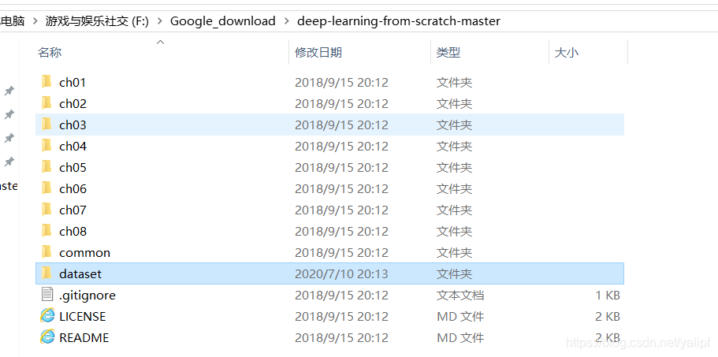

#### 03. how to import file from parent folder

```python
import sys
sys.path.append("../..")
from src import models, dataloader
```


#### 04. sys.exit()

`sys.exit()` is a Python function that you can call to exit your program. It raises the `SystemExit` exception behind the scenes. Once this exception is raised, Python will stop the current program. If you’re writing a script and you want it to exit at any point, you can use `sys.exit()`. Here’s an example:

```python
import sys

print("Hello, world!")
sys.exit()
print("This line will not be printed.")

```

Hint:

**`sys.exit()`**:

- When called without an argument, `sys.exit()` defaults to using an exit status of `0`.

- An exit status of `0` generally indicates that the program terminated successfully without any errors.

- Example usage:

  ```python
  import sys
  sys.exit()  # Equivalent to sys.exit(0)
  
  ```

**`sys.exit(1)`**:

- When called with an argument, `sys.exit(1)`, it uses the provided integer as the exit status.

- An exit status of `1` (or any non-zero value) usually indicates that the program terminated with an error or an exceptional condition.

- Example usage:

  ```python
  import sys
  sys.exit(1)
  
  ```


## import time

#### 1.  time.asctime()

返回当地时间

```python
import time

print(time.asctime())
```

output:

```bash
Tue Aug  2 11:33:21 2022
```

#### 2. time.sleep()

```python
import time
time.sleep(3) # Sleep for 3 seconds
```

If you run this code in your console, then you should experience a delay before you can enter a new statement in the REPL.


## About json

1、json.dumps()：将dict数据类型转成str

2、json.loads()：将str数据类型转成dict

3、json.dump()：将dict类型的数据转成str，并写入到json文件中

4、json.load()：从json文件中读取数据（<type ‘dict’>）

#### 01. json.dump() 存储

导入模块json
以写入模式打开这个文件，让json能够将数据写入其中
我们使用函数json.dump()将数字列表存储到文件numbers.json中

indent:具有缩进的效果

```python
import json
numbers = [1, 3, 5, 7, 9]
filename = 'numbers.json'
with open(filename, 'w') as f_json:
    json.dump(numbers, f_json,indent=1)
```


#### 02. json.load() 读取

以读取方式打开这个文件
使用函数json.load()加载存储在numbers.json中的信息，
并将其存储到变量numbers中。最后，我们打印恢复的数字列表，看看它是否与number_writer.py中创建的数字列表相同

```python
with open(filename) as f_json:
    numbers2 = json.load(f_json)
print(numbers2)
```


## About Keras

#### 1. tf.keras.layers.GlobalAveragePooling2D(    data_format=None, **kwargs )

输入参数：
data_format:
输入是一个字符串。“channels_last”(默认) 或者"channels_first"。
channels_last:代表通道数在最后，输入数据的形式是(batch, height, width, channels)；
channels_first:代表通道数在前面，输入数据的形式是(batch, channels, height, width)；
具体还是根据你在keras使用的图片数据的形式。不需要设置，系统会自动匹配。如果你从未设置过，默认是“channels_last”.

```python
import tensorflow as tf
import torch

a=torch.arange(0,24).view(2, 3, 2,2)

a=a.numpy()

print("This is x: ",a)
# 这里得到a是整型，日后应该用浮点型.

y = tf.keras.layers.GlobalAveragePooling2D(data_format='channels_first')(a)

print(y,y.shape)


```


## About Tensorflow

#### 1.构建网络第一层（输入层）

- 用于构建网络的第一层——**输入层**，该层会告诉网络我们的输入的尺寸是什么，这一点很重要。例如使用Model(input=x,output=y)构建网络，这种构建方式很常见，用途很广，详细[参考文章](https://blog.csdn.net/weixin_44441131/article/details/105905536)

```python
tf.keras.layers.Input(
    shape=None,
    batch_size=None,
    name=None,
    dtype=None,
    sparse=False,
    tensor=None,
    ragged=False,
    **kwargs,
)
```


参数说明
shape:元组维数，定义输入层神经元对应数据的形状。比如shape=(32, )和shape=32是等价的，表示输入都为长度为32的向量。

batch_size：声明输入的batch_size大小，定义输入层时不需要声明，会在fit时声明，一般在训练时候用

name：给layers起个名字，在整个神经网络中不能重复出现。如果name=None，程序会自动为该层创建名字。

dtype：数据类型，一般数据类型为tf.float32，计算速度更快

sparse：特定的布尔值，占位符是否为sparse

tensor：可选的现有tensor包装到“Input”层。如果设置该参数，该层将不会创建占位符张量


## About pydud

#### 1.截取音频文件

AudioSegment.from_mp3()

Or AudioSegment.from_file(para, format='flac')

```python
from pydub import AudioSegment

training_list= ["2400275000","2400910000","2405274000","2409891000","2421209000"
,"2423313000","2424577000","2450751000","2455265000","2464807000"]
for i in range(0,len(training_list)):
    print(i)

    # sourceName = 'training_file/training_list[i]/2405274000'

    # 加载mp3文件

​    input_music = AudioSegment.from_mp3('training_file/'+ training_list[i]+'/'+training_list[i]+ '.mp4.mp3')

    # sound_time = input_music.duration_seconds # 获取音频时间

    # 截取音频前20秒的内容

​    output_music = input_music[0:20000]

    # 保存音频 前面为保存的路径，后面为保存的格式

​    output_music.export('training_file/'+ training_list[i]+'/'+training_list[i] + '.wav', format='wav')
```


## About scipy

#### 01. scipy.special.softmax()

```python
from scipy.special import softmax

np.set_printoptions(precision=5)

x = np.array([[1, 0.5, 0.2, 3],

​              [1,  -1,   7, 3],

​              [2,  12,  13, 3]])

m = softmax(x)

print("无论行列，所有元素使用softmax：",m)

print("无论行列，所有元素经过softmax之后进行求和：",m.sum())

m = softmax(x, axis=0)

print("对每一列进行softmax:",m)

print("对每一列进行求和",m.sum(axis=0))

m = softmax(x, axis=1)

print("对每一行进行softmax:",m)

print("对每一行进行求和",m.sum(axis=1))
```

output:

```powershell
无论行列，所有元素使用softmax： 

[[4.48309e-06 2.71913e-06 2.01438e-06 3.31258e-05] 

[4.48309e-06 6.06720e-07 1.80861e-03 3.31258e-05] 

[1.21863e-05 2.68421e-01 7.29644e-01 3.31258e-05]] 

无论行列，所有元素经过softmax之后进行求和： 1.0000000000000002 

对每一列进行softmax: 

[[2.11942e-01 1.01300e-05 2.75394e-06 3.33333e-01] 

[2.11942e-01 2.26030e-06 2.47262e-03 3.33333e-01]

[5.76117e-01 9.99988e-01 9.97525e-01 3.33333e-01]] 

对每一列进行求和 [1. 1. 1. 1.] 

对每一列进行softmax: 

[[1.05877e-01 6.42177e-02 4.75736e-02 7.82332e-01] 

[2.42746e-03 3.28521e-04 9.79307e-01 1.79366e-02] 

[1.22094e-05 2.68929e-01 7.31025e-01 3.31885e-05]] 

对每一列进行求和 [1. 1. 1.]
```


#### 02. scipy.signal.butter()

Butterworth digital and analog filter design.

- It's commonly used to filter signals while preserving the shape and timing of waveform features, which is crucial for many scientific and engineering applications, such as ECG and PCG analysis.

```python
#import required libraries
from scipy.signal import filtfilt
from scipy import stats
import CSV
import pandas as pd
import numpy as np
import matplotlib.pyplot as plt
import scipy

def plot():
    data = pd.read_csv('path of the file')
    signal_data = data[['data']]
    signal_data = np.array(signal_data)


    time = np.linespace(0, 0.0002, 4000)
    plt.plot(time, signal_data)
    plt.show()

    filtered_signal= bandPassFilter(signal_data)

    plt.plot(time, filtered_signal)
    plt.show()

#syntax for bandpass filter
def bandPass_filter(signal):

    fs = 4000.0
    lowcut = 20.0
    highcut = 50.0

    nyqs = 0.5* fs
    low = lowcut / nyqs
    high = highcut/ nyqs
    
    order=2
    
    b, a = scipy.signal.butter(order, [low, high], 'bandpass', analog = False)
    y = scipy.signal.filtfilt(b, a, signal, axis=0)
    return(y)

plot()
```


After the preprocessing of butterworth filter.

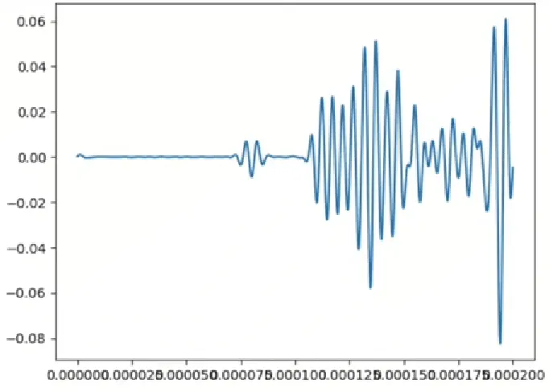

#### 03. scipy.signal.resample()

Resample *x* to *num* samples using Fourier method along the given axis.

The resampled signal starts at the same value as *x* but is sampled with a spacing of `len(x) / num * (spacing of x)`. Because a Fourier method is used, the signal is assumed to be periodic.


```python
from scipy import signal
import numpy as np

# Create a sample signal
t = np.linspace(0, 10, 1000)
x = np.sin(2*np.pi*t)  # Original signal with 1000 points
print("This is the input's shape:",x.shape)
# Resample to 500 points

num_points = 500
x_resampled = signal.resample(x, num_points)
print("This is the output's shape:",x_resampled.shape)
```

output:

```
This is the input's shape: (1000,)
This is the output's shape: (500,)
```


#### 04. scipy.signal.resample_poly()

This function performs polyphase resampling of signals using a rational factor. It's often used when you need to change the sampling rate of a signal by a rational factor (up/down).

Here's a basic example of how to use it:

```python
from scipy import signal
import numpy as np

# Create a sample signal
t = np.linspace(0, 10, 1000)
x = np.sin(2*np.pi*t)  # Original signal
print("This is the input's shape", x.shape)

# Resample with ratio 3/2 (upsampling by 3, then downsampling by 2)
resampled = signal.resample_poly(x, up=3, down=2)
print("This is the output's shape:", resampled.shape)
```

output:

```
This is the input's shape (1000,)
This is the output's shape: (1500,)
```

The main parameters are:

1. `x`: The input signal array
2. `up`: The upsampling factor (numerator)
3. `down`: The downsampling factor (denominator)

This method is particularly useful because:
- It's more efficient than `resample` for rational factors
- It has better preservation of signal characteristics
- It's less prone to aliasing compared to simple interpolation

Common use cases include:
- Converting audio between different sampling rates
- Adjusting signal sampling rates for signal processing
- Matching sampling rates of different signals for comparison

Would you like to see a more specific example for your use case?


#### 05. scipy.signal.filtfilt()

Apply a digital filter forward and backward to a signal.


#### 06. scipy.optimize.differential_evolution()

Finds the global minimum of a multivariate function.


#### 07. scipy.stats.pearsonr()

`scipy.stats.pearsonr()` is a function in the SciPy library that calculates the **Pearson correlation coefficient** and the **p-value** for testing non-correlation between two datasets.

- **Pearson correlation coefficient (r)**: It measures the linear relationship between two variables. The value ranges between -1 and 1:
  - **1**: Perfect positive linear relationship.
  - **-1**: Perfect negative linear relationship.
  - **0**: No linear relationship.

- **p-value**: It tests the hypothesis that there is no linear correlation (r = 0). A small p-value (typically ≤ 0.05) indicates strong evidence against the null hypothesis, suggesting a correlation.

```python
from scipy.stats import pearsonr
import numpy as np

# Example P-wave segments (arrays of data points)
p_wave_1 = np.array([1, 2, 3, 4, 5])
p_wave_2 = np.array([1, 2, 3, 4, 6])

# Calculate Pearson Correlation Coefficient
corr, p_value = pearsonr(p_wave_1, p_wave_2)

# Output
print("Pearson Correlation Coefficient:", corr)
print("P-value:", p_value)
```

This would give you the correlation coefficient and the associated p-value.

output:

```
Pearson Correlation Coefficient: 0.9863939238321437
P-value: 0.0019012746601963693
```


## About torchvision

#### 01.torchvision.transforms


torchvision是pytorch的一个图形库，它服务于PyTorch深度学习框架的，主要用来构建计算机视觉模型。torchvision.transforms主要是用于常见的一些图形变换。以下是torchvision的构成：

torchvision.datasets: 一些加载数据的函数及常用的数据集接口；
torchvision.models: 包含常用的模型结构（含预训练模型），例如AlexNet、VGG、ResNet等；
torchvision.transforms: 常用的图片变换，例如裁剪、旋转等；
torchvision.utils: 其他的一些有用的方法。

##### 01.transforms.Compose()

本文的主题是其中的`torchvision.transforms.Compose()`类。这个类的主要作用是串联多个图片变换的操作。这个类的构造很简单:

- 即组合几个变换方法，按顺序变换相应数据。
- 其中torchscript为脚本模块，用于封装脚本跨平台使用，若需要支持此情况，需要使用torch.nn.Sequential，而不是compose
- 对应于问题描述中代码，即先应用ToTensor()使[0-255]变换为[0-1]，再应用Normalize自定义标准化


```python
class torchvision.transforms.Compose(transforms):

 # Composes several transforms together.

 # Parameters: transforms (list of Transform objects) – list of transforms to compose.

Example # 可以看出Compose里面的参数实际上就是个列表，而这个列表里面的元素就是你想要执行的transform操作。

>>> transforms.Compose([
>>>  transforms.CenterCrop(10),
>>>  transforms.ToTensor(),])


```

事实上，`Compose()`类会将transforms列表里面的transform操作进行遍历。实现的代码很简单：

```python
## 这里对源码进行了部分截取。
def __call__(self, img):
	for t in self.transforms:	
		img = t(img)
    return img

```

##### 02.transforms.ToTensor()

Convert a `PIL Image` or `numpy.ndarray` to tensor
转换一个PIL库的图片或者numpy的数组为tensor张量类型；

转换从[0,255]->[0,1]

- 实现原理，即针对不同类型进行处理，原理即各值除以255，最后通过`torch.from_numpy`将`PIL Image` or `numpy.ndarray`针对具体数值类型比如Int32,int16,float等转成`torch.tensor`数据类型
- **需要注意的是，源码中有一小段内容：**

```python
 if isinstance(pic, np.ndarray):
        # handle numpy array
        if pic.ndim == 2:
            pic = pic[:, :, None]

        img = torch.from_numpy(pic.transpose((2, 0, 1))).contiguous()
        # backward compatibility
        if isinstance(img, torch.ByteTensor):
            return img.float().div(255)
        else:
            return img


```

我们可以看到在转换过程中有一个轴的转置操作`pic.transpose((2, 0, 1))` 和`contiguous()` 函数

- `pic.transpose((2, 0, 1))`将第三维轴换到第一个位置，这样做的原因主要是因为PIEimage与torch和numpy数据类型多维参数位置的区别，以下表说明

| 参数              | 含义   |
| ----------------- | ------ |
| torch：(x,y,z)    | x个y*z |
| PIEimage：(x,y,z) | z个x*y |

即三维表示的结构顺序有区别，导致numpy与torch多维转换时需要转置.

| Normalize a tensor image with mean and standard deviation 通过平均值和标准差来标准化一个tensor图像 |
| ------------------------------------------------------------ |
| 公式为： output[channel] = (input[channel] - mean[channel]) / std[channel] |

transforms.Normalize((0.5, 0.5, 0.5), (0.5, 0.5, 0.5))解释：

第一个(0.5,0.5,0.5) 即三个通道的平均值
第二个(0.5,0.5,0.5) 即三个通道的标准差值
由于ToTensor()已经将图像变为[0,1]，我们使其变为[-1,1]，以第一个通道为例，将最大与最小值代入公式

(0-0.5)/0.5=-1
(1-0.5)/0.5=1
其他数值同理操作，即映射到[-1,1]


##### 03.transforms.RandomCrop()

`torchvision.transforms.RandomCrop()` is a function from the PyTorch library's `torchvision.transforms` module, specifically designed for image transformations. This function performs a random crop of the input image. Random cropping is a common data augmentation technique used in computer vision tasks to enhance the model's ability to generalize by exposing it to different parts of the input images during training.

Here's a brief overview of its functionality:

```python
import torchvision.transforms as transforms
from torchvision.datasets import CIFAR10
from torch.utils.data import DataLoader

# Define transformations
transform = transforms.Compose([
    transforms.RandomCrop(32, padding=4),  # Random crop with padding of 4 pixels
    transforms.RandomHorizontalFlip(),     # Random horizontal flip
    transforms.ToTensor(),                 # Convert image to PyTorch tensor
    transforms.Normalize((0.5, 0.5, 0.5), (0.5, 0.5, 0.5))  # Normalize image
])

# Load CIFAR-10 dataset with defined transformations
train_dataset = CIFAR10(root='./data', train=True, download=True, transform=transform)

# Create a DataLoader to iterate over the dataset in batches
train_loader = DataLoader(train_dataset, batch_size=64, shuffle=True)

# Now, you can iterate over train_loader to access batches of randomly cropped and augmented images
for batch in train_loader:
    images, labels = batch
    # Your training code goes here

```

**Note**:

- `RandomCrop()` is typically used in conjunction with other transformations in a pipeline, such as resizing, normalization, and horizontal flipping, as part of data preprocessing for training deep learning models on image datasets.


#### 02.torchvision.datasets.MNIST()

*CLASS*torchvision.datasets.MNIST(*root: [str](https://docs.python.org/3/library/stdtypes.html#str)*, *train: [bool](https://docs.python.org/3/library/functions.html#bool) = True*, *transform: [Optional](https://docs.python.org/3/library/typing.html#typing.Optional)[[Callable](https://docs.python.org/3/library/typing.html#typing.Callable)] = None*, *target_transform: [Optional](https://docs.python.org/3/library/typing.html#typing.Optional)[[Callable](https://docs.python.org/3/library/typing.html#typing.Callable)] = None*, *download: [bool](https://docs.python.org/3/library/functions.html#bool) = False*)

- **root** (*string*) – Root directory of dataset where `MNIST/raw/train-images-idx3-ubyte` and `MNIST/raw/t10k-images-idx3-ubyte` exist.
- **train** ([*bool*](https://docs.python.org/3/library/functions.html#bool)*,* *optional*) – If True, creates dataset from `train-images-idx3-ubyte`, otherwise from `t10k-images-idx3-ubyte`.
- **download** ([*bool*](https://docs.python.org/3/library/functions.html#bool)*,* *optional*) – If True, downloads the dataset from the internet and puts it in root directory. If dataset is already downloaded, it is not downloaded again.
- **transform** (*callable**,* *optional*) – A function/transform that takes in an PIL image and returns a transformed version. E.g, `transforms.RandomCrop`
- **target_transform** (*callable**,* *optional*) – A function/transform that takes in the target and transforms it.

example:

```python
from torchvision.datasets.mnist import MNIST

transform = ToTensor()
train_set = MNIST(root='./datasets', train=True, download=True, transform=transform)
test_set = MNIST(root='./datasets', train=False, download=True, transform=transform)
```

result:

```
Downloading http://yann.lecun.com/exdb/mnist/train-images-idx3-ubyte.gz Downloading http://yann.lecun.com/exdb/mnist/train-images-idx3-ubyte.gz to [./datasets/MNIST/raw/train-images-idx3-ubyte.gz](https://file+.vscode-resource.vscode-cdn.net/home/jiang/桌面/simple CNN code Identify the Apparels and original Neural Network/datasets/MNIST/raw/train-images-idx3-ubyte.gz)

9913344it [00:00, 10329470.32it[/s](https://file+.vscode-resource.vscode-cdn.net/s)]                             

Extracting [./datasets/MNIST/raw/train-images-idx3-ubyte.gz](https://file+.vscode-resource.vscode-cdn.net/home/jiang/桌面/simple CNN code Identify the Apparels and original Neural Network/datasets/MNIST/raw/train-images-idx3-ubyte.gz) to [./datasets/MNIST/raw](https://file+.vscode-resource.vscode-cdn.net/home/jiang/桌面/simple CNN code Identify the Apparels and original Neural Network/datasets/MNIST/raw) Downloading http://yann.lecun.com/exdb/mnist/train-labels-idx1-ubyte.gz Downloading http://yann.lecun.com/exdb/mnist/train-labels-idx1-ubyte.gz to [./datasets/MNIST/raw/train-labels-idx1-ubyte.gz](https://file+.vscode-resource.vscode-cdn.net/home/jiang/桌面/simple CNN code Identify the Apparels and original Neural Network/datasets/MNIST/raw/train-labels-idx1-ubyte.gz)

29696it [00:00, 7895660.96it[/s](https://file+.vscode-resource.vscode-cdn.net/s)]          

Extracting [./datasets/MNIST/raw/train-labels-idx1-ubyte.gz](https://file+.vscode-resource.vscode-cdn.net/home/jiang/桌面/simple CNN code Identify the Apparels and original Neural Network/datasets/MNIST/raw/train-labels-idx1-ubyte.gz) to [./datasets/MNIST/raw](https://file+.vscode-resource.vscode-cdn.net/home/jiang/桌面/simple CNN code Identify the Apparels and original Neural Network/datasets/MNIST/raw) Downloading http://yann.lecun.com/exdb/mnist/t10k-images-idx3-ubyte.gz


Downloading http://yann.lecun.com/exdb/mnist/t10k-images-idx3-ubyte.gz to [./datasets/MNIST/raw/t10k-images-idx3-ubyte.gz](https://file+.vscode-resource.vscode-cdn.net/home/jiang/桌面/simple CNN code Identify the Apparels and original Neural Network/datasets/MNIST/raw/t10k-images-idx3-ubyte.gz)

1649664it [00:00, 5373946.30it[/s](https://file+.vscode-resource.vscode-cdn.net/s)]                             

Extracting [./datasets/MNIST/raw/t10k-images-idx3-ubyte.gz](https://file+.vscode-resource.vscode-cdn.net/home/jiang/桌面/simple CNN code Identify the Apparels and original Neural Network/datasets/MNIST/raw/t10k-images-idx3-ubyte.gz) to [./datasets/MNIST/raw](https://file+.vscode-resource.vscode-cdn.net/home/jiang/桌面/simple CNN code Identify the Apparels and original Neural Network/datasets/MNIST/raw) Downloading http://yann.lecun.com/exdb/mnist/t10k-labels-idx1-ubyte.gz Downloading http://yann.lecun.com/exdb/mnist/t10k-labels-idx1-ubyte.gz to [./datasets/MNIST/raw/t10k-labels-idx1-ubyte.gz](https://file+.vscode-resource.vscode-cdn.net/home/jiang/桌面/simple CNN code Identify the Apparels and original Neural Network/datasets/MNIST/raw/t10k-labels-idx1-ubyte.gz)

5120it [00:00, 9946658.86it[/s](https://file+.vscode-resource.vscode-cdn.net/s)]          

Extracting [./datasets/MNIST/raw/t10k-labels-idx1-ubyte.gz](https://file+.vscode-resource.vscode-cdn.net/home/jiang/桌面/simple CNN code Identify the Apparels and original Neural Network/datasets/MNIST/raw/t10k-labels-idx1-ubyte.gz) to [./datasets/MNIST/raw](https://file+.vscode-resource.vscode-cdn.net/home/jiang/桌面/simple CNN code Identify the Apparels and original Neural Network/datasets/MNIST/raw)
```


#### 03.torchvision.models

The models subpackage contains definitions of models for addressing different tasks, including: image classification, pixelwise semantic segmentation, object detection, instance segmentation, person keypoint detection and video classification.

You can construct a model with random weights by calling its constructor:

```python
import torchvision.models as models
resnet18 = models.resnet18()
alexnet = models.alexnet()
vgg16 = models.vgg16()
squeezenet = models.squeezenet1_0()
densenet = models.densenet161()
inception = models.inception_v3()
googlenet = models.googlenet()
shufflenet = models.shufflenet_v2_x1_0()
mobilenet_v2 = models.mobilenet_v2()
mobilenet_v3_large = models.mobilenet_v3_large()
mobilenet_v3_small = models.mobilenet_v3_small()
resnext50_32x4d = models.resnext50_32x4d()
wide_resnet50_2 = models.wide_resnet50_2()
mnasnet = models.mnasnet1_0()
```

We provide pre-trained models, using the PyTorch `torch.utils.model_zoo`. These can be constructed by passing `pretrained=True`:

```python
import torchvision.models as models
resnet18 = models.resnet18(pretrained=True)
alexnet = models.alexnet(pretrained=True)
squeezenet = models.squeezenet1_0(pretrained=True)
vgg16 = models.vgg16(pretrained=True)
densenet = models.densenet161(pretrained=True)
inception = models.inception_v3(pretrained=True)
googlenet = models.googlenet(pretrained=True)
shufflenet = models.shufflenet_v2_x1_0(pretrained=True)
mobilenet_v2 = models.mobilenet_v2(pretrained=True)
mobilenet_v3_large = models.mobilenet_v3_large(pretrained=True)
mobilenet_v3_small = models.mobilenet_v3_small(pretrained=True)
resnext50_32x4d = models.resnext50_32x4d(pretrained=True)
wide_resnet50_2 = models.wide_resnet50_2(pretrained=True)
mnasnet = models.mnasnet1_0(pretrained=True)
```


#### 04. torchvision.datasets.ImageFolder()

This class is particularly useful for loading datasets of images when the images are arranged in a specific folder structure.

A generic data loader where the images are arranged in this way by default:

root/dog/xxx.png
root/dog/xxy.png
root/dog/[...]/xxz.png

root/cat/123.png
root/cat/nsdf3.png
root/cat/[...]/asd932_.png

```python
from torchvision import datasets

root= "../../ImageNet_1K/ImageNet_extrated"
dataset = datasets.ImageFolder(root)
image, label=dataset[0]
print(len(dataset))
print(len(dataset.imgs), dataset.imgs[0])
print("This is the image:",image)
print("This is the label:", label)
```

output:

```
1281167
1281167 ('../../ImageNet_1K/ImageNet_extrated/n01440764/n01440764_10026.JPEG', 0)
This is the image: <PIL.Image.Image image mode=RGB size=250x250 at 0x749DE215C580>
This is the label: 0
```


## About torchaudio

#### 1. torchaudio.load()

Load audio file into torch.Tensor object. Refer to [torchaudio.backend](https://pytorch.org/audio/stable/backend.html#backend) for the detail.

```python
import torch
import torchaudio
import matplotlib.pyplot as plt


filename = "/home/jiang/桌面/pytorchforaudio-main/UrbanSound8K/audio/fold2/4201-3-0-0.wav"

waveform,sample_rate = torchaudio.load(filename)
print("Shape of waveform:{}".format(waveform.size())) #音频大小
print("sample rate of waveform:{}".format(sample_rate))#采样率

plt.figure()
plt.plot(waveform.t().numpy())
plt.show()

```

output:

```bash
Shape of waveform:torch.Size([2, 10937]) 
sample rate of waveform:44100
```

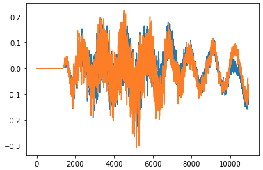

To load only one channel (mono) from a stereo audio file, you can use indexing on the loaded waveform. Here's an example:

```python
pythonCopy codeimport torchaudio

# Specify the file path
file_path = "path/to/your/stereo_audio_file.wav"

# Load the stereo waveform and sample rate
waveform, sample_rate = torchaudio.load(file_path)

# Extract only the first channel (left channel) for mono audio
mono_waveform = waveform[0, :]

# Check the shape of the resulting mono waveform
print("Mono waveform shape:", mono_waveform.shape)
print("Sample rate:", sample_rate)
```

In this example, `waveform[0, :]` extracts the first channel (left channel) from the stereo waveform. This will result in a 1D tensor representing the mono waveform.

Make sure to replace `"path/to/your/stereo_audio_file.wav"` with the actual path to your stereo audio file.


#### 2. torchaudio.transforms.MelSpectrogram()

Create MelSpectrogram for a raw audio signal.

This is a composition of [`torchaudio.transforms.Spectrogram()`](https://pytorch.org/audio/stable/transforms.html#torchaudio.transforms.Spectrogram) and and [`torchaudio.transforms.MelScale()`](https://pytorch.org/audio/stable/transforms.html#torchaudio.transforms.MelScale).

```python
torchaudio.transforms.MelSpectrogram()
```

Parameters:

- **sample_rate** ([*int*](https://docs.python.org/3/library/functions.html#int)*,* *optional*) – Sample rate of audio signal. (Default: `16000`)
- **n_fft** ([*int*](https://docs.python.org/3/library/functions.html#int)*,* *optional*) – Size of FFT, creates `n_fft // 2 + 1` bins. (Default: `400`)
- **win_length** ([*int*](https://docs.python.org/3/library/functions.html#int) *or* [*None*](https://docs.python.org/3/library/constants.html#None)*,* *optional*) – Window size. (Default: `n_fft`)
- **hop_length** ([*int*](https://docs.python.org/3/library/functions.html#int) *or* [*None*](https://docs.python.org/3/library/constants.html#None)*,* *optional*) – Length of hop between STFT windows. (Default: `win_length // 2`)
- **f_min** ([*float*](https://docs.python.org/3/library/functions.html#float)*,* *optional*) – Minimum frequency. (Default: `0.`)
- **f_max** ([*float*](https://docs.python.org/3/library/functions.html#float) *or* [*None*](https://docs.python.org/3/library/constants.html#None)*,* *optional*) – Maximum frequency. (Default: `None`)
- **pad** ([*int*](https://docs.python.org/3/library/functions.html#int)*,* *optional*) – Two sided padding of signal. (Default: `0`)
- **n_mels** ([*int*](https://docs.python.org/3/library/functions.html#int)*,* *optional*) – Number of mel filterbanks. (Default: `128`)
- **window_fn** (*Callable**[**..**,* *Tensor**]**,* *optional*) – A function to create a window tensor that is applied/multiplied to each frame/window. (Default: `torch.hann_window`)
- **power** ([*float*](https://docs.python.org/3/library/functions.html#float)*,* *optional*) – Exponent for the magnitude spectrogram, (must be > 0) e.g., 1 for energy, 2 for power, etc. (Default: `2`)
- **normalized** ([*bool*](https://docs.python.org/3/library/functions.html#bool)*,* *optional*) – Whether to normalize by magnitude after stft. (Default: `False`)
- **wkwargs** (*Dict**[**..**,* *..**] or* [*None*](https://docs.python.org/3/library/constants.html#None)*,* *optional*) – Arguments for window function. (Default: `None`)
- **center** ([*bool*](https://docs.python.org/3/library/functions.html#bool)*,* *optional*) – whether to pad `waveform` on both sides so that the t*t*-th frame is centered at time t \times \text{hop\_length}*t*×hop_length. (Default: `True`)
- **pad_mode** (*string**,* *optional*) – controls the padding method used when `center` is `True`. (Default: `"reflect"`)
- **onesided** ([*bool*](https://docs.python.org/3/library/functions.html#bool)*,* *optional*) – controls whether to return half of results to avoid redundancy. (Default: `True`)
- **norm** ([*str*](https://docs.python.org/3/library/stdtypes.html#str) *or* [*None*](https://docs.python.org/3/library/constants.html#None)*,* *optional*) – If ‘slaney’, divide the triangular mel weights by the width of the mel band (area normalization). (Default: `None`)
- **mel_scale** ([*str*](https://docs.python.org/3/library/stdtypes.html#str)*,* *optional*) – Scale to use: `htk` or `slaney`. (Default: `htk`)


#### 3.torchaudio.compliance.kaldi.fbank()

Create a fbank from a raw audio signal. This matches the input/output of Kaldi’s compute-fbank-feats. 

*总而言之用这个函数我们可以得到filterbank的特征*

- Parameters

  - **waveform** (*Tensor*) – Tensor of audio of size (c, n) where c is in the range [0,2)
  - **blackman_coeff** ([*float*](https://docs.python.org/3/library/functions.html#float)*,* *optional*) – Constant coefficient for generalized Blackman window. (Default: `0.42`)
  - **channel** ([*int*](https://docs.python.org/3/library/functions.html#int)*,* *optional*) – Channel to extract (-1 -> expect mono, 0 -> left, 1 -> right) (Default: `-1`)
  - **dither** ([*float*](https://docs.python.org/3/library/functions.html#float)*,* *optional*) – Dithering constant (0.0 means no dither). If you turn this off, you should set the energy_floor option, e.g. to 1.0 or 0.1 (Default: `0.0`)
  - **energy_floor** ([*float*](https://docs.python.org/3/library/functions.html#float)*,* *optional*) – Floor on energy (absolute, not relative) in Spectrogram computation. Caution: this floor is applied to the zeroth component, representing the total signal energy. The floor on the individual spectrogram elements is fixed at std::numeric_limits<float>::epsilon(). (Default: `1.0`)
  - **frame_length** ([*float*](https://docs.python.org/3/library/functions.html#float)*,* *optional*) – Frame length in milliseconds (Default: `25.0`)
  - **frame_shift** ([*float*](https://docs.python.org/3/library/functions.html#float)*,* *optional*) – Frame shift in milliseconds (Default: `10.0`)
  - **high_freq** ([*float*](https://docs.python.org/3/library/functions.html#float)*,* *optional*) – High cutoff frequency for mel bins (if <= 0, offset from Nyquist) (Default: `0.0`)
  - **htk_compat** ([*bool*](https://docs.python.org/3/library/functions.html#bool)*,* *optional*) – If true, put energy last. Warning: not sufficient to get HTK compatible features (need to change other parameters). (Default: `False`)
  - **low_freq** ([*float*](https://docs.python.org/3/library/functions.html#float)*,* *optional*) – Low cutoff frequency for mel bins (Default: `20.0`)
  - **min_duration** ([*float*](https://docs.python.org/3/library/functions.html#float)*,* *optional*) – Minimum duration of segments to process (in seconds). (Default: `0.0`)
  - **num_mel_bins** ([*int*](https://docs.python.org/3/library/functions.html#int)*,* *optional*) – Number of triangular mel-frequency bins (Default: `23`)
  - **preemphasis_coefficient** ([*float*](https://docs.python.org/3/library/functions.html#float)*,* *optional*) – Coefficient for use in signal preemphasis (Default: `0.97`)
  - **raw_energy** ([*bool*](https://docs.python.org/3/library/functions.html#bool)*,* *optional*) – If True, compute energy before preemphasis and windowing (Default: `True`)
  - **remove_dc_offset** ([*bool*](https://docs.python.org/3/library/functions.html#bool)*,* *optional*) – Subtract mean from waveform on each frame (Default: `True`)
  - **round_to_power_of_two** ([*bool*](https://docs.python.org/3/library/functions.html#bool)*,* *optional*) – If True, round window size to power of two by zero-padding input to FFT. (Default: `True`)
  - **sample_frequency** ([*float*](https://docs.python.org/3/library/functions.html#float)*,* *optional*) – Waveform data sample frequency (must match the waveform file, if specified there) (Default: `16000.0`)
  - **snip_edges** ([*bool*](https://docs.python.org/3/library/functions.html#bool)*,* *optional*) – If True, end effects will be handled by outputting only frames that completely fit in the file, and the number of frames depends on the frame_length. If False, the number of frames depends only on the frame_shift, and we reflect the data at the ends. (Default: `True`)
  - **subtract_mean** ([*bool*](https://docs.python.org/3/library/functions.html#bool)*,* *optional*) – Subtract mean of each feature file [CMS]; not recommended to do it this way. (Default: `False`)
  - **use_energy** ([*bool*](https://docs.python.org/3/library/functions.html#bool)*,* *optional*) – Add an extra dimension with energy to the FBANK output. (Default: `False`)
  - **use_log_fbank** ([*bool*](https://docs.python.org/3/library/functions.html#bool)*,* *optional*) – If true, produce log-filterbank, else produce linear. (Default: `True`)
  - **use_power** ([*bool*](https://docs.python.org/3/library/functions.html#bool)*,* *optional*) – If true, use power, else use magnitude. (Default: `True`)
  - **vtln_high** ([*float*](https://docs.python.org/3/library/functions.html#float)*,* *optional*) – High inflection point in piecewise linear VTLN warping function (if negative, offset from high-mel-freq (Default: `-500.0`)
  - **vtln_low** ([*float*](https://docs.python.org/3/library/functions.html#float)*,* *optional*) – Low inflection point in piecewise linear VTLN warping function (Default: `100.0`)
  - **vtln_warp** ([*float*](https://docs.python.org/3/library/functions.html#float)*,* *optional*) – Vtln warp factor (only applicable if vtln_map not specified) (Default: `1.0`)
  - **window_type** ([*str*](https://docs.python.org/3/library/stdtypes.html#str)*,* *optional*) – Type of window (‘hamming’|’hanning’|’povey’|’rectangular’|’blackman’) (Default: `'povey'`)

- Returns

  A fbank identical to what Kaldi would output. The shape is (m, `num_mel_bins + use_energy`) where m is calculated in _get_strided

- Return type

  Tensor

- Example:


```python
import torchaudio
import matplotlib.pyplot as plt


filename='/home/jiang/桌面/ast-master/egs/short_audio/data/short-audio-master/short_audio/0_1-100038-A-14.wav'

waveform, sample_rate = torchaudio.load(filename)
fbank = torchaudio.compliance.kaldi.fbank(waveform)
print("Shape of fbank: {}".format(fbank.size()))

plt.figure()
plt.imshow(fbank.t().numpy(), cmap='gray')
plt.show()
```


#### 4. torchaudio.transforms.FrequencyMasking()

`torchaudio.transforms.FrequencyMasking`(*freq_mask_param: [int](https://docs.python.org/3/library/functions.html#int)*, *iid_masks: [bool](https://docs.python.org/3/library/functions.html#bool) = False*)

Apply masking to a spectrogram in the frequency domain. Proposed in *SpecAugment* [[1](https://pytorch.org/audio/stable/transforms.html#footcite-specaugment)].

Parameters:

- **freq_mask_param** ([*int*](https://docs.python.org/3/library/functions.html#int)) – maximum possible length of the mask. Indices uniformly sampled from [0, freq_mask_param).
- **iid_masks** ([*bool*](https://docs.python.org/3/library/functions.html#bool)*,* *optional*) – whether to apply different masks to each example/channel in the batch. (Default: `False`) This option is applicable only when the input tensor is 4D.

```python
spectrogram = torchaudio.transforms.Spectrogram()
masking = torchaudio.transforms.FrequencyMasking(freq_mask_param=80)

original = spectrogram(waveform)
masked = masking(original)
```


#### 5. torchaudio.transforms.TimeMasking()

`torchaudio.transforms.TimeMasking`(*time_mask_param: [int](https://docs.python.org/3/library/functions.html#int)*, *iid_masks: [bool](https://docs.python.org/3/library/functions.html#bool) = False*, *p: [float](https://docs.python.org/3/library/functions.html#float) = 1.0*)

Apply masking to a spectrogram in the time domain. Proposed in *SpecAugment* [[1](https://pytorch.org/audio/stable/transforms.html#footcite-specaugment)].

Parameters:

- **time_mask_param** ([*int*](https://docs.python.org/3/library/functions.html#int)) – maximum possible length of the mask. Indices uniformly sampled from [0, time_mask_param).
- **iid_masks** ([*bool*](https://docs.python.org/3/library/functions.html#bool)*,* *optional*) – whether to apply different masks to each example/channel in the batch. (Default: `False`) This option is applicable only when the input tensor is 4D.
- **p** ([*float*](https://docs.python.org/3/library/functions.html#float)*,* *optional*) – maximum proportion of time steps that can be masked. Must be within range [0.0, 1.0]. (Default: 1.0)

```python
spectrogram = torchaudio.transforms.Spectrogram()
masking = torchaudio.transforms.TimeMasking(freq_mask_param=80)

original = spectrogram(waveform)
masked = masking(original)
```

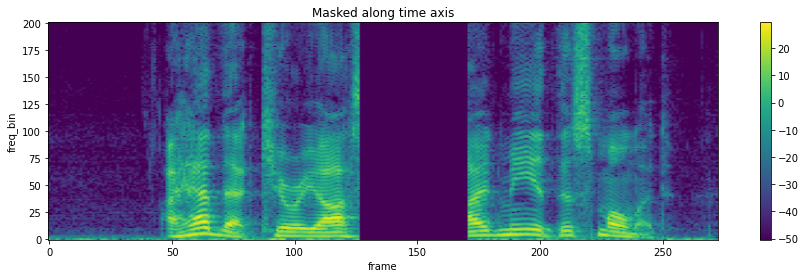

***Hint: 关于如何使用的具体代码可以参考官方代码*** 

#### 6. torchaudio.transforms.MelSpectrogram()(waveform)

```python
import torchaudio
import matplotlib.pyplot as plt

filename="./data/short-audio-master/short_audio/0_1-977-A-39.wav"
waveform, sample_rate = torchaudio.load(filename)
specgram = torchaudio.transforms.MelSpectrogram()(waveform)

print("Shape of spectrogram: {}".format(specgram.size()))


plt.figure()
p = plt.imshow(specgram.log2()[0,:,:].detach().numpy())
```

#### 7. torchaudio.functional.resample

The `torchaudio.functional.resample` function is used to resample an input waveform to a new sample rate. Resampling is the process of changing the number of samples in a signal to change its playback speed or alter its pitch.

```python
import torchaudio
import torch

# Load an example waveform
waveform, sample_rate = torchaudio.load("path/to/audio/file.wav")

# Define the target sample rate
target_sample_rate = 16000

# Resample the waveform
resampled_waveform = torchaudio.functional.resample(waveform, sample_rate, target_sample_rate)

# Print the shape of the resampled waveform
print(resampled_waveform.shape)

```


## About random

#### 01. python中的random函数

random() 方法返回随机生成的一个实数，它在[0,1)范围内

```python
import random
random.random()

#randint函数，返回指定范围的一个随机整数，包含上下限
random.randint(0,99)#返回0~99之间的整数

#randrange函数，randrange(0,101,2)可以用来选曲0~100之间的偶数
```


#### 02. random.seed(int)

给随机数对象一个种子值，用于产生随机序列。
对于同一个种子值的输入，之后产生的随机数序列也一样。

通常是把时间秒数等变化值作为种子值，达到每次运行产生的随机系列都不一样
seed() 省略参数，意味着使用当前系统时间生成随机数

```python
random.seed(10)
print random.random()   #0.57140259469
random.seed(10)
print random.random()   #0.57140259469  同一个种子值，产生的随机数相同
print random.random()   #0.428889054675

random.seed()           #省略参数，意味着取当前系统时间
print random.random()
random.seed()
print random.random()
```


#### 03. 随机正态浮点数random.uniform(u,sigma)

```python
print random.uniform(1,5)
```


#### 04. 按步长随机在上下限范围内取一个随机数

```python
#random.randrange(start,stop,step)
print random.randrange(20,100,5)
```


#### 05. 随机选择字符

```python
#随机的选取n个字符
print(random.sample('abcdefghijk',3))

#随机的选取一个字符
print(random.choice('af/fse.faek``fs'))

#随机选取几个字符，再拼接成新的字符串
print string.join(random.sample('abcdefhjk',4)).replace(" ","")

```


#### 06. random.choice()

**choice()** 方法返回一个列表，元组或字符串的随机项。

```python
random.choice( seq  )
```

- seq -- 可以是一个列表，元组或字符串。

```python
import random

print ("choice([1, 2, 3, 5, 9]) : ", random.choice([1, 2, 3, 5, 9]))
print ("choice('A String') : ", random.choice('A String'))
```


output:

```python
choice([1, 2, 3, 5, 9]) :  2
choice('A String') :  n
```


#### 07. random.shuffle()

Yes, `random.shuffle()` is a function in Python's `random` module. It randomly reorders the elements of a list in place, meaning it modifies the original list rather than returning a new one. Here's a quick overview:

- **Syntax**: `random.shuffle(sequence)`
- **Parameter**: 
  - `sequence`: A mutable sequence (e.g., a list) to be shuffled.
- **Return**: None (it shuffles the list in place).
- **Requires**: You must import the `random` module to use it.

Example:

```python
import random

my_list = [1, 2, 3, 4, 5]
random.shuffle(my_list)
print(my_list)  # Output: A randomly reordered list, e.g., [3, 1, 5, 2, 4]
```

Notes:

- The shuffling is based on a pseudo-random number generator. You can set a seed with `random.seed()` for reproducible results.
- It only works on mutable sequences like lists, not on immutable types like tuples or strings.
- If you need a shuffled copy of a list (without modifying the original), you can use `random.sample()` instead:
  ```python
  shuffled_copy = random.sample(my_list, len(my_list))
  ```


#### 08. numpy模块中的randn和rand函数

numpy.random.randn(d0,d1,…,dn),正太随机

numpy.random.rand(d0,d1,…,dn)，选择[0,1]范围内的随机数

```python
import numpy
numpy.random.randn(2,3)
array([[ 1.62434536, -0.61175641, -0.52817175],
       [-1.07296862,  0.86540763, -2.3015387 ]])

numpy.random.rand(2,3)
array([[0.41919451, 0.6852195 , 0.20445225],
       [0.87811744, 0.02738759, 0.67046751]])
```


#### 09. random.random()

`random.random()` generates a random floating-point number between 0.0 and 1.0.

**Range**: The number returned will be in the range [0.0,1.0)[0.0, 1.0)[0.0,1.0). This means it includes 0.0 but excludes 1.0.

**Uniform Distribution**: The numbers are uniformly distributed, meaning each number within the range has an equal probability of being generated.

```python
import random

# Generate a random floating-point number between 0.0 and 1.0
random_number = random.random()

# Print the random number
print(random_number)

```

output:

```
0.23837441221640987
```


## About matplotlib

#### 01. plot histogram by matplotlib

```python
import matplotlib.pyplot as plt
import mpl_toolkits.axisartist.axislines as axislines
import numpy as np

listA=[10]*13+[20]*25+[30]*42+[40]*50+[50]*58+[60]*72+[70]*47+[80]*63+[90]*45+[100]*41

\# An "interface" to matplotlib.axes.Axes.hist() method

n, bins, patches = plt.hist(x=listA, bins=10, color='#0504aa', alpha=0.7, rwidth=0.8, orientation='horizontal',histtype='barstacked')

plt.grid(axis='y', alpha=0.75)
plt.xticks(np.arange(0,110,10))
plt.xlabel('Numbers of intervals')


plt.yticks([0,10,20,30,40,50,60,70,80,90,100,110],['','40ms-140ms','140ms-240ms','240ms-340ms','340ms-440ms','440ms-540ms','540ms-640ms','640ms-740ms','740ms-840ms','840ms-940ms','940ms-inf',''])

plt.ylabel('Sound length interval')


plt.title('Figure 1: Interval histograms of different sound lengths at millisecond level(DatasetA)',y=-0.3)
```


#### 02. How to Adjust Line Thickness in Matplotlib

```python
import matplotlib.pyplot as plt
import numpy as np

#define x and y values
x = np.linspace(0, 10, 100)
y1 = np.sin(x)*np.exp(-x/3)

#create line plot with line width set to 3
plt.plot(x, y1, linewidth=3)

#display plot
plt.show()
```


#### 03. Graph Plotting in Python easily

```python
# importing the required module
import matplotlib.pyplot as plt

# x axis values
x = [1,2,3]
# corresponding y axis values
y = [2,4,1]

# plotting the points
plt.plot(x, y)

# naming the x axis
plt.xlabel('x - axis')
# naming the y axis
plt.ylabel('y - axis')

# giving a title to my graph
plt.title('My first graph!')

# function to show the plot
plt.show()
```

output:


#### 04. matplotlib.pyplot.figure().set_figwidth() or set_figheight()

Change plot size in Matplotlib – Python

```python
# importing the matplotlib library
import matplotlib.pyplot as plt

# values on x-axis
x = [1, 2, 3, 4, 5]
# values on y-axis
y = [1, 2, 3, 4, 5]

# naming the x and y axis
plt.xlabel('x - axis')
plt.ylabel('y - axis')

# plotting a line plot with it's default size
print("Plot in it's default size: ")
plt.plot(x, y)
plt.show()

# plotting a line plot after changing it's width and height
f = plt.figure()
f.set_figwidth(4)
f.set_figheight(1)

print("Plot after re-sizing: ")
plt.plot(x, y)
plt.show()

```

output:

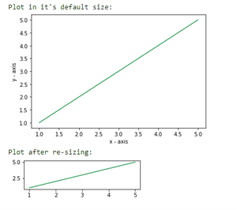

#### 05. matplotlib.pyplot.**savefig**(**args*, ***kwargs*)

Save the current figure.

**hint: set the "bbox_inches="tight"", otherwise the image will be cropped.**

```python
import matplotlib.pyplot as plt

plt.savefig('learning_curve.png', dpi=300, bbox_inches="tight")
```


#### 06. matplotlib.pyplot.plt.imshow()


#### 07. matplotlib.pyplot.pcolormesh()


## About csv & pandas

#### 01. csv.DictReader()

假设csv文件的内容如下图所示，DictReader会将第一行的内容（类标题）作为key值，第二行开始才是数据内容。即图中的csv文件有2列7行数据，第一列的key值为id，第二列的key值为class：

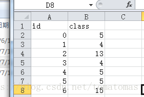

```python
import csv

with open('name.csv') as csvfile:
    reader = csv.DictReader(csvfile)
    for row in reader:
        #循环打印数据的id和class值，此循环执行7次
        print(row['id'],row['class'])
```


output:

```bash
0 5
1 4
2 13
…
6 15
```


#### 02. csv.DictWriter()

现假设我们要创建一个格式如上图所示的csv文件，则实现代码应该如下：

```python
import csv
datas=[1, 2, 3, 4, 5, 6]

with open('name.csv','w') as csvfile:
    writer = csv.DictWriter(csvfile,fieldnames=['Name', 'Target', 'Label_code', 'Frequency', 'Duration'])
    #写入列标题，即DictWriter构造方法的fieldnames参数
    writer.writeheader()
    for data in datas:
        writer.writerow({'Name': 'abc', 'Target': data, 'Label_code': 'abc', 'Frequency': 'abc', 'Duration': 'abc'})
```


#### 03. Update column value of CSV in python

```python
# importing the pandas library
import pandas as pd

# reading the csv file
df = pd.read_csv("data/short-audio-master/meta/instantaneous_dataset_7284_edit.csv")

# updating the column value/data
df.loc[0, 'train_eval'] = '1'

# writing into the file
df.to_csv("data/short-audio-master/meta/instantaneous_dataset_7284_edit.csv", index=False)

print(df)
```


#### 04. how to read csv file line by line

```python
import pandas as pd

df = pd.read_csv("short_indoor_duration.csv")

for i in range(len(df['filename'])):
    print(df['filename'][i])
```


output:

```
bea_001_00_00_0.flac--0.wav bea_001_00_00_0.flac--1.wav bea_001_00_00_0.flac--2.wav bea_002_00_00_0.flac--0.wav bea_002_00_00_0.flac--1.wav bea_004_00_00_0.flac--0.wav bea_004_00_00_0.flac--1.wav bea_005_00_00_0.flac--0.wav bea_005_00_00_0.flac--1.wav bea_005_00_00_0.flac--2.wav bea_006_00_00_0.flac--1.wav bea_006_00_00_0.flac--3.wav bea_007_00_00_0.flac--1.wav bea_008_00_00_0.flac--0.wav bea_010_00_00_0.flac--0.wav bea_011_00_00_0.flac--0.wav bea_013_00_00_0.flac--0.wav bea_014_00_00_0.flac--0.wav bea_015_00_00_0.flac--0.wav bea_015_00_00_0.flac--1.wav bea_018_00_00_0.flac--0.wav bea_019_00_00_0.flac--0.wav bea_019_00_00_0.flac--1.wav bea_019_00_00_0.flac--2.wav bea_019_00_00_0.flac--3.wav

...

win_102_01_02_0.flac--1.wav win_103_02_02_0.flac--0.wav win_103_02_02_0.flac--1.wav win_104_01_02_0.flac--0.wav
```


If your CSV file doesn't contain a header, you can use the `header=None` option while reading the file. By doing this, pandas will automatically assign default column names (0, 1, 2, ...) to your DataFrame. Here's an example:

```python
import pandas as pd

# Assuming your CSV file is named 'your_file.csv'
file_path = 'path/to/your_file.csv'

# Read the CSV file without a header
df = pd.read_csv(file_path, header=None)

# Display the DataFrame
print(df)

```

##### dtype

If you want to set all columns to a single data type, you can pass a data type directly. For example:

```python
import pandas as pd

# Set all columns to type 'str'
df = pd.read_csv('yourfile.csv', dtype=str)

```


#### 05. pandas.DataFrame() and pandas.DataFrame.iloc()

A Pandas DataFrame is a 2 dimensional data structure, like a 2 dimensional array, or a table with rows and columns.

below is the example:

```python
import pandas as pd

d = {'col1': [1, 2], 'col2': [3, 4]}
df = pd.DataFrame(data=d) # same as pd.DataFrame(d)
df
```

output:

```
   col1  col2
0     1     3
1     2     4
```

another example:

pandas.DataFrame.iloc()

Purely integer-location(纯整数位置) based indexing for selection by position.

```python
import pandas as pd

data = {'A': [1, 2, 3], 'B': [4, 5, 6], 'C': [7, 8, 9]}
df = pd.DataFrame(data)
print(df)
print("----------------------------------------")

# Selecting a single element
value = df.iloc[1, 2]
print(value)  # Output: 8
print("----------------------------------------")

# Selecting multiple rows and columns
subset = df.iloc[0:2, 1:3]
print(subset)
print("----------------------------------------")
# Output:
#    B  C
# 0  4  7
# 1  5  8

# Selecting specific rows and columns
subset2 = df.iloc[[0, 2], [1, 2]]
print(subset2)
print("----------------------------------------")
# Output:
#    B  C
# 0  4  7
# 2  6  9
```

output:

```
   A  B  C
0  1  4  7
1  2  5  8
2  3  6  9
----------------------------------------
8
----------------------------------------
   B  C
0  4  7
1  5  8
----------------------------------------
   B  C
0  4  7
2  6  9
----------------------------------------
```


#### 06. Series.to_list(~)

Pandas `Series.to_list(~)` method converts the Series into a Python's standard list.

Parameters:

This method does not take any parameters.

Return Value:

A Python standard list.

Examples:

To convert a Series into a Python standard list:

```python
import pandas as pd

# Create a Dict from a input
data = {'Courses' :"pandas", 'Fees' : 20000, 'Duration' : "30days"}
s = pd.Series(data)
print(s)
print("------------------")
print (s.to_list())
```

output:

```
Courses     pandas 
Fees         20000 
Duration    30days 
dtype: object 
------------------
['pandas', 20000, '30days']
```


#### 07. Series.index

[Pandas](https://www.geeksforgeeks.org/python-pandas-series-index/Pandas) **Series.index** attribute is used to get or set the index labels of the given Series object.

```python
# importing pandas as pd
import pandas as pd

Date = ['1/1/2018', '2/1/2018', '3/1/2018', '4/1/2018']
Index_name = ['Day 1', 'Day 2', 'Day 3', 'Day 4']
# Creating the Series
sr = pd.Series(data = Date,	 # Series Data
			index = Index_name # Index
			)			
# Print the series
print(sr)
```

output:

```
Day 1    1/1/2018
Day 2    2/1/2018
Day 3    3/1/2018
Day 4    4/1/2018
dtype: object
```


#### 08. Pandas DataFrame reset_index()

The `reset_index()` method allows you reset the index back to the default 0, 1, 2 etc indexes.

By default this method will keep the "old" idexes in a column named "index", to avoid this, use the `drop` parameter.

Hint: The most commonly used function of this method is to reorder the DataFrame.


| Parameter | Value                   | Description                                                  |
| :-------- | :---------------------- | :----------------------------------------------------------- |
| level     | *Int String List Tuple* | Optional. Specifies the levels to reset. Default resets all levels |
| drop      | `TrueFalse`             | Optional. default False                                      |
| inplace   | `TrueFalse`             | Optional, default False. If True: the operation is done on the current DataFrame. If False: returns a copy where the operation is done. |
| col_level | *Int String*            | Optional, default 0. For multi level columns, specifies on which level to reset the indexes |
| col_fill  | *Object *None           | Optional, default ''. For multi level columns, specifies how the other levels are indexed |

```python
import pandas as pd

data = {
  "name": ["Sally", "Mary", "John"],
  "age": [50, 40, 30],
  "qualified": [True, False, False]
}

idx = ["X", "Y", "Z"]

df = pd.DataFrame(data, index=idx)

print("This is the original one:\n",df)
print("--------------------------------")
newdf = df.reset_index()
print("This is the original one with reset_index:\n", newdf)
print("--------------------------------")
newdf_drop=df.reset_index(drop=True)
print("This is the original one with reset_index and drop:\n", newdf_drop)
print("--------------------------------")
newdf_drop_inplace=df.reset_index(drop=True, inplace=True)
print(newdf_drop_inplace)
print("--------------------------------")
print("The operation is done on the current DataFrame:\n",df)
```

output:

```
This is the original one:
     name  age  qualified
X  Sally   50       True
Y   Mary   40      False
Z   John   30      False
--------------------------------
This is the original one with reset_index:
   index   name  age  qualified
0     X  Sally   50       True
1     Y   Mary   40      False
2     Z   John   30      False
--------------------------------
This is the original one with reset_index and drop:
     name  age  qualified
0  Sally   50       True
1   Mary   40      False
2   John   30      False
--------------------------------
None
--------------------------------
The operation is done on the current DataFrame:
     name  age  qualified
0  Sally   50       True
1   Mary   40      False
2   John   30      False
```


#### 09. pandas.DataFrame.to_numpy()

Convert the DataFrame to a NumPy array.

```python
import pandas as pd

df = pd.DataFrame({"A": [1, 2], "B": [3.0, 4.5]})
# convert dataframe to numpy array
arr = df.to_numpy()

print('\nNumpy Array\n----------\n', arr)
print(type(arr))
```

output:

```
Numpy Array
----------
 [[1.  3. ]
 [2.  4.5]]
<class 'numpy.ndarray'>
```


#### 10. Difference Between `loc` and `iloc`

The difference between the `loc` and `iloc` functions is that the `loc` function selects rows using *row labels* (e.g. `tea`) whereas the `iloc` function selects rows using their *integer positions* (staring from `0` and going up by one for each row).

##### Label *vs.* Location

The main distinction between the two methods is:

- `loc` gets rows (and/or columns) with particular **labels**.
- `iloc` gets rows (and/or columns) at integer **locations**.

To demonstrate, consider a series `s` of characters with a non-monotonic integer index:

```py
>>> s = pd.Series(list("abcdef"), index=[49, 48, 47, 0, 1, 2]) 
49    a
48    b
47    c
0     d
1     e
2     f

>>> s.loc[0]    # value at index label 0
'd'

>>> s.iloc[0]   # value at index location 0
'a'

>>> s.loc[0:1]  # rows at index labels between 0 and 1 (inclusive)
0    d
1    e

>>> s.iloc[0:1] # rows at index location between 0 and 1 (exclusive)
49    a
```

hint: 

accessing elements from it. Let's break it down:

```python
import pandas as pd

# Creating a Pandas Series with a custom index
s = pd.Series(list("abcdef"), index=[49, 48, 47, 0, 1, 2]) 
print(s)
```

Here, a Pandas Series is created with the values 'a', 'b', 'c', 'd', 'e', 'f', and a custom index provided as [49, 48, 47, 0, 1, 2]. The output of `print(s)` would be:

```
49    a
48    b
47    c
0     d
1     e
2     f
dtype: object
```

Now, let's look at the two different ways of accessing elements:

```
print(s[0])
```

This uses the **implicit integer index** to access the element at index 0. In this case, it prints the value 'd'. The output would be:

```
d

print(s.loc[0])
```

This uses the `.loc` accessor to **explicitly locate** the element at the index 0. Again, it prints the value 'd'. The output is the same as the previous example:

```python
d
```

another example:

trying to print a data by index from a specific column.  

```python
import pandas as pd

data_df = pd.read_csv('./records_stratified_10_folds_v2.csv', index_col=0)
print(data_df['Patient'].iloc[0:6])
```

output:

```
0    Q0001
1    Q0002
2    Q0003
3    Q0004
4    Q0005
5    Q0006
Name: Patient, dtype: object
```


#### 11. pandas.DataFrame.drop()

The `drop()` method removes the specified row or column.

By specifying the column axis (`axis='columns'`), the `drop()` method removes the specified column.

By specifying the row axis (`axis='index'`), the `drop()` method removes the specified row.

##### Parameters

The `axis`, `index`, `columns`, `level`, `inplace`, `errors` parameters are [keyword arguments](https://www.w3schools.com/python/gloss_python_function_keyword_arguments.asp).

| Parameter | Value                 | Description                                                  |
| :-------- | :-------------------- | :----------------------------------------------------------- |
| labels    |                       | Optional, The labels or indexes to drop. If more than one, specify them in a list. |
| axis      | `01'index''columns'`  | Optional, Which axis to check, default 0.                    |
| index     | *String* *List*       | Optional, Specifies the name of the rows to drop. Can be used instead of the `labels` parameter. |
| columns   | *String* *List*       | Optional, Specifies the name of the columns to drop. Can be used instead of the `labels` parameter. |
| level     | *Number* *level name* | Optional, default None. Specifies which level ( in a hierarchical multi index) to check along |
| inplace   | `TrueFalse`           | Optional, default False. If True: the removing is done on the current DataFrame. If False: returns a copy where the removing is done. |
| errors    | `'ignore''raise'`     | Optional, default 'ignore'. Specifies whether to ignore errors or not |


```python
import pickle
import pandas as pd

filename ="../cinc2021-focus_without_attention/model/PROGRESS_0.pickle"
with open(filename, 'rb') as handle:
    models = pickle.load(handle)
    train_files = pickle.load(handle)
    valid_files = pickle.load(handle)
    classes = pickle.load(handle)
    lossweights = pickle.load(handle)

results = pd.DataFrame(models)
results.drop(columns=['model'], inplace=True)

print(results)
```


#### 12. pandas.Series()

One-dimensional ndarray with axis labels (including time series).

```python
import pandas as pd

a = [1, 7, 2]
myvar = pd.Series(a, index = ["x", "y", "z"])

print(myvar)
```

output:

```
x    1
y    7
z    2
dtype: int64
```


#### 13. pandas.concat()

`pandas.concat()` is a function in the Pandas library used for concatenating two or more pandas objects along a particular axis, either rows or columns. The objects can be DataFrames or Series. This function allows you to combine and merge data efficiently.

Here is a basic syntax for `pandas.concat()`:

```python
pandas.concat(objs, axis=0, join='outer', ignore_index=False, keys=None, levels=None, names=None, verify_integrity=False, sort=False, copy=True)
```

- `objs`: This is a list or dictionary of pandas objects (DataFrames or Series) that you want to concatenate.
- `axis`: Specifies the axis along which the concatenation will occur. It can be either 0 (concatenate along rows) or 1 (concatenate along columns).
- `join`: Specifies how to handle indexes on other axes. It can take values like 'inner' or 'outer'. 'outer' will union the indexes, and 'inner' will intersect them.
- `ignore_index`: If True, the resulting concatenated object will have a new index, ignoring the existing indexes.
- `keys`: If you pass a list of keys, it will be used as the outermost level of a MultiIndex.
- `levels`, `names`: These parameters are used when the keys parameter is specified.
- `verify_integrity`: If True, it will check for duplicate indexes. If there are duplicates and verify_integrity is True, it will raise a ValueError.
- `sort`: If True, it will sort the non-concatenation axis.
- `copy`: If False, do not copy data unnecessarily.

Here's an example of using `pandas.concat()` to concatenate two DataFrames along rows:

```python
import pandas as pd

df1 = pd.DataFrame({'A': [1, 2], 'B': [3, 4]})
df2 = pd.DataFrame({'A': [5, 6], 'B': [7, 8]})

result = pd.concat([df1, df2], axis=0, ignore_index=True)
print(result)
```

output:

```
   A  B
0  1  3
1  2  4
2  5  7
3  6  8
```

This will produce a DataFrame with the rows of both `df1` and `df2` concatenated.

Keep in mind that there are more advanced use cases and options for `pandas.concat()`, so I recommend checking the official Pandas documentation for further details: pandas.concat() documentation.


#### 14. pandas.Series.values

In Python, the `.values` attribute is commonly associated with Pandas DataFrames and Series. Here's an explanation of its usage in that context:

1. **Pandas Series:**

   - If you have a Pandas Series object, calling `.values` will return the underlying NumPy array representation of the Series.

   ```python
   import pandas as pd
   
   # Creating a Pandas Series
   series_data = pd.Series([1, 2, 3, 4])
   
   # Getting the underlying NumPy array using .values
   array_representation = series_data.values
   
   print(array_representation, type(array_representation))
   ```

output:

```
[1 2 3 4] <class 'numpy.ndarray'>
```

another example:

```python
import pandas as pd

s = pd.Series(list("abcdef"), index=[49, 48, 47, 0, 1, 2]) 
print(s)
print(s.values)
```

output:

```
49    a
48    b
47    c
0     d
1     e
2     f
dtype: object
['a' 'b' 'c' 'd' 'e' 'f']
```

Hint: be careful here, the values of index will be ignored.


#### 15. pandas.at[]

It's a method provided by the Pandas library in Python for fast label-based scalar access to a DataFrame. 

Here's a brief overview:

- **Purpose**: The `at[]` function is used to access a single value in a DataFrame using a row and column label.
- **Usage**: `DataFrame.at[row_label, column_label]`
- **Performance**: It provides faster access compared to `DataFrame.loc[]` when dealing with a single scalar value because it bypasses some of the overhead associated with `loc[]`.
- **Note**: While `at[]` is faster for accessing single values, it's limited to accessing individual elements and cannot be used to access slices of data like `loc[]`.

For example:

```python
import pandas as pd

# Create a sample DataFrame
data = {'A': [1, 2, 3], 'B': [4, 5, 6]}
df = pd.DataFrame(data, index=['X', 'Y', 'Z'])
print(df)

# Accessing a single value
value = df.at['X', 'A']  # Accesses the value at row 'X' and column 'A'
print("This is the  df.at['X', 'A']:",value)  # Output: 1
```

output:

```
   A  B
X  1  4
Y  2  5
Z  3  6
This is the  df.at['X', 'A']: 1
```

Remember, `at[]` is designed for fast scalar access, so it's useful when you need to access only a single value from the DataFrame.


#### 16. pandas.Series.dropna()

Certainly! The `pandas.Series.dropna()` method in Python is used to remove missing values (NaNs) from a pandas Series. A pandas Series is a one-dimensional array-like object that can hold any data type. Missing values are often represented by `NaN` (Not a Number) in pandas.

Here's a detailed explanation of how `pandas.Series.dropna()` works:

Syntax

```python
Series.dropna(axis=0, inplace=False, **kwargs)
```

Parameters

- **axis**: This parameter is not really applicable to a Series, as a Series is one-dimensional. It's more relevant to DataFrames where you can drop rows or columns. For Series, it defaults to 0.
- **inplace**: A boolean value (default is `False`). If `True`, the operation will be performed in place, meaning the original Series will be modified and no new Series will be returned. If `False`, the method will return a new Series with the missing values removed, leaving the original Series unchanged.
- **\*\*kwargs**: Additional arguments for compatibility, but usually not needed for basic usage.

Returns

- A Series with missing values removed if `inplace` is `False` (the default).
- `None` if `inplace` is `True`.

Example Usage

Here are a few examples to illustrate how `pandas.Series.dropna()` works:

```python
import pandas as pd
import numpy as np

# Create a Series with some NaN values
data = pd.Series([1, 2, np.nan, 4, np.nan, 6])

print("Original Series:")
print(data)

# Remove missing values
cleaned_data = data.dropna()

print("\nSeries after dropping NaN values:")
print(cleaned_data)

# Drop NaN values in place
data.dropna(inplace=True)

print("\nOriginal Series after dropping NaN values in place:")
print(data)
```

Output

```
Original Series:
0    1.0
1    2.0
2    NaN
3    4.0
4    NaN
5    6.0
dtype: float64

Series after dropping NaN values:
0    1.0
1    2.0
3    4.0
5    6.0
dtype: float64

Original Series after dropping NaN values in place:
0    1.0
1    2.0
3    4.0
5    6.0
dtype: float64
```

Explanation

1. **Original Series**: We start with a Series that includes `NaN` values.
2. **Series after dropping NaN values**: The `dropna()` method is called without the `inplace` parameter, so it returns a new Series with the `NaN` values removed. The original Series remains unchanged.
3. **Original Series after dropping NaN values in place**: The `dropna(inplace=True)` call removes the `NaN` values directly from the original Series.

Use Cases

- **Data Cleaning**: Commonly used in data preprocessing to clean up datasets by removing missing values.
- **Analysis**: Ensures that subsequent analysis or operations are performed on complete data, avoiding errors or inaccuracies due to `NaN` values.

Additional Considerations

- If you need to handle missing data differently (e.g., filling missing values instead of dropping them), pandas provides other methods like `fillna()`.
- Be cautious with `inplace=True`, as it modifies the original Series and cannot be undone.

This method is essential for ensuring data integrity when working with real-world datasets that often contain missing values.


#### 17. pandas.str.contains()

However, pandas provides a method called `.str.contains()` that can be used to check if a pattern or substring exists in a pandas Series of strings.

Here is an example of how to use `.str.contains()`:

```python
import pandas as pd

# Example DataFrame
df = pd.DataFrame({
    'col': ['apple', 'banana', 'cherry', 'apple pie']
})

# Check if 'apple' is contained in the column
df['contains_apple'] = df['col'].str.contains('apple')

print(df)
```

Output:
```
          col  contains_apple
0       apple            True
1      banana           False
2      cherry           False
3  apple pie            True
```

This method is used when you're working with string columns in pandas and want to check for the presence of a substring or pattern. If you are looking for another functionality, feel free to clarify!


## About util.AverageMeter()


## import math

#### 01. math.log()

这个函数的底数为e.

```python
import math 

print(math.log(5))
# 1.6094379124341003
```


#### 02. math.isnan()

 In Python, the `math.isnan()` function is used to check whether a given value is a "Not a Number" (NaN) or not. NaN is a special floating-point value that represents undefined or unrepresentable results of mathematical operations, particularly those involving division by zero or operations with undefined results.

```python
import math

age = float('nan')
print(math.isnan(age))
```

output:

```
True
```


#### 03. math.isfinite()

The `math.isfinite(x)` function in Python is used to check whether `x` is neither an infinity nor a NaN (Not a Number). The function returns `True` if `x` is a finite number, and `False` otherwise.

Here’s an example:

```python
import math

print(math.isfinite(10))  # True
print(math.isfinite(float('inf')))  # False
print(math.isfinite(float('nan')))  # False

```

In this example, `10` is a finite number, so `math.isfinite(10)` returns `True`. However, `float('inf')` represents infinity, and `float('nan')` represents a NaN value, so `math.isfinite()` returns `False` for both of these values.


#### 04. math.ceil()

Round a number **upward** to its nearest integer:

```python
# Import math library
import math

# Round a number upward to its nearest integer
print(math.ceil(1.4))
print(math.ceil(5.3))
print(math.ceil(-5.3))
print(math.ceil(22.6))
print(math.ceil(10.0))
```

output:

```
2
6
-5
23
10
```


## About Pathlib

### why do we use Pathlib

Each operating system has different rules for constructing file paths. For example, Linux uses forward slashes for paths, while Windows uses backslashes.

This small difference can cause issues if you are working on a project and you want other developers who come from different operating systems to expand your code.

Fortunately, if you're coding in Python, the Pathlib module does the heavy lifting by letting you make sure that your file paths work the same in different operating systems. Also, it provides functionalities and operations to help you save time while handling and manipulating paths.


### How Does Pathlib Work?

To understand how you can construct a basic path using Pathlib, let's create a new Python file called `example.py` and put it inside a particular directory.

Open the file, and type the following content:

```python
import pathlib

p = pathlib.Path(__file__)
print(p)
```

output:

```
/media/huawei/ECG/effective-ECG-recognition/Prna_2020_challenge_NO1/physionet2020-submission/helper.py
```

In this example, we import the Pathlib module. Then, we create a new variable called `p` to store the path. Here, we use the Path object from Pathlib with a built-in variable in Python called **__file__** to refer to the file path we are currently writing in it `example.py`.

If we print `p`, we will get the path to the file we are currently in:


#### 01. path.mkdir(parents=True, exist_ok=True)

Here is an example:

```python
from pathlib import Path

# Define the path
path = Path('/path/to/directory')

# Create the directory
path.mkdir(parents=True, exist_ok=True)
```

In this code, the `parents=True` argument tells Python to create any necessary parent directories, and `exist_ok=True` allows the operation to proceed without raising an exception if the directory already exists.


#### 02. pathlib.Path().glob()

The `glob` method is used to search for files or directories matching a specified pattern.

Here's a basic example of how you can use `glob` with `Path`:

```python
pythonCopy codefrom pathlib import Path

# Create a Path object for the directory you want to search in
directory_path = Path('/path/to/your/directory')

# Use the glob method to find files matching a specific pattern
files = directory_path.glob('*.txt')

# Iterate through the matched files
for file_path in files:
    print(file_path)
```

In this example, `*.txt` is the pattern, which matches all files with a `.txt` extension in the specified directory. You can customize the pattern based on your specific requirements.

Remember to replace `'/path/to/your/directory'` with the actual path of the directory you want to search in.


## About tqdm

`tqdm` means "progress" in Arabic (*taqadum*, تقدّم) and is an abbreviation for "I love you so much" in Spanish (*te quiero demasiado*).

Instantly make your loops show a smart progress meter - just wrap any iterable with `tqdm(iterable)`, and you're done!


```python
from tqdm import tqdm
import time

\# easy example:
\# for i in tqdm(range(10000)):
\#     print(i)

with tqdm(total=200) as pbar:

​    for i in range(20):  # 总共更新 20 次
​        pbar.update(10)  # 每次更新步长为 10
​        time.sleep(1)
```

output:

```javascript
100%|██████████| 200[/200](https://file+.vscode-resource.vscode-cdn.net/200) [00:20<00:00,  9.97it[/s](https://file+.vscode-resource.vscode-cdn.net/s)]
```

注: 如果输出的range太小(一般700以下), tqdm可能会挡住输出。
可以通过 time.sleep() 函数避免这个问题。

```python
header_files=["../../python-classifier-2021-main/training_data/chapman_shaoxing/g1/JS00001.hea","../../python-classifier-2021-main/training_data/chapman_shaoxing/g1/JS00002.hea","../../python-classifier-2021-main/training_data/chapman_shaoxing/g1/JS00004.hea"]

tmp = dict()
import time

for h in tqdm(header_files):
​    tmp['header'] = h
​    tmp['record'] = h.replace('.hea','.mat')

time.sleep(0.5)
print(tmp)
```

output:

100%|██████████| 3[/3](https://file+.vscode-resource.vscode-cdn.net/3) [00:00<00:00, 89240.51it[/s](https://file+.vscode-resource.vscode-cdn.net/s)]

{'header': '.[./../python-classifier-2021-main/training_data/chapman_shaoxing/g1/JS00004.hea](https://file+.vscode-resource.vscode-cdn.net/media/jiang/ECG/physionet.org/files/challenge-2021/1.0.3/training/ISIBrnoAIMT_from_challenge/python-classifier-2021-main/training_data/chapman_shaoxing/g1/JS00004.hea)', 'record': '.[./../python-classifier-2021-main/training_data/chapman_shaoxing/g1/JS00004.mat](https://file+.vscode-resource.vscode-cdn.net/media/jiang/ECG/physionet.org/files/challenge-2021/1.0.3/training/ISIBrnoAIMT_from_challenge/python-classifier-2021-main/training_data/chapman_shaoxing/g1/JS00004.mat)'}


#### 02.tqdm.set_postfix()

In this example, we create a `tqdm` instance called `progress_bar` using the `total` parameter to specify the total number of iterations. Within the loop, we call `progress_bar.set_postfix` to update the postfix information. Again, you can pass a dictionary or use keyword arguments to set the values.

After updating the postfix, we call `progress_bar.update(1)` to increment the progress bar by 1. Finally, we close the progress bar using `progress_bar.close()` when the loop is finished.

```python
from tqdm import tqdm
import time

# Create a tqdm instance
progress_bar = tqdm(total=10)

# Create a loop
for i in range(10):
    # Simulating some computation or task
​    time.sleep(0.5)
​    
    # Update the postfix with new information
    # You can pass a dictionary with key-value pairs
    # or use keyword arguments to set the values
​    progress_bar.set_postfix({'Iteration': i, 'Progress': f'{i*10}%'})
​    

    # Update the progress bar
​    progress_bar.update(1)

# Close the progress bar
progress_bar.close()
```


#### 03.for xxx in tqdm(torch.utils.data.DataLoader)

Instantly make your loops show a smart progress meter - just wrap any iterable with tqdm(iterable), and you’re done!

```python
from torch.utils.data import DataLoader, Dataset
import torch
from tqdm import tqdm

class TensorDataset(Dataset):
    # TensorDataset继承Dataset, 重载了__init__, __getitem__, __len__
    # 实现将一组Tensor数据对封装成Tensor数据集
    # 能够通过index得到数据集的数据，能够通过len，得到数据集大小
    def __init__(self, data_tensor, target_tensor):
        self.data_tensor = data_tensor
        self.target_tensor = target_tensor

    def __getitem__(self, index):

        # 两边都是输出相同索引的数值,根据输出栏目可以看到data和taeget是一套输出的
        return self.data_tensor[index], self.target_tensor[index]

    def __len__(self):
        return self.data_tensor.size(0)

# 生成数据
data_tensor = torch.randn(4000, 3)
target_tensor = torch.rand(4000)
print("This is data_tensor: ",data_tensor)
print("This is target_tensor: ",target_tensor)

# 将数据封装成Dataset
tensor_dataset = TensorDataset(data_tensor, target_tensor)

# 可使用索引调用数据
print ('tensor_data[0]: ', tensor_dataset[0])

# 可返回数据len
print ('len os tensor_dataset: ', len(tensor_dataset))

# 这个函数控制着接下来for循环的输出“__getitem__”方法
tensor_dataloader = DataLoader(tensor_dataset,   # 封装的对象
                               batch_size=1,     # 输出的batchsize
                               shuffle=True,     # 随机输出
                               num_workers=0)    # 只有1个进程
print("-----------------------------Dividing-----------------------------------------")
# 以for循环形式输出,这里会直接调用
with tqdm(tensor_dataloader) as pbar:
    for data, target in pbar: 
        print("This is data: ",data)
        print("This is target: ",target)
```


## About skmultilearn

`iterative_train_test_split()` is a function provided by the **scikit-multilearn** library in Python, which allows for iterative stratification-based splitting of a dataset into training and testing sets for multilabel classification problems. This function uses the `RepeatedMultilabelStratifiedKFold` class for the splitting, which ensures that the distribution of labels in both the training and testing sets remains similar.

#### How to install skmultilearn

```
pip install scikit-multilearn
```


#### 1. Here is an example of how to use `iterative_train_test_split()`:

```python
from sklearn.datasets import make_multilabel_classification
from skmultilearn.model_selection import iterative_train_test_split

# Generate a random multilabel classification dataset
X, y = make_multilabel_classification(n_samples=1000, n_features=20, n_classes=5, random_state=42)

# Split the dataset into training and testing sets using iterative_train_test_split()
X_train, y_train, X_test, y_test = iterative_train_test_split(X, y, test_size=0.2)

# Print the shapes of the resulting arrays
print("X_train shape:", X_train.shape)
print("y_train shape:", y_train.shape)
print("X_test shape:", X_test.shape)
print("y_test shape:", y_test.shape)
```

output:

```python
X_train shape: (800, 20) 
y_train shape: (800, 5) 
X_test shape: (200, 20) 
y_test shape: (200, 5)
```

In this example, we first generate a random multilabel classification dataset using the `make_multilabel_classification()` function from the scikit-learn library. We then split this dataset into training and testing sets using `iterative_train_test_split()` with a test size of 0.2 (i.e., 20% of the data is used for testing).

The resulting arrays `X_train`, `y_train`, `X_test`, and `y_test` contain the training and testing data and labels, respectively. We print their shapes to verify that the splitting was successful.

Note that `iterative_train_test_split()` returns four arrays: `X_train`, `y_train`, `X_test`, and `y_test`. The `X_train` and `y_train` arrays contain the training data and labels, while the `X_test` and `y_test` arrays contain the testing data and labels.


#### 02. skmultilearn.model_selection.iterative_stratification.IterativeStratification()


```

```


## About librosa

### Installation

The latest stable release is available on PyPI, and you can install it by saying

```
pip install librosa
```

librosa is also available as a [conda](https://anaconda.org/) package. You can install it by saying

```
conda install -c conda-forge librosa
```


#### 1. Getting the duration of wav file 

```python
import librosa
librosa.get_duration(path='my.wav')
```

output:

```
0.05199546485260771
```


#### About torchinfo

### Installation

conda

```
conda install -c conda-forge torchinfo
```

pip

```
pip install torchinfo
```

#### 1. summary()

```python
import torchvision
import torchinfo

model = torchvision.models.resnet50(pretrained=False)
print(model)

torchinfo.summary(model, (64, 3, 224, 224))
```

output:

```
==========================================================================================
Layer (type:depth-idx)                   Output Shape              Param #
==========================================================================================
ResNet                                   [64, 1000]                --
├─Conv2d: 1-1                            [64, 64, 112, 112]        9,408
├─BatchNorm2d: 1-2                       [64, 64, 112, 112]        128
├─ReLU: 1-3                              [64, 64, 112, 112]        --
├─MaxPool2d: 1-4                         [64, 64, 56, 56]          --
├─Sequential: 1-5                        [64, 256, 56, 56]         --
│    └─Bottleneck: 2-1                   [64, 256, 56, 56]         --
│    │    └─Conv2d: 3-1                  [64, 64, 56, 56]          4,096
│    │    └─BatchNorm2d: 3-2             [64, 64, 56, 56]          128
│    │    └─ReLU: 3-3                    [64, 64, 56, 56]          --
│    │    └─Conv2d: 3-4                  [64, 64, 56, 56]          36,864
│    │    └─BatchNorm2d: 3-5             [64, 64, 56, 56]          128
│    │    └─ReLU: 3-6                    [64, 64, 56, 56]          --
│    │    └─Conv2d: 3-7                  [64, 256, 56, 56]         16,384
│    │    └─BatchNorm2d: 3-8             [64, 256, 56, 56]         512
│    │    └─Sequential: 3-9              [64, 256, 56, 56]         16,896
│    │    └─ReLU: 3-10                   [64, 256, 56, 56]         --
│    └─Bottleneck: 2-2                   [64, 256, 56, 56]         --
│    │    └─Conv2d: 3-11                 [64, 64, 56, 56]          16,384
....
├─AdaptiveAvgPool2d: 1-9                 [64, 2048, 1, 1]          --
├─Linear: 1-10                           [64, 1000]                2,049,000
==========================================================================================
Total params: 25,557,032
Trainable params: 25,557,032
Non-trainable params: 0
Total mult-adds (G): 261.71
==========================================================================================
Input size (MB): 38.54
Forward/backward pass size (MB): 11381.23
Params size (MB): 102.23
Estimated Total Size (MB): 11521.99
==========================================================================================
```


## About argparse

The [`argparse`](https://docs.python.org/3/library/argparse.html#module-argparse) module makes it easy to write user-friendly command-line interfaces. The program defines what arguments it requires, and [`argparse`](https://docs.python.org/3/library/argparse.html#module-argparse) will figure out how to parse those out of [`sys.argv`](https://docs.python.org/3/library/sys.html#sys.argv). The [`argparse`](https://docs.python.org/3/library/argparse.html#module-argparse) module also automatically generates help and usage messages. The module will also issue errors when users give the program invalid arguments.


#### 01. Normal usage:

```python
import argparse

parser = argparse.ArgumentParser(description='Process some integers.')

parser.add_argument("--aaa", type=int, default=2, help="how many epoch to wait to reduce lr if mAP doesn't improve")
parser.add_argument("--bbb", type=int, default=100, help="number of steps to print statistics")

# parser the arguments.
args = parser.parse_args()
print("This is the args:",args)
print("This is the interger:",args.aaa)
```

input:

```bash
(IACT) huawei@huawei-B460MDS3HV2:/media/huawei/Vdataset/ast-master/src/test_py_files$ python arg.py --aaa 123
```

output:

```bash
This is the args: Namespace(aaa=123, bbb=100)
This is the interger: 123
```

##### About 'parents'

The `parents` parameter is used to specify another parser whose arguments should also be added to this parser. In this case, it's calling a function `get_args_parser()`, which is presumably defined elsewhere in the code. This technique is commonly used for modularizing argument parsing, where you have a base set of arguments defined in one place and additional arguments added elsewhere.

```python
import argparse

parser = argparse.ArgumentParser('DeiT training and evaluation script', parents=[get_args_parser()])

```


#### 02. easy way to add arguments

Here we can use 'args.abc' to add arguments.

```python
import argparse

parser = argparse.ArgumentParser(description='Process some integers.')

parser.add_argument("--aaa", type=int, default=2, help="how many epoch to wait to reduce lr if mAP doesn't improve")
parser.add_argument("--bbb", type=int, default=100, help="number of steps to print statistics")

args = parser.parse_args()
args.abc=123
print("This is the args:",args)
print("This is the interger:",args.aaa)
```

output:

```
This is the args: Namespace(aaa=2, abc=123, bbb=100)
This is the interger: 2

```


#### 03. action=""

[action](http://docs.python.org/dev/library/argparse.html#action) defines how to handle command-line arguments: store it as a constant, append into a list, store a boolean value etc. There are several built-in actions available, plus it's easy to write a custom one.

1. `store`: Save the value, after optionally converting it to a different type. This is the default action taken if none is specified explicitly.

2. `store_true`/`store_false`: `"store_true"` and `"store_false"`: Special cases of `"store_const"`. These are used when an argument represents a boolean flag. `"store_true"` stores `True` if the argument is present, while `"store_false"` stores `False` if the argument is present.

   

3. `append`: Save the value to a list. Multiple values are saved if the argument is repeated.

4. `append_const`: Save a value defined in the argument specification to a list.

6. `version`: Prints version details about the program and then exits.


#### 04. parser.set_defaults()

`argparse.ArgumentParser().set_defaults()` is a method in Python's `argparse` module that allows you to set default values for arguments in your command-line interface. This method sets default values for attributes of the argument parser.

Here's how you would typically use it:

```python
import argparse

parser = argparse.ArgumentParser()
parser.add_argument('--foo', help='foo help')
parser.add_argument('--bar', help='bar help')

# Set default values for arguments
parser.set_defaults(foo='default foo value', bar='default bar value')

args = parser.parse_args()

print(args.foo)
print(args.bar)

```

output:

```
default foo value
default bar value
```


#### 05. the `dest`' from the `parser.add_argument('--foo', help='foo help')`

```python
argparse.ArgumentParser.add_argument('--foo', help='foo help', dest='bar')
print(args.foo) # AttributeError: 'Namespace' object has no attribute 'foo'. Did you mean: 'bar'?

```

The value of the `'--foo'` argument will be stored in the namespace under the name `'bar'`. So you would access it using `args.bar`. The name `'foo'` is still used as the option string when invoking the script, but internally(内部地), the value is stored with the name `'bar'`. Therefore, **`args.foo` won't contain any value**, but `args.bar` will contain the value of the `'--foo'` argument.


invoke the script(调用脚本)


#### 06. parser.parse_known_args()

The parse_known_args() method parses command-line arguments but, unlike parse_args(), it doesn’t raise an error for unrecognized arguments. Instead, it returns a tuple containing:

1. A namespace object with the parsed arguments (similar to what parse_args() returns).
2. A list of remaining (unparsed) arguments.

This is particularly useful when you’re dealing with partial argument parsing, such as when a script uses multiple parsers or when you want to pass unparsed arguments to another command or function.


```python
import argparse

# Create a parser with a space as the program name and no help option
parser = argparse.ArgumentParser(' ', add_help=False)

# Add a single argument
parser.add_argument('--foo', type=int, default=42, help='Foo value')

# Parse arguments
parsed_args, unknown_args = parser.parse_known_args(['--foo', '123', '--bar', 'test'])

print(parsed_args)  # Namespace(foo=123)
print(unknown_args)  # ['--bar', 'test']
```


## About warnings

#### 01. warnings.filterwarnings('xxx')

`warnings.filterwarnings()` is a method from Python's `warnings` module that allows you to control how warnings are handled in your code. The `warnings` module provides a way to issue warnings and customize how these warnings are filtered (shown, ignored, or handled in a specific way).

The general structure of `warnings.filterwarnings()` is:

```python
warnings.filterwarnings(action, message='', category=Warning, module='', lineno=0, append=False)
```

Parameters:

- **action**: Specifies what to do with the matching warnings. Some common actions are:
  - `'ignore'`: Ignore the warning.
  - `'error'`: Turn the warning into an exception.
  - `'always'`: Always print the warning.
  - `'default'`: Print the warning once per occurrence.
  - `'module'`: Print the warning once per module.
  - `'once'`: Print the warning only once.

- **message**: A regular expression pattern to match warning messages.
  
- **category**: Specifies the warning class (e.g., `UserWarning`, `DeprecationWarning`, etc.).

- **module**: A regular expression pattern to match module names.

- **lineno**: The line number on which to filter warnings.

- **append**: If set to `True`, appends the filter to the list of filters, otherwise it inserts it at the beginning.

Example:

If you want to ignore all `DeprecationWarning` messages, you could write:

```python
import warnings
warnings.filterwarnings('ignore', category=DeprecationWarning)
```

This method is particularly useful when you want to suppress specific warnings or change how they are reported during execution.


## About Excel

#### 1. What does the comma mean in Excel?

- Enclose them in braces ( **{** **}** ).

- Separate values in different columns by using commas (**,**). For example, to represent the values 10, 20, 30, and 40, you enter {10,20,30,40}. This array constant is known as a 1-by-4 array and is equivalent to a 1-row-by-4-column reference.

- Separate values in different rows by using semicolons (**;**). For example, to represent the values 10, 20, 30, and 40 in one row and 50, 60, 70, and 80 in the row immediately below, you enter a 2-by-4 array constant: {10,20,30,40;50,60,70,80}.

  

## About yaml

*“YAML Ain’t Markup Language”*, often also referred to as *“Yet Another Markup Language”*. 

Data serialization is relevant in the exchange of unstructured or semi-structured data effectively across applications or systems with different underlying infrastructures. Data serialization languages use standardized and well-documented syntax to share data across machines.

Some of the widely used data serialization languages include YAML, XML, and JSON. While XML and JSON are used for data transfer between applications, YAML is often used to define the configuration for applications.

YAML is characterized by a simple syntax involving line separation and indentation, without complex syntax involving the use of curly braces, parentheses, and tags.

YAML is a human-readable data-serialization language and stands for “YAML Ain’t Markup Language”, often also referred to as “Yet Another Markup Language”. It is written with a .yml or .yaml (preferred) file extension.

It is used because of its readability to write configuration settings for applications. It is user-friendly and easy to understand.


#### 01. The `dump()` Function

Now, to create a *yaml* representation of the `data` dictionary created above, you can use the `dump()` function in the *yaml* module . The `dump()` function expresses Python objects in YAML format. It accepts two arguments, data (which is a Python object) which is required, and optionally, a file to store the YAML format of the Python object.

You can also pass in *optional* parameters that specify formatting details for the emitter. The commonly used optional parameters are `sort_keys` for sorting the keys of a Python object in alphabetical order, and `default_flow-style` for proper indentation of nested lists, which is set to `True` by default.

The code below will return a `str` object that corresponds to a YAML document. As we’ve set `sort_keys` to `False`, the original order of the keys is preserved.

```python
import yaml

data = {
    'Name':'John Doe',
    'Position':'DevOps Engineer',
    'Location':'England',
    'Age':'26',
    'Experience': {'GitHub':'Software Engineer',\
    'Google':'Technical Engineer', 'Linkedin':'Data Analyst'},
    'Languages': {'Markup':['HTML'], 'Programming'\
    :['Python', 'JavaScript','Golang']}
}

yaml_output = yaml.dump(data, sort_keys=False) 

print(yaml_output) 
```

output:

```
Name: John Doe
Position: DevOps Engineer
Location: England
Age: '26'
Experience:
  GitHub: Software Engineer
  Google: Technical Engineer
  Linkedin: Data Analyst
Languages:
  Markup:
  - HTML
  Programming:
  - Python
  - JavaScript
  - Golang
```


## About copy

In [Python](https://www.geeksforgeeks.org/python-programming-language/), Assignment statements do not copy objects, they create bindings(绑定) between a target and an object. When we use the ***\*=\**** operator, It only creates a new variable that shares the reference of the original object. In order to create “real copies” or “clones” of these objects, we can use the copy module in [Python](https://www.geeksforgeeks.org/python-programming-language/).

#### Syntax of Python Deepcopy

> ***\*Syntax:\**** copy.deepcopy(x)

#### Syntax of Python Shallowcopy

> ***\*Syntax:\**** copy.copy(x)

**Example 1:**

In order to make these copies, we use the copy module. The copy() returns a shallow copy of the list, and deepcopy() returns a deep copy of the list. As you can see that both have the same value but have different IDs.

```python
import copy

li1 = [1, 2, 3, 4]
print("li1 ID: ", id(li1), "Value: ", li1,"\n")

li2 = copy.copy(li1)
print("li2 ID: ", id(li2), "Value: ", li2,"\n")

li3 = copy.deepcopy(li1)
print("li3 ID: ", id(li3), "Value: ", li3,"\n")

li4 = li1
print("li4 ID: ", id(li4), "Value: ", li4,"\n")

print("----------------------------------------")
li4[0] = li4[0]-2
print("This is the li1 and li4: ",li1, li4)

print("----------------------------------------")
print("This is the li2 and li3: ",li2, li3)
```

output:

```
li1 ID:  139688315343744 Value:  [1, 2, 3, 4] 

li2 ID:  139688314582144 Value:  [1, 2, 3, 4] 

li3 ID:  139688314607808 Value:  [1, 2, 3, 4] 

li4 ID:  139688315343744 Value:  [1, 2, 3, 4] 

----------------------------------------
This is the li1 and li4:  [-1, 2, 3, 4] [-1, 2, 3, 4]
----------------------------------------
This is the li2 and li3:  [1, 2, 3, 4] [1, 2, 3, 4]

```


**Example 2**

```python
import copy

li1 = 6
print("li1 ID: ", id(li1), "Value: ", li1,"\n")

li2 = copy.copy(li1)
print("li2 ID: ", id(li2), "Value: ", li2,"\n")

li3 = copy.deepcopy(li1)
print("li3 ID: ", id(li3), "Value: ", li3,"\n")

li4 = li1
print("li4 ID: ", id(li4), "Value: ", li4,"\n")

print("----------------------------------------")
li4 = li4-2
print("This is the li1 and li4: ",li1, li4)
print("This is the ID of li4: ",id(li4))
print("----------------------------------------")
print("This is the li2 and li3: ",li2, li3)
```

output:

```
li1 ID:  7585632 Value:  6 

li2 ID:  7585632 Value:  6 

li3 ID:  7585632 Value:  6 

li4 ID:  7585632 Value:  6 

----------------------------------------
This is the li1 and li4:  6 4
This is the ID of li4:  7585568
----------------------------------------
This is the li2 and li3:  6 6
```


**shallow copy vs deep copy**


## About Seaborn

Seaborn is a Python visualization library based on matplotlib. It provides a high-level interface for drawing attractive statistical graphics.


#### 01. seaborn.**heatmap**()

This is an Axes-level function and will draw the heatmap into the currently-active Axes if none is provided to the `ax` argument. Part of this Axes space will be taken and used to plot a colormap, unless `cbar` is False or a separate Axes is provided to `cbar_ax`.

```python
import matplotlib.pyplot as plt
import seaborn as sns


# Compute confusion matrix
cm = confusion_matrix(y_test, y_pred)
print("This is the cm:", cm)

# Print classification report (precision, recall, f1-score, support)
print("Classification Report:\n", classification_report(y_test, y_pred))

# Visualize confusion matrix using seaborn
classes=["neutral", "calm", "happy", "sad", "angry", "fearful", "disgust", "surprised"]
sns.set(font_scale=1.2)
sns.heatmap(cm, annot=True, fmt='d', cmap='Blues', annot_kws={"size": 14}, xticklabels=classes, yticklabels=classes)
plt.title('Confusion matrix for i-RAVDESS ')
plt.xlabel('Predicted')
plt.ylabel('Actual')
plt.show()
```


## BioSPPy

`BioSPPy` is a toolbox for biosignal processing written in Python. The toolbox bundles together various signal processing and pattern recognition methods geared torwards the analysis of biosignals.


#### 01. biosppy.signals.tools.filter_signal()

The `biosppy.signals.tools.filter_signal()` function is a part of the BioSPPy (BIological Signal Processing in Python) library. This function is used to filter a given signal.

Here’s a basic explanation of the parameters it takes:

- `signal`: This is the input signal that you want to filter.
- `ftype`: This is the type of the filter. Common types include “butter” (Butterworth), “FIR” (Finite Impulse Response), etc.
- `band`: This is the band of the filter. It can be “lowpass”, “highpass”, “bandpass”, etc.
- `order`: This is the order of the filter. A higher order means a steeper roll-off, but it might also lead to more distortion.
- `frequency`: This is the critical frequency or frequencies. For a lowpass or highpass filter, this is a scalar. For a bandpass or bandstop filter, this is a pair of values.
- `sampling_rate`: This is the sampling rate of the signal.

Here are some examples of how it’s used:

1. [Lowpass filter](https://snyk.io/advisor/python/biosppy/functions/biosppy.tools.filter_signal)[1](https://snyk.io/advisor/python/biosppy/functions/biosppy.tools.filter_signal):

Python


```python
original, _, _ = biosppy.tools.filter_signal(
    signal=eda,
    ftype="butter",
    band="lowpass",
    order=4,
    frequency=5,
    sampling_rate=sampling_rate
)
```

AI-generated code. Review and use carefully. [More info on FAQ](https://www.bing.com/new#faq).

1. [Bandpass filter](https://snyk.io/advisor/python/biosppy/functions/biosppy.tools.filter_signal)[1](https://snyk.io/advisor/python/biosppy/functions/biosppy.tools.filter_signal):

Python


```python
original, _, _ = biosppy.tools.filter_signal(
    signal=rsp,
    ftype="butter",
    band="bandpass",
    order=2,
    frequency=[0.1, 0.35],
    sampling_rate=sampling_rate
)
```

AI-generated code. Review and use carefully. [More info on FAQ](https://www.bing.com/new#faq).

1. [Bandpass FIR filter](https://snyk.io/advisor/python/biosppy/functions/biosppy.tools.filter_signal)[1](https://snyk.io/advisor/python/biosppy/functions/biosppy.tools.filter_signal):

Python


```python
original, _, _ = biosppy.tools.filter_signal(
    signal=ecg,
    ftype="FIR",
    band="bandpass",
    order=int(0.3 * sampling_rate),
    frequency=[3, 45],
    sampling_rate=sampling_rate
)
```

AI-generated code. Review and use carefully. [More info on FAQ](https://www.bing.com/new#faq).

These examples show how the function can be used to apply different types of filters to different types of signals. The filtered signal can then be used for further analysis or processing. Please note that the exact parameters used will depend on the specific requirements of your application. Always refer to the BioSPPy documentation for more details.


## YACS

YACS (Yet Another Configuration System): In software development, YACS is a lightweight Python library for managing system configurations, particularly for scientific experiments. It uses YAML for human-readable serialization of configurations like hyperparameters for machine learning models. YACS is designed for reproducibility, with a project config file (e.g., config.py) defining defaults. It’s used in projects like Detectron and supports structured configuration via CfgNode.

**Usage**:

- CfgNode is typically used to define a configuration structure with nested parameters. You initialize a CfgNode object to hold default settings, which can then be overridden by external YAML files or programmatically.

```python
from yacs.config import CfgNode as CN

# Define a configuration
_C = CN()
_C.SYSTEM = CN()
_C.SYSTEM.NUM_GPUS = 8
_C.TRAIN = CN()
_C.TRAIN.HYPERPARAMETER_1 = 0.1

# Load from a YAML file to override defaults
_C.merge_from_file("config.yaml")
```

**Key Features**:

- **Hierarchical Structure**: Supports nested configurations (e.g., _C.TRAIN.HYPERPARAMETER_1).
- **YAML Integration**: You can load configurations from YAML files using merge_from_file.
- **Immutability**: Configurations can be frozen to prevent accidental changes using _C.freeze().
- **Reproducibility**: Ensures consistent experiment setups, widely used in projects like Facebook’s Detectron.

**Example YAML File** (config.yaml):

```
SYSTEM:  
	NUM_GPUS: 4 
TRAIN:  
	HYPERPARAMETER_1: 0.2
```

Loading this file would override _C.SYSTEM.NUM_GPUS to 4 and _C.TRAIN.HYPERPARAMETER_1 to 0.2.


#### 01. defrost()

In the context of from yacs.config import CfgNode, the defrost() method is used to make a CfgNode object mutable, allowing its configuration values to be modified.

By default, a CfgNode object in the yacs (Yet Another Configuration System) library is "frozen," meaning its attributes are immutable and cannot be changed after initialization to prevent accidental modifications. Calling defrost() on a CfgNode object unfreezes it, enabling you to update or add new configuration values.

**Example:**

```python
from yacs.config import CfgNode

# Create a configuration
config = CfgNode()
config.PARAM1 = 10
config.PARAM2 = "test"
config.freeze()  # Make the config immutable

# Try to modify (will raise an error)
try:
    config.PARAM1 = 20  # This will fail because config is frozen
except Exception as e:
    print(e)

# Defrost to make it mutable again
config.defrost()
config.PARAM1 = 20  # Now this works
print(config.PARAM1)  # Output: 20
```

**Key Points:**

- defrost() is the counterpart to freeze(). While freeze() locks the configuration, defrost() unlocks it.
- After calling defrost(), you can modify existing attributes or add new ones.
- This is useful in scenarios where you need to dynamically update a configuration during runtime, such as in machine learning experiments where hyperparameters might need adjustment.


## wfdb

The native Python waveform-database (WFDB) package. A library of tools for reading, writing, and processing WFDB signals and annotations.

processing

#### 01. wfdb.processing.XQRS()

```python
import wfdb
from wfdb import processing

# filename = str(self.src_path/(row.Patient + '.hea'))
filename = "../test/E00001.hea"
data, hdr = load_challenge_data(filename)

print(data, data.shape)
xqrs = processing.XQRS(data[1,:], fs=500.)
xqrs.detect(verbose=False)
print(xqrs)
print(xqrs.qrs_inds)

wfdb.plot_items(signal=data[1,:], ann_samp=[xqrs.qrs_inds])
```

output:

```
[[136. 136. 136. ...  68.  73.  87.]
 [ 87.  87.  87. ...  34.  34.  34.]
 [-48. -48. -48. ... -34. -39. -53.]
 ...
 [ 97.  97.  97. ...  48.  48.  53.]
 [ 87.  87.  87. ...  34.  34.  43.]
 [ 78.  78.  78. ...  29.  29.  29.]] (12, 5000)
<wfdb.processing.qrs.XQRS object at 0x7f9b07860670>
[ 121  224  615  971 1343 1701 2051 2403 2753 3100 3458 3820 4178 4534
 4909]
```

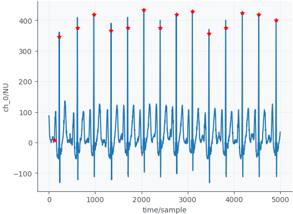

## import re

#### 01. re.search()

In Python, the `re.search()` function is part of the `re` module, which stands for regular expressions. Regular expressions are a powerful tool for pattern matching in strings. The `re.search()` function is used to search for a specified pattern within a string.

Here's a basic explanation of how `re.search()` works:

```python
import re

# Define a pattern to search for
pattern = r"Hello"

# Define a string to search within
text = "Hello, world!"

# Use re.search() to find the pattern in the text
match = re.search(pattern, text)

# Check if a match is found
if match:
    print("Match found!")
else:
    print("No match found.")

```

output:

```
Match found!
```

In this example, the pattern `r"hello"` is a simple regular expression that matches the substring "hello" in a case-sensitive manner. The `re.search()` function takes two arguments: the pattern and the text to search within. If the pattern is found anywhere in the text, `re.search()` returns a match object; otherwise, it returns `None`.

You can also use groups in regular expressions to capture specific parts of the matched pattern. For example:

```python
import re

# Define a pattern with a group
pattern = r"(\d+)-(\d+)-(\d+)"

# Define a string with a date-like pattern
text = "2024-03-01"

# Use re.search() to find the pattern and capture groups
match = re.search(pattern, text)

# Check if a match is found
if match:
    # Access captured groups using group()
    year, month, day = match.groups()
    print(f"Year: {year}, Month: {month}, Day: {day}")
else:
    print("No match found.")

```

output:

```
Year: 2024, Month: 03, Day: 01
```

In this example, the pattern `r"(\d+)-(\d+)-(\d+)"` captures three groups representing the year, month, and day in a date-like pattern. **The `match.groups()` method is then used to access the captured values.**

Keep in mind that regular expressions can be quite powerful and have a wide range of features. The patterns you use can be as simple or as complex as needed for your specific use case.


## functools

#### 01.functools.partial()

`functools.partial` is a function in Python's `functools` module that allows you to "freeze" some portion of a function's arguments and/or keywords resulting in a new callable with the partially applied arguments. It's particularly useful in situations where you need to create a new function based on an existing function but with some arguments pre-set.

Here's a basic example of how `functools.partial` works:

```python
from functools import partial

# Original function
def power(base, exponent):
    return base ** exponent

# Create a new function with the exponent preset to 2
square = partial(power, exponent=2)

# Now square is a new function that takes only one argument (base)
print(square(3))  # Output: 9 (equivalent to power(3, 2))

```

In this example, `partial(power, exponent=2)` creates a new function called `square` where the `exponent` argument is preset to `2`. When you call `square(3)`, it is equivalent to calling `power(3, 2)`.

You can also use `partial` to fix any positional arguments:

```python
from functools import partial

# Original function
def greeting(greeting, name):
    return f"{greeting}, {name}!"

# Create a new function with the greeting preset to "Hello"
hello_greeting = partial(greeting, "Hello")

print(hello_greeting("Alice"))  # Output: "Hello, Alice!"
print(hello_greeting("Bob"))    # Output: "Hello, Bob!"

```

In this example, `partial(greeting, "Hello")` creates a new function called `hello_greeting` where the `greeting` argument is preset to `"Hello"`. When you call `hello_greeting("Alice")`, it is equivalent to calling `greeting("Hello", "Alice")`.

`functools.partial` is particularly handy when you have a function that you need to pass to another function or method that requires a different signature. It allows you to adapt functions with different signatures to fit each other's requirements without having to define new functions explicitly.


## mlflow

Sure, `mlflow` is a Python library that provides a platform to streamline machine learning development. [It includes tracking experiments, packaging code into reproducible runs, and sharing and deploying models](https://pypi.org/project/mlflow/)[1](https://pypi.org/project/mlflow/). Here are the main components of `mlflow`:

1. [**MLflow Tracking**: An API to log parameters, code, and results in machine learning experiments and compare them using an interactive UI](https://pypi.org/project/mlflow/)[1](https://pypi.org/project/mlflow/).
2. [**MLflow Projects**: A code packaging format for reproducible runs using Conda and Docker, so you can share your ML code with others](https://pypi.org/project/mlflow/)[1](https://pypi.org/project/mlflow/).
3. [**MLflow Models**: A model packaging format and tools that let you easily deploy the same model (from any ML library) to batch and real-time scoring on platforms such as Docker, Apache Spark, Azure ML, and AWS SageMaker](https://pypi.org/project/mlflow/)[1](https://pypi.org/project/mlflow/).
4. [**MLflow Model Registry**: A centralized model store, set of APIs, and UI, to collaboratively manage the full lifecycle of MLflow Models](https://pypi.org/project/mlflow/)[1](https://pypi.org/project/mlflow/).

[`mlflow` offers a set of lightweight APIs that can be used with any existing machine learning application or library (TensorFlow, PyTorch, XGBoost, etc), wherever you currently run ML code (e.g., in notebooks, standalone applications, or the cloud)](https://pypi.org/project/mlflow/)[1](https://pypi.org/project/mlflow/).

[You can install `mlflow` from PyPI via `pip install mlflow`](https://pypi.org/project/mlflow/)[1](https://pypi.org/project/mlflow/). For more detailed information, you can refer to the [official documentation](https://mlflow.org/docs/latest/index.html).


Sure, here’s a basic example of how to use the `mlflow` library in Python. This example demonstrates how to train a simple model and log parameters, metrics, and the model itself using `mlflow`.

```python
import mlflow
import mlflow.sklearn
from sklearn.datasets import load_iris
from sklearn.model_selection import train_test_split
from sklearn.ensemble import RandomForestClassifier
from sklearn.metrics import accuracy_score

# Load iris dataset
iris = load_iris()
X = iris.data
y = iris.target

# Split the dataset
X_train, X_test, y_train, y_test = train_test_split(X, y, test_size=0.3, random_state=42)

# Start a new MLflow run 
with mlflow.start_run():

    # Train a model
    model = RandomForestClassifier()
    model.fit(X_train, y_train)

    # Evaluate the model
    predictions = model.predict(X_test)
    accuracy = accuracy_score(y_test, predictions)

    # Log parameters and metrics using MLflow
    mlflow.log_param("model", "RandomForestClassifier")
    mlflow.log_param("test_size", 0.3)
    mlflow.log_metric("accuracy", accuracy)

    # Log the sklearn model
    mlflow.sklearn.log_model(model, "model")
```

In this example, we first import the necessary libraries and load the iris dataset. We then split the dataset into training and testing sets. We start a new MLflow run and train a `RandomForestClassifier` model. We evaluate the model and log the model type, test size, and accuracy as parameters and metrics using MLflow’s `log_param` and `log_metric` functions. Finally, we log the trained model using MLflow’s `log_model` function.

[You can view the logged runs using MLflow’s UI by running `mlflow ui` in your terminal and navigating to `http://localhost:5000` in your web browser](https://mlflow.org/docs/latest/tutorials-and-examples/index.html)[1](https://mlflow.org/docs/latest/tutorials-and-examples/index.html).

For more detailed examples, you can refer to the [official MLflow examples](https://mlflow.org/docs/latest/tutorials-and-examples/index.html) and [other MLflow examples on GitHub](https://github.com/amesar/mlflow-examples).

​                 

## wandb

`wandb` stands for "Weights & Biases", and it's a Python library commonly used for experiment tracking, model visualization, and collaboration in machine learning projects.

1. **Experiment Tracking**: You can log various metrics like training loss, accuracy, learning rate, etc., during the training process of your machine learning models. This helps you keep track of how different experiments are performing and compare them easily.
2. **Visualization**: `wandb` provides tools for visualizing your logged data, such as charts and graphs, to better understand your model's performance.
3. **Hyperparameter Tuning**: You can log hyperparameters used in your experiments, allowing you to easily compare the performance of different configurations and tune your models more effectively.
4. **Project Collaboration**: `wandb` allows teams to share and collaborate on machine learning projects by logging and sharing experiment results and visualizations.


## typing

#### 01. typing.Optional

In Python, `Optional` is a type hint introduced in the `typing` module, which was added in Python 3.5. `Optional` is used to indicate that a variable can either contain a value of a certain type or be `None`. It's particularly useful for documenting function signatures, making it clear whether a function may return `None` or a value of a specific type.

Here's a basic example:

```python
from typing import Optional

def greet(name: Optional[str]) -> str:
    if name is not None:
        return f"Hello, {name}!"
    else:
        return "Hello, stranger!"
```

In this example, the `name` parameter of the `greet` function is annotated as `Optional[str]`, indicating that it can either be a string or `None`. This makes it clear to users of the function that passing `None` as the `name` argument is acceptable.

Using `Optional` can improve code readability and help catch potential `None`-related bugs early in development.


## einops

The `einops.rearrange` function is a part of the Einops library in Python. [It’s a reader-friendly smart element reordering function for multidimensional tensors](https://einops.rocks/api/rearrange/)[1](https://einops.rocks/api/rearrange/). This operation includes functionality of several tensor operations such as:

#### 01. several functions

- **Transpose**: This is the permutation of axes.
- **Reshape (view)**: This changes the shape of the tensor without changing its data.
- **Squeeze**: This removes the dimensions or axes that have a length of one.
- **Unsqueeze**: This adds an extra dimension or axis at a specific position in the tensor.
- **Stack**: This joins a sequence of tensors along a new axis.
- **Concatenate**: This joins a sequence of tensors along an existing axis.

Here are some examples of how `einops.rearrange` can be used:

1. **Stacking images along the first (batch) axis**:

```python
images = [np.random.randn(30, 40, 3) for _ in range(32)]
rearrange(images, 'b h w c -> b h w c').shape  # Output: (32, 30, 40, 3)
```

1. **Concatenating images along height (vertical axis)**:

```python
rearrange(images, 'b h w c -> (b h) w c').shape  # Output: (960, 40, 3)
```

1. **Concatenating images along horizontal axis**:

```python
rearrange(images, 'b h w c -> h (b w) c').shape  # Output: (30, 1280, 3)
```

1. **Reordering axes to “b c h w” format for deep learning**:

```python
rearrange(images, 'b h w c -> b c h w').shape  # Output: (32, 3, 30, 40)
```

1. **Flattening each image into a vector**:

```python
rearrange(images, 'b h w c -> b (c h w)').shape  # Output: (32, 3600)
```

1. **Splitting each image into 4 smaller images (top-left, top-right, bottom-left, bottom-right)**:

```python
rearrange(images, 'b (h1 h) (w1 w) c -> (b h1 w1) h w c', h1=2, w1=2).shape  # Output: (128, 15, 20, 3)
```

1. **Space-to-depth operation**:

```python
rearrange(images, 'b (h h1) (w w1) c -> b h w (c h1 w1)', h1=2, w1=2).shape  # Output: (32, 15, 20, 12)
```

[In the rearrangement pattern, ‘b’, ‘h’, ‘w’, and ‘c’ represent batch, height, width, and channel dimensions respectively](https://einops.rocks/api/rearrange/)[1](https://einops.rocks/api/rearrange/).


#### 02. torch.permute() vs einops.rearrange

> Hint:                 
>
> While both `torch.permute()` and `einops.rearrange()` are used for manipulating the dimensions of tensors, they are not the same.
>
> **torch.permute()** is a function in PyTorch that allows you to **reorder the dimensions** of your tensor. It does not change the shape of the tensor, but it does change the order of the elements.
>
> On the other hand, **einops.rearrange()** is a more flexible function that allows you to **reorder, reshape, and even combine dimensions**. It provides a more expressive way to manipulate tensor dimensions.
>
> Here’s an example to illustrate the difference:
>
> Suppose you have a 4D tensor `x` of shape (10, 3, 480, 640) representing 10 images, each with 3 color channels and of size 480x640 pixels. If you want to swap the color channels with the batch dimension, you can do:
>
> ```python
> x_permuted = x.permute(1, 0, 2, 3)  # Now x_permuted is of shape (3, 10, 480, 640)
> ```
>
> But if you want to flatten the height and width dimensions into a single dimension, you would need `einops.rearrange()`:
>
> ```python
> from einops import rearrange
> x_rearranged = rearrange(x, 'b c h w -> b c (h w)')  # Now x_rearranged is of shape (10, 3, 307200)
> ```
>
> As you can see, `einops.rearrange()` allows for more **complex manipulations** of tensor dimensions. So, while they have some overlap in functionality, they are not the same. The choice between the two will depend on your specific needs and which syntax you find more readable and intuitive.

​              

#### 03. einops.repeat()

Certainly! The `einops.repeat()` function is part of the `einops` library in Python, which provides a set of operations to manipulate multi-dimensional arrays (like NumPy arrays, PyTorch tensors, etc.) in a concise and readable way. The `repeat` function allows you to repeat elements of an array along specified axes.

Here's an explanation of how `einops.repeat()` works and some examples to illustrate its usage:

Basic Syntax

```python
einops.repeat(array, pattern, **axes_lengths)
```

- `array`: The input array you want to manipulate.
- `pattern`: A string describing the desired pattern of the output array.
- `axes_lengths`: Named arguments specifying the length of new axes or the repetition count.

Pattern Description

The pattern string describes how the dimensions of the input array should be transformed. It uses axis labels to refer to dimensions and defines how these dimensions should be repeated or expanded.

Examples

Example 1: Simple Repetition

Let's start with a basic example of repeating elements along a new axis.

```python
import numpy as np
from einops import repeat

# Original array
array = np.array([1, 2, 3])

# Repeat each element twice
repeated = repeat(array, 'i -> i j', j=2)
print(repeated)
```

**Explanation:**

- `array` is a 1D array `[1, 2, 3]`.
- Pattern `'i -> i j'` means we keep the original dimension `i` and introduce a new dimension `j`.
- `j=2` indicates that each element along the `i` axis should be repeated twice.

**Output:**
```
[[1, 1],
 [2, 2],
 [3, 3]]
```

Example 2: Expanding and Repeating

Now, let's expand an array and repeat it along multiple axes.

```python
# Original array
array = np.array([[1, 2], [3, 4]])

# Repeat along new axes
repeated = repeat(array, 'h w -> h w i j', i=2, j=3)
print(repeated)
```

**Explanation:**
- `array` is a 2D array with shape `(2, 2)`.
- Pattern `'h w -> h w i j'` keeps the original `h` and `w` dimensions and adds new dimensions `i` and `j`.
- `i=2` and `j=3` mean each element in the `h` and `w` dimensions is repeated to form a new 4D array.

**Output:**
```
[[[[1, 1, 1],
   [1, 1, 1]],
  [[2, 2, 2],
   [2, 2, 2]]],

 [[[3, 3, 3],
   [3, 3, 3]],
  [[4, 4, 4],
   [4, 4, 4]]]]
```

Example 3: Repeating with Reduction

You can also use `einops.repeat()` to repeat and then reduce dimensions.

```python
# Original array
array = np.array([1, 2, 3])

# Repeat and reduce dimensions
repeated = repeat(array, 'i -> i i')
summed = repeated.sum(axis=1)
print(summed)
```

**Explanation:**
- `array` is a 1D array `[1, 2, 3]`.
- Pattern `'i -> i i'` repeats each element along a new axis.
- `.sum(axis=1)` sums the repeated elements along the new axis.

**Output:**
```
[1 2 3]
```

Summary

- `einops.repeat()` is used to repeat elements of an array along specified axes.
- The `pattern` string describes the transformation of dimensions.
- Named arguments specify the lengths of new axes or repetition counts.

This function is powerful for reshaping, repeating, and manipulating multi-dimensional arrays in a readable and concise way.


## About transformers

​              

#### 01. transformers.AutoTokenizer()

`AutoTokenizer` is a class provided by the `transformers` library that enables automatic selection of the appropriate tokenizer for a given pre-trained model. Tokenizers are a crucial component in natural language processing pipelines as they convert raw text into a format suitable for input to neural network models.

Here's an overview of `AutoTokenizer`:

1. **Automatic Model Selection**: The `AutoTokenizer` class allows you to specify the name or identifier of a pre-trained model, and it automatically selects the corresponding tokenizer for that model. This is useful because different models may require different tokenization strategies, and using the wrong tokenizer can lead to errors or degraded performance.

2. **Pre-trained Tokenizers**: The `transformers` library provides tokenizers for a wide range of pre-trained models, including models like BERT, GPT, RoBERTa, and many others. These tokenizers are trained on large corpora of text data and are optimized for specific model architectures and tasks.

3. **Unified Interface**: `AutoTokenizer` provides a unified interface for accessing different tokenizers, regardless of the underlying model architecture. This makes it easy to switch between different models without having to change your code significantly.

4. **Tokenization Methods**: Tokenizers provided by `AutoTokenizer` typically include methods for tokenizing text, converting tokens to IDs, padding sequences to a fixed length, and performing other common preprocessing tasks required for feeding text data into neural networks.

5. **Integration with Model Classes**: `AutoTokenizer` is often used in conjunction with model classes like `AutoModel` or `AutoModelForSequenceClassification`, which provide automatic model selection similar to `AutoTokenizer`. This allows you to easily combine the correct tokenizer and model for your task without having to manage them separately.

Here's a simplified example demonstrating how you might use `AutoTokenizer`:

```python
from transformers import AutoTokenizer

# Specify the name or identifier of the pre-trained model
model_name = "bert-base-uncased"

# Initialize AutoTokenizer with the model name
tokenizer = AutoTokenizer.from_pretrained(model_name)

# Tokenize input text
input_text = "Hello, how are you?"
tokens = tokenizer(input_text)

# Print the tokens
print(tokens)
```

In this example, `AutoTokenizer.from_pretrained(model_name)` automatically selects the tokenizer for the specified pre-trained model (`"bert-base-uncased"`) and initializes it. Then, we tokenize an input text string using this tokenizer, and print the resulting tokens.


## contextlib

#### 01.contextlib.suppress

The `contextlib.suppress` function in Python is a context manager that can be used to suppress specified exceptions. It allows you to execute a block of code while ignoring certain exceptions that may occur within that block.

Here's how it works:

1. **Importing**: First, you need to import it from the `contextlib` module.
2. **Usage**: You use it in a `with` statement, passing the exceptions you want to suppress as arguments.
3. **Behavior**: Any exceptions specified in the `suppress` will be caught and suppressed, meaning the program will not crash or stop executing; it will continue to the next statement after the `with` block.

Syntax

```python
from contextlib import suppress

with suppress(ExceptionType1, ExceptionType2, ...):
    # Code that might raise the exceptions you want to suppress
    ...
```

Example

Here's a practical example to illustrate its usage:

```python
from contextlib import suppress

# Suppose we want to try to delete a file, but it's okay if the file doesn't exist
import os

file_path = 'somefile.txt'

# Using suppress to ignore FileNotFoundError if the file doesn't exist
with suppress(FileNotFoundError):
    os.remove(file_path)

print("Continuing execution...")
```

In this example:
- The code attempts to remove a file named 'somefile.txt'.
- If the file doesn't exist, a `FileNotFoundError` would normally be raised.
- By using `suppress(FileNotFoundError)`, this exception is ignored, and the program continues execution without interruption.

Use Cases

- **File Operations**: Suppressing errors when trying to remove a file or directory that may not exist.
- **Type Casting**: Ignoring exceptions when trying to cast values that might fail.
- **Optional Dependencies**: Suppressing import errors for optional dependencies in a script or module.

Benefits

- **Cleaner Code**: Reduces the need for try-except blocks, making the code cleaner and easier to read.
- **Focus**: Keeps the focus on the main logic of the code rather than on exception handling.
- **Conciseness**: Particularly useful for one-liners where exception handling would otherwise add unnecessary verbosity.

Caveats

- **Overuse**: Overusing `suppress` can lead to bugs being silently ignored. Use it judiciously and only when you are sure that the suppressed exceptions are truly ignorable.
- **Debugging**: Suppressing too many exceptions might make debugging difficult, as it can obscure the root cause of an issue.

Overall, `contextlib.suppress` is a powerful tool for managing exceptions in a clean and concise manner when you are certain that some exceptions can be safely ignored.


## PIL

#### 01. PIL.Image.open()

The `PIL.Image.open()` function is part of the **Python Imaging Library (PIL)**, specifically in the `PIL.Image` module. PIL has been succeeded by the `Pillow` library, which is a more modern and actively maintained fork of PIL. Here’s a detailed explanation of what `PIL.Image.open()` does:

purpose:

`PIL.Image.open()` is used to open and identify an image file. It loads the image into a PIL image object, which can then be manipulated, transformed, and saved using various methods provided by the library.

```python
from PIL import Image

# Open an image file
img = Image.open("path_to_your_image.jpg")

# Display the image
img.show()

# Get basic information about the image
print(f"Format: {img.format}")  # Output: JPEG, PNG, etc.
print(f"Size: {img.size}")      # Output: (width, height)
print(f"Mode: {img.mode}")      # Output: "RGB", "L" (grayscale), etc.

# Save the image in a different format
img.save("path_to_save_image.png")

# Resize the image
img_resized = img.resize((100, 100))
img_resized.show()

# Convert the image to grayscale
img_gray = img.convert("L")
img_gray.show()

```


## About shutil

#### 01. shutil.copy(src, dst, *, follow_symlinks=True)

the `shutil.copy()` function is part of Python's `shutil` module. It is used to copy the **contents of a file** from a source to a **destination**. Here is a brief overview of how it works:

`src`: The source file path.

`dst`: The destination file path or directory.

`follow_symlinks` (optional): If `True` (the default), it will copy the file pointed to by symbolic links. If `False`, it will copy the symbolic link itself.

```python
import shutil

# Source path
src = 'path/to/source/file.txt'

# Destination path
dst = 'path/to/destination/file.txt'

# Copy the file
shutil.copy(src, dst)

```

If the destination is a directory, the source file is copied into the directory with the same name as the source file.

It only copies the content of the file, preserving the file's permissions. It does not copy metadata such as creation and modification times.


## About multiprocessing

#### 01. multiprocessing.pool()

It is part of the `multiprocessing` library, which supports parallel processing by using separate processes. The `multiprocessing.Pool` class allows you to manage a pool of worker processes to which you can submit tasks for parallel execution. This is useful for tasks that can be parallelized to take advantage of multiple CPU cores, thereby improving performance.

```python
from multiprocessing import Pool
import time

def square(n):
    time.sleep(1)
    return n * n

if __name__ == '__main__':
    numbers = [1, 2, 3, 4, 5]

    with Pool(processes=3) as pool:
        results = pool.map(square, numbers)

    print(results)

```

output:

```
[1, 4, 9, 16, 25]
```


#### 02. multiprocessing.cpu_count()

The `multiprocessing.cpu_count()` function in Python is part of the `multiprocessing` module, and it returns the number of CPU cores available on the machine. This is useful for parallel processing, as it allows you to determine the number of processors you can leverage to optimize performance for CPU-bound tasks.

Here's a basic example of how to use it:

```python
import multiprocessing

num_cpu_cores = multiprocessing.cpu_count()
print("Number of CPU cores:", num_cpu_cores)
```

output:

```
Number of CPU cores: 16
```


## About neurokit2

**NeuroKit2** is a Python package designed to facilitate the processing, analysis, and visualization of physiological signals. It's particularly useful for researchers and developers working in fields like neuroscience, psychophysiology, or biomedical engineering.

Some key features of NeuroKit2 include:

1. **Signal Processing**: It provides tools for preprocessing physiological signals, such as ECG (electrocardiogram), EDA (electrodermal activity), EMG (electromyography), and PPG (photoplethysmogram).
2. **Feature Extraction**: NeuroKit2 can extract relevant features from physiological data, like heart rate variability (HRV), respiratory patterns, or skin conductance responses.
3. **Visualization**: The package includes functions to easily visualize physiological signals and the results of analyses.
4. **Data Analysis**: NeuroKit2 integrates with other Python libraries like NumPy, SciPy, and Pandas, making it versatile for advanced data analysis and statistical modeling.

It's widely used for research purposes, especially in projects related to understanding the relationship between physiological signals and psychological states or behaviors.


#### 01. neurokit2.ecg_process()

It offers a comprehensive pipeline for analyzing ECG data, including steps like filtering, R-peak detection, heart rate variability (HRV) computation, and more.

Here’s an overview of how it works:

- **Input**: You provide raw ECG signals, and `neurokit2.ecg_process()` processes them through multiple stages, including signal cleaning, R-peak detection, and feature extraction.

- Outputs:

  1. **ECG signals**: A cleaned ECG signal, including important annotations like R-peaks.

     ​	    ECG_Raw|The raw signal.

     ​            ECG_Clean|The cleaned signal.

     ​            ECG_Rate|Heart rate interpolated between R-peaks.

     ​            ECG_Quality|The quality of the cleaned signal.

     ​            ECG_R_Peaks|The R-peaks marked as "1" in a list of zeros.

     ​            ECG_R_Onsets|The R-onsets marked as "1" in a list of zeros.

     ​            ECG_R_Offsets|The R-offsets marked as "1" in a list of zeros.

     ​            ECG_P_Peaks|The P-peaks marked as "1" in a list of zeros.

     ​            ECG_P_Onsets|The P-onsets marked as "1" in a list of zeros.

     ​            ECG_P_Offsets|The P-offsets marked as "1" in a list of zeros.

     ​            ECG_Q_Peaks|The Q-peaks marked as "1" in a list of zeros.

     ​            ECG_S_Peaks|The S-peaks marked as "1" in a list of zeros.

     ​            ECG_T_Peaks|The T-peaks marked as "1" in a list of zeros.

     ​            ECG_T_Onsets|The T-onsets marked as "1" in a list of zeros.

     ​            ECG_T_Offsets|The T-offsets marked as "1" in a list of zeros.

     ​            ECG_Phase_Atrial|Cardiac phase, marked by "1" for systole and "0" for diastole.

     ​            ECG_Phase_Completion_Atrial|Cardiac phase (atrial) completion, expressed in percentage (from 0 to 1), representing the stage of the current cardiac phase.

     ​            ECG_Phase_Completion_Ventricular|Cardiac phase (ventricular) completion, expressed in percentage (from 0 to 1), representing the stage of the current cardiac phase.

  2. **ECG info**: A dictionary containing information on various morphological features of the ECG, such as heart rate, R-R intervals, and HRV indices.


```python
import neurokit2 as nk
import matplotlib.pyplot as plt

# Step 1: Simulate or load an ECG signal (for example purposes, we'll simulate)
ecg_signal = nk.ecg_simulate(duration=10, heart_rate=70)

# Step 2: Process the ECG signal
ecg_processed, ecg_info = nk.ecg_process(ecg_signal, sampling_rate=1000)

# Step 3: Plot the processed ECG signal
nk.ecg_plot(ecg_processed, sampling_rate=1000)

# Step 4: Display extracted information
print("R-peaks indices:", ecg_info["ECG_R_Peaks"])
print("Heart rate (bpm):", ecg_info["ECG_Rate"])

```


## About nolds

 It is a Python library used for nonlinear time series analysis. The library is particularly useful for analyzing chaotic systems, and it includes methods to compute Lyapunov exponents, fractal dimensions, and other measures from time series data.

#### 01. nolds.perm_entropy()

```python
import nolds
# Assume you have ECG data in a NumPy array
ecg_data = np.array([...])  # replace with actual ECG data

entropy = nolds.perm_entropy(ecg_data, order=5, delay=1, normalize=True)
print(f"ECG Permutation Entropy: {entropy}")
```


## About antropy

**Antropy** is a library that provides easy-to-use functions for calculating a variety of entropy-based measures, especially in time-series analysis and biomedical signal processing (like ECG, EEG).

Some common entropy measures you can calculate with the Antropy library are:

1. **Permutation Entropy (`perm_entropy`)**: Measures the complexity of a time series by looking at the permutations of time-ordered values.
2. **Sample Entropy (`sampen`)**: Quantifies the regularity or predictability of a time series by measuring the likelihood that patterns repeat.
3. **Spectral Entropy (`spectral_entropy`)**: A frequency-domain measure of entropy that calculates the Shannon entropy of the power spectral density of a signal.
4. **Approximate Entropy (`app_entropy`)**: Quantifies the unpredictability of fluctuations in a time series.


#### 01. antropy.perm_entropy()

```python
import numpy as np
from antropy import perm_entropy

# Example time series data (e.g., ECG signal)
time_series = np.random.rand(1000)  # Replace with real data

# Calculate permutation entropy
pe = perm_entropy(time_series, order=3, normalize=True)

print(f"Permutation Entropy: {pe}")
```


## About Triton

Description: Triton is an open-source programming language and compiler designed for writing highly efficient GPU code for deep learning operations. It simplifies GPU programming by providing a Python-like syntax, making it accessible to developers without extensive CUDA experience. It’s particularly useful for creating custom neural network kernels, such as matrix multiplication or fused operations, that can match or outperform existing libraries like cuBLAS.


